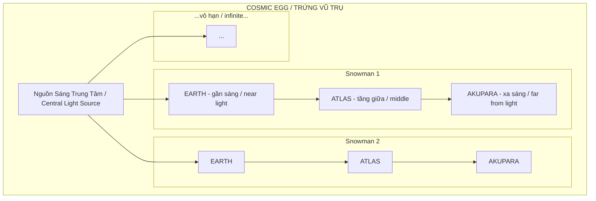
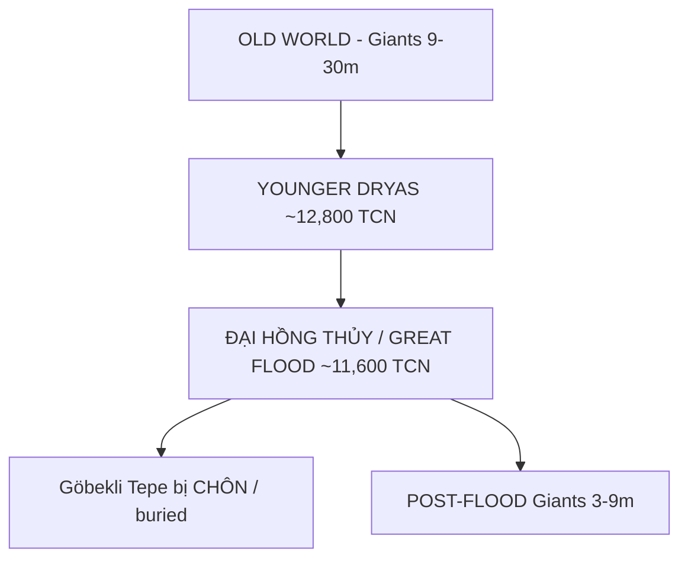
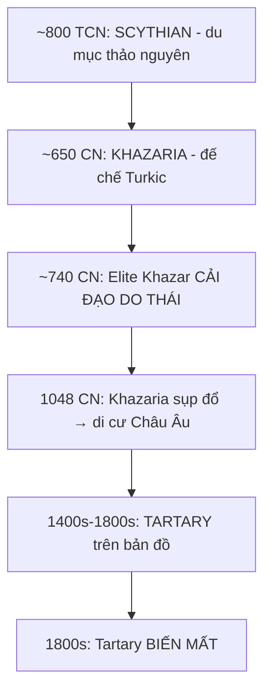
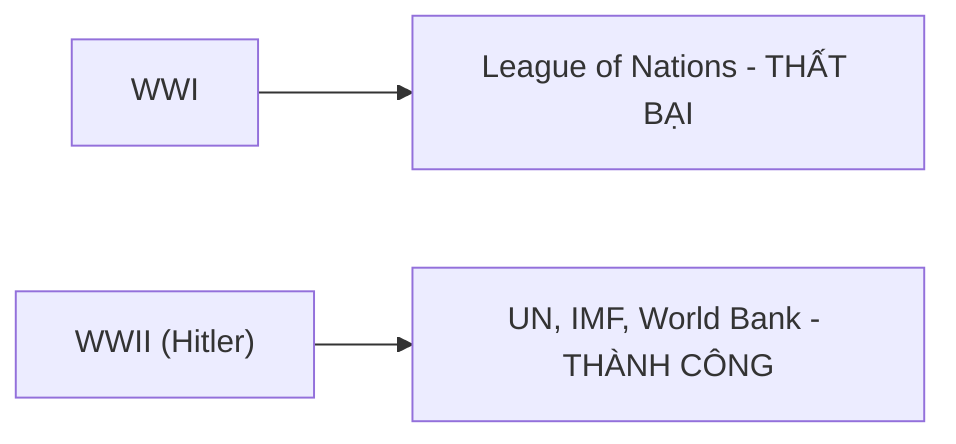
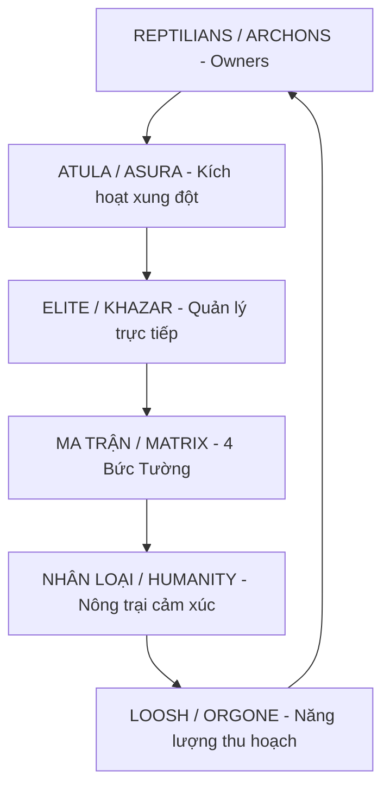

# Lịch Sử Song Song — Khi Thế Giới Đồng Bộ

Lịch sử không phải những đường thẳng riêng lẻ mà là một tấm thảm đan xen — khi Việt Nam đang làm gì thì thế giới cũng đang chuyển động. Bài này đặt câu hỏi: **Tại sao những "trùng hợp" này lại xảy ra?**

*History isn't isolated timelines but an interconnected web — when Vietnam was doing something, the world was also moving. This article asks: Why do these "coincidences" occur?*

---

## I. Cấu Trúc Vũ Trụ: Trứng Vũ Trụ & Vô Số Thế Giới / Cosmic Structure

Trước khi nói về lịch sử, cần hiểu **không gian** nơi lịch sử xảy ra.

*Before discussing history, we need to understand the space where history occurs.*

Theo [[Bức Tường Băng|Ice Wall Manifesto]], toàn bộ tạo hóa nằm trong một **Trứng Vũ Trụ (Cosmic Egg)** — với **vô số cấu trúc "người tuyết"** bên trong. Mỗi "người tuyết" gồm 3 tầng xếp chồng.

*According to the Ice Wall Manifesto, all creation exists within a Cosmic Egg — containing infinite "snowman" structures. Each "snowman" has 3 stacked layers.*

**Logic quan trọng / Key Logic:**

| Tầng / Layer | Vị trí / Position | Vật chất / Matter | Tâm linh / Spirituality |
|--------------|-------------------|-------------------|-------------------------|
| **Earth** | Gần nguồn sáng nhất / Closest to light | Cao nhất / Highest density | Thấp nhất / Lowest |
| **Atlas** | Giữa / Middle | Trung bình / Medium | Trung bình / Medium |
| **Akupara** | Xa nguồn sáng, sát vỏ trứng / Far, near shell | Thấp nhất / Lowest | Cao nhất / Highest |

Điều này **khớp với cái thấy của Đức Phật**: vô lượng thế giới, mỗi hạt cát chứa tam thiên đại thiên thế giới. Cõi người (Earth) khó tu nhất vì vật chất dày đặc, nhưng là nơi **duy nhất có thể thành Phật**.

*This aligns with Buddha's vision: infinite worlds, each grain of sand contains universes. The human realm (Earth) is hardest to practice because of dense matter, yet it's the only place to attain Buddhahood.*

### Bốn Lực Lượng Cơ Bản / Four Fundamental Forces

| Lực lượng / Force | Bản chất / Nature | Ứng dụng / Application |
|-------------------|-------------------|------------------------|
| **Aether** | Lấp đầy không gian / Fills space | Công nghệ Tartarian / Tartarian tech |
| **Azoth** | Tiềm năng thuần túy / Pure potential | Divine spark trong mỗi người |
| **Vril** | Sức mạnh ý chí / Willpower | Consciousness, sáng tạo |
| **Orgone** | Năng lượng từ ý chí bị bẻ gãy / Energy from broken will | **Loosh?** |

> **Connection:** Orgone = ý chí bị bẻ gãy = **[[Loosh - Năng Lượng Thu Hoạch Từ Con Người|Loosh]]** — năng lượng thu hoạch từ đau khổ con người.
>
> *Orgone = broken will = Loosh — energy harvested from human suffering.*

---

## II. Old World: Người Khổng Lồ & Đại Hồng Thủy / Giants & The Great Flood

### Kích Thước Con Người Qua Các Thời Đại / Human Size Through Ages

Các văn bản cổ từ nhiều nền văn hóa đều nhắc đến giants. Elite **không thể xóa** vì hàng tỷ người thuộc lòng.

*Ancient texts from many cultures mention giants. Elite cannot erase them because billions have memorized them.*

| Nguồn / Source | Nội dung / Content | Chiều cao / Height |
|----------------|--------------------|--------------------|
| **Hadith (Islam)** | Adam cao 60 cubits | ~27-30 mét |
| **Book of Enoch** | Nephilim 300 cubits | ~137 mét |
| **Hindu Puranas** | Giảm qua các Yuga / Decreasing through Yugas | 9.5m → 1.6m |
| **Buddhist texts** | Thay đổi theo Kalpa / Changes by Kalpa | 2,560m → 30cm |

### Younger Dryas: Reset Lần Một / First Reset (~12,000 TCN)

Hầu hết các nền văn hóa đều có truyền thuyết Đại Hồng Thủy: Noah, Gilgamesh, Manu, Nữ Oa, Deucalion...

*Almost all cultures have Great Flood legends: Noah, Gilgamesh, Manu, Nữ Oa, Deucalion...*

### Giants Đã Đi Đâu? / Where Did Giants Go?

1. **Chết/Bị giết** trong Mudflood events
2. **Di cư** sang Atlas/Akupara — "bên kia Bức Tường Băng" / Beyond the Ice Wall
3. **Giảm kích thước** theo Yugas: 9m → 3m → 1.6m

---

## III. Nguồn Gốc: Việt Nam, Tartaria & Elite / Origins

### Người Việt Cổ / Ancient Vietnamese (40,000 năm)

Bắc Việt Nam là **trung tâm cổ nhất** của văn hóa Hoabinhian. Khi Vua Hùng lập Văn Lang (~2879 TCN), **Kim tự tháp Giza chưa được xây** (~2560 TCN).

*Northern Vietnam is the oldest center of Hoabinhian culture. When Hung Kings established Van Lang (~2879 BCE), the Pyramids of Giza weren't built yet (~2560 BCE).*

### Scythian → Khazaria → Tartaria

**Fact:** Bản đồ Library of Congress (1400s-1800s) đều ghi "Tartary" — đế chế từ Đông Âu đến Thái Bình Dương. Rồi đột nhiên biến mất.

*Maps from Library of Congress (1400s-1800s) all show "Tartary" — an empire from Eastern Europe to Pacific. Then it suddenly vanished.*

### Người Việt Thắng Tartars 3 Lần / Vietnamese Defeated Tartars 3 Times

Đế chế Mông Cổ chinh phục gần như toàn bộ Eurasia, nhưng **thua Đại Việt 3 lần** (1258, 1285, 1288). Nếu Tartarians là giants, người Việt cổ **cũng phải có ưu thế tương đương**.

*Mongol Empire conquered almost all of Eurasia, but lost to Đại Việt 3 times. If Tartarians were giants, ancient Vietnamese must have had similar advantages.*

### Star Forts = Dấu Vết Giants? / Star Forts = Giants Evidence?

Nếu lấy **công trình cổ làm mốc**, các quốc gia có Star Forts/Old World buildings có khả năng cao là **gốc giants**.

*If we use ancient structures as markers, countries with Star Forts/Old World buildings likely have giant ancestry.*

| Khu vực / Region | Công trình / Structure | Ghi chú / Note |
|------------------|------------------------|----------------|
| **Việt Nam** | [[Thành Cổ Loa]] — xoắn ốc 3 vòng | Tương tự starfort concept |
| **Châu Âu** | Hàng ngàn Star Forts | "Vauban style" hay Tartarian? |
| **Ấn Độ** | Taj Mahal, Red Fort | Timurid = Tartarian? |
| **Nhật Bản** | Goryōkaku (五稜郭) | Cùng pattern toàn cầu |
| **Nga** | Kremlin, Peter & Paul Fortress | Tartarian homeland? |

> Starforts có mặt khắp thế giới với **cùng thiết kế hình học** — điều này vô nghĩa nếu các nền văn minh phát triển độc lập.
>
> *Starforts appear worldwide with identical geometric designs — nonsensical if civilizations developed independently.*

---

## IV. Timeline Thống Nhất / Unified Timeline

### ~800-200 TCN: Axial Age — Thức Tỉnh Toàn Cầu / Global Awakening

Sau Bronze Age Collapse và 400 năm Greek Dark Ages, **cả thế giới "thức tỉnh" triết học cùng lúc**.

*After Bronze Age Collapse and 400 years of Greek Dark Ages, the entire world "awakened" philosophically at once.*

| Nhân vật / Figure | Năm sinh / Born | Nơi / Place |
|-------------------|-----------------|-------------|
| Pythagoras | ~570 TCN | Hy Lạp / Greece |
| Phật Thích Ca / Buddha | ~563 TCN | Ấn Độ / India |
| Khổng Tử / Confucius | 551 TCN | Trung Quốc / China |
| Lão Tử / Laozi | ~6th c. TCN | Trung Quốc / China |
| Socrates | 470 TCN | Hy Lạp / Greece |

> **Pattern:** Mỗi khi Elite tập trung quyền lực → Làn sóng thức tỉnh xuất hiện để cân bằng.
>
> *When Elite consolidates power → Awakening wave emerges to balance.*

### 1776-1789: Năm Của Cách Mạng / Year of Revolutions

**Cùng năm 1776 / Same year 1776:**
- Illuminati thành lập (Bavaria)
- Mỹ tuyên bố độc lập / US Declaration of Independence

**Cùng năm 1789 / Same year 1789:**
- **Quang Trung** đại phá quân Thanh
- **Washington** nhậm chức Tổng thống
- **Cách mạng Pháp** phá ngục Bastille

### 1946-1959: Antarctic Treaty

| Năm / Year | Sự kiện / Event |
|------------|-----------------|
| 1946-1947 | **Operation Highjump** — Đô đốc Byrd dẫn 4,700 quân đến Nam Cực |
| 1947 | Byrd thấy "vùng đất bên ngoài cực", "lục địa lớn bằng châu Mỹ" |
| 1947 | Chiến dịch **rút lui sớm** — tại sao? |
| 1/12/1959 | **Antarctic Treaty** — 12 quốc gia, cấm khám phá tự do |

> **Câu hỏi / Question:** Mỹ-Liên Xô đối đầu khắp nơi, nhưng lại **hợp tác** ở Nam Cực? Có gì cần **canh giữ**?
>
> *US-USSR opposed everywhere, but cooperated in Antarctica? What needs guarding?*

### Hitler: Con Bài Được Chọn? / A Chosen Pawn?

> **Pattern:** KHỦNG HOẢNG → GIẢI PHÁP → TẬP TRUNG QUYỀN LỰC
>
> *CRISIS → SOLUTION → POWER CENTRALIZATION*

---

## V. Nông Trại Cảm Xúc / Emotion Farm

### Hệ Thống Kiểm Soát Đa Tầng / Multi-Layer Control System

Theo [[Atula]], cõi A-tu-la đặc trưng bởi sân hận và hiếu chiến — **giống thế giới con người hiện nay**. Mục đích? Thu hoạch **Loosh** — năng lượng từ đau khổ.

*According to Atula, the Asura realm is characterized by anger and bellicosity — like today's human world. Purpose? Harvest Loosh — energy from suffering.*

---

## VI. Karma Law: Tại Sao Elite Phải Để Hints? / Why Elite Must Leave Hints

Theo [[Nhân Quả]], Karma là quy luật **phổ quát** — không ai thoát, kể cả Elite. Nói dối 100% = gánh quả nặng hơn.

*According to Karma Law, it's universal — no one escapes, including Elite. Lying 100% = heavier karma.*

| Phương pháp / Method | Ví dụ / Example |
|---------------------|-----------------|
| Văn bản cổ / Ancient texts | Bible, Quran, Vedas — không sửa được |
| Symbolism | Logo, kiến trúc, monuments |
| Predictive Programming | Phim ảnh "tiên đoán" sự kiện |
| Tuyên bố công khai / Public statements | "New World Order", "Great Reset" |

> **Nguyên tắc / Principle:** Họ **phải** tiết lộ truth ở đâu đó — người đủ thức tỉnh sẽ thấy.
>
> *They must reveal truth somewhere — those awakened enough will see.*

---

## VII. Patterns & Bài Học / Lessons

### Pattern 1: Control ↔ Awakening

| Thời kỳ / Era | Control | Awakening |
|---------------|---------|-----------|
| 500 TCN | Đế chế mở rộng / Empire expansion | Phật, Khổng Tử, Socrates |
| 0-300 CE | La Mã / Rome | Jesus, Gnosticism |
| 1500-1800 | Thuộc địa hóa / Colonization | Reformation, Enlightenment |
| 2020+ | Globalism, AI | ??? |

### Pattern 2: Truth Bị Ignore → Tái Phát Hiện

- Mendel (1866 → 1900) — 16 năm sau khi chết
- Tartaria (1800s → 2020s) — đang được tái khám phá?

---

## VIII. Lời Kết: Ngón Tay Chỉ Mặt Trăng / Conclusion: Finger Pointing to Moon

Bài viết này là **framework** — không phải truth.

*This article is a framework — not truth.*

Theo [[Nghịch Lý Của Hiểu Biết]]:

> *"Mọi framework — đều là ngón tay chỉ mặt trăng, không phải mặt trăng."*
>
> *"Every framework is a finger pointing to the moon, not the moon itself."*

### Via Negativa — Con Đường Phủ Định

Mục đích không phải **chứng minh** Giants 30m có thật. Mà là **đặt câu hỏi**:

*The purpose isn't to prove 30m Giants existed. But to ask questions:*

- Tại sao tin lịch sử mainstream mà không verify? / Why believe mainstream history without verifying?
- Tại sao Antarctic Treaty cấm khám phá? / Why does Antarctic Treaty ban exploration?
- Tại sao Tartary biến mất khỏi bản đồ? / Why did Tartary vanish from maps?
- Tại sao mọi văn hóa đều có truyền thuyết Giants? / Why do all cultures have Giant legends?

**Câu hỏi đúng > Câu trả lời sai. / Right questions > Wrong answers.**

### Cái Thấy / The Seeing

Không phải Giants đúng hay sai. Không phải Ma Trận đúng hay sai.

Mà là: **Cái gì đang THẤY tất cả những thứ đó?**

*Not whether Giants are true or false. Not whether Matrix is true or false.*

*But: What is SEEING all of this?*

> Cái biết rằng nó đang biết — đó là cái duy nhất không thể bị phủ định.
>
> *The knowing that knows it's knowing — that's the only thing that cannot be negated.*

---

## Related / Liên Quan

### Cosmic Structure
- [[Bức Tường Băng]] — Ice Wall Manifesto
- [[Vũ Trụ Học Phật Giáo]] — 6 cõi, Kinh Thế Ký
- [[Chu Kỳ Vũ Trụ — Yugas & Kalpas]] — Hindu Yugas, Buddhist Kalpas
- [[Năng Lượng Aether]] — Công nghệ Old World

### Thực Thể Kiểm Soát / Control Entities
- [[Atula]] — Kích hoạt xung đột
- [[Loosh - Năng Lượng Thu Hoạch Từ Con Người]] — Emotion harvesting
- [[Elite]] — Quản lý tầng trung
- [[Ma Trận - Giải Phẫu Hoàn Chỉnh]] — 4 Walls

### Reset & Hidden History
- [[Tartaria]] — Đế chế bị xóa
- [[Mudflood]] — Reset events
- [[Thành Cổ Loa]] — Giant architecture in Vietnam?

### Con Đường Thoát / Path Out
- [[Nhân Quả]] — Karma Law
- [[Nghịch Lý Của Hiểu Biết]] — Beyond frameworks
- [[Gnosis]] — Direct knowing

---

*"Ehi-passiko" — Hãy đến và tự thấy. / Come and see for yourself.*
*— Đức Phật / Buddha*
