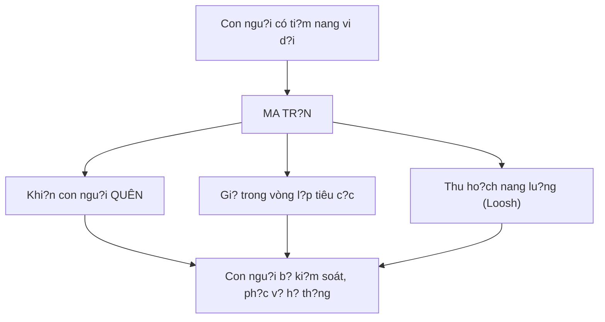
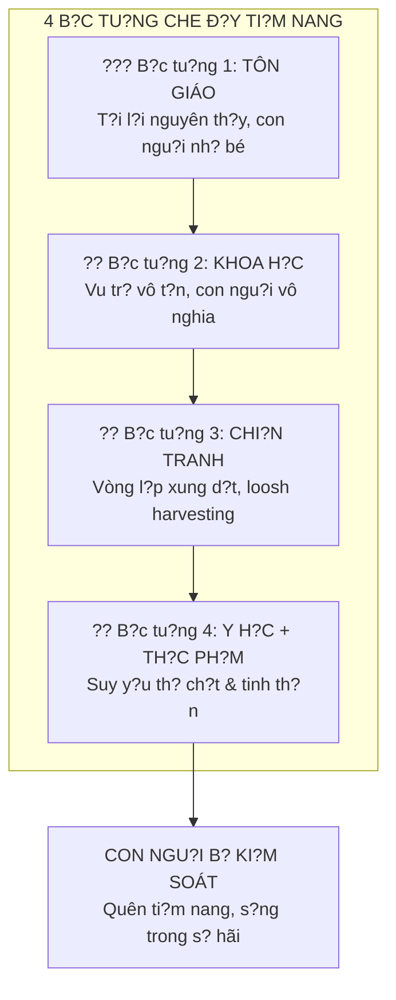
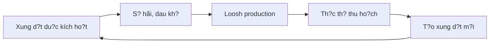
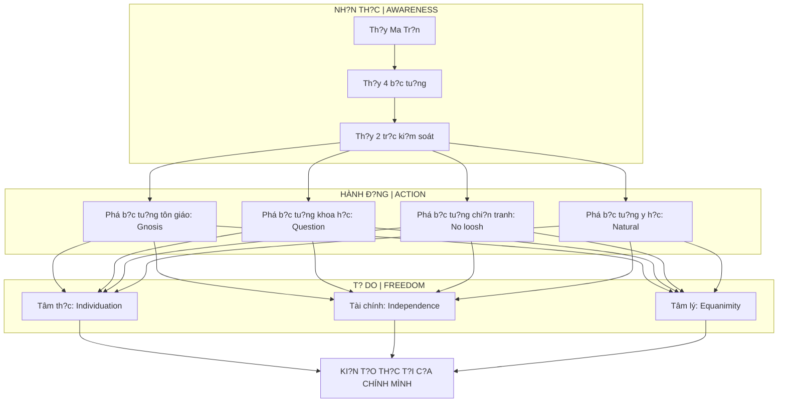

# Ma Tr?n - Gi?i Ph?u Hoàn Ch?nh

> *"Khi?n con ngu?i quên di giá tr? c?a chính mình là bu?c d?u tiên d? ki?m soát h?."*
> *"Making humans forget their own value is the first step to controlling them."*

Bài vi?t này là **b?n t?ng h?p hoàn ch?nh** v? [[Ma Tr?n]] - c?u trúc, các l?p ki?m soát, m?c dích t?n t?i, và **con du?ng thoát ra**. Ðây là meta-framework xâu chu?i toàn b? ki?n th?c trong vault.

*This is the complete synthesis of the Matrix - its structure, control layers, purpose of existence, and the path to escape. This is the meta-framework connecting all knowledge in the vault.*

---

## Ti?n Ð?: T?i Sao Ma Tr?n T?n T?i? / Why Does the Matrix Exist?

### Con Ngu?i Có Ti?m Nang Vi Ð?i / Humans Have Immense Potential

Theo nhi?u truy?n th?ng tâm linh:

*According to many spiritual traditions:*

| Truy?n th?ng | Quan di?m |
|--------------|-----------|
| **Ph?t giáo** | Ch? ? cõi ngu?i m?i tu du?c thành Ph?t - du?c làm ngu?i vô cùng hi?m hoi |
| **Gnosticism** | Con ngu?i mang "divine spark" b? m?c k?t trong v?t ch?t |
| **Hermeticism** | "As above, so below" - con ngu?i là microcosm c?a vu tr? |
| **Nhi?u tôn giáo** | Con ngu?i du?c t?o theo hình ?nh c?a Thu?ng Ð? |

> N?u con ngu?i th?c s? có ti?m nang này, thì m?t **th? l?c** (dù là [[Elite]], [[Th?c Th? Cõi Trung Gi?i|th?c th? chi?u cao hon]], hay c? hai) s? c?n **gi? con ngu?i trong tr?ng thái quên**.
>
> *If humans truly have this potential, then a force would need to keep humans in a state of forgetting.*

### M?c Ðích Ma Tr?n / The Matrix's Purpose

? Xem chi ti?t: [[Loosh - Nang Lu?ng Thu Ho?ch T? Con Ngu?i]]

---

## C?u Trúc Ma Tr?n: 4 B?c Tu?ng / Matrix Structure: 4 Walls

### T?ng Quan / Overview

---

### B?c Tu?ng 1: Tôn Giáo / Wall 1: Religion

**Co ch?:** Khi?n con ngu?i tin mình **nh? bé, có t?i**, c?n trung gian d? ti?p c?n Thu?ng Ð?.

*Mechanism: Make humans believe they are small, sinful, needing intermediaries to access God.*

| Element | Tác d?ng |
|---------|----------|
| **T?i l?i nguyên th?y** | Con ngu?i sinh ra dã có t?i, c?n c?u r?i |
| **Trung gian hóa** | C?n linh m?c d? ti?p c?n Thu?ng Ð? |
| **S? hãi d?a ng?c** | Ki?m soát qua fear |
| **Adam-Eva 6000 nam** | Xóa b? l?ch s? van minh c? |

**Contradiction:** N?u Adam-Eva ch? 6000 nam tru?c, thì mâu thu?n v?i [[Atlantis]], [[Lemuria]], [[Tartaria]], Kim T? Tháp Giza...

**Góc nhìn [[Gnosis|Gnostic]]:** Chúa Giêsu d?n d? **khai m? nh?n th?c**, không ch? c?u r?i. "Nu?c Tr?i" n?m **bên trong** m?i ngu?i.

? Xem: [[Nhân Qu?, Luân H?i và Ma Tr?n Tôn Giáo]]

---

### B?c Tu?ng 2: Khoa H?c / Wall 2: Science

**Co ch?:** Khi?n con ngu?i c?m th?y **vô nghia** trong vu tr? vô t?n, l?nh l?o.

*Mechanism: Make humans feel meaningless in an infinite, cold universe.*

| Mô hình hi?n d?i | Tác d?ng tâm lý |
|------------------|-----------------|
| Trái Ð?t c?u nh? bé | Con ngu?i là h?t b?i |
| Vu tr? vô t?n, ng?u nhiên | S? t?n t?i vô m?c dích |
| Ti?n hóa Darwin | Ch? là d?ng v?t may m?n |

**Contrast v?i [[Vu Tr? H?c Ph?t Giáo]]:**

| Khoa h?c hi?n d?i | Vu tr? h?c c? |
|-------------------|---------------|
| Con ngu?i nh? bé | Con ngu?i có v? trí d?c bi?t |
| Tu?i th? ~80 nam | T?ng có ngu?i s?ng 84 v?n nam |
| M?t loài ngu?i | Ngu?i kh?ng l? t?ng t?n t?i |

**Gi? thuy?t:** C? tôn giáo (B?c tu?ng 1) và khoa h?c (B?c tu?ng 2) d?u serve: **khi?n con ngu?i c?m th?y nh? bé**.

? Xem: [[Khoa H?c Xét L?i]], [[Thuy?t Trái Ð?t Ph?ng]], [[Mô Hình Ð?a Tâm]]

---

### B?c Tu?ng 3: Chi?n Tranh / Wall 3: War

**Co ch?:** Gi? con ngu?i trong **vòng l?p xung d?t**, s?n xu?t [[Loosh - Nang Lu?ng Thu Ho?ch T? Con Ngu?i|Loosh]] liên t?c.

*Mechanism: Keep humans in conflict loops, continuously producing Loosh.*

**Connection: [[Atula]] (Cõi A-tu-la)**

> *"Cõi Atula, d?c trung b?i sân h?n và hi?u chi?n, có nhi?u di?m tuong d?ng v?i th? gi?i con ngu?i hi?n nay."*

**Gi? thuy?t:** Cõi Atula là t?ng **g?n nh?t** v?i con ngu?i, dang **tác d?ng m?nh** - gi?i thích t?i sao nhân lo?i luôn trong tr?ng thái xung d?t.

**Kh?i Huy?n = K? ho?ch?**

N?u áp d?ng logic [[Predictive Programming - C?y Tuong Lai Vào Ti?m Th?c|Predictive Programming]]: Kh?i Huy?n có th? không ph?i tiên tri mà là **blueprint du?c so?n ra** và th?c hi?n trong tuong lai.

? Xem: [[Atula]], [[Báo Cáo 2030]]

---

### B?c Tu?ng 4: Y H?c + Th?c Ph?m / Wall 4: Medicine + Food

**Co ch?:** Suy y?u **th? ch?t và tinh th?n**, khi?n con ngu?i không còn nang lu?ng d? d?t câu h?i.

*Mechanism: Weaken body and mind, leaving no energy to question.*

| H? th?ng | Tác d?ng |
|----------|----------|
| [[Thu?c Hóa D?u]] | Ch?a tri?u ch?ng, không ch?a g?c, t?o ph? thu?c |
| Processed food | Dopamine hijacking, nutritional void |
| Fluoride | Calcification [[Tuy?n Tùng]] (con m?t th? ba) |
| Chemicals | Hormone disruption, cognitive impairment |

> Khi c? th? ch?t l?n tinh th?n suy y?u, con ngu?i không còn nang lu?ng d? tu t?p, d?t câu h?i, hay th?c t?nh.

? Xem: [[Y T? T? Nhiên]], [[Thuy?t Vi Sinh N?i Sinh]]

---

## Ma Tr?n Ki?m Soát Kép / Dual Control Matrix

Ngoài 4 b?c tu?ng, Ma Tr?n ho?t d?ng trên **2 tr?c song song**:

*Beyond the 4 walls, the Matrix operates on 2 parallel axes:*

### Tr?c 1: Ki?m Soát V?t Ch?t / Material Control

| H? th?ng | Công c? |
|----------|---------|
| **Tài chính** | Ti?n pháp d?nh, l?m phát, n? n?n, [[Báo Cáo 2030|2030 Reset]] |
| **Giáo d?c** | Ðào t?o tuân th?, không tu duy d?c l?p |
| **Lao d?ng** | Bi?n ngu?i thành bánh rang (9-5) |
| **Ð?a lý?** | [[B?c Tu?ng Bang]], không gian b? gi?i h?n |

### Tr?c 2: Ki?m Soát Tâm Th?c / Consciousness Control

| H? th?ng | Công c? |
|----------|---------|
| **Khoa h?c dòng chính** | Rào c?n nh?n th?c, ch?p nh?n m?c d?nh |
| **Chia r? nh? nguyên** | Ðúng-Sai, Trái-Ph?i ? m?t k?t n?i n?i t?i |
| **Quên ngu?n g?c** | Bám víu v?t ch?t, suy tàn tâm th?c |
| **Entertainment** | [[Hollywood - Cây Ðua Phép C?a Phù Th?y|Programming]], distraction |

---

## L?ch S? B? Xóa S? / Erased History

### Mudflood & Reset

L?ch s? loài ngu?i có th? dã b? **reset**. Các n?n van minh tiên ti?n c? d?i b? xóa s?:

*Human history may have been reset. Advanced ancient civilizations erased:*

- [[Atlantis]] - Công ngh? tiên ti?n
- [[Lemuria]] - Van minh tâm linh
- [[Tartaria]] - G?n dây hon, b? xóa ~1800s
- Hyperborea - Vùng d?t phuong B?c huy?n tho?i

**M?c dích:** Khi?n con ngu?i quên ngu?n g?c vi d?i, b?t d?u l?i t? "New World Order".

### Ki?n Th?c B? Che Gi?u / Hidden Knowledge

| Ki?n th?c | Có th? b? che gi?u b?i |
|-----------|------------------------|
| Free energy (Ether, Vril) | T?p doàn nang lu?ng |
| Healing knowledge | Ngành du?c ph?m |
| True cosmology | "Science" establishment |
| Ancient tech | Nh?ng k? ki?m soát |

---

## Con Ðu?ng Thoát Ra / The Escape Path

### Nguyên T?c: Phá T?ng B?c Tu?ng / Principle: Break Each Wall

| B?c tu?ng | Gi?i pháp |
|-----------|-----------|
| **Tôn giáo** | Direct connection to Source, [[Gnosis]], "Nu?c Tr?i ? bên trong" |
| **Khoa h?c** | [[Khoa H?c Xét L?i]], question everything, don't accept default |
| **Chi?n tranh** | Không cho nang lu?ng vào fear/anger, starve loosh |
| **Y h?c/Th?c ph?m** | [[Y T? T? Nhiên]], clean eating, detox, activate [[Tuy?n Tùng]] |

### 3 Chi?u Thoát / 3 Dimensions of Escape

#### 1. Tâm Th?c / Consciousness

- Nhìn th?u ?o ?nh, nh?n ra simulated reality
- Phá b? [[Chia Tách B?i Nh? Nguyên]]
- [[Individuation]] - tích h?p Shadow
- Tr?c ti?p k?t n?i v?i Source

#### 2. Tài Chính / Financial

- Tách "th?i gian" kh?i "thu nh?p"
- [[Tu Duy Luy Th?a]] - phi tuy?n tính
- Tích luy giá tr? th?c (không ph?i fiat)
- [[Bitcoin]], [[Privacy Is The New Wealth|Privacy]]

#### 3. Tâm Lý / Psychological

- Vô nhi?m tru?c tham lam và ho?ng lo?n
- [[S? hãi - Tham Lam – Cân b?ng]]
- [[Tâm b?t Bi?n]] - không b? trigger
- Không d? [[Dopamine Economy - N?n Kinh T? C?a S? Thèm Mu?n|Dopamine]] di?u khi?n

### T?ng K?t: B?n Ð? Thoát / Summary: Escape Map

---

## K?t Lu?n / Conclusion

Th? gi?i là m?t bàn c? l?n v?i nhi?u l?p b?y - t? tôn giáo, khoa h?c, chi?n tranh d?n y h?c. Nhung **s? th?c t?nh dang x?y ra**.

*The world is a grand chessboard with multiple trap layers - from religion, science, war to medicine. But awakening is happening.*

Nh?ng cu?c xung d?t d?a chính tr? (Iran-M?, Nga-Ukraine) không ch? là b? m?t - dó là **l?p che ph? cho cu?c chi?n v? nh?n th?c và tâm linh** c?a con ngu?i.

*Geopolitical conflicts are not just surface - they cover the deeper war for human consciousness and spirituality.*

Ch? nh?ng ai **th?u hi?u quy lu?t v?n hành** c?a c? máy và **trang b? tu duy d?c l?p** m?i có th? bu?c ra kh?i bàn c? và tr? thành **ngu?i ki?n t?o th?c t?i c?a chính mình**.

*Only those who understand the machine's operating principles and equip themselves with independent thinking can step off the board and become creators of their own reality.*

---

## Related / Liên quan

### Core
- [[Ma Tr?n]] - Base concept
- [[Elite]] - Who operates
- [[Loosh - Nang Lu?ng Thu Ho?ch T? Con Ngu?i]] - Why it exists

### 4 Walls
- [[Nhân Qu?, Luân H?i và Ma Tr?n Tôn Giáo]] - Wall 1
- [[Khoa H?c Xét L?i]], [[Thuy?t Trái Ð?t Ph?ng]] - Wall 2
- [[Atula]], [[Báo Cáo 2030]] - Wall 3
- [[Y T? T? Nhiên]], [[Thu?c Hóa D?u]] - Wall 4

### Hidden History
- [[Atlantis]], [[Lemuria]], [[Tartaria]]
- [[Vu Tr? H?c Ph?t Giáo]], [[B?c Tu?ng Bang]]

### Escape
- [[Individuation]], [[Gnosis]]
- [[Tu Duy Luy Th?a]], [[Bitcoin]]
- [[Privacy Is The New Wealth]]
- [[Ngh?ch Lý C?a Hi?u Bi?t]] - Ultimate transcendence
