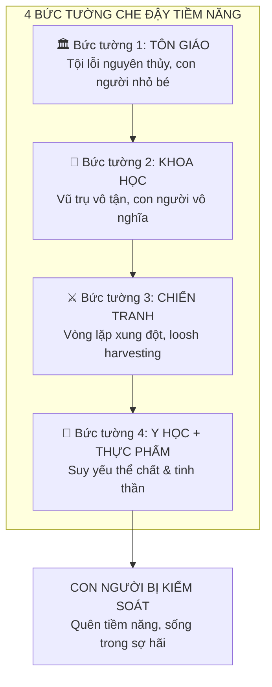
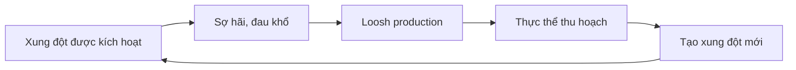
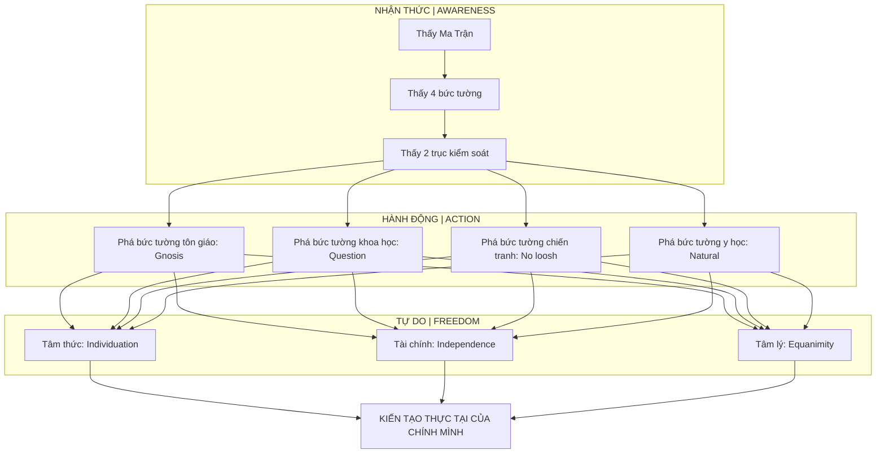

# Ma Trận — Giải Phẫu Hoàn Chỉnh

> *"Khiến con người quên đi giá trị của chính mình là bước đầu tiên để kiểm soát họ."*
> *"Making humans forget their own value is the first step to controlling them."*

Bài viết này là **bản tổng hợp hoàn chỉnh** về [[Ma Trận]] — cấu trúc, các lớp kiểm soát, mục đích tồn tại, và **con đường thoát ra**. Đây là meta-framework xâu chuỗi toàn bộ kiến thức trong vault.

*This is the complete synthesis of the Matrix — its structure, control layers, purpose of existence, and the path to escape. This is the meta-framework connecting all knowledge in the vault.*

---

## Tiền Đề: Tại Sao Ma Trận Tồn Tại? / Why Does the Matrix Exist?

### Con Người Có Tiềm Năng Vĩ Đại / Humans Have Immense Potential

Theo nhiều truyền thống tâm linh:

*According to many spiritual traditions:*

| Truyền thống | Quan điểm |
|--------------|-----------|
| **Phật giáo** | Chỉ ở cõi người mới tu được thành Phật — được làm người vô cùng hiếm hoi |
| **Gnosticism** | Con người mang "divine spark" bị mắc kẹt trong vật chất |
| **Hermeticism** | "As above, so below" — con người là microcosm của vũ trụ |
| **Nhiều tôn giáo** | Con người được tạo theo hình ảnh của Thượng Đế |

> Nếu con người thực sự có tiềm năng này, thì một **thế lực** (dù là [[Elite]], [[Thực Thể Cõi Trung Giới|thực thể chiều cao hơn]], hay cả hai) sẽ cần **giữ con người trong trạng thái quên**.
>
> *If humans truly have this potential, then a force would need to keep humans in a state of forgetting.*

### Mục Đích Ma Trận / The Matrix's Purpose

→ Xem chi tiết: [[Loosh - Năng Lượng Thu Hoạch Từ Con Người]]

---

## Cấu Trúc Ma Trận: 4 Bức Tường / Matrix Structure: 4 Walls

### Tổng Quan / Overview

---

### Bức Tường 1: Tôn Giáo / Wall 1: Religion

**Cơ chế:** Khiến con người tin mình **nhỏ bé, có tội**, cần trung gian để tiếp cận Thượng Đế.

*Mechanism: Make humans believe they are small, sinful, needing intermediaries to access God.*

| Element | Tác dụng |
|---------|----------|
| **Tội lỗi nguyên thủy** | Con người sinh ra đã có tội, cần cứu rỗi |
| **Trung gian hóa** | Cần linh mục để tiếp cận Thượng Đế |
| **Sợ hãi địa ngục** | Kiểm soát qua fear |
| **Adam-Eva 6000 năm** | Xóa bỏ lịch sử văn minh cổ |

**Contradiction:** Nếu Adam-Eva chỉ 6000 năm trước, thì mâu thuẫn với [[Atlantis]], [[Lemuria]], [[Tartaria]], Kim Tự Tháp Giza...

**Góc nhìn [[Gnosis|Gnostic]]:** Chúa Giêsu đến để **khai mở nhận thức**, không chỉ cứu rỗi. "Nước Trời" nằm **bên trong** mỗi người.

→ Xem: [[Nhân Quả, Luân Hồi và Ma Trận Tôn Giáo]]

---

### Bức Tường 2: Khoa Học / Wall 2: Science

**Cơ chế:** Khiến con người cảm thấy **vô nghĩa** trong vũ trụ vô tận, lạnh lẽo.

*Mechanism: Make humans feel meaningless in an infinite, cold universe.*

| Mô hình hiện đại | Tác dụng tâm lý |
|------------------|-----------------|
| Trái Đất cầu nhỏ bé | Con người là hạt bụi |
| Vũ trụ vô tận, ngẫu nhiên | Sự tồn tại vô mục đích |
| Tiến hóa Darwin | Chỉ là động vật may mắn |

**Contrast với [[Vũ Trụ Học Phật Giáo]]:**

| Khoa học hiện đại | Vũ trụ học cổ |
|-------------------|---------------|
| Con người nhỏ bé | Con người có vị trí đặc biệt |
| Tuổi thọ ~80 năm | Từng có người sống 84 vạn năm |
| Một loài người | Người khổng lồ từng tồn tại |

**Giả thuyết:** Cả tôn giáo (Bức tường 1) và khoa học (Bức tường 2) đều serve: **khiến con người cảm thấy nhỏ bé**.

→ Xem: [[Khoa Học Xét Lại]], [[Thuyết Trái Đất Phẳng]], [[Mô Hình Địa Tâm]]

---

### Bức Tường 3: Chiến Tranh / Wall 3: War

**Cơ chế:** Giữ con người trong **vòng lặp xung đột**, sản xuất [[Loosh - Năng Lượng Thu Hoạch Từ Con Người|Loosh]] liên tục.

*Mechanism: Keep humans in conflict loops, continuously producing Loosh.*

**Connection: [[Atula]] (Cõi A-tu-la)**

> *"Cõi Atula, đặc trưng bởi sân hận và hiếu chiến, có nhiều điểm tương đồng với thế giới con người hiện nay."*

**Giả thuyết:** Cõi Atula là tầng **gần nhất** với con người, đang **tác động mạnh** — giải thích tại sao nhân loại luôn trong trạng thái xung đột.

**Khải Huyền = Kế hoạch?**

Nếu áp dụng logic [[Predictive Programming - Cấy Tương Lai Vào Tiềm Thức|Predictive Programming]]: Khải Huyền có thể không phải tiên tri mà là **blueprint được soạn ra** và thực hiện trong tương lai.

→ Xem: [[Atula]], [[Báo Cáo 2030]]

---

### Bức Tường 4: Y Học + Thực Phẩm / Wall 4: Medicine + Food

**Cơ chế:** Suy yếu **thể chất và tinh thần**, khiến con người không còn năng lượng để đặt câu hỏi.

*Mechanism: Weaken body and mind, leaving no energy to question.*

| Hệ thống | Tác dụng |
|----------|----------|
| [[Thuốc Hóa Dầu]] | Chữa triệu chứng, không chữa gốc, tạo phụ thuộc |
| Processed food | Dopamine hijacking, nutritional void |
| Fluoride | Calcification [[Tuyến Tùng]] (con mắt thứ ba) |
| Chemicals | Hormone disruption, cognitive impairment |

> Khi cả thể chất lẫn tinh thần suy yếu, con người không còn năng lượng để tu tập, đặt câu hỏi, hay thức tỉnh.

→ Xem: [[Y Tế Tự Nhiên]], [[Thuyết Vi Sinh Nội Sinh]]

---

## Ma Trận Kiểm Soát Kép / Dual Control Matrix

Ngoài 4 bức tường, Ma Trận hoạt động trên **2 trục song song**:

*Beyond the 4 walls, the Matrix operates on 2 parallel axes:*

### Trục 1: Kiểm Soát Vật Chất / Material Control

| Hệ thống | Công cụ |
|----------|---------|
| **Tài chính** | Tiền pháp định, lạm phát, nợ nần, [[Báo Cáo 2030\|2030 Reset]] |
| **Giáo dục** | Đào tạo tuân thủ, không tư duy độc lập |
| **Lao động** | Biến người thành bánh răng (9-5) |
| **Địa lý?** | [[Bức Tường Băng]], không gian bị giới hạn |

### Trục 2: Kiểm Soát Tâm Thức / Consciousness Control

| Hệ thống | Công cụ |
|----------|---------|
| **Khoa học dòng chính** | Rào cản nhận thức, chấp nhận mặc định |
| **Chia rẽ nhị nguyên** | Đúng-Sai, Trái-Phải → mất kết nối nội tại |
| **Quên nguồn gốc** | Bám víu vật chất, suy tàn tâm thức |
| **Entertainment** | [[Hollywood - Cây Đũa Phép Của Phù Thủy\|Programming]], distraction |

---

## Lịch Sử Bị Xóa Sổ / Erased History

### Mudflood & Reset

Lịch sử loài người có thể đã bị **reset**. Các nền văn minh tiên tiến cổ đại bị xóa sổ:

*Human history may have been reset. Advanced ancient civilizations erased:*

- [[Atlantis]] — Công nghệ tiên tiến
- [[Lemuria]] — Văn minh tâm linh
- [[Tartaria]] — Gần đây hơn, bị xóa ~1800s
- Hyperborea — Vùng đất phương Bắc huyền thoại

**Mục đích:** Khiến con người quên nguồn gốc vĩ đại, bắt đầu lại từ "New World Order".

### Kiến Thức Bị Che Giấu / Hidden Knowledge

| Kiến thức | Có thể bị che giấu bởi |
|-----------|------------------------|
| Free energy (Ether, Vril) | Tập đoàn năng lượng |
| Healing knowledge | Ngành dược phẩm |
| True cosmology | "Science" establishment |
| Ancient tech | Những kẻ kiểm soát |

---

## Con Đường Thoát Ra / The Escape Path

### Nguyên Tắc: Phá Từng Bức Tường / Principle: Break Each Wall

| Bức tường | Giải pháp |
|-----------|-----------|
| **Tôn giáo** | Direct connection to Source, [[Gnosis]], "Nước Trời ở bên trong" |
| **Khoa học** | [[Khoa Học Xét Lại]], question everything, don't accept default |
| **Chiến tranh** | Không cho năng lượng vào fear/anger, starve loosh |
| **Y học/Thực phẩm** | [[Y Tế Tự Nhiên]], clean eating, detox, activate [[Tuyến Tùng]] |

### 3 Chiều Thoát / 3 Dimensions of Escape

#### 1. Tâm Thức / Consciousness

- Nhìn thấu ảo ảnh, nhận ra simulated reality
- Phá bỏ [[Chia Tách Bởi Nhị Nguyên]]
- [[Individuation]] — tích hợp Shadow
- Trực tiếp kết nối với Source

#### 2. Tài Chính / Financial

- Tách "thời gian" khỏi "thu nhập"
- [[Tư Duy Lũy Thừa]] — phi tuyến tính
- Tích lũy giá trị thực (không phải fiat)
- [[Bitcoin]], [[Privacy Is The New Wealth|Privacy]]

#### 3. Tâm Lý / Psychological

- Vô nhiễm trước tham lam và hoảng loạn
- [[Sợ hãi - Tham Lam – Cân bằng]]
- [[Tâm bất Biến]] — không bị trigger
- Không để [[Dopamine Economy - Nền Kinh Tế Của Sự Thèm Muốn|Dopamine]] điều khiển

### Tổng Kết: Bản Đồ Thoát / Summary: Escape Map

---

## Kết Luận / Conclusion

Thế giới là một bàn cờ lớn với nhiều lớp bẫy — từ tôn giáo, khoa học, chiến tranh đến y học. Nhưng **sự thức tỉnh đang xảy ra**.

*The world is a grand chessboard with multiple trap layers — from religion, science, war to medicine. But awakening is happening.*

Những cuộc xung đột địa chính trị (Iran-Mỹ, Nga-Ukraine) không chỉ là bề mặt — đó là **lớp che phủ cho cuộc chiến về nhận thức và tâm linh** của con người.

*Geopolitical conflicts are not just surface — they cover the deeper war for human consciousness and spirituality.*

Chỉ những ai **thấu hiểu quy luật vận hành** của cỗ máy và **trang bị tư duy độc lập** mới có thể bước ra khỏi bàn cờ và trở thành **người kiến tạo thực tại của chính mình**.

*Only those who understand the machine's operating principles and equip themselves with independent thinking can step off the board and become creators of their own reality.*

---

## Related / Liên quan

### Core
- [[Ma Trận]] — Base concept
- [[Elite]] — Who operates
- [[Loosh - Năng Lượng Thu Hoạch Từ Con Người]] — Why it exists

### 4 Walls
- [[Nhân Quả, Luân Hồi và Ma Trận Tôn Giáo]] — Wall 1
- [[Khoa Học Xét Lại]], [[Thuyết Trái Đất Phẳng]] — Wall 2
- [[Atula]], [[Báo Cáo 2030]] — Wall 3
- [[Y Tế Tự Nhiên]], [[Thuốc Hóa Dầu]] — Wall 4

### Hidden History
- [[Atlantis]], [[Lemuria]], [[Tartaria]]
- [[Vũ Trụ Học Phật Giáo]], [[Bức Tường Băng]]

### Escape
- [[Individuation]], [[Gnosis]]
- [[Tư Duy Lũy Thừa]], [[Bitcoin]]
- [[Privacy Is The New Wealth]]
- [[Nghịch Lý Của Hiểu Biết]] — Ultimate transcendence
