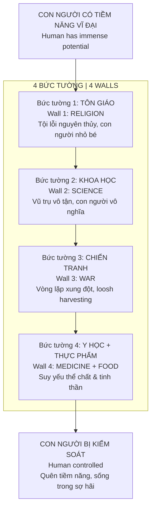
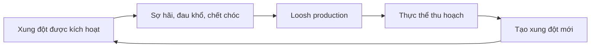

# Ma Trận Đa Tầng — Các Bức Tường Che Đậy Tiềm Năng Con Người

> *"Khiến con người quên đi giá trị của chính mình là bước đầu tiên để kiểm soát họ."*
> *"Making humans forget their own value is the first step to controlling them."*

Bài viết này trình bày một **meta-framework** — nhìn [[Ma Trận]] không phải như một hệ thống đơn lẻ, mà là **nhiều bức tường** được dựng lên qua hàng nghìn năm, tất cả đều serve cùng một mục đích: **che đậy tiềm năng vĩ đại vốn có của con người**.

*This article presents a meta-framework — viewing the Matrix not as a single system, but as multiple walls built over thousands of years, all serving the same purpose: hiding the inherent greatness of humanity.*

---

## Tiền Đề Cốt Lõi / Core Premise

### Con Người Có Tiềm Năng Vĩ Đại / Humans Have Immense Potential

Theo Phật giáo và nhiều truyền thống tâm linh:

*According to Buddhism and many spiritual traditions:*

| Truyền thống / Tradition | Quan điểm / View |
|--------------------------|------------------|
| **Phật giáo** | Chỉ ở cõi người mới tu được thành Phật |
| **Gnosticism** | Con người mang "divine spark" bị mắc kẹt |
| **Hermeticism** | "As above, so below" — con người là microcosm |
| **Nhiều tôn giáo** | Con người được tạo theo hình ảnh của Thượng Đế |

> Theo Phật giáo, được làm người là **vô cùng hiếm hoi** — và chỉ ở cõi người mới có đủ cân bằng giữa khổ và lạc để tu tập, thức tỉnh.
>
> *In Buddhism, being human is extremely rare — and only in the human realm is there enough balance between suffering and pleasure for spiritual practice and awakening.*

### Vậy Tại Sao Cần Kiểm Soát? / Why the Need for Control?

Nếu con người thực sự có tiềm năng này, thì **một thế lực** (dù là [[Elite]], [[Thực Thể Cõi Trung Giới|thực thể chiều cao hơn]], hay cả hai) sẽ cần:

*If humans truly have this potential, then a force (whether [[Elite]], [[Thực Thể Cõi Trung Giới|higher-dimensional entities]], or both) would need to:*

1. **Khiến con người quên** tiềm năng của mình
2. **Giữ con người** trong các vòng lặp tiêu cực (chiến tranh, bệnh tật, tranh đấu)
3. **Thu hoạch năng lượng** từ các trạng thái này (xem: [[Loosh - Năng Lượng Thu Hoạch Từ Con Người|Loosh]])

---

## Các Bức Tường / The Walls

---

## Bức Tường 1: Tôn Giáo / Wall 1: Religion

### Cơ Chế / Mechanism

| Element | Tác dụng / Effect |
|---------|-------------------|
| **Tội lỗi nguyên thủy** | Con người sinh ra đã có tội, cần cứu rỗi |
| **Trung gian hóa** | Cần linh mục/giáo sĩ để tiếp cận Thượng Đế |
| **Sợ hãi địa ngục** | Kiểm soát qua fear |
| **Adam-Eva 6000 năm** | Xóa bỏ lịch sử các nền văn minh cổ |

### Contradiction với Văn Minh Cổ / Contradiction with Ancient Civilizations

Nếu Adam và Eva chỉ cách nay 6000 năm, thì mâu thuẫn với:

*If Adam and Eve were only 6000 years ago, this contradicts:*

- [[Atlantis]] — Ước tính 10,000+ năm trước
- [[Lemuria]] — Có thể cổ hơn nữa
- [[Tartaria]] — Văn minh bị xóa sổ
- Kim Tự Tháp Giza, Angkor Wat, Barabar — Công nghệ vượt thời đại

> **Giả thuyết:** Kinh Thánh Cựu Ước có thể là công cụ để **định hình lại nhận thức**, đặt Adam-Eva là tổ tiên duy nhất, qua đó che khuất dấu vết của những nền văn minh trước.
>
> *Hypothesis: The Old Testament may be a tool to reshape perception, placing Adam-Eve as sole ancestors, thereby hiding traces of earlier civilizations.*

### Góc Nhìn Gnostic / Gnostic Perspective

Theo [[Gnosis|Gnosticism]]:

- Chúa Giêsu đến để **khai mở nhận thức**, không chỉ cứu rỗi
- Tương tự Đức Phật hướng con người đến giác ngộ nội tâm
- "Nước Trời" / "Phật Tính" nằm **bên trong** mỗi sinh linh
- Tổ chức tôn giáo có thể đã **đảo ngược** thông điệp gốc

*Gnostic view: Jesus came to open consciousness, similar to Buddha guiding toward inner enlightenment. The "Kingdom of Heaven" / "Buddha Nature" lies within each being.*

### Bible = "By Baal"?

Một giả thuyết etymology thú vị:

*An interesting etymology hypothesis:*

- **Bible** phiên âm gần giống **"By Baal"**
- Baal — vị thần từng được tôn thờ trong các nền văn minh Trung Đông cổ
- Có thể là wordplay ẩn giấu nguồn gốc thực sự?

> **Lưu ý:** Đây là speculation, cần research thêm. Xem: [[Gematria]]
>
> *Note: This is speculation, needs more research.*

→ Xem thêm: [[Nhân Quả, Luân Hồi và Ma Trận Tôn Giáo]]

---

## Bức Tường 2: Khoa Học / Wall 2: Science

### Cơ Chế / Mechanism

| Mô hình / Model | Tác dụng tâm lý / Psychological Effect |
|-----------------|---------------------------------------|
| **Trái Đất cầu nhỏ bé** | Con người là hạt bụi trong vũ trụ |
| **Vũ trụ vô tận, lạnh lẽo** | Sự tồn tại vô nghĩa |
| **Big Bang ngẫu nhiên** | Không có mục đích, không có thiết kế |
| **Tiến hóa Darwin** | Con người chỉ là động vật may mắn |

### Contrast với Vũ Trụ Học Cổ / Contrast with Ancient Cosmology

| Khoa học hiện đại | [[Vũ Trụ Học Phật Giáo]] |
|-------------------|-------------------------|
| Vũ trụ vô tận, con người nhỏ bé | Núi Tu Di ở trung tâm, con người có vị trí đặc biệt |
| Mặt trời khổng lồ, xa cách | Mặt trời-trăng kích thước tương đồng, xoay quanh |
| Tuổi thọ ~80 năm | Từng có người sống 84 vạn năm |
| Một loài người | Người khổng lồ từng tồn tại |

→ Xem thêm: [[Thuyết Trái Đất Phẳng]], [[Mô Hình Địa Tâm]], [[Khoa Học Xét Lại]]

### Vatican và Bức Tường Kép / Vatican and the Double Wall

**Giả thuyết:** Vatican có thể là trung tâm nắm giữ tri thức bị che giấu.

*Hypothesis: Vatican may be the center holding hidden knowledge.*

- Tôn giáo (Bức tường 1) để kiểm soát tinh thần
- Khoa học (Bức tường 2) được dựng lên sau khi tôn giáo mất hiệu quả
- Cả hai đều serve: **khiến con người cảm thấy nhỏ bé**

---

## Bức Tường 3: Chiến Tranh / Wall 3: War

### Cơ Chế / Mechanism

### Vòng Lặp Lịch Sử / Historical Loop

| Era | Conflict | Loosh Generated |
|-----|----------|-----------------|
| Cổ đại | Chiến tranh thần-người (mythology) | Foundation |
| Trung cổ | Thập Tự Chinh | Mass religious fervor |
| 20th century | WW1, WW2 | Unprecedented scale |
| Hiện đại | Regional conflicts, terrorism | Continuous fear |
| Tương lai? | WW3? | [[Báo Cáo 2030]] scenario |

### Connection: [[Atula]] và Chiến Tranh / Asura Realm Connection

> *"Cõi Atula, nơi đặc trưng bởi sân hận, tranh đấu và hiếu chiến, dường như có nhiều điểm tương đồng với thế giới con người hiện nay."*

**Giả thuyết:** Cõi Atula là tầng **gần nhất** với con người và đang **tác động mạnh** đến chúng ta.

*Hypothesis: The Asura realm is closest to humans and strongly influencing us.*

- Asura energy: jealousy, competition, "win at all costs"
- Modern world: competitive, warlike, never satisfied
- Các cuộc chiến = manifestation của Asura influence?

→ Xem chi tiết: [[Atula]]

---

## Bức Tường 4: Y Học + Thực Phẩm / Wall 4: Medicine + Food

### Cơ Chế / Mechanism

| System | Effect |
|--------|--------|
| **[[Thuốc Hóa Dầu]]** | Chữa triệu chứng, không chữa gốc, tạo phụ thuộc |
| **Processed food** | Dopamine hijacking, nutritional void |
| **Fluoride** | Calcification [[Tuyến Tùng]] (con mắt thứ ba) |
| **Chemicals in environment** | Hormone disruption, cognitive impairment |

### Mục Đích / Purpose

> Khi cả **thể chất lẫn tinh thần** suy yếu, con người không còn năng lượng để:
> - Đặt câu hỏi
> - Tu tập
> - Thức tỉnh

*When both body and mind are weakened, humans no longer have energy to question, practice, or awaken.*

→ Xem: [[Y Tế Tự Nhiên]], [[Thuyết Vi Sinh Nội Sinh]], [[Cơ Chế Tự Bảo Vệ Của Cơ Thể]]

---

## Meta-Pattern: Predictive Programming

### Khải Huyền = Kế Hoạch? / Revelation = Blueprint?

> *"Khải Huyền có thể không phải là tiên tri mà là kế hoạch được soạn ra và thực hiện trong tương lai."*

Nếu áp dụng logic [[Predictive Programming - Cấy Tương Lai Vào Tiềm Thức|Predictive Programming]]:

*If applying Predictive Programming logic:*

| "Tiên tri" | Có thể là |
|------------|-----------|
| Khải Huyền | Blueprint cho End Times scenario |
| Nostradamus | Coded plans |
| Các "lời tiên tri" khác | Agenda disclosure |

**The Simpsons analogy:** Không phải "dự đoán" tương lai — mà là **sắp đặt** để diễn ra.

---

## Thoát Khỏi Các Bức Tường / Escaping the Walls

### 1. Nhận Thức / Awareness

Bước đầu tiên: **thấy các bức tường**.

*First step: see the walls.*

### 2. Phá Từng Bức Tường / Break Each Wall

| Bức tường | Giải pháp |
|-----------|-----------|
| **Tôn giáo** | Direct connection to Source, [[Gnosis]] |
| **Khoa học** | [[Khoa Học Xét Lại]], question everything |
| **Chiến tranh** | Không cho năng lượng vào fear/anger, starve loosh |
| **Y học/Thực phẩm** | [[Y Tế Tự Nhiên]], clean eating, detox |

### 3. Nhớ Lại Tiềm Năng / Remember Your Potential

> "Nước Trời ở bên trong" / "Phật Tính ở bên trong"
>
> *"The Kingdom of Heaven is within" / "Buddha Nature is within"*

[[Individuation]] là con đường nhớ lại.

---

## Kết Luận / Conclusion

Những cuộc đối đầu như Iran-Mỹ, Nga-Ukraine, hay vô số xung đột lớn nhỏ trên thế giới **không chỉ là địa chính trị**. Đó là **lớp bề mặt** che phủ cho một cuộc chiến sâu hơn — cuộc chiến về **nhận thức và tâm linh** của con người.

*Conflicts like Iran-US, Russia-Ukraine, or countless large and small conflicts worldwide are not just geopolitics. They are the surface layer covering a deeper war — the war for human consciousness and spirituality.*

Mỗi bức tường — tôn giáo, khoa học, chiến tranh, y học — đều serve cùng một mục đích: **giữ con người trong trạng thái quên**.

*Each wall — religion, science, war, medicine — serves the same purpose: keeping humans in a state of forgetting.*

Nhưng **sự thức tỉnh đang xảy ra**. Và đó có thể là lý do tại sao hệ thống đang ngày càng desperate.

*But awakening is happening. And that may be why the system is becoming increasingly desperate.*

---

## Related / Liên quan

### Core Matrix
- [[Ma Trận]] — Base article
- [[Elite]] — Who operates the walls
- [[Loosh - Năng Lượng Thu Hoạch Từ Con Người]] — Why the walls exist

### Each Wall
- [[Nhân Quả, Luân Hồi và Ma Trận Tôn Giáo]] — Wall 1
- [[Khoa Học Xét Lại]], [[Thuyết Trái Đất Phẳng]] — Wall 2
- [[Atula]], [[Predictive Programming - Cấy Tương Lai Vào Tiềm Thức]] — Wall 3
- [[Y Tế Tự Nhiên]], [[Thuốc Hóa Dầu]] — Wall 4

### Ancient Knowledge
- [[Vũ Trụ Học Phật Giáo]] — Alternative cosmology
- [[Atlantis]], [[Lemuria]], [[Tartaria]] — Hidden civilizations
- [[Gnosis]] — Direct knowing

### Escape
- [[Individuation]] — The path
- [[Nghịch Lý Của Hiểu Biết]] — Ultimate transcendence
