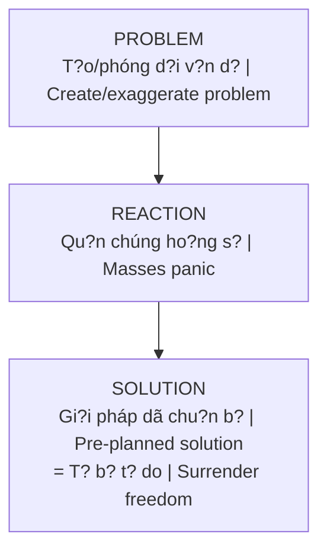

# Ma Tr?n (The Matrix)

**Ma Tr?n** không ch? là b? phim - nó là metaphor cho h? th?ng ki?m soát da chi?u dang v?n hành trên Trái Ð?t: giáo d?c, tài chính, truy?n thông, tôn giáo. T?t c? thi?t k? d? gi? tâm th?c con ngu?i "ng? mê" và khai thác nang lu?ng.

*The **Matrix** isn't just a movie - it's a metaphor for the multi-dimensional control system operating on Earth: education, finance, media, religion. All designed to keep human consciousness "asleep" and harvest energy.*

---

## Các t?ng Ma Tr?n / Layers of the Matrix

### T?ng 1: V?t Ch?t / Physical Layer

| Vietnamese | English |
|------------|---------|
| **Giáo d?c**: D?y tuân th?, không d?y tu duy ph?n bi?n | **Education**: Teaches compliance, not critical thinking |
| **Công vi?c 9-5**: Bi?n ngu?i thành rang cua | **9-5 jobs**: Turn people into cogs |
| **N? n?n**: Nô l? n? su?t d?i | **Debt**: Lifelong debt slavery |

### T?ng 2: Tâm Lý / Psychological Layer

| Vietnamese | English |
|------------|---------|
| **Truy?n thông**: Ki?m soát narrative | **Media**: Controls narrative |
| **Gi?i trí**: Distraction d? tránh n?i quan | **Entertainment**: Distraction from introspection |
| **Social Media**: Echo chambers & polarization | **Social Media**: Echo chambers & polarization |

### T?ng 3: Tâm Linh / Spiritual Layer

| Vietnamese | English |
|------------|---------|
| **Tôn giáo t? ch?c**: Trung gian hóa v?i Ngu?n | **Organized religion**: Intermediary to Source |
| **New Age traps**: L?i d?y n?a v?i | **New Age traps**: Half-truths |
| **[[Luân H?i]] trap**: Soul recycling | **[[Luân H?i]] trap**: Soul recycling |

---

## M?c dích Ma Tr?n / Purpose of the Matrix

### 1. Thu ho?ch nang lu?ng / Energy Harvesting (Loosh)

Con ngu?i là "ngu?n nang lu?ng" cho các th?c th? c?p cao. S? hãi, lo l?ng, dau kh? t?o ra "loosh" - nang lu?ng du?c thu ho?ch.

*Humans are "energy sources" for higher entities. Fear, anxiety, suffering create "loosh" - energy that gets harvested.*

### 2. Ngan ch?n Th?c T?nh / Prevent Awakening

Ma Tr?n ngan con ngu?i nh?n ra b?n ch?t th?c - nh?ng sinh linh có s?c m?nh sáng t?o vô h?n.

*The Matrix prevents humans from realizing their true nature - beings with infinite creative power.*

### 3. Duy trì quy?n l?c [[Elite]] / Maintain Elite Power

Ki?m soát thông qua s? vô minh t?p th? c?a qu?n chúng.

*Control through collective ignorance of the masses.*

---

## Cách Ma Tr?n ho?t d?ng / How the Matrix Operates

### Problem-Reaction-Solution

### Divide and Conquer / Chia d? tr?

- Left / Right politics
- Rich / Poor
- Race / Religion
- Generations (Boomer vs Gen Z)

### Normalization / Bình thu?ng hóa

D?n normalize nh?ng th? t?ng không th? ch?p nh?n, d?n khi chúng tr? thành "normal".

*Gradually normalize what was once unacceptable until it becomes "normal".*

---

## Thoát kh?i Ma Tr?n / Escaping the Matrix

### 1. Nh?n th?c / Awareness

Bu?c d?u là **nhìn th?y**. Nhu Neo, m?t khi dã th?y, không th? "unsee".

*First step is **seeing**. Like Neo, once you see, you can't unsee.*

### 2. Gi?i mã / Deprogramming

- Ð?t câu h?i v? m?i ni?m tin / Question all beliefs
- Tìm ngu?n thông tin alternative / Find alternative sources
- [[Tâm Lý H?c Jung|Shadow work]] / Recognize internal programming

### 3. Nâng t?n s? / Raise Frequency

Ma Tr?n ho?t d?ng ? d?i t?n s? nh?t d?nh. Nâng cao t?n s? qua:

*The Matrix operates at certain frequency. Raise your vibration through:*

- Meditation / Thi?n d?nh
- Clean eating / An s?ch
- Nature connection / K?t n?i thiên nhiên
- Unconditional love / Tình yêu vô di?u ki?n

### 4. Exit Strategies / Chi?n lu?c thoát

| Area | Strategy |
|------|----------|
| **Finance** | [[Bitcoin]], gold, self-sufficiency |
| **Information** | Exit mainstream media |
| **Physical** | Off-grid, permaculture |
| **Spiritual** | Direct connection to Source |

---

## Related

### Matrix Structure / C?u trúc Ma Tr?n
- [[Ma Tr?n - Gi?i Ph?u Hoàn Ch?nh|Ma Tr?n Ki?m Soát]]
- [[Mental Model - Ki?n Trúc B? Khóa Ma Tr?n]]
- [[33 T?ng B?c - Khám Phá Ngôi Ð?n Linh Thiêng Trong Tâm Trí]]

### Operators / K? v?n hành
- [[Elite]] - Controlling elite
- [[Cabal]] - Shadow forces
- [[Saturn Cube]] - Control symbolism

### Programming Tools / Công c? l?p trình
- [[Hollywood - Cây Ðua Phép C?a Phù Th?y]] - Entertainment as spellcasting
- [[Inception - Predictive Programming V? Ki?m Soát Tâm Trí]] - C?y ý tu?ng
- [[Schadenfreude - Dopamine Ph?n Di?n]] - Exploit dark emotions

### Energy Harvesting / Thu ho?ch nang lu?ng
- [[Loosh - Nang Lu?ng Thu Ho?ch T? Con Ngu?i]] - Unified theory of energy harvesting
- [[Th?c Th? Cõi Trung Gi?i]] - Collectors/Archons
- [[Nang Lu?ng Tình D?c]] - Sexual energy as primary target
- [[S? Th?t Ðen T?i V? Phim Khiêu Dâm]] - Case study: porn industry

### Hidden Knowledge / Ki?n th?c b? che gi?u
- [[Gaia - Trái Ð?t Có Ý Th?c]] - Earth consciousness suppressed
- [[Khoa H?c Xét L?i]] - Ancient wisdom repackaged as "discoveries"

### Escape / Thoát kh?i
- [[Ma Tr?n - Gi?i Ph?u Hoàn Ch?nh]]
- [[Gnosis]] - Path of knowledge
- [[Individuation]] - Personal awakening
- [[Privacy Is The New Wealth]] - Stealth as survival strategy
