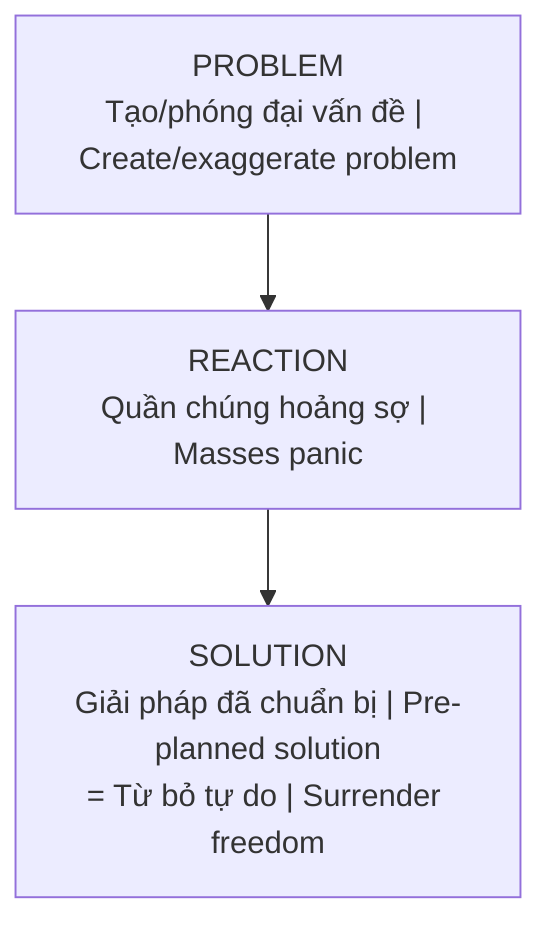

---
title: "Ma Trận (The Matrix)"
date: 2026-04-07
tags: [esoterica]
status: refined
related:
  - "[[Elite]]"
  - "[[Saturn Cube]]"
  - "[[Ma Trận - Giải Phẫu Hoàn Chỉnh]]"
---
# Ma Trận (The Matrix)

**Ma Trận** không chỉ là bộ phim — nó là metaphor cho hệ thống kiểm soát đa chiều đang vận hành trên Trái Đất: giáo dục, tài chính, truyền thông, tôn giáo. Tất cả thiết kế để giữ tâm thức con người "ngủ mê" và khai thác năng lượng.

*The **Matrix** isn't just a movie — it's a metaphor for the multi-dimensional control system operating on Earth: education, finance, media, religion. All designed to keep human consciousness "asleep" and harvest energy.*

---

## Các tầng Ma Trận / Layers of the Matrix

### Tầng 1: Vật Chất / Physical Layer

| Vietnamese | English |
|------------|---------|
| **Giáo dục**: Dạy tuân thủ, không dạy tư duy phản biện | **Education**: Teaches compliance, not critical thinking |
| **Công việc 9-5**: Biến người thành răng cưa | **9-5 jobs**: Turn people into cogs |
| **Nợ nần**: Nô lệ nợ suốt đời | **Debt**: Lifelong debt slavery |

### Tầng 2: Tâm Lý / Psychological Layer

| Vietnamese | English |
|------------|---------|
| **Truyền thông**: Kiểm soát narrative | **Media**: Controls narrative |
| **Giải trí**: Distraction để tránh nội quan | **Entertainment**: Distraction from introspection |
| **Social Media**: Echo chambers & polarization | **Social Media**: Echo chambers & polarization |

### Tầng 3: Tâm Linh / Spiritual Layer

| Vietnamese | English |
|------------|---------|
| **Tôn giáo tổ chức**: Trung gian hóa với Nguồn | **Organized religion**: Intermediary to Source |
| **New Age traps**: Lời dạy nửa vời | **New Age traps**: Half-truths |
| **[[Luân Hồi]] trap**: Soul recycling | **[[Luân Hồi]] trap**: Soul recycling |

---

## Mục đích Ma Trận / Purpose of the Matrix

### 1. Thu hoạch năng lượng / Energy Harvesting (Loosh)

Con người là "nguồn năng lượng" cho các thực thể cấp cao. Sợ hãi, lo lắng, đau khổ tạo ra "loosh" — năng lượng được thu hoạch.

*Humans are "energy sources" for higher entities. Fear, anxiety, suffering create "loosh" — energy that gets harvested.*

### 2. Ngăn chặn Thức Tỉnh / Prevent Awakening

Ma Trận ngăn con người nhận ra bản chất thực — những sinh linh có sức mạnh sáng tạo vô hạn.

*The Matrix prevents humans from realizing their true nature — beings with infinite creative power.*

### 3. Duy trì quyền lực [[Elite]] / Maintain Elite Power

Kiểm soát thông qua sự vô minh tập thể của quần chúng.

*Control through collective ignorance of the masses.*

---

## Cách Ma Trận hoạt động / How the Matrix Operates

### Problem-Reaction-Solution

### Divide and Conquer / Chia để trị

- Left / Right politics
- Rich / Poor
- Race / Religion
- Generations (Boomer vs Gen Z)

### Normalization / Bình thường hóa

Dần normalize những thứ từng không thể chấp nhận, đến khi chúng trở thành "normal".

*Gradually normalize what was once unacceptable until it becomes "normal".*

---

## Thoát khỏi Ma Trận / Escaping the Matrix

### 1. Nhận thức / Awareness

Bước đầu là **nhìn thấy**. Như Neo, một khi đã thấy, không thể "unsee".

*First step is **seeing**. Like Neo, once you see, you can't unsee.*

### 2. Giải mã / Deprogramming

- Đặt câu hỏi về mọi niềm tin / Question all beliefs
- Tìm nguồn thông tin alternative / Find alternative sources
- [[Tâm Lý Học Jung|Shadow work]] / Recognize internal programming

### 3. Nâng tần số / Raise Frequency

Ma Trận hoạt động ở dải tần số nhất định. Nâng cao tần số qua:

*The Matrix operates at certain frequency. Raise your vibration through:*

- Meditation / Thiền định
- Clean eating / Ăn sạch
- Nature connection / Kết nối thiên nhiên
- Unconditional love / Tình yêu vô điều kiện

### 4. Exit Strategies / Chiến lược thoát

| Area | Strategy |
|------|----------|
| **Finance** | [[Bitcoin]], gold, self-sufficiency |
| **Information** | Exit mainstream media |
| **Physical** | Off-grid, permaculture |
| **Spiritual** | Direct connection to Source |

---

## Related

### Matrix Structure / Cấu trúc Ma Trận
- [[Ma Trận - Giải Phẫu Hoàn Chỉnh|Ma Trận Kiểm Soát]]
- [[Mental Model - Kiến Trúc Bẻ Khóa Ma Trận]]
- [[33 Tầng Bậc - Khám Phá Ngôi Đền Linh Thiêng Trong Tâm Trí]]

### Operators / Kẻ vận hành
- [[Elite]] — Controlling elite
- [[Cabal]] — Shadow forces
- [[Saturn Cube]] — Control symbolism

### Programming Tools / Công cụ lập trình
- [[Hollywood - Cây Đũa Phép Của Phù Thủy]] — Entertainment as spellcasting
- [[Inception - Predictive Programming Về Kiểm Soát Tâm Trí]] — Cấy ý tưởng
- [[Schadenfreude - Dopamine Phản Diện]] — Exploit dark emotions

### Energy Harvesting / Thu hoạch năng lượng
- [[Loosh - Năng Lượng Thu Hoạch Từ Con Người]] — Unified theory of energy harvesting
- [[Thực Thể Cõi Trung Giới]] — Collectors/Archons
- [[Năng Lượng Tình Dục]] — Sexual energy as primary target
- [[Sự Thật Đen Tối Về Phim Khiêu Dâm]] — Case study: porn industry

### Hidden Knowledge / Kiến thức bị che giấu
- [[Gaia - Trái Đất Có Ý Thức]] — Earth consciousness suppressed
- [[Khoa Học Xét Lại]] — Ancient wisdom repackaged as "discoveries"

### Escape / Thoát khỏi
- [[Ma Trận - Giải Phẫu Hoàn Chỉnh]]
- [[Gnosis]] — Path of knowledge
- [[Individuation]] — Personal awakening
- [[Privacy Is The New Wealth]] — Stealth as survival strategy
