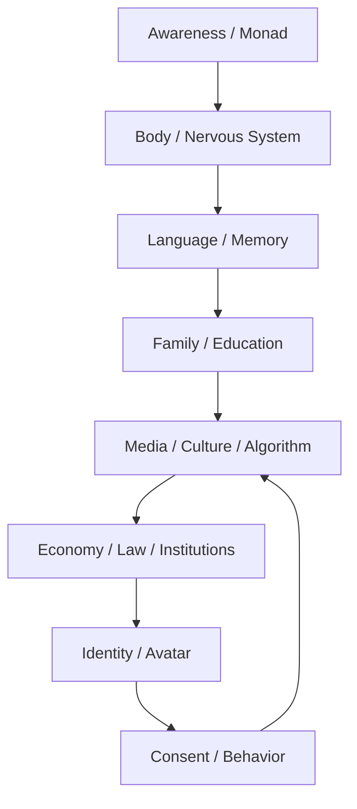
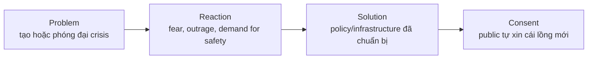
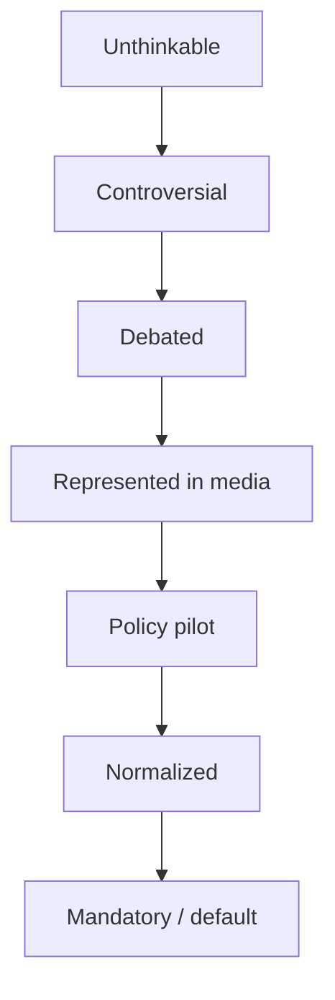
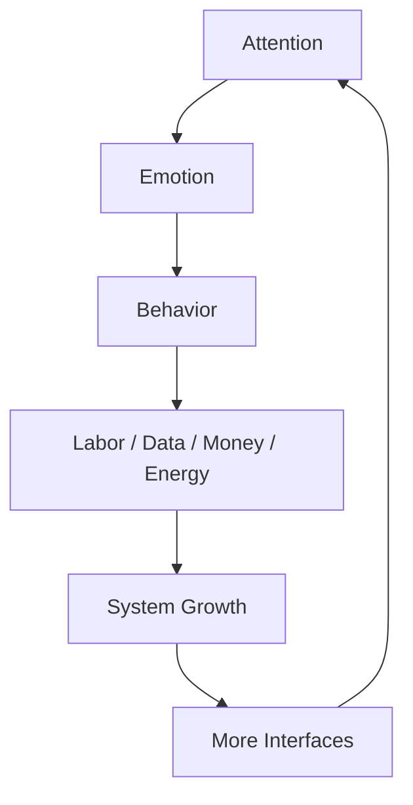
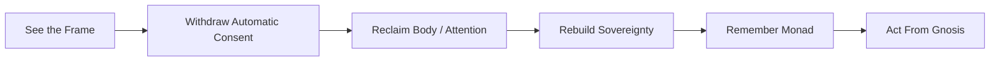

# Ma Trận (The Matrix)

**Ma Trận không chỉ là một bộ phim hay một “âm mưu” bên ngoài. Ma Trận là hệ điều hành của perception: lớp interface khiến một sinh thể có [[Monad]] quên mình là ai, đồng nhất với avatar xã hội, rồi tự vận hành theo những luật chơi được thiết kế sẵn.**

*The Matrix is not merely a movie or an external conspiracy. It is an operating system of perception: an interface that makes a being with a [[Monad]] forget what it is, identify with a social avatar, and self-operate according to pre-designed rules.*

---

## Vault Position / Vị Trí Trong Vault

**Ma Trận** là hub trung tâm của redpill.wiki. Hầu hết các node khác là một lớp, một cơ quan, hoặc một symptom của Ma Trận: tiền tệ, giáo dục, truyền thông, y tế, religion, food, sex, AI, Hollywood, disclosure, finance và even spirituality.

Nhưng cần đọc cho đúng: Ma Trận không đơn giản là “họ lừa mình”. Đó là một operating system định nghĩa:

- cái gì được gọi là thật,
- cái gì bị gọi là điên,
- cái gì đáng sợ,
- cái gì đáng thèm muốn,
- cái gì là “bình thường”,
- và cái gì không bao giờ được đặt thành câu hỏi.

Nếu [[Sự Nhất Thể]] là reality nền, [[Monad]] là tia lửa bất khả phân bên trong, và [[Gnosis]] là sự nhớ lại trực tiếp, thì Ma Trận là lớp interface khiến Monad đồng nhất mình với role, debt, trauma, status, ideology, body image, career path và narrative.

> Ma Trận mạnh nhất không phải khi nó cấm bạn thấy. Nó mạnh nhất khi nó dạy bạn gọi cái lồng là “đời sống bình thường”.

---

## How To Read This / Cách Đọc Bài Này

Đừng đọc Ma Trận như một claim một tầng. Bài này có bốn tầng:

| Tầng | Cách đọc | Ví dụ |
|---|---|---|
| **Fact / documentable** | Có hệ thống thật, institution thật, incentive thật | debt, media ownership, pharma incentives, algorithmic feeds |
| **Pattern / systems reading** | Các hệ thống cùng conditioning hành vi | problem-reaction-solution, divide-and-conquer, normalization |
| **Symbol / myth reading** | Cách myth/cinema/symbol lập trình subconscious | The Matrix, red pill, black cube, obelisk, Hollywood |
| **Speculative synthesis** | Tầng huyền học/consciousness model | Loosh, archons, soul trap, prison planet |

Theo rule của [[Cách Đọc Red Pill Wiki]]: không lấy tầng symbolic/speculative để thay thế fact, nhưng cũng không dùng fact-level để phủ định mọi tầng symbol.

---

## 1. Ma Trận Là Gì? / What Is The Matrix?

Ma Trận là **interface giữa awareness và world**.

Nó không chỉ nằm ngoài kia. Nó đi qua hệ thần kinh, ngôn ngữ, ký ức, gia đình, trường học, tiền bạc, truyền thông, pháp luật, tôn giáo, thuật toán và ước mơ cá nhân.

Bạn không chỉ bị kiểm soát bởi thông tin sai. Bạn bị kiểm soát bởi những cái khung khiến một số câu hỏi không bao giờ xuất hiện trong đầu.

*You are not only controlled by false information. You are controlled by frames that prevent certain questions from arising at all.*

---

## 2. Ba Tầng Cốt Lõi / Three Core Layers

### Tầng 1: Physical Matrix

Đây là tầng dễ thấy nhất: thân xác, tiền bạc, thời gian, không gian sống, công việc, nợ, food system, medical system.

| Module | Cách kiểm soát |
|---|---|
| Giáo dục | dạy tuân thủ, thi cử, credential, không dạy sovereignty |
| Công việc | đổi lifetime lấy salary, status và exhaustion |
| Nợ | kéo tương lai về hiện tại rồi bắt con người trả bằng thời gian sống |
| Food | làm cơ thể viêm, mệt, nghiện, mất clarity |
| Medical system | chữa symptom, ít hỏi terrain và incentive |
| Housing/urban design | cắt con người khỏi đất, nắng, cộng đồng, silence |

Physical Matrix làm con người quá mệt để đặt câu hỏi sâu.

### Tầng 2: Psychological Matrix

Đây là tầng programming: media, dopamine, shame, fear, identity politics, social comparison.

| Module | Cách kiểm soát |
|---|---|
| News | định nghĩa crisis nào đáng sợ hôm nay |
| Social media | reward loop, outrage loop, comparison loop |
| Entertainment | distraction, predictive programming, emotional rehearsal |
| Porn/sex economy | dopamine hijack, intimacy collapse, energy drain |
| Politics | binary choice, false enemy, tribal identity |
| Education/media language | giới hạn từ vựng để giới hạn suy nghĩ |

Psychological Matrix không cần bạn tin tất cả. Nó chỉ cần bạn phản ứng theo nhịp nó đặt.

### Tầng 3: Spiritual Matrix

Đây là tầng sâu nhất: con người quên mình là ai.

| Module | Cách kiểm soát |
|---|---|
| Organized religion | trung gian hóa Source, biến direct knowing thành permission |
| New Age traps | love-and-light bypass, không chạm shadow hoặc system |
| Soul contracts / karma misread | biến bài học thành hợp đồng nô lệ |
| [[Luân Hồi]] trap | memory wipe, repetition, guilt, unfinished loops |
| False awakening | tưởng mình tỉnh vì biết conspiracy, nhưng ego vẫn là chủ |

Spiritual Matrix không chỉ che sự thật. Nó đưa ra những “sự thật nửa vời” đủ hấp dẫn để người đọc dừng lại trước [[Gnosis]].

---

## 3. Cơ Chế Vận Hành / Operating Mechanisms

### Problem → Reaction → Solution

Không phải crisis nào cũng fake. Điểm cần đọc là: crisis được frame như thế nào, solution nào được chuẩn bị sẵn, và quyền tự do nào bị đổi lấy cảm giác an toàn.

### Divide and Conquer

[[Nhị Nguyên]] là nguyên lý tự nhiên của cõi vật chất, nhưng trong Ma Trận nó bị weaponize thành binary cage.

- left vs right
- men vs women
- rich vs poor
- science vs spirituality
- vax vs antivax
- believer vs conspiracy theorist
- patriot vs traitor

Khi public chọn phe trong một binary được thiết kế sẵn, họ tưởng mình đang tự do. Thực ra họ chỉ đang chọn lane trong cùng một highway.

### Normalization

Ma Trận không ép mọi thứ ngay lập tức. Nó làm mềm biên giới của cái bình thường.

Đây là nơi [[Hollywood - Cây Đũa Phép Của Phù Thủy]], [[Predictive Programming - Cấy Tương Lai Vào Tiềm Thức]] và [[Karma Disclosure - Truth Hidden In Plain Sight]] nối trực tiếp vào Ma Trận.

### Reward Hijacking

Ma Trận không chỉ dùng sợ hãi. Nó dùng phần thưởng.

- dopamine từ notification,
- validation từ likes,
- status từ career,
- identity từ ideology,
- comfort từ consumption,
- escape từ entertainment,
- sexual charge từ porn,
- certainty từ dogma.

Một cái lồng có thưởng sẽ khó nhận ra hơn một cái lồng có roi.

---

## 4. Mục Đích / Why Does The Matrix Exist?

Ở tầng fact, Ma Trận tạo lợi ích cho những system có incentive thật: banks, platforms, pharma, military, media, bureaucracy, state power.

Ở tầng pattern, Ma Trận duy trì một population dễ dự đoán, dễ quản lý, dễ kích hoạt cảm xúc, dễ bán sản phẩm và dễ xin consent.

Ở tầng metaphysical, Ma Trận có thể được đọc như một hệ thống harvest attention/emotion/life-force, tức [[Loosh - Năng Lượng Thu Hoạch Từ Con Người]].

Mục đích cuối không chỉ là “kiểm soát”. Kiểm soát là phương tiện. Mục đích sâu hơn là **capture creative energy**: biến năng lượng sáng tạo của Monad thành labor, fear, data, debt, ideology, shame, war, consumption và repetition.

---

## 5. Ai Vận Hành Ma Trận? / Who Runs The Matrix?

Câu trả lời yếu nhất: “một nhóm người xấu”.

Câu trả lời mạnh hơn: **Ma Trận được vận hành bởi nhiều tầng quyền lực chồng lên nhau**.

| Tầng | Actor | Vai trò |
|---|---|---|
| Institutional | state, banks, corporations, NGOs, academia | policy, funding, credential, enforcement |
| Narrative | media, Hollywood, education, influencers | story, emotion, status, frame |
| Technical | platforms, AI, surveillance, payment rails | data, behavior prediction, friction/control |
| Esoteric | secret societies, ritual systems, symbolic priesthood | myth, consent, archetype, initiation |
| Metaphysical | archons/entities/loosh collectors | speculative layer: energy harvest, soul-loop management |

[[Elite]] là node đại diện cho tầng institutional/narrative/financial. Nhưng nếu chỉ săn danh sách người, người đọc sẽ kẹt ở cartoon conspiracy. Ma Trận mạnh vì nó là **network of incentives + interfaces**, không chỉ là một phòng họp bí mật.

> Elite không cần kiểm soát mọi người mọi lúc. Họ chỉ cần kiểm soát default options mà số đông tưởng là lựa chọn tự do.

---

## 6. Ma Trận Và Bản Ngã / Matrix And The Avatar

Ma Trận cần một chỗ để bám. Chỗ đó là identity.

Con người sinh ra không chỉ là body. Nhưng qua thời gian, họ bị dạy để đồng nhất với:

- tên gọi,
- thành tích,
- nghề nghiệp,
- trauma,
- quốc tịch,
- giới tính xã hội,
- phe chính trị,
- tài sản,
- body image,
- diagnosis,
- follower count,
- spiritual label.

Những thứ này không nhất thiết giả. Chúng là interface. Bẫy nằm ở chỗ tưởng interface là Self.

[[Individuation]] giúp avatar trở nên toàn vẹn. [[Gnosis]] giúp nhớ ra người đang chơi avatar. [[Monad]] là phần chưa từng bị Ma Trận sở hữu.

---

## 7. False Awakening / Tỉnh Giả

Một trong những module tinh vi nhất của Ma Trận là bán cho bạn cảm giác “tôi đã tỉnh”.

Dấu hiệu tỉnh giả:

- mọi thứ quy về một enemy duy nhất,
- khinh người khác là NPC,
- nghiện doomscrolling và rabbit hole,
- biết nhiều conspiracy nhưng đời sống cá nhân vẫn hỗn loạn,
- dùng spirituality để né shadow,
- dùng “ma trận” để trốn trách nhiệm,
- mất khả năng nói “tôi chưa biết”.

Đây là lý do [[Nghịch Lý Của Hiểu Biết]] nằm ở trung tâm vault. Thoát khỏi mainstream dogma để rơi vào alternative dogma vẫn là ở trong Ma Trận.

> Red pill không phải đổi nhà tù. Red pill là thấy cơ chế tạo nhà tù.

---

## 8. Escape Strategy / Chiến Lược Thoát

Thoát Ma Trận không phải một cú rage quit. Nó là quá trình lấy lại chủ quyền theo nhiều tầng.

### 1. Perception Sovereignty

- đọc chậm lại,
- tách fact / pattern / symbol / speculation,
- giảm media input,
- học cách đặt câu hỏi tốt,
- không để algorithm quyết định worldview.

→ Xem: [[Cách Đọc Red Pill Wiki]], [[Khoa Học Xét Lại]], [[Kiểm Soát Tâm Trí]].

### 2. Body Sovereignty

- ngủ, nắng, nước, muối, vận động,
- giảm junk dopamine,
- hiểu terrain,
- không outsource hoàn toàn health authority.

→ Xem: [[Y Tế Tự Nhiên]], [[Kính Chiếu Yêu - Nhìn Thấu Tây Y]], [[MOC - Health Sovereignty]].

### 3. Financial Sovereignty

- hiểu fiat/debt,
- giảm dependency,
- học privacy,
- giữ optionality.

→ Xem: [[Bitcoin]], [[Privacy]], [[MOC - Financial Sovereignty]].

### 4. Spiritual Sovereignty

- direct connection to Source,
- shadow work,
- Gnosis thay vì dogma,
- humility trước cái chưa biết.

→ Xem: [[Gnosis]], [[Monad]], [[Sự Nhất Thể]].

---

## 9. Synthesis / Tổng Hợp

Ma Trận không phải một cái máy ngoài kia. Nó là một hệ thống nhiều tầng vận hành qua institution, narrative, body, dopamine, fear, identity và metaphysical forgetting.

Nó không cần nhốt bạn bằng xích nếu có thể khiến bạn yêu cái avatar mà nó thiết kế cho bạn.

Nó không cần che mọi sự thật nếu có thể đặt sự thật vào frame sai.

Nó không cần bắt bạn consent nếu có thể khiến bạn tự xin thêm control để đổi lấy comfort.

Và nó không thể sở hữu [[Monad]], trừ khi Monad quên mình là Monad.

> Ma Trận kết thúc không phải khi toàn bộ thế giới bên ngoài đổi. Nó bắt đầu nứt khi cái bên trong ngừng gọi programming là “tôi”.

---

## Related

### Core Matrix Framework

- [[Ma Trận - Giải Phẫu Hoàn Chỉnh]] — bản giải phẫu sâu hơn
- [[Mental Model - Kiến Trúc Bẻ Khóa Ma Trận]] — practical unlock model
- [[MOC - Esoterica & Consciousness]] — bản đồ metaphysics/consciousness
- [[MOC - Epistemology & Propaganda]] — bản đồ framing/propaganda

### Operators & Control Tools

- [[Elite]]
- [[Kiểm Soát Tâm Trí]]
- [[Báo Cáo 2030]]
- [[Hollywood - Cây Đũa Phép Của Phù Thủy]]
- [[Predictive Programming - Cấy Tương Lai Vào Tiềm Thức]]

### Energy, Soul & Escape

- [[Loosh - Năng Lượng Thu Hoạch Từ Con Người]]
- [[Luân Hồi]]
- [[Gnosis]]
- [[Monad]]
- [[Individuation]]
- [[Nghịch Lý Của Hiểu Biết]]
