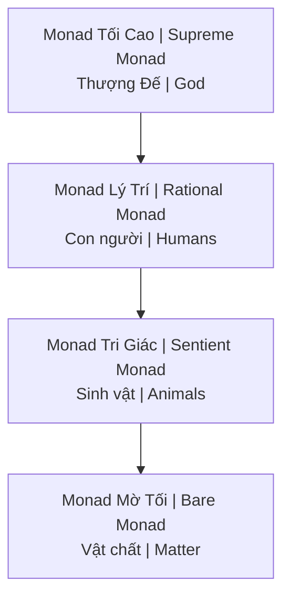

---
title: "Monad (Đơn Thể Tối Cao)"
aliases: ["Monad", "The One"]
date: 2026-04-08
tags: [esoterica]
status: refined
---
# Monad (Đơn Thể Tối Cao)

**Monad** (từ Hy Lạp μονάς monás = "unit") là đơn thể tinh thần, vô hình, không thể phân rã — nguồn gốc và thành phần cơ bản nhất của thực tại.

*Monad (Greek μονάς monás = "unit") is a spiritual, invisible, indivisible entity — the source and most basic component of reality.*

---

## Trong Các Truyền thống / Across Traditions

| Tradition | Term | Description |
|-----------|------|-------------|
| **Pythagoras** | Monas | The One, source of numbers |
| **Plato** | The One | Beyond being / Vượt trên hiện hữu |
| **Plotinus** | The One | First principle / Nguyên lý đầu tiên |
| **Leibniz** | Monad | Simple substance |
| **Theosophy** | Monad | Divine spark / Tia lửa thần thánh |
| **Đạo** | Vô Cực | Limitless, undifferentiated |
| **Hindu** | Brahman | Ultimate reality |

---

## Đặc điểm Cốt lõi / Core Characteristics

| Feature | Description |
|---------|-------------|
| **Indivisible** | Không thể chia nhỏ / Cannot be divided |
| **Self-contained** | "No windows" (Leibniz) / Complete universe within |
| **Source of All** | Everything emanates from The One / Mọi thứ phát xuất từ Một |
| **Eternal** | No parts = no destruction |

---

## Leibniz's Hierarchy

### Implications / Hàm ý

| Concept | Meaning |
|---------|---------|
| **Panpsychism** | Everything is alive/conscious |
| **Humans** | = Awakening monads |
| **Evolution** | = Monad development |
| **Death** | = Monad continues |

---

## Hành trình Linh hồn / Soul Journey

### Descent / Hạ giáng

1. Monad emanates "spark" / Monad phát ra "tia lửa"
2. Spark descends through planes / Hạ xuống qua các cõi
3. Takes on denser bodies / Khoác thân xác dày đặc
4. Forgets origin (amnesia) / Quên nguồn gốc

### Ascent / Thăng hoa

1. Awakening in matter / Thức tỉnh trong vật chất
2. [[Gnosis|Gnosis]] — remembering / nhớ lại
3. Purification through experience / Thanh lọc qua trải nghiệm
4. Return to source / Trở về nguồn

### Purpose / Mục đích

- Experience all possibilities / Trải nghiệm mọi khả năng
- Monad enriched by journey / Monad được làm giàu bởi hành trình
- "God knowing itself" / "Thượng Đế tự biết mình"

---

## Monad vs Soul vs Spirit

| Level | Vietnamese | Description |
|-------|------------|-------------|
| **Spirit (Monad)** | Tinh thần | Unchanging divine spark / Không đổi |
| **Soul** | Linh hồn | Accumulator of experience / Tích lũy kinh nghiệm |
| **Personality** | Nhân cách | Current life identity / Bản ngã đời này |

---

## Scientific Parallels / Song song Khoa học

### Quantum Physics

| Concept | Connection |
|---------|------------|
| **Holographic universe** | Each part contains whole / Mỗi phần chứa toàn thể |
| **Observer effect** | Consciousness fundamental |
| **Non-locality** | Everything connected / Mọi thứ kết nối |

### Field Theory

- Unified field / Trường thống nhất
- Everything is energy / Mọi thứ là năng lượng
- Patterns within patterns

---

## Related

### Return to Source
- [[Sự Nhất Thể]] — The unity Monad represents
- [[Gnosis]] — Remembering monad nature
- [[Luân Hồi]] — Monad's journey through lives

### Connection
- [[Vô Thức Tập Thể]] — Shared monad memory?
- [[Giải Mã Thiên Tai, Long Mạch và Triết Học Monad]]

### Awakening
- [[Tâm Lý Học Jung]] — Individuation as monad awakening
- [[Individuation]]
