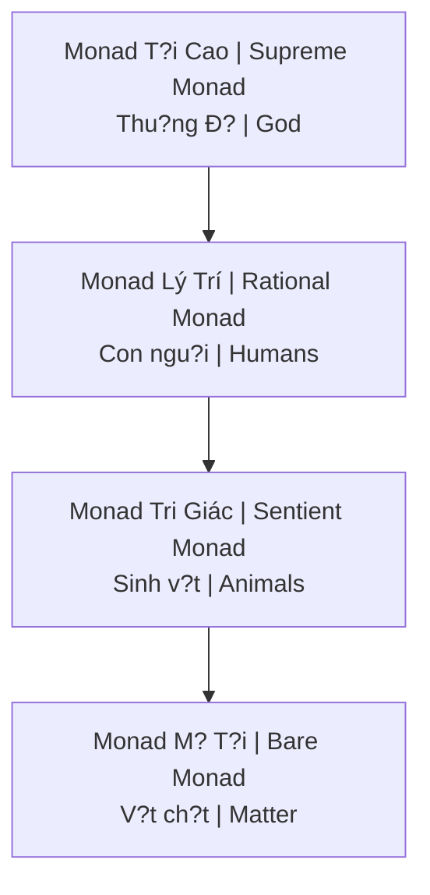

# Monad (Ðon Th? T?i Cao)

**Monad** (t? Hy L?p µ???? monás = "unit") là don th? tinh th?n, vô hình, không th? phân rã - ngu?n g?c và thành ph?n co b?n nh?t c?a th?c t?i.

*Monad (Greek µ???? monás = "unit") is a spiritual, invisible, indivisible entity - the source and most basic component of reality.*

---

## Trong Các Truy?n th?ng / Across Traditions

| Tradition | Term | Description |
|-----------|------|-------------|
| **Pythagoras** | Monas | The One, source of numbers |
| **Plato** | The One | Beyond being / Vu?t trên hi?n h?u |
| **Plotinus** | The One | First principle / Nguyên lý d?u tiên |
| **Leibniz** | Monad | Simple substance |
| **Theosophy** | Monad | Divine spark / Tia l?a th?n thánh |
| **Ð?o** | Vô C?c | Limitless, undifferentiated |
| **Hindu** | Brahman | Ultimate reality |

---

## Ð?c di?m C?t lõi / Core Characteristics

| Feature | Description |
|---------|-------------|
| **Indivisible** | Không th? chia nh? / Cannot be divided |
| **Self-contained** | "No windows" (Leibniz) / Complete universe within |
| **Source of All** | Everything emanates from The One / M?i th? phát xu?t t? M?t |
| **Eternal** | No parts = no destruction |

---

## Leibniz's Hierarchy

### Implications / Hàm ý

| Concept | Meaning |
|---------|---------|
| **Panpsychism** | Everything is alive/conscious |
| **Humans** | = Awakening monads |
| **Evolution** | = Monad development |
| **Death** | = Monad continues |

---

## Hành trình Linh h?n / Soul Journey

### Descent / H? giáng

1. Monad emanates "spark" / Monad phát ra "tia l?a"
2. Spark descends through planes / H? xu?ng qua các cõi
3. Takes on denser bodies / Khoác thân xác dày d?c
4. Forgets origin (amnesia) / Quên ngu?n g?c

### Ascent / Thang hoa

1. Awakening in matter / Th?c t?nh trong v?t ch?t
2. [[Gnosis|Gnosis]] - remembering / nh? l?i
3. Purification through experience / Thanh l?c qua tr?i nghi?m
4. Return to source / Tr? v? ngu?n

### Purpose / M?c dích

- Experience all possibilities / Tr?i nghi?m m?i kh? nang
- Monad enriched by journey / Monad du?c làm giàu b?i hành trình
- "God knowing itself" / "Thu?ng Ð? t? bi?t mình"

---

## Monad vs Soul vs Spirit

| Level | Vietnamese | Description |
|-------|------------|-------------|
| **Spirit (Monad)** | Tinh th?n | Unchanging divine spark / Không d?i |
| **Soul** | Linh h?n | Accumulator of experience / Tích luy kinh nghi?m |
| **Personality** | Nhân cách | Current life identity / B?n ngã d?i này |

---

## Scientific Parallels / Song song Khoa h?c

### Quantum Physics

| Concept | Connection |
|---------|------------|
| **Holographic universe** | Each part contains whole / M?i ph?n ch?a toàn th? |
| **Observer effect** | Consciousness fundamental |
| **Non-locality** | Everything connected / M?i th? k?t n?i |

### Field Theory

- Unified field / Tru?ng th?ng nh?t
- Everything is energy / M?i th? là nang lu?ng
- Patterns within patterns

---

## Related

### Return to Source
- [[S? Nh?t Th?]] - The unity Monad represents
- [[Gnosis]] - Remembering monad nature
- [[Luân H?i]] - Monad's journey through lives

### Connection
- [[Vô Th?c T?p Th?]] - Shared monad memory?
- [[Gi?i Mã Thiên Tai, Long M?ch và Tri?t H?c Monad]]

### Awakening
- [[Tâm Lý H?c Jung]] - Individuation as monad awakening
- [[Individuation]]
