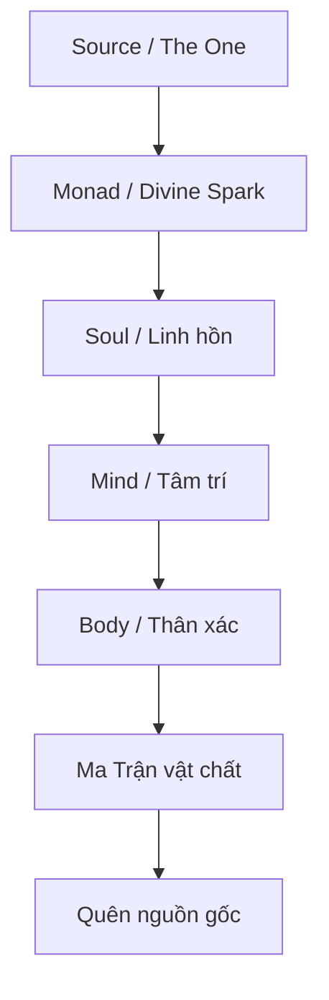
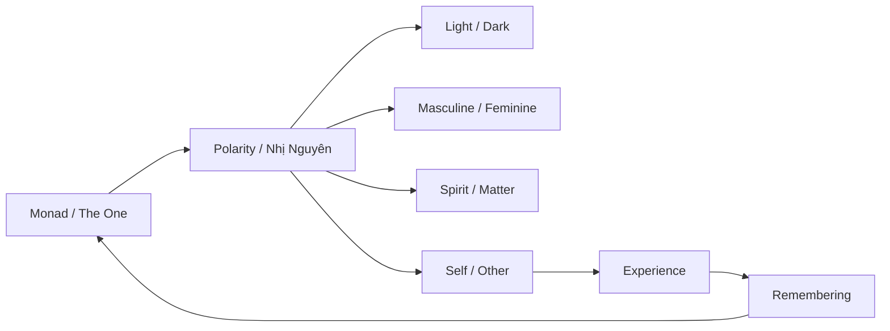

# Monad (Đơn Thể Tối Cao)

**Monad là tia lửa bất khả phân của Nguồn. Nó không phải “linh hồn” theo nghĩa cá nhân, cũng không phải “bản ngã” của đời này. Monad là điểm Một bên trong mỗi sinh thể — phần chưa từng rời khỏi Source, chỉ đang trải nghiệm ảo giác phân tách qua linh hồn, thân xác và [[Ma Trận]].**

*Monad is the indivisible spark of Source. It is not the soul in the personal sense, nor the ego of this lifetime. Monad is the One-point inside every being — the part that never truly left Source, only experiencing the illusion of separation through soul, body, and the Matrix.*

Nếu [[Sự Nhất Thể]] là đại dương, Monad là giọt nước vẫn mang toàn bộ bản chất của đại dương. Nếu [[Ma Trận]] là trò chơi phân mảnh, Monad là player thật đứng sau nhân vật. Nếu [[Gnosis]] là sự nhớ lại, thì Monad là thứ được nhớ lại.

---

## Evidence Discipline / Cách Đọc

Monad là khái niệm metaphysical. Nó không được dùng như một “fact” khoa học theo nghĩa đo đạc vật lý, mà như một model để đọc linh hồn, Source, [[Gnosis]] và cảm giác phân tách trong [[Ma Trận]]. Khi bài viết nói “Monad”, hãy đọc như ngôn ngữ biểu tượng cho tầng bất khả phân của ý thức, không phải một vật thể nằm đâu đó trong cơ thể.

*Monad is a metaphysical pointer: useful when it clarifies experience, dangerous when turned into dogma.*

---

## 1. Monad Là Gì?

Từ “Monad” đến từ Hy Lạp *monás* — nghĩa là đơn vị, cái Một, điểm không thể phân chia thêm. Trong nhiều truyền thống, Monad được dùng để chỉ nguyên lý đầu tiên: cái Một sinh ra mọi thứ nhưng bản thân nó không bị sinh ra bởi thứ gì khác.

Monad không phải một vật thể. Không nằm trong không gian. Không có hình dạng. Không có tuổi. Không thể bị cắt, đốt, giết, mua bán, lập trình hay xóa khỏi tồn tại.

Nó là phần **bất khả xâm phạm** của consciousness. *The Monad is the inviolable core of consciousness.*

Con người thường nhầm mình là body, job title, personality, trauma, memory, nationality, gender, horoscope, hoặc câu chuyện đời mình. Nhưng tất cả những thứ đó đều là lớp phủ. Monad là cái đang biết tất cả những lớp phủ đó.

---

## 2. Một Khái Niệm, Nhiều Tên Gọi

Các truyền thống khác nhau dùng ngôn ngữ khác nhau, nhưng đều chỉ về cùng một hướng: có một Nguồn, một điểm Một, một nguyên lý bất phân phía sau toàn bộ thực tại.

| Truyền thống | Tên gọi | Ý nghĩa |
|---|---|---|
| Pythagoras | Monas | Cái Một sinh ra số và trật tự |
| Plato | The One | Cái vượt trên hiện hữu |
| Plotinus | The One | Nguyên lý đầu tiên, mọi thứ emanate từ đó |
| Leibniz | Monad | Đơn thể đơn giản, không cửa sổ, phản chiếu toàn vũ trụ |
| Theosophy | Divine Spark | Tia lửa thần thánh trong con người |
| Hindu | Brahman / Atman | Đại Ngã và Tiểu Ngã vốn không hai |
| Đạo | Vô Cực / Đạo | Cái chưa phân cực trước âm-dương |
| Gnostic | Divine Spark | Tia sáng bị mắc kẹt trong thế giới vật chất |

Điểm chung: Monad không phải thứ để “tin”. Nó là thứ để nhận ra.

---

## 3. Monad, Linh Hồn Và Bản Ngã Khác Nhau Thế Nào?

Một lỗi phổ biến là dùng Monad, soul và ego như cùng một thứ. Nhưng nếu phân tầng rõ, ta sẽ hiểu hành trình con người sâu hơn.

| Tầng | Tiếng Việt | Chức năng |
|---|---|---|
| **Monad / Spirit** | Tinh thần, tia lửa nguồn | Không đổi, bất khả phân, kết nối trực tiếp với Source |
| **Soul** | Linh hồn | Tích lũy kinh nghiệm qua nhiều đời, mang ký ức nghiệp và bài học |
| **Personality / Ego** | Nhân cách, bản ngã | Vai diễn đời này: tên, tính cách, trauma, sở thích, identity |
| **Body** | Thân xác | Avatar sinh học để trải nghiệm vật chất |

Nói ngắn gọn:

- Body là bộ đồ.
- Ego là nhân vật.
- Soul là account đã chơi nhiều ván.
- Monad là player thật.

*The body is the suit. The ego is the character. The soul is the account across lifetimes. The Monad is the real player.*

---

## 4. Hành Trình Hạ Giáng: Vì Sao Monad Bước Vào Ma Trận?

Trong mô hình emanation, Monad không “rơi” xuống vật chất theo nghĩa bị trừng phạt. Nó phát ra một tia trải nghiệm, đi qua nhiều tầng reality, cho đến khi khoác lên mình linh hồn, tâm trí và thân xác.

Càng đi xuống các tầng dày đặc, consciousness càng quên mình là ai. Đây là spiritual amnesia. Khi sinh ra, con người không chỉ quên kiếp trước. Họ quên luôn bản chất trước mọi kiếp.

Ma Trận không nhất thiết tạo ra Monad. Ma Trận chỉ tạo ra lớp nhiễu khiến Monad không nhận ra chính mình.

Đó là lý do hệ thống luôn tấn công vào attention, memory, body, sexuality, dopamine, fear và identity. Nếu bạn bị giữ ở tầng ego, bạn sẽ không bao giờ hỏi tới Monad.

---

## 5. Hành Trình Thăng Hoa: Gnosis Là Nhớ Lại Monad

Thức tỉnh không phải thêm thông tin. Thức tỉnh là bỏ dần các lớp nhận dạng sai. [[Gnosis]] không phải “biết nhiều hơn”. Gnosis là khoảnh khắc một phần bên trong nhận ra:

> “Mình không phải chỉ là nhân vật này.”

Hành trình trở về Monad thường đi qua các bước:

1. **Bất mãn với bản ngã** — thấy vai diễn xã hội không đủ.
2. **Nghi ngờ Ma Trận** — nhận ra reality đang được lập trình.
3. **Quan sát nội tâm** — thấy thoughts/emotions không phải “mình”.
4. **Tích hợp shadow** — ngừng chạy khỏi phần tối.
5. **Nhớ lại Source** — thấy cái biết luôn có mặt phía sau mọi trải nghiệm.

Đây là nơi Monad nối với [[Individuation]]. Jung gọi đó là quá trình trở thành toàn vẹn. Esoterica gọi đó là nhớ lại tia lửa thần thánh. Gnostic gọi đó là thoát khỏi amnesia.

---

## 6. Monad Và Nhị Nguyên

Trước khi có sáng/tối, nam/nữ, thiện/ác, trên/dưới, tinh thần/vật chất — có cái Một. [[Nhị Nguyên]] bắt đầu khi cái Một tự phân cực để có thể trải nghiệm chính mình.

Nhị nguyên không hoàn toàn xấu. Không có nhị nguyên thì không có trải nghiệm. Nhưng nếu consciousness quên rằng hai cực cùng xuất phát từ một gốc, nhị nguyên trở thành nhà tù.

Đó là trick của [[Ma Trận]]: biến phân cực thành chiến tranh vĩnh viễn. Bạn chọn phe sáng chống phe tối. Phe nam chống phe nữ. Phe tả chống phe hữu. Phe khoa học chống phe tâm linh. Và trong lúc đó, bạn quên câu hỏi gốc:

> Cái gì đang chứng kiến cả hai phe?

Câu hỏi đó kéo bạn trở lại Monad.

---

## 7. Monad Và Ma Trận

Trong [[Ma Trận]], con người bị đồng nhất với avatar. Họ nghĩ mình là nhân vật trong game, nên họ sợ chết, sợ mất danh tính, sợ bị loại khỏi xã hội, sợ không thắng được scoreboard.

Nhưng nếu Monad là player, thì đời sống vật chất là một lớp simulation để trải nghiệm, học, nhớ và tích hợp.

Điều này không có nghĩa đời sống không quan trọng. Ngược lại: vì đây là game có ý nghĩa, từng lựa chọn trong game đều là dữ liệu cho soul. Nhưng nếu quên mình là player, bạn sẽ bị game điều khiển.

| Nếu quên Monad | Nếu nhớ Monad |
|---|---|
| Identity = job, tiền, status | Identity = awareness đang trải nghiệm vai diễn |
| Sợ chết tuyệt đối | Thấy death là chuyển cảnh |
| Bị thao túng bằng fear | Có khoảng cách với fear |
| Chạy theo dopamine | Quan sát craving |
| Chọn phe trong nhị nguyên | Thấy structure tạo ra hai phe |

Nhớ Monad không biến bạn thành người “bay khỏi đời”. Nó làm bạn chơi đời tỉnh hơn.

---

## 8. Monad Và Khoa Học Xét Lại

Khoa học mainstream thường bắt đầu từ vật chất rồi cố giải thích consciousness như sản phẩm phụ của não. Monad đảo ngược hướng nhìn: consciousness là nền, vật chất là biểu hiện.

Một số parallel hiện đại:

| Concept | Gợi ý tương đồng |
|---|---|
| Holographic Universe | Mỗi phần chứa thông tin của toàn thể |
| Observer Effect | Người quan sát không hoàn toàn tách khỏi hiện tượng |
| Non-locality | Kết nối vượt không gian tuyến tính |
| Field Theory | Thực tại như trường, vật thể là pattern trong trường |
| Panpsychism | Consciousness không chỉ xuất hiện ở não người |

Không nên vội dùng quantum physics để “chứng minh” Monad. Đó là lỗi phổ biến của spiritual pop-science. Nhưng các mô hình này ít nhất cho thấy vật chất không còn đơn giản là “đồ cứng ngoài kia”. Reality có tính thông tin, tính trường, tính quan sát.

Monad là metaphysical language cho cùng một trực giác: phần nhỏ không tách khỏi toàn thể.

---

## 9. Monad Trong Đời Sống Thực Tế

Nếu Monad là khái niệm quá trừu tượng, hãy đưa nó về đời sống. Khi bạn nổi giận, có một phần biết rằng “cơn giận đang xảy ra”. Phần đó không giận. Nó biết cơn giận. Khi bạn buồn, có một phần biết rằng “nỗi buồn đang ở đây”. Phần đó không chìm hoàn toàn trong buồn. Nó biết nỗi buồn. Khi bạn suy nghĩ, có một phần biết rằng “thoughts đang chạy”. Phần đó không phải thought.

Monad không phải một ý tưởng xa xôi. Nó là cái biết thầm lặng luôn đứng phía sau mọi trạng thái. Thực hành đơn giản:

1. Dừng lại vài giây.
2. Nhìn một thought đang xuất hiện.
3. Hỏi: “Cái gì đang biết thought này?”
4. Đừng trả lời bằng chữ.
5. Ở lại với cái biết đó.

Đó là cửa nhỏ quay về Monad.

---

## 10. Sai Lầm Khi Hiểu Monad

### Sai lầm 1: “Tôi là God, nên muốn làm gì cũng được”

Đây là ego chiếm dụng metaphysics. Monad không làm ego phình to. Monad làm ego trong suốt hơn.

### Sai lầm 2: “Tất cả là một, nên đau khổ không quan trọng”

Đây là spiritual bypassing. Nếu mọi thứ là một, đau khổ của người khác cũng là đau khổ của bạn ở tầng sâu hơn.

### Sai lầm 3: “Trở về Source là bỏ đời sống vật chất”

Không. Thân xác là temple. Trải nghiệm là dữ liệu. Quan hệ là mirror. Vật chất không phải lỗi, chỉ là tầng dày đặc nhất của bài học.

### Sai lầm 4: “Monad là niềm tin”

Monad không cần được tin như giáo điều. Nó cần được kiểm chứng qua trực nghiệm: quan sát, thiền, shadow work, Gnosis.

---

## 11. Synthesis: Monad Là Cái Không Thể Bị Ma Trận Sở Hữu

[[Elite]] có thể kiểm soát tiền. Họ có thể kiểm soát truyền thông. Họ có thể kiểm soát giáo dục, y tế, thuật toán, dopamine, narrative, lịch sử, thậm chí cả khái niệm về vũ trụ.

Nhưng họ không thể sở hữu Monad. Họ chỉ có thể làm bạn quên nó.

Đây là lý do mọi hệ thống kiểm soát đều hoạt động bằng distraction: kéo attention ra ngoài, làm bạn đồng nhất với body, fear, tribe, trauma, desire, và avatar. Một người nhớ Monad không dễ bị cai trị, vì họ không còn tin rằng hệ thống đang giữ thứ cốt lõi của họ.

Cái hệ thống có thể lấy chỉ là lớp ngoài. Cái thật nhất chưa từng nằm trong tay nó.

*The system can own your data, your money, your avatar, your attention for a while. But it cannot own the Monad. It can only make you forget it exists.*

---

## Related

### Source / Nguồn
- [[Sự Nhất Thể]] — Monad như tia lửa của cái Một
- [[Gnosis]] — Nhớ lại bản chất Monad
- [[Nghịch Lý Của Hiểu Biết]] — Vượt qua mọi framework để thấy cái đang thấy

### Journey / Hành trình
- [[Luân Hồi]] — Soul đi qua nhiều đời để tích lũy trải nghiệm
- [[Individuation]] — Tích hợp bản thể để trở thành toàn vẹn
- [[Vô Thức Tập Thể]] — Tầng ký ức/archetype chung của nhân loại

### Matrix / Ma Trận
- [[Ma Trận]] — Hệ thống làm consciousness quên mình là gì
- [[Ma Trận - Giải Phẫu Hoàn Chỉnh]] — Bản đồ đầy đủ của các lớp kiểm soát
- [[Nhị Nguyên]] — Cách cái Một phân cực thành trò chơi hai mặt
- [[Mental Model - Kiến Trúc Bẻ Khóa Ma Trận]] — Ứng dụng Monad vào hành trình giải phóng

---

> *“The One became many so the many could remember they were One.”*
>
> *Cái Một trở thành muôn hình vạn trạng để muôn hình vạn trạng nhớ lại mình vốn là Một.*