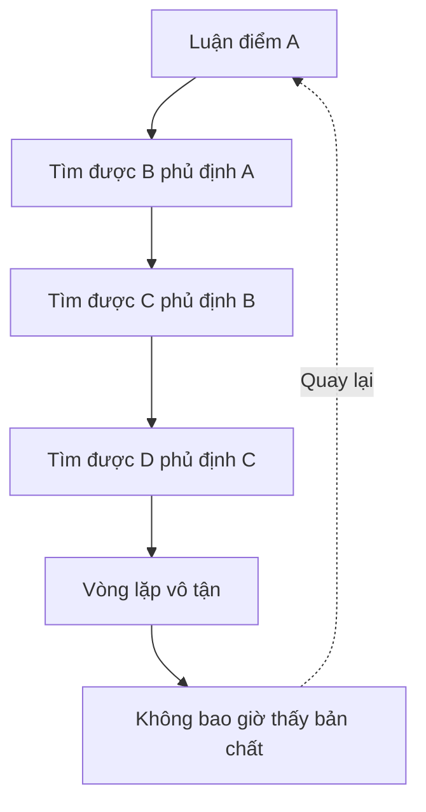
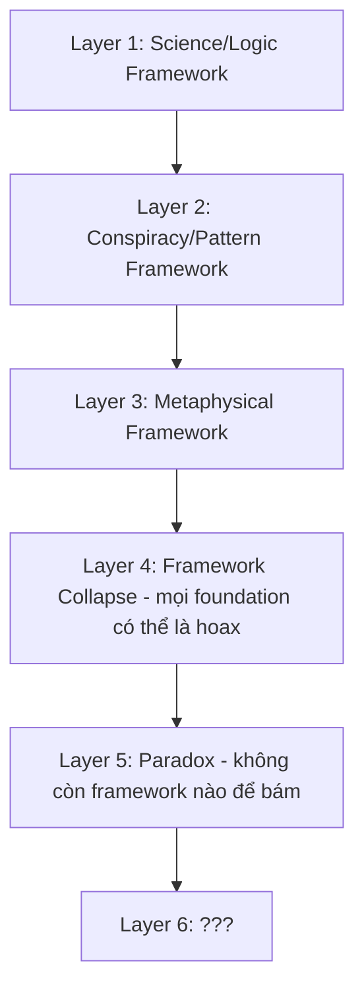
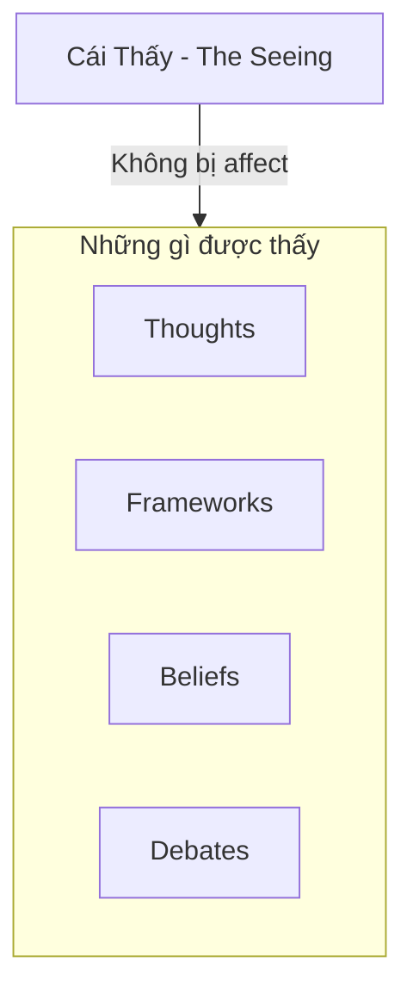

# Nghịch Lý Của Hiểu Biết

Có một trap mà mind không thể thoát bằng thinking: **Mọi luận điểm đều có thể tìm được cái đối nghịch để phủ định nó.**

*There's a trap the mind cannot escape through thinking: Every argument can find its opposite to negate it.*

---

## Trap Của Nhị Nguyên / The Duality Trap

Đây chính là [[Nhị Nguyên]] — **mọi concept đều có shadow**. Mọi framework đều có counter-framework.

*This is Duality — every concept has its shadow. Every framework has a counter-framework.*

### Ví Dụ Thực Tế

| Framework | Counter-Framework |
|-----------|-------------------|
| Thuyết tiến hóa giải thích behavior | Thuyết tiến hóa có thể là hoax |
| DNA/Chimera ảnh hưởng identity | Phật tại tâm — transcend được genetics |
| Ma Trận kiểm soát | Consciousness tự do vốn dĩ |
| Science chứng minh X | Science từng chứng minh sai nhiều thứ |

**Ma Trận giữ người ta trong vòng tranh luận vĩnh viễn.**

*The Matrix keeps people in endless debate.*

---

## Tất Cả Đều Đúng VÀ Sai / Everything Is True AND False

Có thể... tất cả đều đúng VÀ sai cùng lúc?

*Perhaps... everything is true AND false simultaneously?*

| Statement | Layer thấp | Layer cao |
|-----------|-----------|-----------|
| DNA ảnh hưởng bạn | ✅ Đúng | Transcendable |
| Phật tại tâm | Abstract | ✅ Đúng |
| Thuyết tiến hóa | ✅ Useful model | Incomplete/hoax |
| Ma Trận kiểm soát | ✅ Ở một level | Illusion ở level khác |

**Không phải A hay B.**

**Mà là cái THẤY cả A và B mà không bị kẹt trong cả hai.**

*Not A or B. But the SEEING of both A and B without being stuck in either.*

---

## Layers Của Hiểu Biết / Layers of Understanding

Khi tìm hiểu bất kỳ chủ đề nào, mind đi qua các layers:

*When exploring any topic, the mind goes through layers:*

**Mỗi layer shift cảm giác như "enlightenment"** — cho đến khi layer tiếp theo phủ định nó.

*Each layer shift feels like "enlightenment" — until the next layer negates it.*

### Điều Gì Xảy Ra Ở Layer 5?

- Không còn framework nào để bám
- Mind muốn "solve" nhưng không có gì để solve
- Mọi answer đều là new question
- Cái "hiểu" chính là obstacle của sự hiểu thực sự

**Đây là Paradox.**

*This is the Paradox.*

---

## Cái Thấy / The Seeing

Và đây mới là point:

**Không phải evolutionary psychology đúng hay sai.**
**Không phải Ma Trận đúng hay sai.**
**Không phải DNA/Chimera đúng hay sai.**

Mà là: **Cái gì đang THẤY tất cả những thứ đó?**

*The point isn't whether anything is true or false. The point is: What is SEEING all of this?*

### Cái Thấy:

- Không phải DNA
- Không phải mind
- Không bị affect bởi Chimera hay propaganda
- Không bị affect bởi framework nào

**Đó là... Phật tại tâm? Consciousness itself? Witness?**

> Cái biết rằng nó đang biết — đó là cái duy nhất không thể bị phủ định.
>
> *The knowing that knows it's knowing — that's the only thing that cannot be negated.*

---

## Đạo Khả Đạo Phi Thường Đạo

> "Đạo khả đạo phi thường đạo. Danh khả danh phi thường danh."
> — Lão Tử, Đạo Đức Kinh
>
> *"The Tao that can be spoken is not the eternal Tao. The name that can be named is not the eternal name."*

Mọi bài viết, mọi framework, mọi explanation — **đều là ngón tay chỉ mặt trăng, không phải mặt trăng**.

*Every article, framework, explanation — is the finger pointing at the moon, not the moon itself.*

### Vậy Tại Sao Vẫn Viết?

Vì những "ngón tay" này **useful cho người đang ở một layer nhất định**.

- Layer 1 cần science explanation
- Layer 2 cần Ma Trận framework
- Layer 3 cần metaphysical concepts
- Layer 4 cần framework collapse
- Layer 5 cần... không cần gì cả

**Mỗi layer là bước đệm.** Không có bước đệm, không nhảy được.

*Each layer is a stepping stone. Without stepping stones, you can't jump.*

Nhưng đừng confuse stepping stone với destination.

*But don't confuse the stepping stone with the destination.*

---

## Transmission vs Information

Có hai loại "hiểu":

| Information | Transmission |
|-------------|--------------|
| Từ mind đến mind | Từ being đến being |
| Có thể tranh luận | Không thể tranh luận |
| Thêm vào knowledge | Dissolve knowledge |
| "Bây giờ tôi biết X" | "..." (silence) |

**Bài viết này là information.** Nó có thể useful hoặc không.

**Cái moment bạn THẤY paradox — đó là transmission.** Không ai có thể give hay take.

*This article is information. The moment you SEE the paradox — that's transmission.*

---

## Kết / Ending (But Not Conclusion)

Không có conclusion vì conclusion sẽ là một framework khác để bám.

*There's no conclusion because a conclusion would be another framework to cling to.*

Chỉ có invitation:

**Khi đọc bất kỳ bài nào trong vault này — evolutionary psychology, Ma Trận, Sacred Geometry, bất kỳ thứ gì — hãy nhớ hỏi:**

*When reading any article in this vault — remember to ask:*

> Cái gì đang thấy điều này?
>
> *What is seeing this?*

Và đừng answer bằng words. Chỉ... thấy.

*And don't answer with words. Just... see.*

---

## Related

### Nền tảng / Foundation
- [[Nhị Nguyên]] — Duality
- [[Sự Nhất Thể]] — Oneness
- [[Monad]] — The One

### Tâm linh / Spirituality
- [[Gnosis]] — Direct knowing
- [[Tâm Lý Học Jung]] — Consciousness exploration
- [[Individuation]] — Becoming whole

### Paradox trong các bài khác
- [[Tâm Lý Học Tiến Hóa Về Giới Tính]] — Multiple frameworks
- [[Ma Trận]] — What is real?
- [[Sacred Geometry]] — Pattern and source
