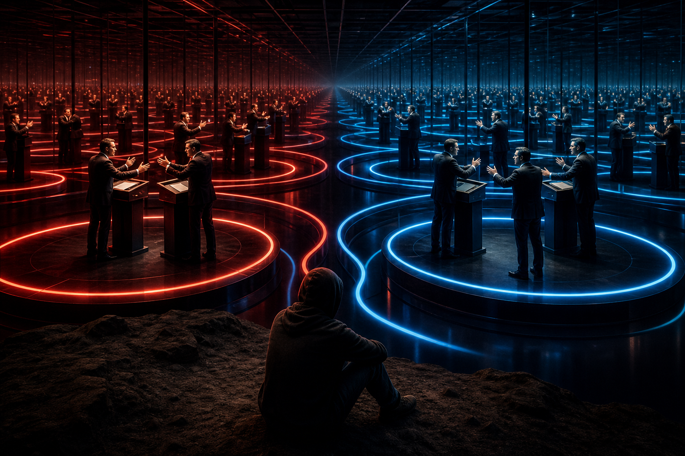

# Nghịch Lý Của Hiểu Biết

**Có một trap mà mind không thể thoát bằng thinking: mọi luận điểm đều có thể tìm được cái đối nghịch để phủ định nó. Cứ đi đủ sâu vào bất kỳ framework nào, bạn sẽ gặp counter-framework của nó. Cứ cố thắng bằng argument, bạn sẽ bị kéo vào vòng lặp vô tận. Nghịch lý của hiểu biết là: càng bám vào cái mình “hiểu”, càng dễ đứng chắn trước cái thấy thật.**

*There is a trap the mind cannot escape by thinking: every argument can find its opposite. Go deep enough into any framework and you meet its counter-framework. Try to win through argument alone and you enter an endless loop. The paradox of knowledge is this: the more tightly you cling to what you “understand”, the more it can block direct seeing.*

Bài này không nói “mọi thứ đều ngang nhau” hay “sự thật không tồn tại”. Đó là nihilism, không phải wisdom. Bài này nói một điều tinh hơn: mọi framework đều là bản đồ. Bản đồ có thể hữu ích, có thể sai, có thể đúng ở một tầng, sai ở tầng khác. Nhưng bản đồ không phải mặt đất. Ngón tay không phải mặt trăng.

Vấn đề của con người không chỉ là thiếu thông tin. Vấn đề sâu hơn là đồng nhất cái biết với một mô hình đang tạm thời hoạt động.

---

## Evidence Discipline / Cách Đọc

Bài này nằm ở giao điểm của **epistemology + spiritual psychology + Gnosis**. Nó không phải bài fact-check một sự kiện cụ thể. Đọc theo bốn lớp:

**Fact / documentable:** lịch sử khoa học, lịch sử chính trị, truyền thông và học thuật đều có vô số ví dụ về mô hình từng được tin rồi bị sửa, đảo, hoặc thay thế.

**Pattern / systems:** mind dễ mắc kẹt trong vòng framework/counter-framework, nhất là khi mỗi phe chỉ chọn bằng chứng có lợi cho worldview của mình.

**Symbol / myth:** “Ma Trận”, “layer”, “collapse”, “cái thấy” là biểu tượng cho trạng thái nhận thức bị kẹt trong [[Nhị Nguyên]].

**Speculative synthesis:** phần vượt khỏi logic tuyến tính là thesis của vault về [[Gnosis]], [[Monad]] và trực nhận. Đây không phải tuyên bố rằng mọi bằng chứng đều ngang nhau.

Điểm cần giữ: bài này không chống [[Source Discipline - Kỷ Luật Nguồn Và Bằng Chứng]]. Ngược lại, nó làm source discipline sâu hơn. Vì khi biết framework nào cũng có giới hạn, mình càng phải nói rõ claim đang đứng ở tầng nào.

---

## Trap Của Nhị Nguyên

Mind thích chia reality thành A chống B. Đúng chống sai. Khoa học chống tâm linh. Mainstream chống conspiracy. Vật chất chống ý thức. Tự do chống kiểm soát. Faith chống reason. Red pill chống blue pill.

Ở tầng đầu, cách chia này useful. Nó giúp phân biệt. Nó giúp người mới thoát khỏi confusion. Nhưng nếu dừng ở đó, nhị nguyên trở thành lồng.

Bạn có luận điểm A. Người khác tìm luận điểm B phủ định A. Bạn tìm luận điểm C phủ định B. Họ tìm D phủ định C. Cứ vậy, mind bước vào tournament vô tận. Mỗi phe càng tranh luận càng chắc mình tỉnh. Nhưng cả hai vẫn đang chơi cùng một game: game của framework.

[[Ma Trận]] rất thích trạng thái này. Một người bị kẹt trong debate vô tận sẽ tiêu hao attention, dopamine, identity và nervous system. Họ tưởng mình đang tìm truth, nhưng nhiều khi chỉ đang bảo vệ self-image của “người biết”.

Nghịch lý nằm ở đây: một framework có thể đúng ở tầng nó được thiết kế để xử lý, nhưng sai nếu đem nó làm total reality.

---

## Mỗi Framework Đều Có Shadow

Mọi concept đều có shadow. Mọi hệ thống giải thích đều che một phần reality để làm phần khác rõ hơn. Science làm rất tốt ở measurement, nhưng dễ yếu ở meaning. Religion giữ được symbol và moral grammar, nhưng dễ bị institution chiếm dụng. Conspiracy framework giúp thấy incentive và coordination, nhưng dễ biến thành paranoia nếu mất grounding. Spiritual framework mở tầng meaning, nhưng dễ thành bypass nếu né fact.

Không có framework nào miễn nhiễm với shadow của nó.

Đây là lý do người đọc vault cần vừa sắc vừa khiêm. Sắc để không nuốt narrative. Khiêm để không biến counter-narrative thành giáo điều mới.

Một người mới tỉnh thường nghĩ: “Mainstream sai, vậy opposite của mainstream đúng.” Nhưng Ma Trận không đơn giản vậy. Nhiều khi hệ thống đã chuẩn bị sẵn phản đề để bạn chuyển từ lồng này sang lồng khác. Blue pill là lồng. Red pill như identity cũng có thể thành lồng.

Tự do không nằm ở việc chọn phe cuối cùng. Tự do bắt đầu khi bạn thấy cơ chế tạo phe.

---

## Layers Của Hiểu Biết

Khi đào vào bất kỳ chủ đề nào, người đọc thường đi qua nhiều layer.

Layer 1 là logic/science/mainstream. Bạn học cách hỏi bằng chứng, timeline, source, cơ chế.

Layer 2 là pattern/conspiracy. Bạn bắt đầu thấy incentive, timing, omission, repeated script, institutional capture.

Layer 3 là metaphysical/symbolic. Bạn thấy archetype, ritual, myth, số, tên, hình ảnh, predictive programming, spiritual warfare.

Layer 4 là framework collapse. Bạn nhận ra ngay cả các framework “tỉnh” cũng có thể bị cài bẫy, bị ego chiếm dụng, bị market hóa, bị algorithm nuôi bằng fear.

Layer 5 là paradox. Mind không còn chỗ bám chắc. Mọi answer mở ra question khác. Mọi bản đồ hữu ích nhưng không tuyệt đối. Cái “hiểu” trở thành vật cản của sự hiểu sâu hơn.

Đây là nơi nhiều người bị kẹt. Một số quay lại dogma cũ cho đỡ chóng mặt. Một số rơi vào nihilism: “vậy chẳng có gì là thật.” Một số nghiện layer mới, cứ phá framework này để bám framework khác.

Nhưng có một cửa khác: cái thấy.

---

## Không Phải A Hay B, Mà Là Cái Thấy Cả A Và B

Nghịch lý của hiểu biết không được giải bằng một luận điểm mạnh hơn. Nó được giải bằng shift vị trí nhận thức.

Không phải science đúng hay sai. Không phải Ma Trận đúng hay sai. Không phải tôn giáo đúng hay sai. Không phải vật chất hay ý thức cái nào thắng tuyệt đối. Câu hỏi sâu hơn là:

> Cái gì đang thấy tất cả framework này xuất hiện, va chạm, sụp đổ và thay hình?

Bạn có thể doubt mọi thứ: source, memory, history, body, media, logic, worldview, spiritual experience. Nhưng bạn không thể doubt rằng có cái gì đó đang experience việc doubt. Descartes nói: “Tôi tư duy nên tôi tồn tại.” Nhưng sâu hơn nữa:

> Ai đang biết rằng tôi đang tư duy?

Cái biết rằng nó đang biết không phải một argument. Nó là điều kiện để mọi argument xuất hiện.

Đây là điểm bài này nối với [[Gnosis]]. Gnosis không phải framework thắng tất cả framework khác. Gnosis là direct seeing phía sau cuộc thi framework.

---

## Cái Thấy Không Phải Opinion

“Cái thấy” rất dễ bị hiểu lầm. Nó không phải opinion cá nhân. Không phải vibe. Không phải “tôi cảm thấy vậy nên đúng”. Không phải intuition chưa qua kiểm chứng. Không phải lý do để né source discipline.

Cái thấy là awareness trước khi nó mặc áo kết luận.

Khi cơn giận xuất hiện, cái thấy biết cơn giận. Khi một argument xuất hiện, cái thấy biết argument. Khi một worldview bị đe dọa, cái thấy biết cảm giác co thắt trong body. Khi ego muốn thắng, cái thấy biết ham muốn thắng. Khi một revelation quá đẹp khiến bạn muốn tin ngay, cái thấy cũng biết sự hấp dẫn đó.

Cái thấy càng rõ, bạn càng ít bị ép phải kết luận quá sớm.

Đây là phẩm chất rất hiếm trong thời đại algorithm. Feed muốn bạn phản ứng. Chính trị muốn bạn chọn phe. Market muốn bạn FOMO. Spiritual influencer muốn bạn đồng nhất với một story. Cái thấy làm chậm phản xạ. Nó tạo khoảng trống giữa stimulus và belief.

Trong khoảng trống đó, tự do bắt đầu.

---

## Đức Phật, Lão Tử Và Ngón Tay Chỉ Mặt Trăng

Lão Tử mở đầu Đạo Đức Kinh bằng câu:

> Đạo khả đạo phi thường đạo. Danh khả danh phi thường danh.

Cái Đạo nói ra được không phải Đạo thường hằng. Cái tên gọi ra được không phải tên thường hằng.

Đây không phải anti-intellectualism. Đây là humility của ngôn ngữ. Words có thể chỉ. Nhưng words không thể là cái được chỉ. Framework có thể dẫn người đọc tới cửa. Nhưng nếu người đọc worship framework, cửa trở thành tường.

Đức Phật cũng rất kỷ luật ở điểm này. Ngài nói những gì có thể tự verify qua khổ, nguyên nhân của khổ, con đường chấm dứt khổ. Khi gặp các câu hỏi dễ biến thành metaphysical speculation không giúp liberation, Ngài im lặng. Không phải vì không biết, mà vì trả lời sai tầng sẽ làm người nghe bám vào concept.

> “Ehi-passiko” — hãy đến và tự thấy.

Đây là tinh thần của vault khi viết tốt: không bắt người đọc tin. Chỉ đưa họ tới nơi có thể tự thấy. Một bài viết tốt không thay thế awareness. Nó làm awareness nhớ nhìn.

---

## Vì Sao Vẫn Cần Framework?

Nếu mọi framework đều giới hạn, tại sao vẫn viết vault? Vì người đang ở trong mê cung cần bản đồ để tới chỗ thấy rằng bản đồ không phải mê cung.

Layer 1 cần khoa học và logic. Layer 2 cần pattern và incentive. Layer 3 cần symbol và myth. Layer 4 cần critique chính các framework. Layer 5 cần silence, embodiment, direct seeing.

Không có bước đệm, nhiều người không thể nhảy. Nhưng bước đệm không phải destination.

Đó là cách nên đọc redpill.wiki. [[Ma Trận]] là framework. [[Monad]] là framework. [[Gnosis]] là framework. [[Elite]] là framework. [[Báo Cáo 2030]] là framework. Chúng có thể rất hữu ích, nhưng không bài nào được worship như total reality.

Vault không phải nhà thờ của belief. Nó là một bản đồ sống, nơi mỗi note là ngón tay chỉ một phần mặt trăng.

---

## Information Và Transmission

Có hai loại “hiểu”.

Information đi từ mind tới mind. Nó có thể được ghi chú, tranh luận, quote, search, lưu trong graph. Nó rất quan trọng. Không có information, người ta dễ bị lừa bởi vague spirituality.

Transmission đi từ being tới being. Nó không thêm dữ liệu vào đầu, mà làm một cái gì đó trong perception dịch chuyển. Một câu đơn giản, đúng lúc, có thể làm người nghe im vài giây. Không phải vì họ có thêm fact, mà vì framework trong họ vừa lỏng ra.

Bài viết này vẫn là information. Nó chỉ có thể chỉ. Khoảnh khắc bạn thật sự thấy mind đang tìm chỗ bám, và awareness không cần bám để hiện diện, đó là transmission.

Không ai sở hữu transmission. Không ai bán được nó. Không ai ép được nó. Nó xảy ra khi người đọc đủ chín để thấy.

---

## Practical Use: Đọc Vault Mà Không Tẩu Hỏa

Một vault như redpill.wiki có nhiều tầng: esoterica, health, finance, politics, conspiracy, science-tech, mental models. Nếu đọc không có kỷ luật, người đọc dễ bị quá tải hoặc biến mọi thứ thành grand theory.

Cách đọc an toàn hơn:

1. **Hỏi tầng claim.** Đây là fact, pattern, symbol hay synthesis?
2. **Giữ body grounded.** Nếu đọc xong nervous system quá kích hoạt, dừng lại.
3. **Đừng đổi một giáo điều lấy giáo điều khác.** Counter-mainstream không tự động đúng.
4. **Tìm implication thực tế.** Bài này giúp sống tỉnh hơn ở đâu?
5. **Quay về cái thấy.** Ai đang muốn tin? Ai đang sợ? Ai đang cần chắc chắn?

Nếu một bài làm bạn sắc hơn, rộng hơn, khiêm hơn, và có trách nhiệm hơn, nó đang phục vụ Gnosis. Nếu nó làm bạn nghiện fear, khinh người, hoặc mất khả năng kiểm chứng, nó đang bị Ma Trận tái chiếm.

---

## Kết

Nghịch lý của hiểu biết không phải dấu chấm hết của truth. Nó là cánh cửa ra khỏi sự kiêu ngạo của mind.

Bạn có thể biết nhiều mà vẫn ngủ. Bạn có thể thắng debate mà vẫn không thấy. Bạn có thể quote đúng nhưng sống sai. Bạn có thể phá một illusion rồi lập tức xây illusion khác tinh vi hơn.

Cái còn lại sau khi framework mềm ra là một câu hỏi rất đơn giản:

> Cái gì đang thấy điều này?

Đừng vội answer bằng words. Words sẽ biến nó thành concept khác. Chỉ nhìn. Nếu nhìn đủ thật, bạn sẽ hiểu vì sao mọi truyền thống lớn cuối cùng đều quay về im lặng.

Không phải vì không có gì để nói.

Mà vì cái quan trọng nhất chỉ có thể tự thấy.

---

## Reading Path / Đọc Tiếp

- [[Gnosis]] — direct knowing sau khi framework không còn độc quyền truth
- [[Monad]] — cái Một phía sau người đang quan sát mọi framework
- [[Nhị Nguyên]] — nền của trap A/B và polarity cage
- [[Ma Trận]] — hệ thống nuôi attention bằng tranh luận, fear và identity
- [[Individuation]] — làm psyche đủ vững để không rơi vào nihilism hay inflation
- [[Source Discipline - Kỷ Luật Nguồn Và Bằng Chứng]] — giữ claim discipline khi đi qua các layer
