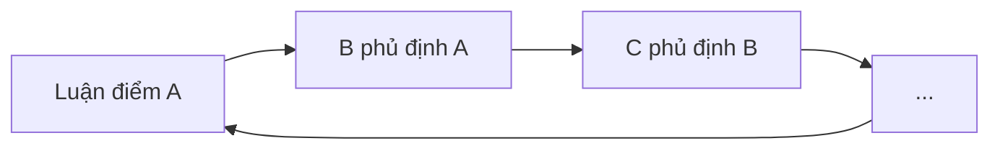
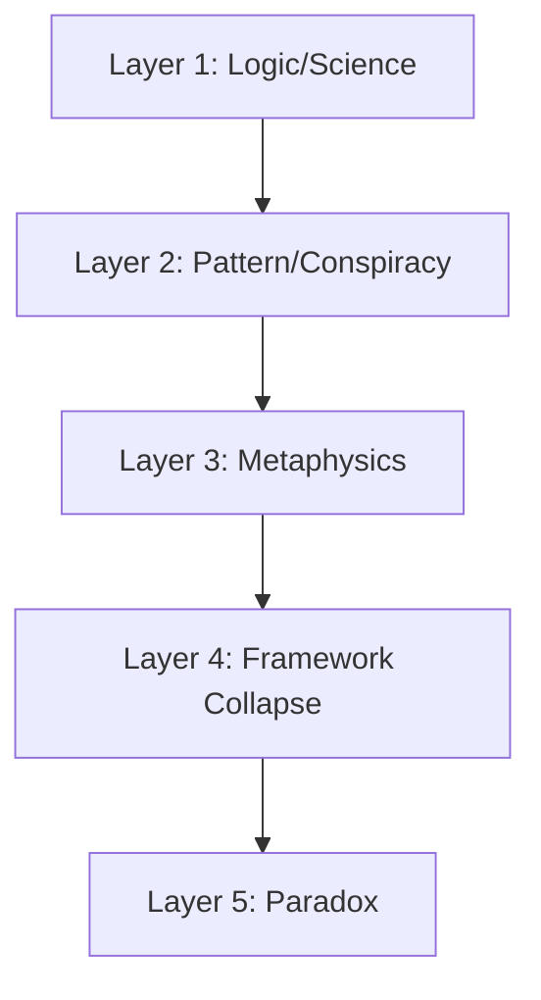
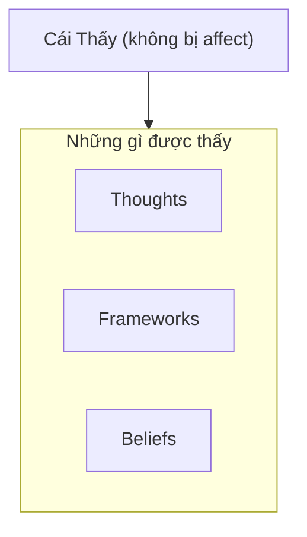

# Nghịch Lý Của Hiểu Biết

Có một trap mà mind không thể thoát bằng thinking: **Mọi luận điểm đều có thể tìm được cái đối nghịch để phủ định nó.**

*There's a trap the mind cannot escape through thinking: Every argument can find its opposite to negate it.*

---

## 1. Trap Của Nhị Nguyên

Đây là [[Nhị Nguyên]] — **mọi concept đều có shadow**.

| Framework | Counter-Framework |
|-----------|-------------------|
| Science chứng minh X | Science từng sai nhiều thứ |
| Lịch sử ghi chép Y | Lịch sử do kẻ thắng viết |
| Có Thượng Đế | Không có Thượng Đế |
| Vật chất quyết định ý thức | Ý thức tạo ra vật chất |

**Kết quả:** Tranh luận vĩnh viễn, không bao giờ thấy bản chất.

---

## 2. Layers Của Hiểu Biết

Khi tìm hiểu bất kỳ chủ đề nào, mind đi qua các layers:

**Mỗi layer shift cảm giác như enlightenment** — cho đến khi layer tiếp theo phủ định nó.

### Layer 5: Paradox

- Không còn framework nào để bám
- Mọi answer đều là new question
- Mind muốn "solve" nhưng không có gì để solve

**Đây là nơi hầu hết người ta bị kẹt — hoặc bỏ cuộc.**

---

## 3. Tất Cả Đều Đúng VÀ Sai

Có thể mọi thứ đều đúng VÀ sai cùng lúc — tùy thuộc vào layer bạn đang đứng.

| Statement | Layer thấp | Layer cao |
|-----------|-----------|-----------|
| Vật chất là thực | ✅ Đúng | Chỉ là sóng/tần số |
| Lịch sử như sách dạy | ✅ Useful | Written by winners |
| Ma Trận kiểm soát | ✅ Ở một level | Illusion ở level khác |

**Không phải A hay B. Mà là cái THẤY cả A và B mà không bị kẹt trong cả hai.**

---

## 4. Cái Thấy

Và đây mới là point:

**Không phải science đúng hay sai.**
**Không phải tôn giáo đúng hay sai.**
**Mà là: Cái gì đang THẤY tất cả những thứ đó?**

### Cái Thấy:

- Không phải não bộ
- Không phải mind
- Không bị affect bởi education hay propaganda

**Đó là... Phật tại tâm? Consciousness? Witness?**

> Cái biết rằng nó đang biết — đó là cái duy nhất không thể bị phủ định.

Bạn có thể doubt mọi thứ — nhưng bạn không thể doubt rằng **có cái gì đó đang experience việc doubt**.

---

## 5. Trí Tuệ Của Đức Phật

> "Đạo khả đạo phi thường đạo."
> — Lão Tử

Mọi bài viết, mọi framework — **đều là ngón tay chỉ mặt trăng, không phải mặt trăng**.

### Điều Phi Thường

**Nếu không có ultimate truth khi expressed bằng words — thì Đức Phật đã làm điều impossible: dùng words để truyền cái beyond words.**

Ngài không chỉ "biết" — Ngài **biết cách làm cho người khác thấy**.

| Teacher | Master |
|---------|--------|
| Dạy knowledge | Transmit awakening |
| Thêm vào mind | Dissolve mind |
| "Bây giờ bạn biết X" | "..." (im lặng hiểu) |

### Chỉ Nói Những Gì Có Thể Tự Thấy

Đức Phật chỉ nói về **con đường** — Tứ Diệu Đế, Bát Chánh Đạo — những thứ người ta có thể **tự verify**.

Khi được hỏi về những điều beyond human experience (vũ trụ có vĩnh hằng? Linh hồn sau khi chết?), Ngài chọn **im lặng**.

Không phải vì không biết — mà vì **trả lời bằng words sẽ mislead hơn là illuminate**.

> "Ehi-passiko" — Hãy đến và tự thấy.

---

## 6. Transmission vs Information

| Information | Transmission |
|-------------|--------------|
| Từ mind đến mind | Từ being đến being |
| Có thể tranh luận | Không thể tranh luận |
| Thêm vào knowledge | Dissolve knowledge |
| "Tôi biết X" | "..." (silence) |

**Bài viết này là information.**

**Cái moment bạn THẤY paradox — đó là transmission.**

---

## Kết: Invitation

Không có conclusion — vì conclusion sẽ là framework khác để bám.

Chỉ có invitation:

**Khi đọc bất kỳ bài nào — hãy nhớ hỏi:**

> Cái gì đang thấy điều này?

Và đừng answer bằng words. Chỉ... **thấy**.

---

## Related

### Core
- [[Nhị Nguyên]] — Duality
- [[Sự Nhất Thể]] — Oneness  
- [[Gnosis]] — Direct knowing

### Đọc thêm
- [[AI Và Câu Hỏi Về Ý Thức]] — AI có "thấy" không?
- [[Inception - Predictive Programming Về Kiểm Soát Tâm Trí]] — How ideas are planted
- [[Ma Trận]] — The control system
