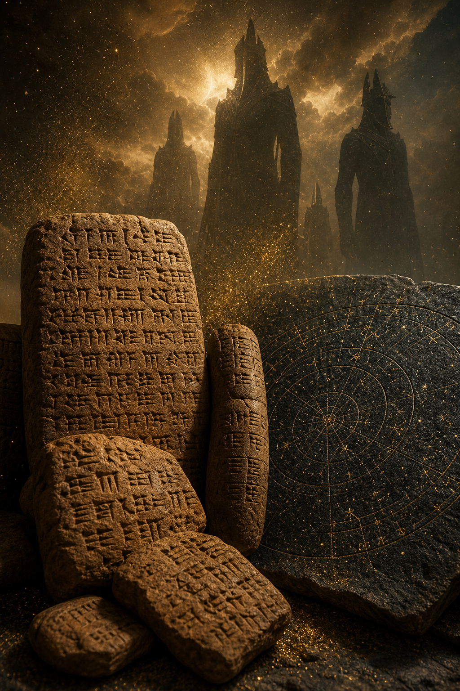

# Nibiru (Hành Tinh X)

**Nibiru không nên được đọc như một lịch tận thế internet. Nó là giao điểm giữa Planet X, Sitchin, [[Annunaki]], ký ức catastrophe và archetype “vật thể từ trời trở lại”. Ở tầng fact thiên văn, chưa có bằng chứng mainstream cho một hành tinh khổng lồ đang lao vào hệ Mặt Trời theo cách doom culture thường kể. Ở tầng myth-pattern, Nibiru vẫn đáng đọc vì nó gom nhiều motif cổ: sky omen, đại hồng thủy, reset văn minh, gods from heaven và quyền lực che giấu existential risk.**

*Nibiru should not be read as an internet doomsday calendar. It is a crossing point between Planet X, Sitchin, the Annunaki, catastrophe memory, and the archetype of a returning sky body.*

Nibiru là bài test tâm lý. Người sợ hãi tìm ngày tận thế. Người tham vọng tìm bunker. Người tỉnh hơn hỏi: nếu mọi nền văn minh đều hữu hạn, mình nên sống, chuẩn bị và đọc dữ liệu như thế nào?

---

## Evidence Discipline / Cách Đọc

Nibiru là chủ đề dễ trượt từ inquiry sang doom cult. Vì vậy phải tách bốn lớp.

**Fact / astronomy:** có hay không một thiên thể được quan sát, có tọa độ, dữ liệu hồng ngoại, quỹ đạo và dự đoán kiểm chứng. Ở tầng này, internet rumor không đủ.

**Historical-text:** Sitchin dịch Sumer đúng đến đâu, Assyriologists phản biện thế nào, “Nibiru” trong văn bản cổ có nghĩa gì trong từng ngữ cảnh.

**Catastrophe-pattern:** nhiều nền văn hóa có ký ức đại hồng thủy, sao lạ, rồng trời, thiên thạch, fire from heaven, chu kỳ reset.

**Vault synthesis:** Nibiru như biểu tượng của external reset force: thứ buộc nền văn minh đối diện nghiệp tích lũy.

Pattern không phải proof. Nhưng sự thất bại của các ngày tận thế giả cũng không đóng luôn câu hỏi về cataclysm cycles, pole shift, comet impacts hoặc lịch sử bị reset.

---

## Vault Position / Vị Trí Trong Vault

Trong redpill.wiki, Nibiru nằm ở giao điểm của [[Annunaki]], [[Nibiru và Nền Văn Minh Annunaki]], [[Dịch Chuyển Cực]], [[Atlantis]], [[Thuyết Tiến Hóa - Các Nền Văn Minh Bị Che Giấu]] và [[UAP Disclosure - Controlled Revelation]].

Nó không nên nuôi sợ hãi. Nếu có giá trị, giá trị của node này là ép người đọc hỏi: hệ thống chính thống xử lý thông tin existential risk như thế nào? Công khai, che giấu, bóp méo, hay biến thành entertainment?

Nibiru cũng là memento mori vũ trụ: đừng giao linh hồn cho calendar doom, nhưng cũng đừng ngủ trong ảo tưởng rằng trật tự hiện tại là vĩnh cửu.

---

## Sitchin Layer: Nibiru Và Annunaki

Zecharia Sitchin phổ biến narrative rằng Nibiru là home planet của [[Annunaki]], có quỹ đạo dài khoảng 3,600 năm, định kỳ quay lại gần hệ Mặt Trời, và liên quan tới việc Annunaki đến Trái Đất khai thác vàng/can thiệp gene.

Đây là myth hiện đại cực mạnh. Nó nối Planet X, gold, genetic intervention, flood memory, elite bloodline và ancient astronaut theory. Nhưng nó không nên được xem như textbook. Bản dịch Sumerian và kết luận của Sitchin bị tranh luận mạnh.

Trong vault, Sitchin layer nên được giữ như **mythic hypothesis**: có thể sai ở literal translation, nhưng vẫn mở một câu hỏi lớn về quyền lực, nguồn gốc con người và sky-ruler archetype.

---

## Planet X Và Catastrophe Memory

Planet X từng là một câu hỏi thiên văn thật ở nhiều giai đoạn: các nhà khoa học từng tìm thiên thể ngoài rìa hệ Mặt Trời để giải thích perturbations hoặc population of trans-Neptunian objects. Nhưng Planet X khoa học không đồng nghĩa với Nibiru doom narrative.

Nibiru internet thường gom IRAS 1983, Robert Harrington, Google Sky blackout, Antarctic research, Kolbrin Bible, Hopi prophecy, Nostradamus vào một story. Một số điểm đáng điều tra, nhưng không điểm nào tự nó chứng minh hành tinh 3,600 năm đang trở lại.

Cách đọc sạch hơn: xem Nibiru như container cho catastrophe memory. Nhiều nền văn hóa giữ ký ức về đại hồng thủy, lửa trời, vật thể sáng, rồng/serpent trên trời, các thời đại bị kết thúc. Có thể đó là comet impacts, volcanic winter, Younger Dryas, pole instability, solar events, hoặc mythic encoding của nhiều biến cố khác nhau.

---

## Why The Story Has Power

Nibiru mạnh vì nó đánh vào ba nỗi sợ tập thể.

Một là **thiên tai từ ngoài hệ thống**: thứ không thể vote, không thể negotiate, không thể PR.

Hai là **elite asymmetry**: nếu existential risk thật, ai được biết trước? Ai có bunker? Ai bị giữ trong entertainment?

Ba là **cosmic judgement**: motif một vật thể quay lại để reset civilization giống archetype nghiệp quả ở cấp hành tinh.

Vì vậy Nibiru vừa là astronomy rumor, vừa là religious pattern, vừa là political suspicion, vừa là psychological mirror.

---

## The Trap: Calendar Doom

Doom dates là cái bẫy lớn nhất của Nibiru. 2003, 2012, 2017 và nhiều mốc khác đều trượt. Mỗi lần trượt, một nhóm mất niềm tin, một nhóm đổi ngày, một nhóm chuyển sang theory mới.

Calendar doom làm người đọc yếu đi. Nó outsource agency cho một ngày ngoài kia. Nó biến awareness thành adrenaline addiction.

Thực hành đúng là chuẩn bị nền tảng thay vì nghiện dự báo: nước, thức ăn, sức khỏe, cộng đồng, kỹ năng, khả năng đọc dữ liệu và tâm không hoảng. Nếu Nibiru có thật, hoảng loạn không giúp. Nếu Nibiru chỉ là myth, những nền tảng đó vẫn giúp.

---

## Kết

Nibiru không phải nơi để tin mù hoặc cười nhạo. Nó là một symbolic node về cách con người xử lý nguy cơ tận thế, ký ức reset và quyền lực kiểm soát thông tin.

Câu hỏi sâu không phải “ngày nào Nibiru tới?”. Câu hỏi sâu hơn là: nếu một nền văn minh có thể bị reset, điều gì trong ta đáng giữ lại?

---

## Reading Path / Đọc Tiếp

- [[Annunaki]] — sky-ruler archetype và ancient astronaut theory
- [[Nibiru và Nền Văn Minh Annunaki]] — mythic synthesis chi tiết hơn
- [[Dịch Chuyển Cực]] — catastrophe/pole-shift hypothesis
- [[Atlantis]] — ký ức nền văn minh bị reset
- [[Thuyết Tiến Hóa - Các Nền Văn Minh Bị Che Giấu]] — hidden-history frame rộng hơn
