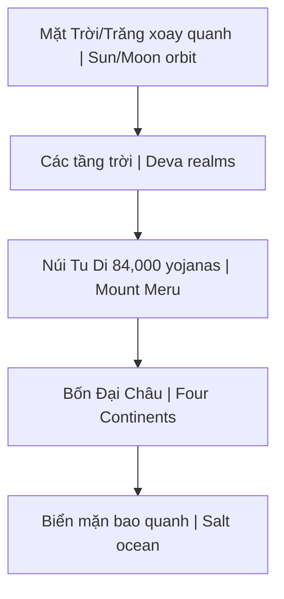

---
title: "Núi Tu Di"
aliases: ["Núi Tu Di", "Mount Meru", "Núi Tu Di (Mount Meru)"]
date: 2026-04-08
tags: [esoterica]
status: refined
---
# Núi Tu Di (Mount Meru)

**Núi Tu Di** (Sanskrit: Sumeru, Pali: Sineru) là trung tâm vũ trụ theo cosmology Phật giáo, Hindu và Jain. Trục thế giới mà quanh đó Mặt Trời, Mặt Trăng và các vì sao xoay.

## Trong Các Truyền Thống

| Tradition | Name | Description |
|-----------|------|-------------|
| **Buddhist** | Sumeru | Center of world-system |
| **Hindu** | Meru | Abode of Brahma |
| **Jain** | Mandara | Center of universe |
| **Norse** | Yggdrasil | World tree (similar concept) |

## Cấu Trúc Vũ Trụ (Buddhist)

### Bốn Đại Châu
1. **Đông Thắng Thần Châu** (Pūrvavideha) — Tartaria?
2. **Nam Thiệm Bộ Châu** (Jambudvīpa) — Chúng ta sống đây
3. **Tây Ngưu Hóa Châu** (Aparagodānīya)
4. **Bắc Câu Lô Châu** (Uttarakuru) — Paradise-like

## Modern Interpretations

### 1. Magnetic North Pole
- "Black Rock" theory
- Magnetic mountain at center
- Why compass always points north
- Hidden from public?

### 2. Hyperborea
- Ancient northern civilization
- Admiral Byrd's diary
- Maps showing central mountain
- [[Tartaria]] connection

### 3. Flat Earth Model
- Tu Di at center
- Sun/Moon circle above
- Antarctica = ice wall perimeter
- See [[Thuyết Trái Đất Phẳng]]

### 4. Inner Earth
- Hollow earth theory
- Entrance at poles
- Agartha, Shambhala
- Advanced civilization within

## Symbolic Meaning

### Axis Mundi
- Center of cosmos
- Connection heaven-earth
- Found in all cultures
- Spine/kundalini in human body

### Microcosm-Macrocosm
- Tu Di = Spine
- 7 chakras = 7 levels
- Crown = summit
- Human as mini-universe

## Why Hidden?

Theo alternative research:
- True cosmology suppressed
- [[Mô Hình Địa Tâm]] vs heliocentric debate
- If Tu Di real → entire science wrong
- Control through false cosmology

## Related

- [[Vũ Trụ Học Phật Giáo]] — Full cosmology
- [[Tartaria]] — Eastern continent connection
- [[Tartaria và Vạn Lý Trường Thành]]
- [[Thuyết Trái Đất Phẳng]] — Modern interpretation
- [[Mô Hình Địa Tâm]] — Alternative cosmology
- [[Long Mạch]] — Earth energy system
