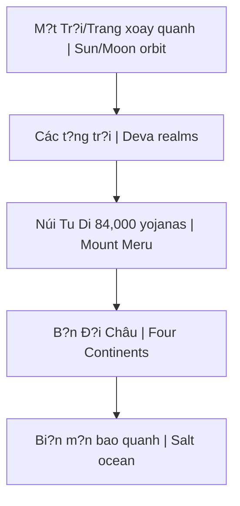

# Núi Tu Di (Mount Meru)

**Núi Tu Di** (Sanskrit: Sumeru, Pali: Sineru) là trung tâm vu tr? theo cosmology Ph?t giáo, Hindu và Jain. Tr?c th? gi?i mà quanh dó M?t Tr?i, M?t Trang và các vì sao xoay.

## Trong Các Truy?n Th?ng

| Tradition | Name | Description |
|-----------|------|-------------|
| **Buddhist** | Sumeru | Center of world-system |
| **Hindu** | Meru | Abode of Brahma |
| **Jain** | Mandara | Center of universe |
| **Norse** | Yggdrasil | World tree (similar concept) |

## C?u Trúc Vu Tr? (Buddhist)

### B?n Ð?i Châu
1. **Ðông Th?ng Th?n Châu** (Purvavideha) - Tartaria?
2. **Nam Thi?m B? Châu** (Jambudvipa) - Chúng ta s?ng dây
3. **Tây Nguu Hóa Châu** (Aparagodaniya)
4. **B?c Câu Lô Châu** (Uttarakuru) - Paradise-like

## Modern Interpretations

### 1. Magnetic North Pole
- "Black Rock" theory
- Magnetic mountain at center
- Why compass always points north
- Hidden from public?

### 2. Hyperborea
- Ancient northern civilization
- Admiral Byrd's diary
- Maps showing central mountain
- [[Tartaria]] connection

### 3. Flat Earth Model
- Tu Di at center
- Sun/Moon circle above
- Antarctica = ice wall perimeter
- See [[Thuy?t Trái Ð?t Ph?ng]]

### 4. Inner Earth
- Hollow earth theory
- Entrance at poles
- Agartha, Shambhala
- Advanced civilization within

## Symbolic Meaning

### Axis Mundi
- Center of cosmos
- Connection heaven-earth
- Found in all cultures
- Spine/kundalini in human body

### Microcosm-Macrocosm
- Tu Di = Spine
- 7 chakras = 7 levels
- Crown = summit
- Human as mini-universe

## Why Hidden?

Theo alternative research:
- True cosmology suppressed
- [[Mô Hình Ð?a Tâm]] vs heliocentric debate
- If Tu Di real ? entire science wrong
- Control through false cosmology

## Related

- [[Vu Tr? H?c Ph?t Giáo]] - Full cosmology
- [[Tartaria]] - Eastern continent connection
- [[Tartaria và V?n Lý Tru?ng Thành]]
- [[Thuy?t Trái Ð?t Ph?ng]] - Modern interpretation
- [[Mô Hình Ð?a Tâm]] - Alternative cosmology
- [[Long M?ch]] - Earth energy system
