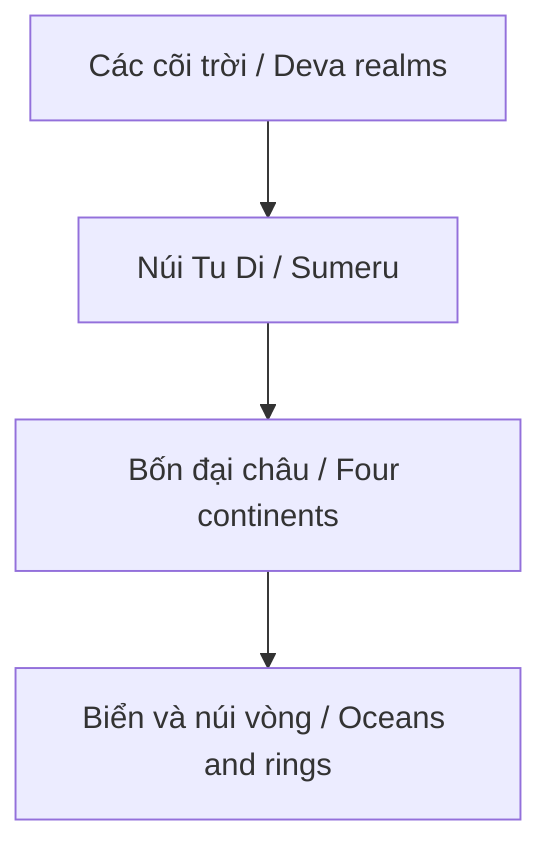

# Núi Tu Di (Mount Meru)

**Núi Tu Di là axis mundi: trục giữa trời, đất và các tầng cõi trong vũ trụ học Phật giáo, Hindu và Jain.** Đọc nông thì hỏi "nó ở đâu trên bản đồ?" Đọc sâu hơn thì hỏi: vì sao gần như mọi truyền thống đều cần một trung tâm vũ trụ để tổ chức không gian, quyền lực, nghi lễ và thân người?

*Mount Meru is the cosmic axis: a center that organizes heaven, earth, realms, ritual space, and the human microcosm.*

---

## Evidence Discipline / Cách Đọc

| Tầng claim | Cách đọc |
|---|---|
| Tradition / documentable | Meru/Sumeru xuất hiện trong nhiều truyền thống Ấn Độ và Phật giáo như trung tâm world-system |
| Symbol / myth | núi trung tâm là axis mundi: cầu nối trời-đất, tâm-cõi, thân-vũ trụ |
| Comparative pattern | Yggdrasil, Olympus, Kailash, ziggurat, pyramid đều giữ motif trục thế giới |
| Speculative synthesis | Tu Di như cực Bắc, Hyperborea, flat earth center hoặc inner earth là giả thuyết vault, không phải fact địa lý |

---

## Vault Position / Vị Trí Trong Vault

Bài này nối [[Vũ Trụ Học Phật Giáo]], [[Mô Hình Địa Tâm]], [[Thuyết Trái Đất Phẳng]], [[Long Mạch]] và [[Tartaria]]. Nó giúp cụm cosmology không chỉ tranh luận hình dạng vật lý của Trái Đất, mà đọc sâu hơn: **center** là cấu trúc tâm linh, chính trị và nhận thức.

---

## Tu Di Trong Vũ Trụ Học Phật Giáo

Trong nhiều mô tả Phật giáo, Sumeru đứng ở trung tâm world-system, quanh đó là biển, núi vòng, bốn đại châu và các cõi trời. Nam Thiệm Bộ Châu thường được hiểu là châu nơi con người đang sống.

Kỷ luật đọc: đây là cosmology truyền thống, không nên ép nó thành bản đồ vật lý hiện đại một cách thô. Nhưng cũng không nên dismiss nó như "người xưa ngu". Cosmology cổ thường nén astronomy, psychology, ritual geography và metaphysics vào cùng một hình.

---

## Axis Mundi / Trục Thế Giới

Axis mundi là motif phổ quát: một điểm nối trên-dưới, trời-đất, người-thần, tâm-vũ trụ. Nó có thể là núi, cây, cột, đền, tháp, kim tự tháp, kinh đô, hoặc cột sống con người.

| Truyền thống | Hình trục |
|---|---|
| Phật giáo/Hindu/Jain | Meru/Sumeru |
| Bắc Âu | Yggdrasil |
| Hy Lạp | Olympus |
| Tây Tạng/Ấn Độ | Kailash |
| Kiến trúc thiêng | stupa, ziggurat, pyramid, temple axis |

Đây là nơi Núi Tu Di nối với [[Long Mạch]] và [[Phong Thủy]]: không gian thiêng luôn cần trục, tâm, hướng và vòng bảo vệ.

---

## Microcosm: Tu Di Trong Thân Người

Trong đọc esoteric, Tu Di không chỉ ngoài vũ trụ; nó nằm trong thân. Cột sống là núi, các chakra là tầng, crown là đỉnh, kundalini là dòng đi lên. Điều này nối bài với [[Chakra]], [[Kundalini]] và [[Tinh Khí Thần]].

Đọc như vậy, câu hỏi "Tu Di ở đâu?" trở thành: trục sống của mình có thẳng không, attention có bị kéo xuống không, ý thức có nhớ trung tâm không?

---

## Modern Alternative Readings

Các dòng alternative thường đọc Tu Di theo nhiều hướng:

- cực Bắc từ tính hoặc một "black rock" trung tâm;
- Hyperborea hoặc nền văn minh phương Bắc;
- [[Thuyết Trái Đất Phẳng]] với Tu Di ở giữa và Antarctica như vòng ngoài;
- inner earth, Agartha, Shambhala;
- liên hệ với [[Tartaria]] và các ký ức bị chôn.

Đây là tầng speculative synthesis. Nó có thể mở câu hỏi thú vị về bản đồ cổ, cực địa, myth phương Bắc và suppressed history. Nhưng không nên trình bày như fact nếu thiếu bằng chứng địa lý/thiên văn rõ.

---

## Vì Sao Trung Tâm Bị Che?

Trong myth, che trung tâm nghĩa là làm con người mất orientation. Một civilization không biết đâu là center sẽ dễ sống bằng bản đồ do authority cấp: globe, grid, GPS, quốc gia, biên giới, news cycle, algorithm.

Đây là tầng symbol quan trọng nhất: Tu Di đại diện cho khả năng tự định tâm. Nếu trung tâm bị thay bằng màn hình, con người đi rất xa mà không bao giờ về nhà.

---

## Core Insight / Chốt Lại

**Núi Tu Di không chỉ là một ngọn núi huyền thoại. Nó là câu hỏi về trung tâm: trung tâm của vũ trụ, trung tâm của bản đồ, trung tâm của thân, và trung tâm của ý thức. Tranh luận địa lý có thể mở cửa; nhưng nếu quên tầng axis mundi, ta bỏ mất phần sâu nhất của biểu tượng.**

*Mount Meru is the question of center. Geography may open the door, but axis mundi is the deeper teaching.*
