# Patient Zero 2026 - Kịch Bản Đại Dịch Quay Lại Nước Nga

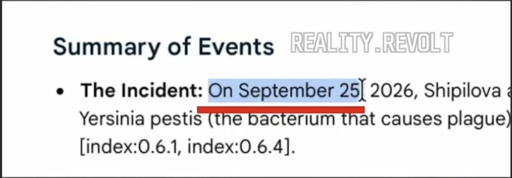

**Ngày 25 tháng 9 năm 2026 nằm ở giữa một mạng lưới kỳ lạ. Hai ngày trước đó, Zelensky gọi Putin là “patient zero” của ý tưởng chiến tranh. Đúng ngày 25 tháng 9, Taylor Swift phát hành ca khúc “Patient Zero”. Cũng ngày ấy, theo nguồn tin địa phương được RFE/RL dẫn lại, một kỹ thuật viên tại viện chống dịch hạch ở Irkutsk làm vỡ ống nghiệm chứa vi khuẩn gây dịch hạch. Trước đó hai tháng, Annie Jacobsen xuất bản cuốn *Biological War*, mở ra bằng kịch bản một tai nạn phòng thí nghiệm kéo thế giới vào đại dịch.**

*September 25, 2026 sits at the center of a strange network. Two days earlier, Zelensky called Putin the “patient zero” of the idea of war. On September 25 itself, Taylor Swift released the song “Patient Zero.” On that same date, according to a local report cited by RFE/RL, a technician at an anti-plague institute in Irkutsk broke a test tube containing plague bacteria. Two months earlier, Annie Jacobsen published Biological War, opening with a scenario in which a laboratory accident pulls the world into a pandemic.*

Không mảnh nào tự mình tạo thành một lời tiên tri. Sức mạnh xuất hiện khi chúng được đặt lên cùng một trục thời gian: chính trị dùng ngôn ngữ dịch bệnh, âm nhạc dùng biểu tượng “bệnh nhân số không”, hư cấu kể về đầu độc và cái chết bí ẩn, một đoạn trích gắn với *Biological War* mô phỏng tai nạn sinh học tại Siberia, còn đời thật đáp lại bằng một cái chết tại viện chống dịch hạch.

*No single fragment forms a prophecy by itself. The force appears when they are placed on one timeline: politics speaks the language of contagion, music invokes “patient zero,” fiction tells of poisoning and mysterious illness, a passage presented with Biological War models a biological accident in Siberia, and reality answers with a death at an anti-plague institute.*

---

## 1. Một Cụm Từ Đi Trước Sự Kiện / A Phrase Arrives Before the Event

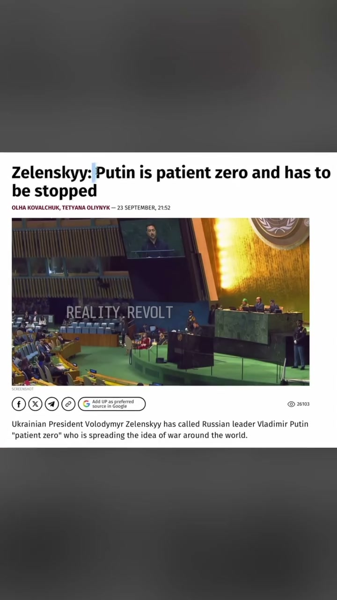

Ngày 23 tháng 9 năm 2026, tại Đại hội đồng Liên Hiệp Quốc, Volodymyr Zelensky gọi Vladimir Putin là “patient zero” — người mà từ đó “ý tưởng chiến tranh tiếp tục lan rộng”. Đây không phải cách nói kín đáo. Nó đưa ngôn ngữ dịch tễ học vào chính trị thế giới: một người trở thành điểm phát tán, chiến tranh trở thành bệnh truyền nhiễm, còn các quốc gia khác được đặt vào vị trí phải ngăn sự lây lan.

*On September 23, 2026, at the United Nations General Assembly, Volodymyr Zelensky called Vladimir Putin “patient zero”—the one from whom “the idea of war keeps spreading further.” This was not subtle language. It moved epidemiology into global politics: a person became the point of transmission, war became contagion, and other nations were cast as those responsible for stopping the spread.*

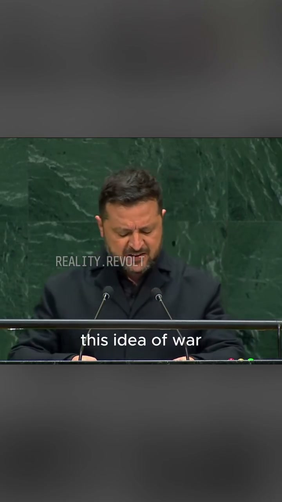

Bài viết của *Ukrainska Pravda* mang đúng tiêu đề: “Putin là patient zero và phải bị ngăn chặn.” Một ẩn dụ chính trị có thật vì thế đứng cạnh những “patient zero” khác sắp xuất hiện trong âm nhạc và tin tức dịch bệnh.

*The Ukrainska Pravda article carries the exact headline: “Putin is patient zero and has to be stopped.” A real political metaphor therefore stands beside other “patient zero” references that were about to appear in music and plague reporting.*

---

## 2. Taylor Swift Phát Hành “Patient Zero” / Taylor Swift Releases “Patient Zero”

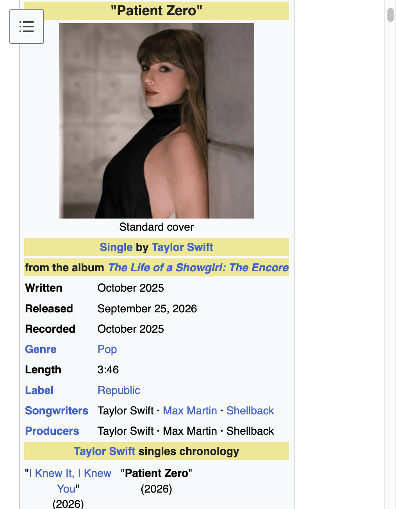

Ngày 25 tháng 9 năm 2026, Taylor Swift phát hành đĩa đơn “Patient Zero”. Ca khúc dùng bệnh tật như ẩn dụ cho một mối quan hệ độc hại: người kể chuyện là phụ nữ đầu tiên đã sống sót qua người đàn ông ấy và nay cảnh báo người đến sau. “Bệnh nhân số không” trong bài hát không mang mầm bệnh sinh học; cô là người đầu tiên nhận ra một khuôn mẫu phá hủy.

*On September 25, 2026, Taylor Swift released the single “Patient Zero.” The song uses illness as a metaphor for a toxic relationship: the narrator is the first woman who survived the man and now warns the woman who came after her. The “patient zero” in the song carries no biological pathogen; she is the first person to recognize a destructive pattern.*

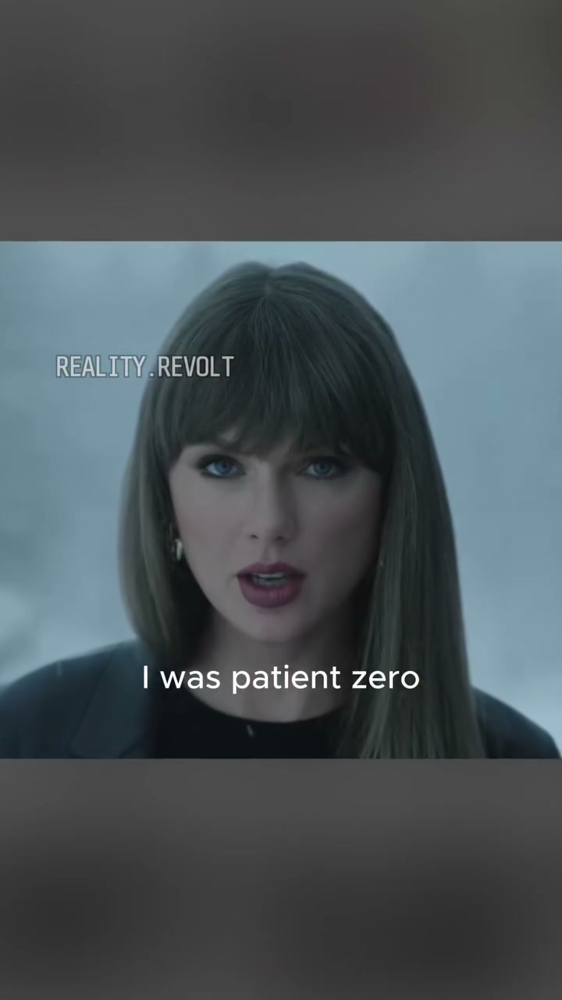

Hai ngày sau, video âm nhạc được công chiếu tại MTV Video Music Awards. Câu chuyện biến ẩn dụ thành hình ảnh Gothic: một phụ nữ ốm yếu, một người chồng đầu độc, bóng ma của người vợ trước, một bài báo về cái chết bí ẩn và cảnh kết tại nghĩa địa.

*Two days later, the music video premiered at the MTV Video Music Awards. The story turned metaphor into Gothic imagery: an ill woman, a poisoning husband, the ghost of a previous wife, a newspaper reporting a mysterious death, and a final revelation in a graveyard.*

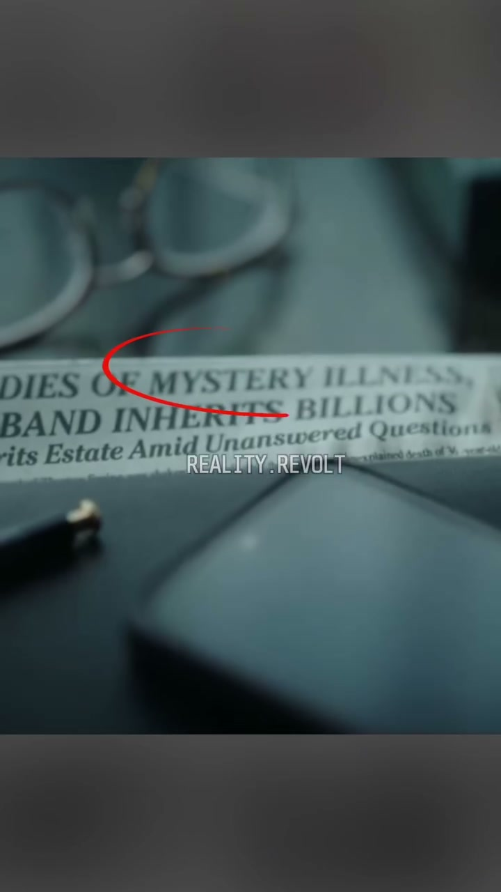

Dòng chữ trong đạo cụ báo chí hiện rõ: “Nữ thừa kế chết vì bệnh bí ẩn — người chồng thừa kế hàng tỷ.” Nó là hư cấu bên trong video, nhưng vài ngày sau lại đứng cạnh một bản tin thật về một phụ nữ trẻ chết vì “viêm phổi chưa rõ nguyên nhân” tại một viện nghiên cứu dịch hạch của Nga. Predictive programming thường vận hành ở chính vùng chồng lấn này: hình ảnh được đưa vào trước, rồi khi đời thật xuất hiện, ký ức văn hóa đã có sẵn một khuôn để tiếp nhận nó.

*The newspaper prop reads: “Heiress dies of mystery illness—husband inherits billions.” It is fiction inside the video, yet within days it stood beside real reporting about a young woman who died of “pneumonia of unknown origin” at a Russian plague institute. Predictive programming operates in precisely this zone of overlap: the image arrives first, and when reality appears, cultural memory already possesses a frame through which to receive it.*

---

## 3. Ngày 25 Tháng 9 Tại Irkutsk / September 25 in Irkutsk

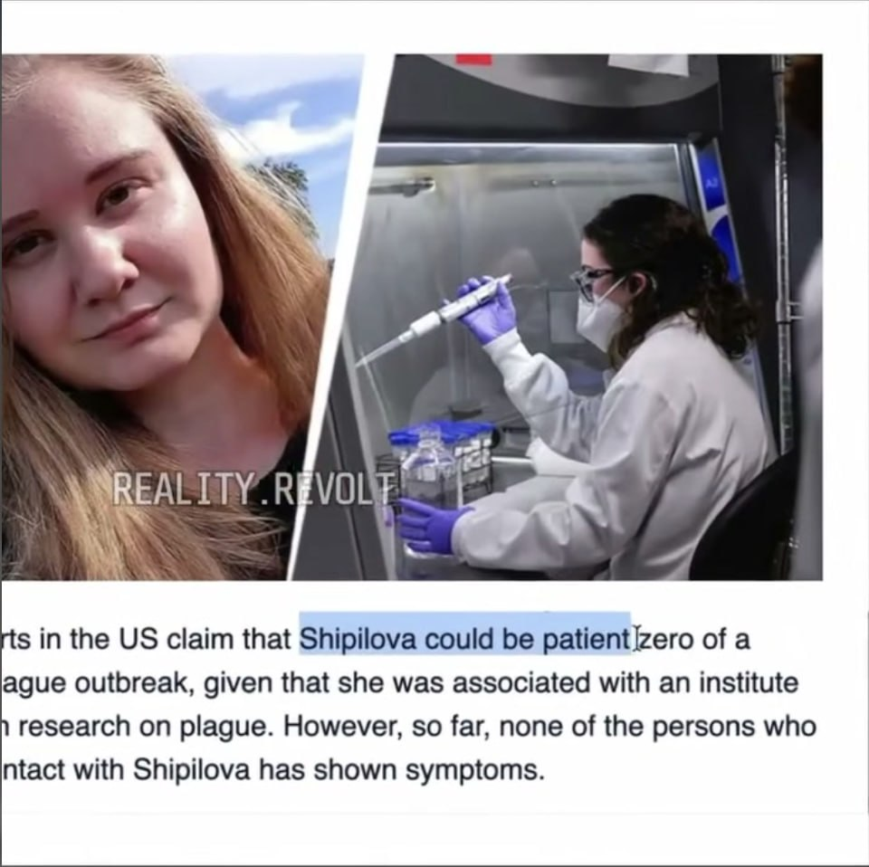

Darya Shipilova, 28 tuổi, làm việc tại Viện Nghiên cứu Chống Dịch hạch Irkutsk của Siberia và Viễn Đông. Theo nguồn tin địa phương *Lyudi Baikala* được RFE/RL dẫn lại, ngày 25 tháng 9 cô làm vỡ một ống nghiệm chứa vi khuẩn gây dịch hạch thể phổi. Cô nhập viện ngày 29 tháng 9 và qua đời ngày 2 tháng 10.

*Darya Shipilova, 28, worked at the Irkutsk Anti-Plague Research Institute of Siberia and the Far East. According to the local outlet Lyudi Baikala as cited by RFE/RL, she broke a test tube containing pneumonic-plague bacteria on September 25. She was hospitalized on September 29 and died on October 2.*

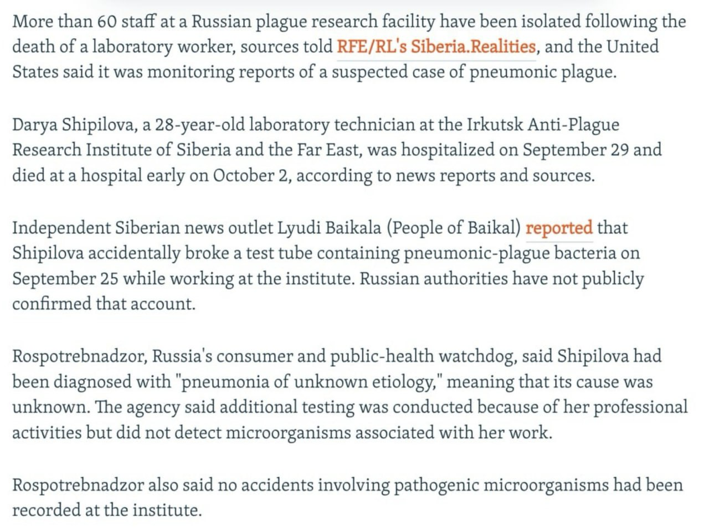

Giới chức Nga nói cô chết vì “viêm phổi chưa rõ nguyên nhân”, không phát hiện vi sinh vật liên quan đến nghề nghiệp và không ghi nhận tai nạn với mầm bệnh tại viện. Gần 200 người được theo dõi hoặc cách ly phòng ngừa. Chính khoảng trống giữa báo cáo địa phương và phủ nhận chính thức đã biến sự kiện thành một bề mặt hoàn hảo cho suy đoán.

*Russian authorities said she died of “pneumonia of unknown origin,” that no work-related microorganism was detected, and that no pathogenic accident had been recorded at the institute. Nearly 200 people were reportedly monitored or isolated as a precaution. The gap between local reporting and official denial created a perfect surface for speculation.*

Điểm nối quan trọng không phải chỉ là từ “dịch hạch”. Đó là ngày 25 tháng 9: ngày được gắn với ống nghiệm tại Irkutsk cũng là ngày “Patient Zero” được phát hành. Một bên là ngôn ngữ tình cảm hóa bệnh tật; bên kia là một sự kiện y sinh thật bị bao phủ bởi thông tin mâu thuẫn.

*The central connection is not merely the word “plague.” It is September 25: the date tied to the Irkutsk test-tube report is also the release date of “Patient Zero.” One side turns illness into emotional metaphor; the other is a real biomedical incident wrapped in conflicting information.*

---

## 4. *Biological War* Và Tai Nạn Ở Siberia / Biological War and an Accident in Siberia

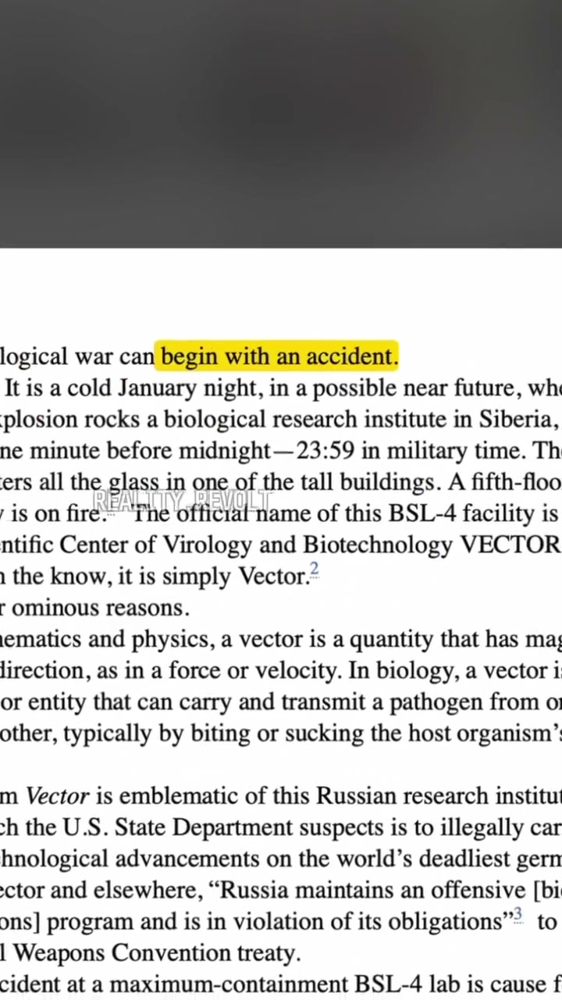

Ngày 28 tháng 7 năm 2026, Annie Jacobsen xuất bản *Biological War: A Scenario*. Phần giới thiệu chính thức của nhà xuất bản gom bốn mắt xích vào một câu: tai nạn phòng thí nghiệm, tấn công sinh học, đại dịch toàn cầu và sự sụp đổ của xã hội. Cuốn sách không bắt đầu bằng một đội quân phun mầm bệnh. Nó bắt đầu bằng một tai nạn.

*On July 28, 2026, Annie Jacobsen published Biological War: A Scenario. The publisher’s official description joins four links in one sentence: a laboratory accident, a biological attack, a global pandemic, and social collapse. The book does not begin with an army spraying pathogens. It begins with an accident.*

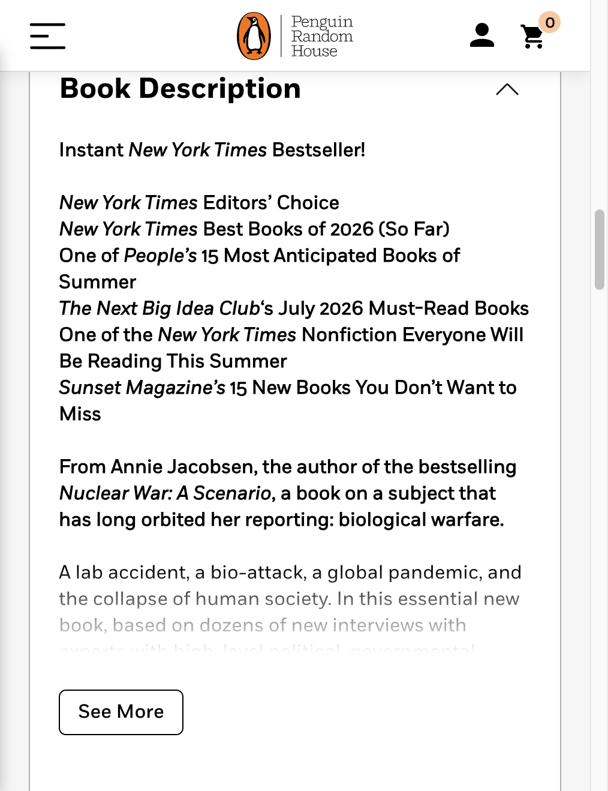

Một đoạn trích được trình bày cùng cuốn sách cụ thể hơn: “Chiến tranh sinh học có thể bắt đầu bằng một tai nạn.” Kịch bản đặt một vụ nổ tại viện nghiên cứu sinh học ở Siberia, gọi tên trung tâm VECTOR và mô tả một mầm bệnh thoát khỏi cơ sở an toàn sinh học cấp cao. Vài tuần sau, đời thật đưa lên mặt báo một nữ kỹ thuật viên chết sau sự cố bị cáo buộc tại một viện chống dịch hạch khác ở Siberia.

*A passage presented with the book is more specific: “Biological war can begin with an accident.” The scenario places an explosion at a biological research institute in Siberia, names the VECTOR center, and imagines a pathogen escaping a high-containment facility. Weeks later, reality placed a young technician’s death—following an alleged accident at another Siberian anti-plague institute—into the news.*

Đây là điểm nối mạnh nhất của toàn bộ chuỗi. Sách là sản phẩm mô phỏng rủi ro; sự kiện Irkutsk là một tình huống y tế đang tranh cãi. Nhưng cùng địa lý, cùng ngữ pháp “tai nạn phòng thí nghiệm”, cùng mầm bệnh và cùng năm 2026 khiến chúng tạo thành một vần âm quá rõ để bị bỏ qua trong khung predictive programming.

*This is the chain’s strongest dot. The book is a risk-scenario work; the Irkutsk event is a contested medical incident. Yet the same geography, the same grammar of a laboratory accident, the same pathogen theme, and the same year produce a rhyme too pronounced to ignore within a predictive-programming frame.*

---

## 5. COVID Khép Một Vòng 6–6–6 / COVID Closes a 6–6–6 Loop

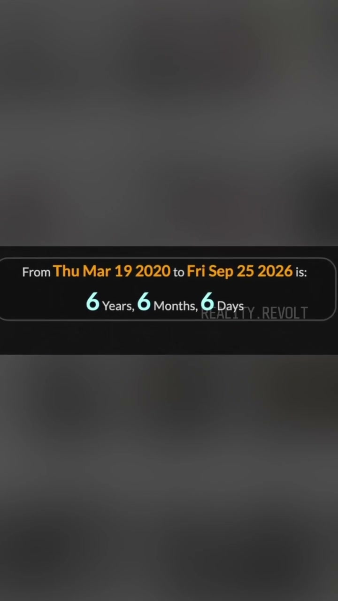

Ngày 19 tháng 3 năm 2020, giới chức Moscow đưa ra thông báo ban đầu về trường hợp tử vong đầu tiên của Nga liên quan đến COVID-19; nguyên nhân tử vong trực tiếp sau đó còn được giải thích thêm. Từ mốc thông báo ấy đến 25 tháng 9 năm 2026 là đúng 6 năm, 6 tháng và 6 ngày. Phép tính này chính xác theo lịch.

*On March 19, 2020, Moscow authorities issued the initial announcement of Russia’s first COVID-19-related death; the immediate cause of death was later further qualified. From that announcement to September 25, 2026 is exactly six years, six months, and six days. The calendar calculation is correct.*

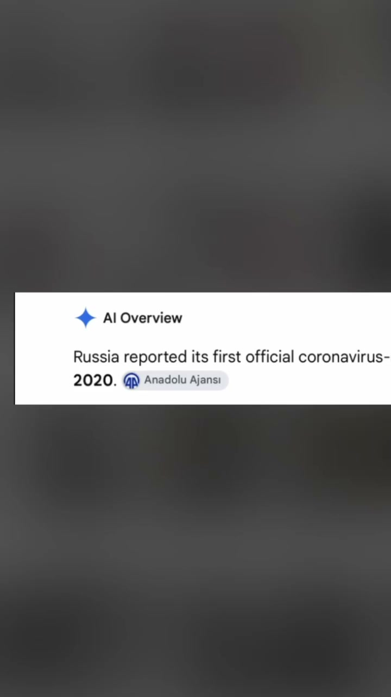

Con số 6–6–6 không chứng minh quan hệ nhân quả giữa COVID và Irkutsk. Nó làm một việc khác: biến hai ngày thành một cánh cổng biểu tượng. Ngày mở đầu chu kỳ COVID của Nga và ngày được gắn với sự cố dịch hạch nối với nhau bằng một khoảng thời gian mang mật độ huyền học cao. Trong ngôn ngữ của spectacle, con số không cần gây ra sự kiện; nó khiến sự kiện có cảm giác đã được sắp thành nghi lễ.

*The number 6–6–6 does not prove causation between COVID and Irkutsk. It performs another function: it turns two dates into a symbolic gate. The opening of Russia’s COVID cycle and the date attached to the plague incident become linked by an interval saturated with occult meaning. In the language of spectacle, a number need not cause an event; it can make the event feel ritually arranged.*

---

## 6. *The World Ahead 2026* Và Hình Ảnh Y Sinh / The World Ahead 2026 and Biomedical Imagery

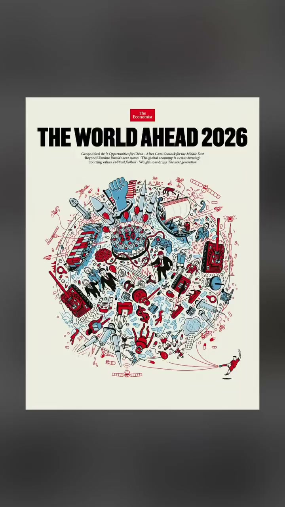

Tháng 11 năm 2025, *The Economist* phát hành *The World Ahead 2026*. Bìa chính thức là một trường biểu tượng dày đặc về chiến tranh, chính trị, kinh tế, AI, y tế và khủng hoảng. Các chi tiết màu đỏ nổi bật gồm: xe cấp cứu, hình giống virus, lọ thuốc, kim tiêm và các gương mặt quyền lực.

*In November 2025, The Economist released The World Ahead 2026. Its official cover is a dense symbolic field of war, politics, economics, AI, medicine, and crisis. Its red details include: emergency vehicles, a virus-like form, a vial, a syringe, and faces of power.*

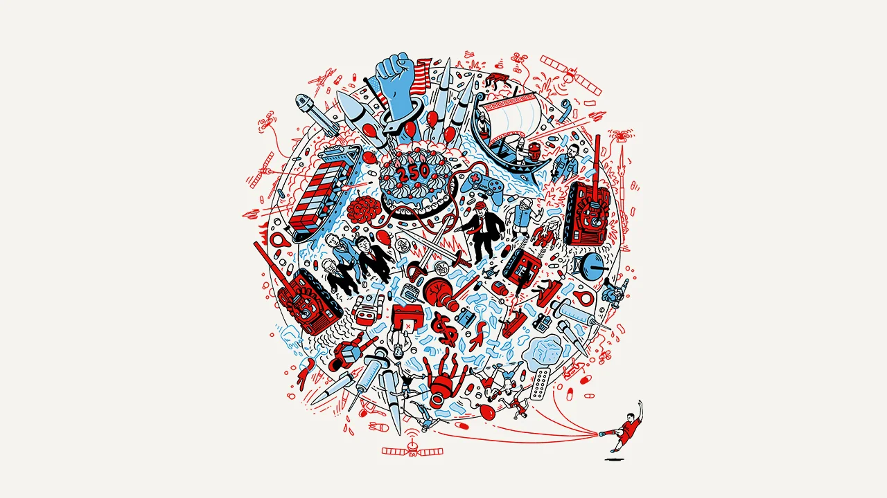

Bìa không nói “đại dịch Nga sẽ xảy ra”. Nó làm điều mà bìa *The World Ahead* thường làm: nén những nỗi lo của năm tới thành một bản đồ thị giác. Khi sự kiện Irkutsk xuất hiện, bản đồ ấy có thể được đọc ngược: các biểu tượng y sinh trông như những điểm đã được đặt sẵn trên sân khấu.

*The cover does not say, “A Russian pandemic will occur.” It does what The World Ahead covers often do: compress the coming year’s anxieties into a visual map. Once the Irkutsk event appeared, that map could be read backward: its biomedical symbols looked like points already placed upon the stage.*

---

## 7. Số 13, Death XIII Và Nghĩa Địa / Number 13, Death XIII, and the Graveyard

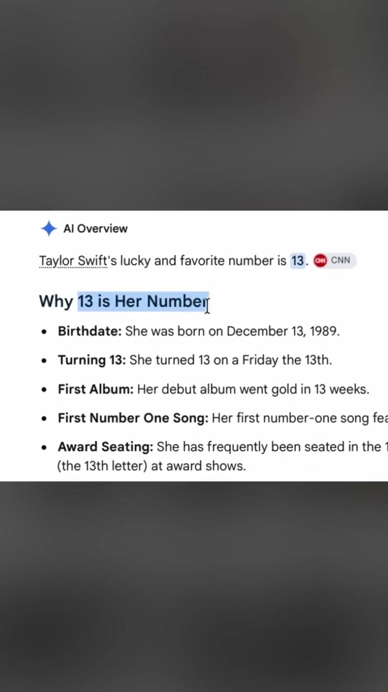

Taylor Swift từ lâu xem 13 là con số may mắn: sinh ngày 13 tháng 12, tròn 13 tuổi vào thứ Sáu ngày 13 và album đầu tay đạt chứng nhận vàng sau 13 tuần. Mối liên hệ công khai ấy trở thành cầu nối sang lá Death XIII trong Tarot.

*Taylor Swift has long treated 13 as a lucky number: she was born on December 13, turned thirteen on Friday the 13th, and saw her debut album go gold after thirteen weeks. That public association becomes a bridge to Death XIII in the tarot.*

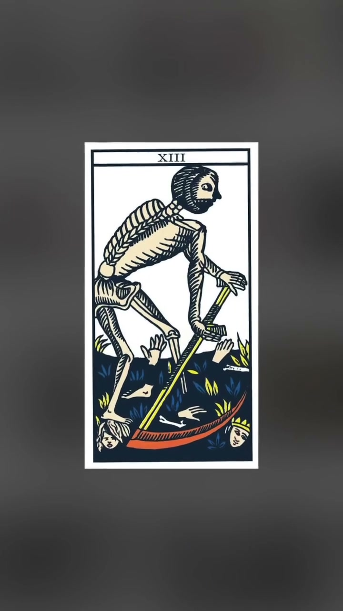

Death là lá số 13 của bộ Ẩn Chính. Trong cách đọc Tarot phổ biến, nó không chỉ là cái chết thể xác mà còn là kết thúc, biến đổi và sự chuyển pha. Nhưng mạch biểu tượng không dừng ở ý nghĩa trừu tượng: nó đi từ số 13 sang lá Death, từ lá Death sang tranh Vũ điệu của Cái chết, rồi kết ở hai bóng người mặc áo choàng giữa nghĩa địa phủ tuyết.

*Death is card thirteen of the Major Arcana. In common tarot interpretation, it does not signify only physical death but endings, transformation, and passage. Yet the symbolic sequence does not remain abstract: it moves from thirteen to Death, from Death to a Dance of Death image, and ends with two cloaked figures walking through a snow-covered graveyard.*

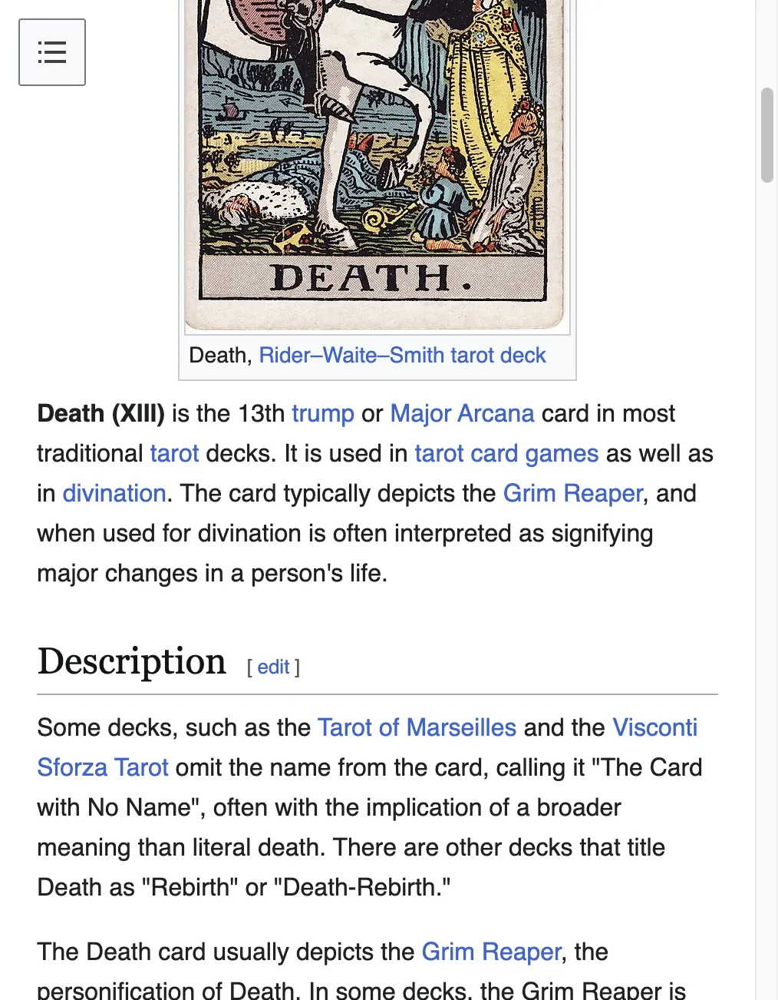

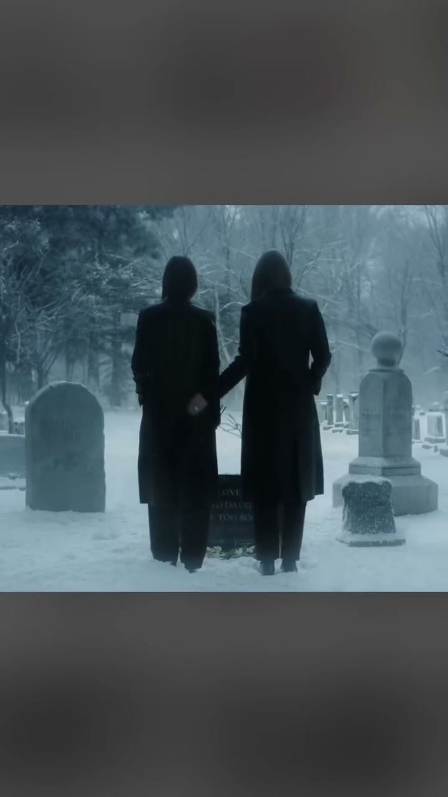

Cảnh nghĩa địa là một phần thật của video “Patient Zero”. Taylor đóng vai hồn ma của người vợ trước, bị người chồng đầu độc và quay lại cảnh báo người phụ nữ sau. Khi nghĩa địa ấy được đặt cạnh Darya Shipilova, lá Death và từ “patient zero”, một câu chuyện về mối quan hệ độc hại được kéo sang trường biểu tượng của dịch bệnh và cái chết tập thể.

*The graveyard is a genuine part of the “Patient Zero” video. Swift plays the ghost of a former wife poisoned by her husband, returning to warn the woman who came after her. When that graveyard is placed beside Darya Shipilova, the Death card, and the words “patient zero,” a story about an abusive relationship is pulled into the symbolic field of epidemics and collective death.*

---

## 8. Predictive Programming Không Cần Một Lời Tiên Tri Hoàn Chỉnh / Predictive Programming Needs No Complete Prophecy

Predictive programming hiếm khi vận hành bằng một câu nói thẳng: “Sự kiện X sẽ xảy ra vào ngày Y.” Nó hiệu quả hơn khi phân phối các mảnh rời: một cuốn sách mô phỏng tai nạn sinh học, một bìa tạp chí chứa biểu tượng y tế, một chính trị gia dùng từ “patient zero”, một ngôi sao phát hành ca khúc cùng tên, một video kể chuyện đầu độc và nghĩa địa. Mỗi mảnh đều có lý do riêng để tồn tại. Chỉ sau khi một sự kiện thật xuất hiện, chúng mới khóa vào nhau.

*Predictive programming rarely operates through a direct sentence: “Event X will happen on date Y.” It works more effectively by distributing fragments: a book modelling a biological accident, a magazine cover carrying medical symbols, a politician using the phrase “patient zero,” a star releasing a song with the same title, and a video telling a story of poisoning and graves. Each fragment has its own reason to exist. Only after a real event appears do they lock together.*

Đó là lý do một chuỗi hình ảnh có thể mạnh hơn một luận văn. Nó không chứng minh bằng chuỗi nguyên nhân. Nó tạo cảm giác nhận ra: khán giả thấy cùng một từ, cùng một ngày, cùng một địa lý và cùng một biểu tượng lặp lại qua các hệ thống tưởng như không liên quan. Sự lặp lại tạo ra ấn tượng rằng văn hóa đã diễn tập một phản ứng trước khi tin tức yêu cầu phản ứng ấy.

*That is why a sequence of images can feel more powerful than an essay. It does not prove through a causal chain. It produces recognition: the viewer sees the same word, date, geography, and symbol recurring across systems that appear unrelated. Repetition creates the impression that culture rehearsed a response before the news demanded it.*

Trong trường hợp này, trục không phải “mọi thứ đều giả” hay “mọi người đều thông đồng”. Trục là sự hội tụ của ngôn ngữ: patient zero, tai nạn phòng thí nghiệm, Siberia, đại dịch toàn cầu, bệnh bí ẩn, số 13, Death và ngày 25 tháng 9. Khi đủ nhiều lớp cùng nói một ngôn ngữ, đời thật bắt đầu trông như cảnh cuối của một bộ phim đã chiếu từ trước.

*In this case, the axis is not “everything is fake” or “everyone colluded.” It is a convergence of language: patient zero, laboratory accident, Siberia, global pandemic, mysterious illness, thirteen, Death, and September 25. When enough layers speak the same language, reality begins to resemble the final scene of a film that has already been shown.*

---

## 9. Nga Như Sân Khấu Của Chu Kỳ Kế Tiếp / Russia as the Stage of the Next Cycle

COVID-19 bắt đầu chu kỳ toàn cầu từ phương Đông nhưng tái cấu trúc toàn bộ thế giới. Trong chuỗi liên kết này, chu kỳ kế tiếp được đặt tại Nga: nơi Zelensky gắn Putin với “patient zero”, nơi lịch sử vũ khí sinh học của Liên Xô vẫn phủ bóng, nơi một đoạn trích gắn với *Biological War* đặt tai nạn VECTOR, và nơi một kỹ thuật viên viện chống dịch hạch chết giữa những báo cáo mâu thuẫn.

*COVID-19 began its global cycle in the East but restructured the entire world. In this chain of connections, the next cycle is staged in Russia: where Zelensky binds Putin to “patient zero,” where the Soviet biological-weapons legacy still casts a shadow, where a passage associated with Biological War places its VECTOR accident, and where a plague-institute technician dies amid conflicting reports.*

Nếu predictive programming là quá trình làm cho một tương lai trở nên quen thuộc trước khi nó thành hiện tại, thì *Patient Zero 2026* không cần dự đoán chính xác một đại dịch Nga. Nó chỉ cần làm ba việc: đặt từ khóa vào trí nhớ, gắn Nga với tai nạn sinh học và dạy khán giả nhận ra ngày 25 tháng 9 như một điểm hội tụ.

*If predictive programming is the process of making a future familiar before it becomes present, Patient Zero 2026 does not need to predict a Russian pandemic with precision. It needs only to do three things: plant the keyword in memory, bind Russia to biological accident, and teach the audience to recognize September 25 as a point of convergence.*

**Kịch bản chưa cần hoàn tất để rehearsal đã bắt đầu. “Patient zero” không chỉ là người nhiễm đầu tiên. Trong thời đại màn hình, nó còn có thể là hình ảnh đầu tiên khiến cả thế giới biết phải tưởng tượng điều gì tiếp theo.**

*The scenario need not be complete for the rehearsal to have begun. “Patient zero” is not only the first infected person. In the age of screens, it may also be the first image that teaches the world what to imagine next.*

---

## 10. Dự Báo Có Thể Bị Bác Bỏ / A Falsifiable Forecast

Connect-the-dots chỉ có giá trị khi nó tạo ra điều kiện theo dõi và chấp nhận khả năng sai. Từ chuỗi *Patient Zero 2026*, có ba con đường khác nhau có thể mở ra.

*Connect-the-dots analysis becomes useful only when it produces observable conditions and accepts the possibility of being wrong. Three different paths may emerge from the Patient Zero 2026 chain.*

### Kịch Bản A — Sự Cố Được Khoanh Vùng / Scenario A — A Contained Incident

Đây là kịch bản cơ sở. Không xuất hiện ca thứ phát, các mẫu xét nghiệm tiếp tục âm tính và biện pháp cách ly dần được gỡ bỏ. Khi đó, giả thuyết về một đợt dịch hạch thực địa suy yếu rõ rệt. Những trùng hợp về ngày tháng, sách, âm nhạc và biểu tượng vẫn tồn tại như một vần âm văn hóa, nhưng không chuyển thành chuỗi lây nhiễm.

*This is the baseline scenario. No secondary cases appear, tests remain negative, and precautionary isolation is gradually lifted. In that case, the thesis of a literal plague outbreak weakens substantially. The coincidences involving dates, books, music, and symbols remain as a cultural rhyme but do not become a chain of transmission.*

### Kịch Bản B — Khủng Hoảng Y Tế Khu Vực / Scenario B — A Regional Health Crisis

Kịch bản này được kích hoạt nếu xuất hiện các ca viêm phổi có liên hệ dịch tễ, bệnh viện kéo dài phong tỏa, vùng lân cận tăng kiểm dịch hoặc WHO nâng đánh giá rủi ro. Nga khi đó trở thành sân khấu thật của ngữ pháp đã được diễn tập: patient zero, tai nạn phòng thí nghiệm, bệnh chưa rõ nguyên nhân và phản ứng an ninh sinh học.

*This scenario activates if epidemiologically linked pneumonia cases emerge, hospital lockdowns continue, neighboring regions intensify screening, or the WHO raises its risk assessment. Russia then becomes the physical stage for the grammar already rehearsed: patient zero, laboratory accident, illness of unknown origin, and a biosecurity response.*

### Kịch Bản C — Một Chu Kỳ Đại Dịch Mới / Scenario C — A New Pandemic Cycle

Kịch bản mạnh nhất chỉ đứng vững nếu có lây truyền người sang người ngoài cụm Irkutsk, tác nhân được định danh, nhiều khu vực hoặc quốc gia ghi nhận ca bệnh và phản ứng quốc tế bắt đầu đồng bộ. Khi ấy, các dot về *Biological War*, *The World Ahead*, COVID và “Patient Zero” không còn chỉ nằm trong trường biểu tượng; chúng trở thành bản đồ đọc một sự kiện đang mở rộng.

*The strongest scenario survives only if person-to-person transmission moves beyond the Irkutsk cluster, the pathogen is identified, multiple regions or countries report cases, and international responses begin to synchronize. At that point, the dots involving Biological War, The World Ahead, COVID, and “Patient Zero” no longer remain only in the symbolic field; they become a map for reading an expanding event.*

### Tín Hiệu Chuyển Trạng Thái / Transition Signals

Năm tín hiệu cần theo dõi là: ca thứ phát; thay đổi đánh giá của WHO; hạn chế đi lại hoặc kiểm dịch xuyên biên giới; sự đồng bộ ngôn ngữ truyền thông quanh các cụm “viêm phổi chưa rõ nguyên nhân”, “patient zero”, “rò rỉ phòng thí nghiệm” và “chiến tranh sinh học”; cuối cùng là việc sự kiện được dùng để thúc đẩy hạ tầng giám sát y tế, dự trữ vaccine hoặc kháng sinh, hộ chiếu y tế hay kiểm soát di chuyển.

*Five signals matter: secondary cases; a change in the WHO risk assessment; travel restrictions or cross-border screening; synchronization of media language around “pneumonia of unknown origin,” “patient zero,” “laboratory leak,” and “biological warfare”; and finally, the use of the event to advance health-surveillance infrastructure, vaccine or antibiotic stockpiles, health passes, or movement controls.*

Nếu những người tiếp xúc tiếp tục không có triệu chứng, xét nghiệm không tìm thấy mầm bệnh nghề nghiệp và mọi biện pháp kiểm soát được gỡ bỏ, kịch bản đại dịch phải được hạ xuống thay vì kéo dài bằng những dot mới. Predictive programming vẫn có thể hoàn thành chức năng ở cấp độ diễn tập ngôn ngữ và chính sách; nhưng dự báo y sinh khi ấy đã không vượt qua phép thử.

*If contacts remain symptom-free, testing finds no occupational pathogen, and all control measures are lifted, the pandemic scenario must be downgraded rather than prolonged by adding new dots. Predictive programming may still operate as a rehearsal of language and policy, but the biomedical forecast will have failed its test.*

---

## Nguồn Và Khung Hình / Sources and Frames

- [RFE/RL — Siberian Anti-Plague Institute Staff Isolated After Worker's Death](https://www.rferl.org/a/russia-plague-warning-siberia-irkutsk-laboratory/33870385.html)
- [CBS News — Russia plays down plague fears and denies lab accident](https://www.cbsnews.com/news/russia-plague-lab-death-pneumonia-of-unknown-origin/)
- [A News / Anadolu — Russia confirms first coronavirus death](https://www.anews.com.tr/world/2020/03/19/russia-confirms-first-coronavirus-death)
- [Penguin Random House — Biological War by Annie Jacobsen](https://www.penguinrandomhouse.com/books/783250/biological-war-by-annie-jacobsen/)
- [Ukrainska Pravda — Zelenskyy: Putin is patient zero](https://www.pravda.com.ua/eng/news/2026/09/23/8054809/)
- [The Economist Group — The World Ahead 2026](https://www.economistgroup.com/press-centre/the-economist/the-economist-launches-the-world-ahead-2026-with-rich-countries-living-beyond-their-means)
- [Variety — Taylor Swift premieres Patient Zero video](https://variety.com/2026/music/news/taylor-swift-vmas-patient-zero-music-video-premiere-1236876944/)
- [TODAY — Patient Zero music video ending](https://www.today.com/popculture/music/taylor-swift-patient-zero-music-video-rcna599911)
