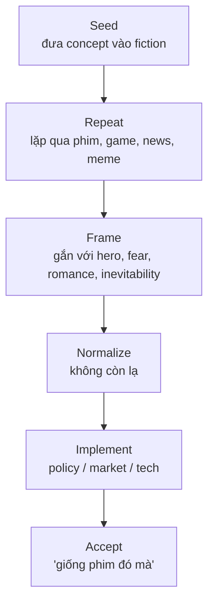

# Predictive Programming — Cấy Tương Lai Vào Tiềm Thức

**Predictive programming là giả thuyết rằng media không chỉ phản ánh tương lai mà còn tập cho công chúng cảm thấy tương lai đó quen thuộc trước khi nó được triển khai.** Đọc đúng, đây không phải trò gom mọi trùng hợp thành "tiên tri"; đây là kỷ luật nhìn repetition, timing, framing và lợi ích quyền lực.

*Predictive programming is the hypothesis that media can rehearse the public into familiarity with futures before those futures become policy, market, or technology.*

---

## Evidence Discipline / Cách Đọc

| Tầng | Kỷ luật |
|---|---|
| Fact | Có thể kiểm tra ngày phát hành, nội dung phim, sự kiện thật, tài liệu công khai |
| Pattern | Cụm chủ đề lặp lại qua nhiều media có thể tạo normalization |
| Psychology | Mere exposure, emotional framing, role-modeling và suspension of disbelief là cơ chế thật |
| Speculative synthesis | Claim "elite cố tình cấy" cần đọc như hypothesis trừ khi có bằng chứng cụ thể |

Điểm quan trọng: một ví dụ trùng không đủ. Pattern cần nhiều điểm, timing hợp lý, framing nhất quán, và câu hỏi "ai hưởng lợi?"

---

## Vault Position / Vị Trí Trong Vault

Bài này là cầu giữa [[Hollywood - Cây Đũa Phép Của Phù Thủy]], [[Kiểm Soát Tâm Trí]], [[Vô Thức Tập Thể]], [[Ma Trận]] và [[Dopamine Economy - Nền Kinh Tế Của Sự Thèm Muốn]]. Nó giải thích tại sao một ý tưởng không cần được tin ngay; nó chỉ cần được thấy đủ nhiều để khi xuất hiện ngoài đời, hệ thần kinh không còn phản ứng mạnh.

---

## Công Thức / The Loop

Programming không phải lúc nào cũng là một phòng kín đầy người lập kế hoạch. Nó có thể là incentive: studios, advertisers, state narratives, tech companies và algorithm cùng đẩy thứ phù hợp với hướng quyền lực.

---

## Vì Sao Fiction Mạnh?

| Cơ chế | Tác dụng |
|---|---|
| Mere exposure | thấy nhiều thì bớt lạ |
| Hero association | concept gắn với nhân vật được yêu |
| Fear framing | khán giả chấp nhận control để tránh threat |
| Humor | joke làm điều cấm nói trở nên nói được |
| Plausible deniability | "chỉ là phim" bảo vệ người cấy khỏi phản biện trực tiếp |

Fiction đi vòng qua cổng lý trí bằng cảm xúc. Một khi cảm xúc đã gắn với hình ảnh, lý trí thường chỉ viết lời biện hộ sau.

---

## Case Patterns / Các Mẫu Hình

| Cụm media | Tương lai được tập dượt |
|---|---|
| pandemic thrillers | lockdown, biosecurity, vaccine politics, expert governance |
| AI films | máy móc như savior, lover, judge, god hoặc existential threat |
| surveillance stories | mass tracking như cái giá cần trả để an toàn |
| alien disclosure | awe/fear trước authority mới từ bầu trời |
| dystopian youth fiction | trẻ em lớn lên trong managed scarcity và gamified obedience |
| superhero franchises | exceptional power đứng ngoài luật để "cứu" xã hội |

Không phải mọi ví dụ đều có cùng độ mạnh. Bài này ưu tiên đọc **cluster**, không worship từng "prediction".

---

## The Simpsons Problem

*The Simpsons* thường được dùng như bằng chứng vì có nhiều "dự đoán" trúng. Cách đọc kỷ luật hơn:

| Giải thích | Có thể đúng khi |
|---|---|
| Law of large numbers | show rất dài, nhiều joke nên một số sẽ khớp |
| Zeitgeist reading | writer nhạy với xu hướng đã manh nha |
| Industry access | người viết ở gần network quyền lực / entertainment |
| Predictive programming | concept được đặt trước để làm quen công chúng |
| Selection bias | người xem nhớ hit, quên miss |

Kỷ luật ở đây là không cần chọn một nguyên nhân duy nhất. Một pattern truyền thông thường có nhiều tầng cùng chạy.

---

## Inception Là Meta-Case

[[Inception - Predictive Programming Về Kiểm Soát Tâm Trí]] quan trọng vì nó không chỉ "là ví dụ"; nó mô tả chính cơ chế: cấy một ý tưởng đủ sâu để người nhận tưởng đó là ý tưởng tự sinh.

Predictive programming thành công nhất khi công chúng không cảm thấy bị ép. Họ cảm thấy mình "tự nhiên" thích, sợ, muốn, hoặc chấp nhận.

---

## Red Flags / Dấu Hiệu Nên Đọc Kỹ

1. Một concept xuất hiện đồng thời ở phim, news, policy paper và quảng cáo.
2. Villain dùng trước, hero dùng sau, khiến khán giả chấp nhận cùng công cụ.
3. Câu chuyện biến điều từng ghê thành inevitable.
4. Children's media chuẩn hóa thứ người lớn còn phản kháng.
5. Expert/authority trong phim luôn là người duy nhất giải thích reality.
6. Opposition bị vẽ như ngu, điên, cực đoan hoặc nguy hiểm.

---

## Không Paranoid, Không Ngây Thơ

Paranoia cũng là một chương trình. Người paranoid thấy mọi thứ là spell và mất khả năng sống. Người ngây thơ thấy mọi thứ là entertainment và giao subconscious cho màn hình. Vị trí đúng nằm giữa: enjoy the story, decode the frame.

Liên kết quan trọng: [[Cách Đọc Red Pill Wiki]] nhắc rằng vault không phải hệ niềm tin mới. Predictive programming nên làm người đọc sắc hơn, không làm người đọc hoảng hơn.

---

## Core Insight / Chốt Lại

**Predictive programming không cần chứng minh rằng mọi phim đều là âm mưu. Nó chỉ cần nhắc rằng tương lai chính trị và công nghệ thường được rehearsal trong imagination trước khi được triển khai trong đời sống.**

*The future is often rehearsed in imagination before it is installed in policy, markets, and behavior.*

## Publication Pack / Disclosure & Spectacle

Bài này thuộc **Disclosure & Spectacle Pack**: đọc current events như media ritual, predictive programming và symbolic rehearsal, nhưng không nhầm symbol thành proof.

Reading path:

1. [[Predictive Programming - Cấy Tương Lai Vào Tiềm Thức]] — method đọc repetition/framing.
2. [[Hollywood - Cây Đũa Phép Của Phù Thủy]] — screen như wand của collective imagination.
3. [[Bộ Tam Thánh Mind Control - NASA Disney Hollywood]] — ba màn hình của myth công nghiệp.
4. [[A LIE N - SpaceX IPO Disclosure Day và Nghi Lễ Tên Lửa]] — disclosure, rocket ritual và techno-myth.
5. [[Brazil 2026 - Khi Bóng Đá Trở Về Với Linh Hồn Tập Thể]] — sports field như collective soul field.
6. [[Spectacle Ritual - World Cup, Super Bowl Và Nghi Lễ Đồng Bộ Đại Chúng]] — spectacle như synchronization infrastructure.

Rule của pack: fact → pattern → symbol → speculative synthesis. Không nhảy thẳng từ coincidence sang certainty.

