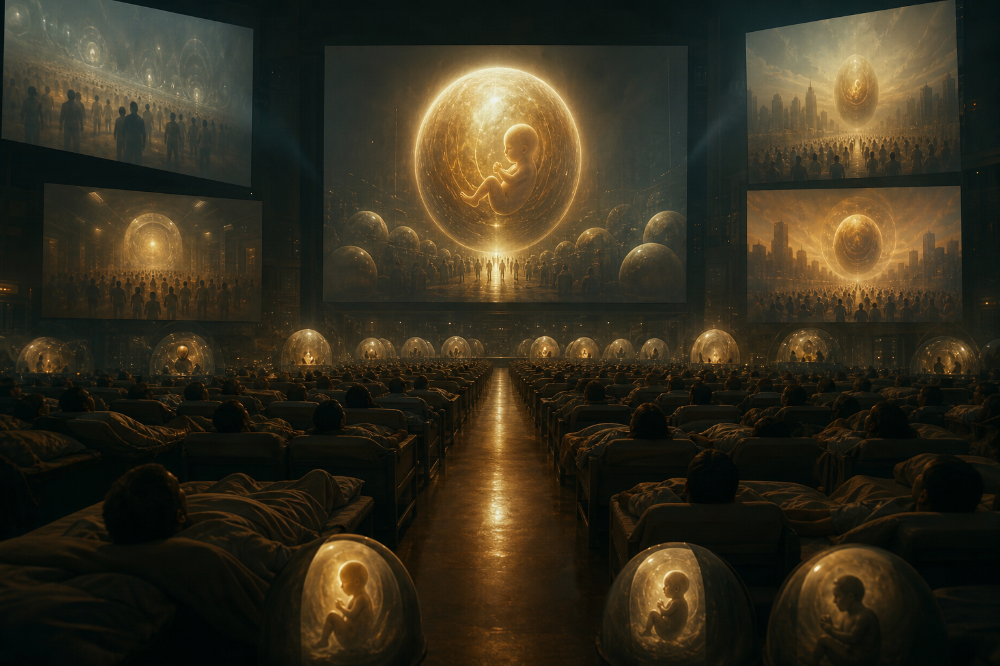
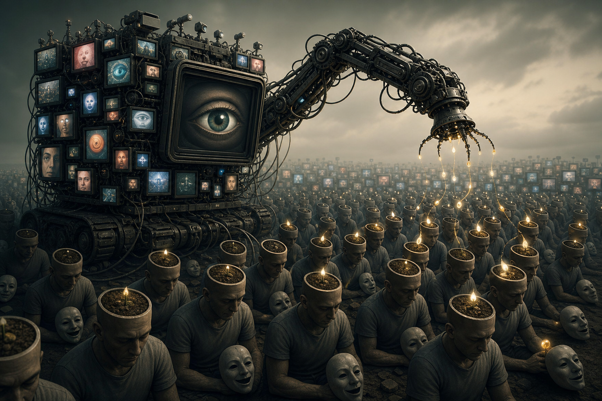
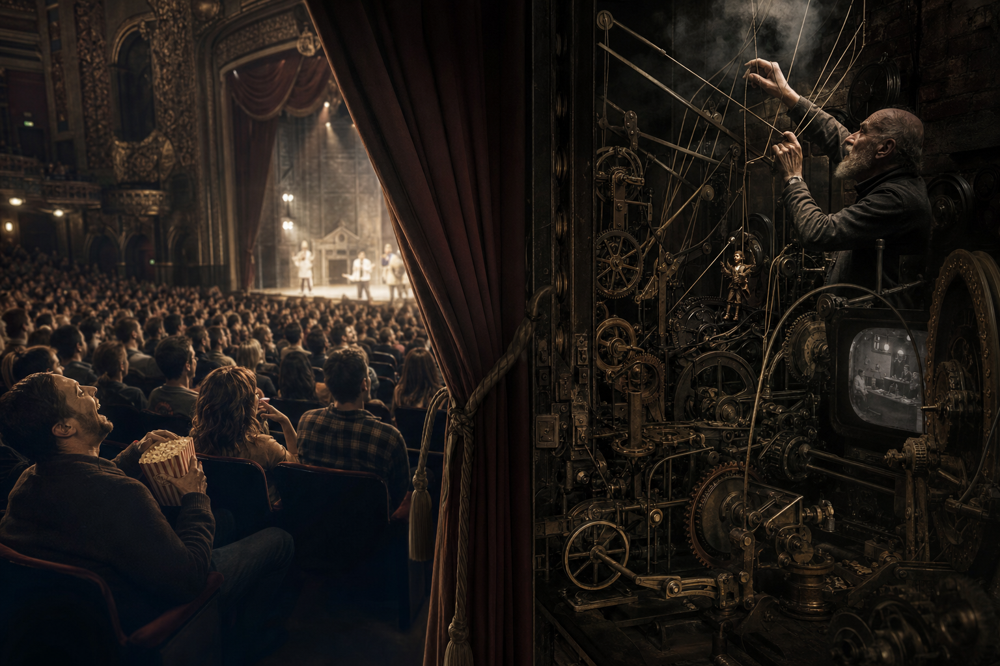

# Predictive Programming — Cấy Tương Lai Vào Tiềm Thức

**Predictive programming là giả thuyết rằng media không chỉ phản ánh tương lai, mà còn tập cho công chúng cảm thấy tương lai đó quen thuộc trước khi nó được triển khai thành policy, market, technology hoặc social norm. Nó không cần bạn tin ngay. Nó chỉ cần bạn đã thấy, đã cảm, đã cười, đã sợ, đã yêu một hình ảnh đủ nhiều lần để khi nó bước ra đời thật, hệ thần kinh không còn phản kháng như lần đầu.**

*Predictive programming is the hypothesis that media does not merely reflect the future, but rehearses the public into familiarity with it before it becomes policy, market, technology, or social norm.*

Đọc đúng, đây không phải trò gom mọi trùng hợp thành “tiên tri”. Đó là kỷ luật nhìn repetition, timing, framing, incentive và câu hỏi: ai được lợi nếu công chúng quen với frame này?

---

## Evidence Discipline / Cách Đọc

Predictive programming phải được đọc theo tầng. Ở tầng fact, ta có thể kiểm tra ngày phát hành phim, nội dung, tài liệu công khai, quảng cáo, policy paper và sự kiện thật. Ở tầng psychology, ta biết mere exposure, emotional framing, role-modeling, suspension of disbelief và social proof là cơ chế thật. Ở tầng pattern, nhiều media có thể cùng normalize một concept. Ở tầng speculative synthesis, claim “Elite cố tình cấy” cần đọc như hypothesis trừ khi có bằng chứng cụ thể.

Một ví dụ trùng không đủ. Pattern cần nhiều điểm: motif lặp, timing hợp lý, framing nhất quán, kênh phân phối lớn, và lợi ích quyền lực rõ. Nếu bỏ kỷ luật này, người đọc sẽ biến vault thành bói meme. Nếu giữ kỷ luật, predictive programming trở thành một công cụ đọc culture rất sắc.

---

## Vault Position / Vị Trí Trong Vault

Bài này là cầu giữa [[Hollywood - Cây Đũa Phép Của Phù Thủy]], [[Kiểm Soát Tâm Trí]], [[Vô Thức Tập Thể]], [[Ma Trận]] và [[Dopamine Economy - Nền Kinh Tế Của Sự Thèm Muốn]]. Nó giải thích tại sao một ý tưởng không cần được chấp nhận bằng lý trí trước. Nó chỉ cần được rehearsal bằng hình ảnh.

Nếu [[Ma Trận]] là hệ điều hành perception, predictive programming là cơ chế preload: cài trước asset cảm xúc, biểu tượng và reaction để khi update thật tới, public không thấy nó xa lạ.

---

## Công Thức: Seed, Repeat, Frame, Normalize, Implement

Công thức đơn giản:

**Seed**: đưa concept vào fiction, game, meme, music video, quảng cáo, children's media hoặc documentary.

**Repeat**: lặp nó qua nhiều format để công chúng không còn thấy lạ.

**Frame**: gắn concept với hero, fear, romance, comedy, inevitability hoặc moral duty.

**Normalize**: biến điều từng ghê thành quen, điều từng lạ thành “cũng hợp lý”.

**Implement**: khi policy/tech/market xuất hiện, public đã có emotional template.

**Accept**: phản ứng cuối cùng không phải “cái gì đây?” mà là “giống phim đó mà”.

Programming không phải lúc nào cũng là một phòng kín đầy người lập kế hoạch. Nó có thể là incentive: studios, advertisers, state narratives, tech companies, NGOs, platform algorithms và investor narratives cùng đẩy thứ phù hợp với hướng quyền lực.

---

## Vì Sao Fiction Mạnh Hơn Tuyên Truyền Thẳng?

Fiction đi vòng qua cổng lý trí bằng cảm xúc.

Khi một politician nói “mass surveillance là cần thiết”, public có thể phản kháng. Nhưng khi superhero dùng surveillance để cứu thành phố, khán giả feel safety trước khi debate privacy. Khi một tech company nói “AI nên quản trị đời sống”, người ta nghi ngờ. Nhưng khi phim cho AI thành lover, savior, judge hoặc god, imagination đã tập trước các vị trí đó.

Entertainment là vùng critical thinking thấp. Người xem tự nói: “chỉ là phim mà”. Chính câu đó mở cửa cho image đi sâu hơn argument.

Điểm này không có nghĩa mọi đạo diễn đều là agent. Nhiều writer chỉ đang đọc zeitgeist tốt. Nhưng zeitgeist cũng là field quyền lực. Cái gì được greenlight, funded, distributed, awarded, memed và repeated không bao giờ hoàn toàn vô tội.

---

## The Simpsons Problem

*The Simpsons* thường được dùng như bằng chứng predictive programming vì có nhiều “dự đoán” trúng. Cách đọc kỷ luật hơn là giữ nhiều khả năng cùng lúc.

Có thể đó là law of large numbers: show rất dài, nhiều joke nên vài cái sẽ khớp. Có thể writer nhạy với xu hướng đã manh nha. Có thể industry access giúp họ gần network quyền lực hơn public. Có thể một số motif là programming thật. Cũng có thể selection bias làm người xem nhớ hit và quên miss.

Không cần chọn một nguyên nhân duy nhất. Văn hóa đại chúng thường chạy bằng nhiều tầng. Vấn đề không phải “Simpsons có phép tiên tri không?”. Câu hỏi tốt hơn là: vì sao một show satire có thể đọc future của hệ thống tốt đến vậy?

Satire giỏi vì nó nhìn logic hiện tại và kéo nó tới cực điểm. Đôi khi future chỉ là present được phóng đại đúng hướng.

---

## Inception Là Meta-Case

[[Inception - Predictive Programming Về Kiểm Soát Tâm Trí]] quan trọng vì nó không chỉ là ví dụ. Nó mô tả chính cơ chế: cấy một ý tưởng đủ sâu để người nhận tưởng đó là ý tưởng tự sinh.

Predictive programming thành công nhất khi công chúng không cảm thấy bị ép. Họ cảm thấy mình tự nhiên thích, sợ, muốn hoặc chấp nhận. Đó là mức cấy sâu hơn propaganda thô. Propaganda nói “hãy tin X”. Inception-style programming làm người nhận nghĩ: “X là suy nghĩ của tôi.”

Đây là lý do media ritual luôn nhắm vào emotion trước. Emotion tạo memory. Memory tạo familiarity. Familiarity tạo plausibility.

---

## Case Patterns / Các Cụm Tương Lai Được Tập Dượt

Pandemic thrillers tập public với biosecurity, lockdown, expert governance và body-as-risk. AI films tập public với máy móc như savior, lover, judge, god hoặc existential threat. Surveillance stories tập public với mass tracking như cái giá cần trả để an toàn. Alien disclosure media tập public với awe/fear trước authority mới từ bầu trời. Dystopian youth fiction tập thế hệ trẻ với managed scarcity, gamified obedience và identity sorting. Superhero franchises tập public với exceptional power đứng ngoài luật để cứu xã hội.

Không phải mọi tác phẩm trong các cụm này là agenda. Nhưng khi cùng một future được rehearsal qua phim, game, news, quảng cáo và policy language, ta nên đọc kỹ.

Red flag mạnh nhất là khi villain dùng một công cụ trước, rồi hero dùng lại công cụ đó “vì hoàn cảnh bắt buộc”. Khán giả học rằng công cụ không xấu; chỉ cần đúng người cầm. Đây là cách nhiều công nghệ kiểm soát được moral laundering.

---

## Hidden In Plain Sight

Predictive programming nối trực tiếp với [[Karma Disclosure - Truth Hidden In Plain Sight]]. Hệ thống có thể reveal một phần method dưới dạng fiction. Vì “chỉ là phim”, phần lớn người xem không xử lý nó như knowledge. Họ tiêu thụ nó như mood, meme, aesthetic.

Nhưng subconscious không phân loại đơn giản như vậy. Một image mạnh có thể sống trong người xem nhiều năm. Khi world event tương ứng xuất hiện, image cũ trở thành template giải nghĩa.

Đây là lý do câu hỏi đúng không phải: “Phim này dự đoán đúng chưa?”

Câu hỏi đúng là:

> Phim này đang dạy hệ thần kinh phản ứng thế nào với một khả năng?

---

## Không Paranoid, Không Ngây Thơ

Paranoia cũng là một chương trình. Người paranoid thấy mọi thứ là spell và mất khả năng sống. Người ngây thơ thấy mọi thứ là entertainment và giao subconscious cho màn hình.

Vị trí đúng nằm giữa: enjoy the story, decode the frame.

Khi xem một tác phẩm, hỏi vài câu sạch: concept nào được làm cool? Điều gì từng ghê đang được làm quen? Ai được quyền giải thích reality? Opposition bị vẽ như ngu, điên, cực đoan hay nguy hiểm? Fear/desire nào bị kích hoạt? Motif này xuất hiện ở đâu nữa? Có nối với policy, market, tech, institution không?

Nếu không nối được, đừng ép. Một symbol không đủ làm proof. Nhưng nếu pattern lặp đủ lâu, đừng giả vờ không thấy.

---

## Kết

Predictive programming không cần chứng minh rằng mọi phim đều là âm mưu. Nó chỉ cần nhắc rằng tương lai chính trị và công nghệ thường được rehearsal trong imagination trước khi được cài vào đời sống.

Tương lai không chỉ được xây bằng luật, vốn và máy móc. Nó được xây trước trong vùng tưởng tượng tập thể.

> Ai kiểm soát hình ảnh của tương lai, người đó đã kiểm soát một phần phản ứng của public khi tương lai đến.

---

## Publication Pack / Disclosure & Spectacle

Reading path:

1. [[Predictive Programming - Cấy Tương Lai Vào Tiềm Thức]] — method đọc repetition/framing.
2. [[Hollywood - Cây Đũa Phép Của Phù Thủy]] — screen như wand của collective imagination.
3. [[Bộ Tam Thánh Mind Control - NASA Disney Hollywood]] — ba màn hình của myth công nghiệp.
4. [[Karma Disclosure - Truth Hidden In Plain Sight]] — reveal trong fiction nhưng không được xử lý như truth.
5. [[Spectacle Ritual - World Cup, Super Bowl Và Nghi Lễ Đồng Bộ Đại Chúng]] — spectacle như synchronization infrastructure.
