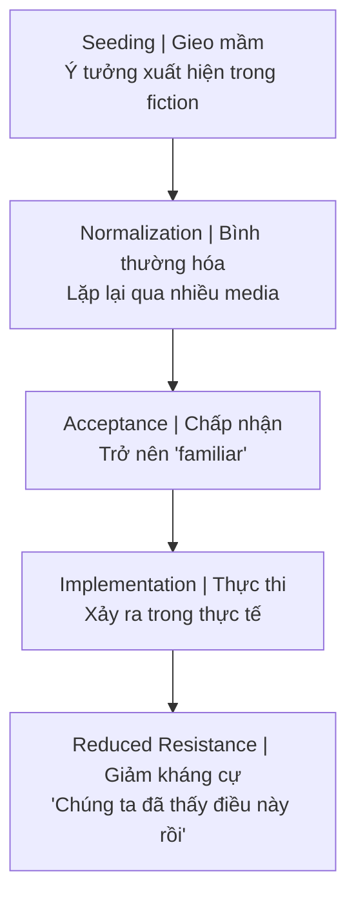
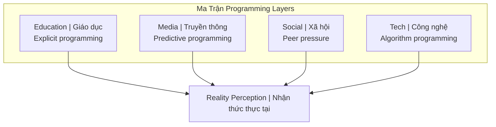

# Predictive Programming — Cấy Tương Lai Vào Tiềm Thức

> *"Cách tốt nhất để dự đoán tương lai là tạo ra nó."*
> *"The best way to predict the future is to create it."*
> — Được gán cho Abraham Lincoln / Peter Drucker

**Predictive Programming** là lý thuyết cho rằng các phương tiện truyền thông (phim, TV, sách, games) được sử dụng để **gieo mầm ý tưởng** vào tiềm thức đại chúng, chuẩn bị tâm lý cho các sự kiện hoặc thay đổi xã hội **trước khi chúng xảy ra**.

*Predictive Programming is the theory that media (films, TV, books, games) is used to seed ideas into the collective unconscious, psychologically preparing people for events or social changes before they happen.*

---

## Cơ Chế Hoạt Động / How It Works

### Công Thức / The Formula

### Tại Sao Hiệu Quả? / Why It Works

| Cơ chế tâm lý / Psychological Mechanism | Giải thích / Explanation |
|----------------------------------------|--------------------------|
| **Mere Exposure Effect** | Tiếp xúc nhiều → quen thuộc → thích | 
| **Suspension of Disbelief** | Khi xem fiction, critical thinking ↓ |
| **Emotional Association** | Gắn ý tưởng với nhân vật yêu thích |
| **Normalization** | Điều lạ → điều bình thường qua repetition |
| **Plausible Deniability** | "Chỉ là phim thôi mà" |

### Theo Góc Nhìn Occult / Occult Perspective

Từ [[Hollywood - Cây Đũa Phép Của Phù Thủy]]:

> **"Cây đũa phép của phù thủy được làm từ gỗ Holly"** — Hollywood = nơi tạo ra magic (ảo thuật nhận thức).

*Xem chi tiết: [[Hollywood - Cây Đũa Phép Của Phù Thủy]]*

---

## Case Studies

### 1. 9/11 — Tháp Đôi WTC

Hình ảnh tháp đôi bị tấn công/phá hủy xuất hiện **nhiều lần trước 2001**:

| Media | Năm | Nội dung |
|-------|-----|----------|
| *The Lone Gunmen* (TV pilot) | Mar 2001 | Máy bay bị hack, nhắm vào WTC |
| *The Matrix* (1999) | 1999 | Neo's passport expires 9/11/2001 |
| *Super Mario Bros* (movie) | 1993 | Twin towers collapse |
| *Terminator 2* | 1991 | Explosion destroys buildings |
| *Back to the Future* | 1985 | "Twin Pines" → "Lone Pine" mall |
| Album covers, cartoons | Various | Twin towers + planes |

### 2. Pandemic Programming

| Media | Năm | Content |
|-------|-----|---------|
| *Contagion* | 2011 | Bat → Pig → Human virus, lockdowns, vaccines |
| *12 Monkeys* | 1995 | Engineered virus wipes out humanity |
| *The Simpsons* | Various | Multiple pandemic predictions |
| *Utopia* (UK) | 2013 | Vaccine as population control |
| *Event 201* | Oct 2019 | Pandemic "simulation" 2 months before COVID |

### 3. Surveillance State

| Media | Năm | Programming |
|-------|-----|-------------|
| *1984* (Orwell) | 1949 | Big Brother, thought crime |
| *Enemy of the State* | 1998 | Total surveillance normalcy |
| *The Dark Knight* | 2008 | Mass surveillance = "necessary" |
| *Black Mirror* | 2011+ | Social credit, constant monitoring |
| *Person of Interest* | 2011 | AI monitors everyone, saves lives |

### 4. Transhumanism

| Media | Năm | Programming |
|-------|-----|-------------|
| *Robocop* | 1987 | Human-machine integration |
| *The Matrix* | 1999 | Brain-computer interface |
| *Ex Machina* | 2014 | AI consciousness |
| *Upgrade* | 2018 | Chip implant = superpower |
| *Neuralink publicity* | 2020s | Elon makes it "cool" |

### 5. [[Inception - Predictive Programming Về Kiểm Soát Tâm Trí|Inception]] (2010)

Bộ phim **về predictive programming** — cấy ý tưởng vào tiềm thức để người đó nghĩ đó là ý tưởng của họ.

*A film about predictive programming — planting ideas in the subconscious so the person thinks it's their own idea.*

→ Xem chi tiết: [[Inception - Predictive Programming Về Kiểm Soát Tâm Trí]]

---

## The Simpsons Phenomenon

*The Simpsons* (1989-present) có **số lượng "predictions" đáng kinh ngạc**:

| Prediction | Episode Year | Reality Year |
|------------|--------------|--------------|
| Trump presidency | 2000 | 2016 |
| Disney buys Fox | 1998 | 2019 |
| Smartwatches | 1995 | 2010s |
| Video calling | 1995 | 2010s |
| FIFA corruption | 2014 | 2015 |
| Tiger attack (Siegfried & Roy) | 1993 | 2003 |
| Ebola outbreak | 1997 | 2014 |
| Autocorrect fails | 1994 | 2010s |

**Giải thích có thể / Possible explanations:**

1. **Predictive Programming** — Deliberate seeding
2. **Law of Large Numbers** — 700+ episodes, some hit by chance
3. **Insider Knowledge** — Writers connected to elite circles
4. **Zeitgeist Reading** — Good writers extrapolate trends
5. **Selection Bias** — We remember hits, forget misses

---

## Reverse Engineering: Nhận Diện Pattern / Pattern Recognition

### Câu hỏi để đặt / Questions to Ask

Khi thấy concept lặp lại trong media:

1. **Frequency:** Xuất hiện bao nhiêu lần, trong bao nhiêu media?
2. **Framing:** Được present là positive, negative, hay neutral?
3. **Timing:** Có cluster trước một event thực không?
4. **Emotional Loading:** Hero hay villain liên kết với concept?
5. **Target Demographic:** Nhắm vào audience nào?

### Red Flags / Dấu hiệu cảnh báo

| Pattern | Có thể đang program |
|---------|---------------------|
| **Sudden appearance** across multiple media | New agenda being pushed |
| **Villains doing it first** | Make heroes justify it later |
| **"Necessary evil"** framing | Acceptance of what was unacceptable |
| **Children's media** | Programming next generation |
| **"Expert" characters** | Appeal to authority |

---

## Criticism & Counter-Arguments / Phản Biện

### Against Predictive Programming Theory

| Argument | Counter |
|----------|---------|
| **Coincidence** | Some are. But pattern & frequency matter. |
| **Hindsight bias** | We only remember hits. |
| **Writers extrapolate** | True for some, not for specific details. |
| **No proof of intent** | Hard to prove, easier to observe pattern. |
| **Just entertainment** | Why so much overlap with real events? |

### Nuanced View / Góc nhìn cân bằng

Có thể có **nhiều layers**:

1. **Level 1:** Genuine creative extrapolation — writers imagine future
2. **Level 2:** Zeitgeist reading — good writers sense emerging trends
3. **Level 3:** Insider knowledge — some writers connected to power
4. **Level 4:** Deliberate programming — coordinated seeding

Không cần chọn một level — **tất cả có thể cùng tồn tại**.

*All levels can coexist. Not all predictions are programming, but not all are coincidence either.*

---

## Application: Đọc Media Có Awareness / Reading Media with Awareness

### Khi xem phim/TV / When watching

1. **Notice:** Concept gì đang được introduce?
2. **Question:** Ai hưởng lợi nếu điều này được accepted?
3. **Track:** Concept này xuất hiện ở đâu nữa?
4. **Timing:** Có sự kiện thực tế nào liên quan sắp tới?
5. **Emotion:** Mình đang được condition để feel gì?

### Mindset

> **Enjoy the story, decode the message.**
>
> *Thưởng thức câu chuyện, giải mã thông điệp.*

Không cần paranoid. Nhưng cũng không naïve.

*Don't be paranoid. But don't be naïve either.*

---

## Connection: [[Ma Trận]] / Matrix Connection

### Programming Stack

### Tại Sao Cần Predictive Programming? / Why Needed?

Theo một số theories: [[Elite]] cần **consent** (ngầm) cho các kế hoạch của họ — do đó tiết lộ trước qua fiction.

*According to some theories: Elite needs (implicit) consent for their plans — hence disclosure through fiction.*

> **"Revealing the method"** — Tiết lộ phương pháp như một loại ritual.
>
> *Revealing the method as a type of ritual.*

→ Xem: [[Hollywood - Cây Đũa Phép Của Phù Thủy]]

---

## Related / Liên quan

### Core
- [[Hollywood - Cây Đũa Phép Của Phù Thủy]] — Entertainment as spellcasting
- [[Inception - Predictive Programming Về Kiểm Soát Tâm Trí]] — Deep dive case study
- [[Ma Trận]] — The control system

### Mechanisms
- [[Kiểm Soát Tâm Trí]] — Mind control techniques
- [[Vô Thức Tập Thể]] — Where seeds are planted
- [[Dopamine Economy - Nền Kinh Tế Của Sự Thèm Muốn]] — How attention is captured

### Examples
- [[Sự Thật Về Vụ Sập Tháp Đôi WTC]] — Post-9/11 analysis
- [[Báo Cáo 2030]] — Blueprint being programmed
- [[Gen Z - Phân Tích Phản Biện]] — Generation most programmed

---

## Sources

- **Alan Watt** — Cutting Through the Matrix (lectures on predictive programming)
- **Jay Dyer** — *Esoteric Hollywood* (2016)
- **Joseph P. Farrell** — Research on media-military complex
- **Vigilant Citizen** — Ongoing media analysis
- Vault: [[Hollywood - Cây Đũa Phép Của Phù Thủy]], [[Inception - Predictive Programming Về Kiểm Soát Tâm Trí]]
