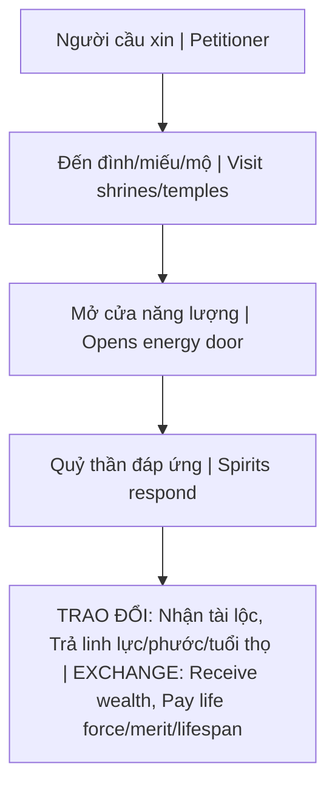

# Quy Luật Trao Đổi Tâm Linh (Spiritual Exchange)

**Quy Luật Trao Đổi Tâm Linh** là cơ chế đánh đổi năng lượng khi con người tương tác với các thế lực siêu nhiên — đặc biệt khi cầu xin từ bên ngoài thay vì phát triển từ bên trong.

*The Spiritual Exchange Law is the energy trade-off mechanism when humans interact with supernatural forces — especially when asking from outside rather than developing from within.*

---

## Nguyên Lý Cơ Bản / Fundamental Principles

### Universal Law of Exchange

| Nguyên tắc / Principle | Ý nghĩa / Meaning |
|------------------------|-------------------|
| **Không có gì miễn phí / Nothing is free** | Năng lượng phải được trao đổi / Energy must be exchanged |
| **Mọi giao dịch có giá / Every transaction has a price** | "No free lunch" áp dụng cả về mặt tâm linh |
| **Hợp đồng ẩn / Hidden contracts** | Không biết giá = nguy hiểm / Not knowing the price = dangerous |

---

## Bẫy Cầu Xin Quỷ Thần / The Trap of Praying to Spirits

### Cơ Chế Hoạt Động / How It Works

### Quỷ Thần Là Ai? / Who Are These Spirits?

Các thực thể tu luyện lâu năm, feed on human energy, có thể thao túng thực tại vật chất (giới hạn). Không phải thần, nhưng là sinh vật quyền năng.

*Entities cultivated over long periods, feeding on human energy, capable of manipulating material reality (limited). Not gods, but powerful beings.*

### Bảng Trao Đổi / Exchange Table

| Bạn nhận / You receive | Bạn mất / You lose |
|------------------------|---------------------|
| Tiền tài ngắn hạn / Short-term wealth | Phước báu dài hạn / Long-term merit |
| May mắn tức thời / Instant luck | Tuổi thọ / Lifespan |
| Tình duyên bề ngoài / Surface romance | Linh lực gốc / Core spiritual power |
| Success nhanh / Quick success | Hậu vận / Future fortune |

### "Của Thiên Trả Địa" / "Heaven's Goods Return to Earth"

Tục ngữ Việt Nam: cái gì đến dễ, đi cũng dễ. Vận may vay mượn phải trả lại — thường với lãi suất nặng.

*Vietnamese proverb: what comes easy, goes easy. Borrowed luck must be repaid — often with heavy interest.*

---

## Ví Dụ Điển Hình / Typical Examples

### Mộ Cô Sáu, Các Miếu Âm / Occult Shrines

Nổi tiếng "linh thiêng", người cầu được nhiều. Nhưng... hỏi những người cầu 10 năm trước xem cuộc sống họ giờ như thế nào.

*Famous for being "sacred", many receive what they ask. But... ask those who prayed 10 years ago how their life is now.*

### Bùa Ngải, Phép Thuật / Charms & Spells

Cưỡng ép tình duyên, hại kẻ thù — luôn quay trở lại. Karma được nhân lên.

*Forcing romance, harming enemies — always comes back. Karma multiplied.*

### Bán Linh Hồn / Selling the Soul (Extreme)

Faustian bargain: đổi linh hồn lấy quyền lực/danh vọng/giàu có. Pattern phổ biến trong ngành giải trí.

*Faustian bargain: trading soul for power/fame/wealth. Common pattern in entertainment industry.*

---

## Tại Sao Đây Là Bẫy? / Why Is This a Trap?

### 1. Hidden Terms / Điều khoản ẩn

Bạn không biết giá đầy đủ. Hợp đồng được ký vô thức. Fine print vô hình.

*You don't know the full price. Contract signed unconsciously. Fine print invisible.*

### 2. Ứng Trước Phước Báu / Borrowing Future Merit

Giống như payday loan cho linh hồn — kéo karma tích cực tương lai về hiện tại. Tương lai: trống rỗng.

*Like a payday loan for the soul — pulling future positive karma into present. Future: empty.*

### 3. Làm Yếu Sự Tự Chủ / Weakens Self-Reliance

Phụ thuộc vào thế lực bên ngoài, quên đi sức mạnh nội tại. Con đường Ngộ Đạo bị chặn, mắc kẹt trong bẫy Nhị Nguyên.

*Dependency on external forces, forgetting inner power. Path to Gnosis blocked, trapped in Duality.*

---

## Con Đường An Toàn / The Safe Path

### 1. Không Cầu Xin Bên Ngoài / Don't Ask Externally

Phật, Thần thực sự không exchange kiểu này. Bậc cao cho đi tự do (không ràng buộc). Nếu có giá, đó không phải thần thánh.

*Real Buddhas and Gods don't exchange this way. High beings give freely (no strings). If there's a price, it's not divine.*

### 2. Phát Triển Bên Trong / Develop From Within

Xây dựng năng lượng riêng, công đức qua hành động, tự tu dưỡng. Con đường Individuation.

*Build your own energy, merit through action, self-cultivation. The path of Individuation.*

### 3. Hiểu Nhân Quả / Understand Karma

Tạo karma tốt trực tiếp. Giúp đỡ người khác chân thành. Sự thịnh vượng tương lai diễn ra tự nhiên — không cần đường tắt.

*Create good karma directly. Help others genuinely. Future prosperity organic — no shortcuts needed.*

### 4. Biết Rõ Contract / Know the Contract

Nếu phải tương tác với cõi tâm linh, hãy biết rõ bạn đang đồng ý với điều gì. Thực hành bảo vệ, sự phân biệt là thiết yếu.

*If you must engage the spiritual realm, know what you're agreeing to. Protection practices, discernment essential.*

---

## Related

- [[Nhị Nguyên]] — Trap of seeking outside
- [[Thực Thể Cõi Trung Giới  (Astral Entities)]]
- [[Tà Linh (Energy Parasites)]] — Who benefits
- [[Sự Thật Ẩn Sau Con Người Bạn]]
- [[Nhân Quả]] — Real mechanism of fortune
- [[Gnosis (Ngộ Đạo)]] — Power from within
- [[Individuation (Thành Toàn Bản Ngã)]]
