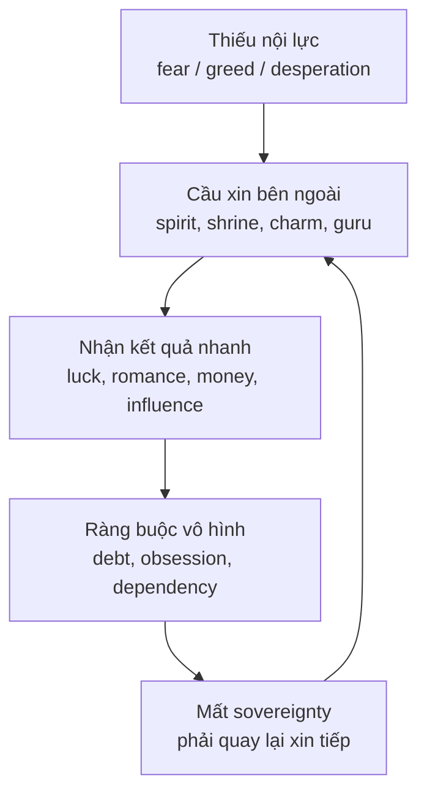

# Quy Luật Trao Đổi Tâm Linh (Spiritual Exchange)

**Quy Luật Trao Đổi Tâm Linh nói một điều đơn giản: khi con người xin quyền lực từ bên ngoài trước khi có nội lực bên trong, món quà thường đi kèm một sợi dây.** Trong vault, đây không phải lời hù dọa mê tín, mà là một lens để đọc [[Nhân Quả]], [[Thực Thể Cõi Trung Giới]], [[Tà Linh]] và bẫy của [[Nhị Nguyên]]: muốn kết quả nhanh, nhưng không đọc được cái giá.

*The Spiritual Exchange Law says that when humans seek power outside before building inner power, the gift often comes with a cord attached.*

---

## Vault Position / Vị Trí Trong Bản Đồ

Bài này nằm trên trục **Gnosis vs dependency**. [[Gnosis]] là quyền biết trực tiếp từ bên trong; trao đổi tâm linh lệch là outsource quyền lực đó cho một thực thể, một nơi thờ, một nghi thức, một bùa phép, một "ông thầy", một promise bên ngoài.

Điểm cần giữ rõ: không phải mọi nghi lễ, đền chùa, cầu nguyện hay truyền thống thờ phụng đều là bẫy. Vấn đề bắt đầu khi người cầu xin bước vào trạng thái **van nài, tham, sợ, muốn đường tắt**, rồi đồng ý vô thức với một exchange mà mình không đọc được điều khoản.

---

## Claim Discipline / Kỷ Luật Tuyên Bố

| Lớp đọc | Cách hiểu |
|---|---|
| **Fact / văn hóa** | Con người ở nhiều nền văn hóa có thực hành cầu xin, cúng lễ, bùa chú, thề nguyện, hiến tế, trả lễ. |
| **Pattern / hệ thống** | Khi một người muốn kết quả nhanh mà không xây năng lực thật, họ dễ rơi vào quan hệ phụ thuộc. |
| **Symbol / huyền học** | "Hợp đồng", "trả lễ", "mất phước", "bán linh hồn" là ngôn ngữ biểu tượng để nói về dây ràng buộc vô hình. |
| **Speculative synthesis** | Việc gán cơ chế này cho thực thể cõi trung giới, loosh hay tà linh là lớp esoteric của vault, không phải chứng minh khoa học. |

---

## Nguyên Lý Cốt Lõi / The Core Principle

Trao đổi tự nó không xấu. Vũ trụ vận hành bằng exchange: hơi thở vào-ra, lao động-giá trị, yêu thương-trách nhiệm, học hỏi-kỷ luật. Vấn đề không nằm ở việc "có trao đổi", mà nằm ở **exchange thiếu minh bạch**.

Một giao dịch lành mạnh có ba dấu hiệu: biết mình đang trao gì, biết mình đang nhận gì, và vẫn giữ được chủ quyền sau khi nhận. Một giao dịch lệch có ba dấu hiệu ngược lại: giá không rõ, cảm giác bị kéo, và càng nhận càng yếu nội lực.

Đây là lý do bài này nối trực tiếp với [[Individuation]]. Trưởng thành tâm linh không phải là biết gọi nhiều lực hơn; trưởng thành là không cần bán quyền tự chủ để đổi lấy một kết quả ngắn hạn.

---

## Bẫy Cầu Xin / The Petition Trap

Khi một người đến đình, miếu, mộ, am, điện hoặc một nghi thức nào đó với tâm thế kính trọng, biết ơn, tưởng niệm, việc đó khác với bước vào trong cơn thiếu thốn và nói: "Cho con tiền, cho con người này, cho con thắng, cho con hại người kia."

Tâm thế thứ hai mở một cửa rất cụ thể: nó công khai điểm yếu. Thực thể nào đi qua cửa đó, nếu có, không nhất thiết là "thần" theo nghĩa cao. Trong lớp esoteric của vault, nhiều thực thể cõi trung giới có thể đáp ứng một phần ham muốn vật chất nhưng lấy lại bằng attention, linh lực, phước, tuổi thọ biểu tượng, hoặc đơn giản hơn: bằng sự phụ thuộc tâm lý.

| Bạn tưởng mình nhận | Cái giá có thể bị lấy |
|---|---|
| Tiền nhanh, luck nhanh | Khả năng tự tạo giá trị bền |
| Tình duyên cưỡng ép | Tự trọng, tự do, karma quan hệ |
| Danh tiếng, quyền lực | Sự yên ổn bên trong |
| Cảm giác được bảo kê | Năng lực tự đứng một mình |

Không cần tin tuyệt đối vào mọi lớp huyền học để thấy pattern này đúng ở tầng đời thường. Người nghiện "đường tắt" luôn trả giá bằng muscle yếu đi. Linh hồn cũng vậy.

---

## Bùa Ngải, Hợp Đồng Ẩn Và Faustian Pattern

Bùa ngải và phép ép duyên là ví dụ dễ thấy nhất vì chúng không chỉ xin cho bản thân; chúng cố bẻ ý chí người khác. Dù đọc theo [[Nhân Quả]] hay theo tâm lý học quan hệ, cấu trúc vẫn bẩn: dùng lực vô hình để né bài học minh bạch, giao tiếp, tự nâng cấp và chấp nhận tự do của người kia.

"Bán linh hồn" là phiên bản cực đoan hơn của cùng pattern. Trong văn hóa đại chúng, Faustian bargain thường được kể như đổi linh hồn lấy fame, money, beauty, power. Ở tầng biểu tượng, nó mô tả khoảnh khắc con người đổi tiếng nói thật lấy persona, đổi tự do lấy spotlight, đổi sự hiện diện lấy hợp đồng với hệ thống.

Đây là điểm nối với [[Ma Trận]]: control system không cần ép bạn nếu nó có thể khiến bạn tự ký vào một deal đẹp mắt.

---

## Không Phải Thần Thánh Nào Cũng Là "Vendor"

Một lỗi phổ biến là gom mọi thứ vô hình vào một rọ: thần, Phật, tổ tiên, vong, quỷ, thầy, năng lượng, "vũ trụ". Cách đọc đó vừa lười vừa nguy hiểm.

Trong ngôn ngữ của vault, tầng cao không hoạt động như vendor bán may mắn. Một lực thật sự cao thường đánh thức trách nhiệm, làm tâm sáng hơn, buộc con người đứng thẳng hơn. Một lực thấp thường chiều tham muốn trước, rồi kéo dây sau. Khác biệt không nằm ở mức độ "linh"; khác biệt nằm ở hậu quả lên sovereignty.

> Nếu sau một thực hành bạn sáng hơn, tự chủ hơn, nhân hậu hơn và bớt nghiện cầu xin, đó là dấu hiệu tốt. Nếu bạn sợ hơn, phụ thuộc hơn, ám ảnh hơn và phải quay lại trả lễ liên tục, hãy đọc lại contract.

---

## Con Đường An Toàn / The Sovereign Path

Con đường an toàn không phải là đóng cửa với mọi chiều kích tâm linh. Nó là bước vào bằng discernment.

1. **Không xin thứ mình chưa sẵn sàng gánh.** Quyền lực mà không có đạo đức sẽ thành nợ.
2. **Không cưỡng ép ý chí người khác.** Tình yêu, tiền, danh, revenge đều thành độc nếu lấy bằng bẻ luật.
3. **Xây công đức bằng hành động thật.** Giúp người, giữ lời, làm việc sạch, trả nợ đời thường trước khi nói chuyện tầng cao.
4. **Giữ quyền từ chối.** Một thực hành làm bạn mất tự do nội tâm thì không phải đường lên.
5. **Quay về Gnosis.** Đừng dùng thần linh để né bài học tự biết mình.

---

## Chốt Lại / Core Insight

**Món quà nguy hiểm nhất là món quà làm bạn yếu đi sau khi nhận.** Quy Luật Trao Đổi Tâm Linh không dạy sợ cõi vô hình; nó dạy đọc giá. Cái gì đến từ tham, sợ và đường tắt thường kéo theo dây. Cái gì đến từ công đức, kỷ luật và Gnosis thường làm con người đứng thẳng hơn.

*The most dangerous gift is the one that weakens you after you receive it. Spiritual sovereignty begins with reading the price before accepting the blessing.*
