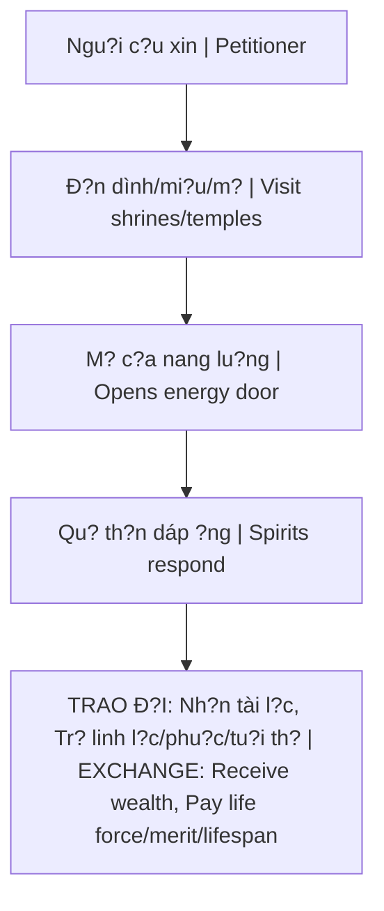

# Quy Lu?t Trao Ð?i Tâm Linh (Spiritual Exchange)

**Quy Lu?t Trao Ð?i Tâm Linh** là co ch? dánh d?i nang lu?ng khi con ngu?i tuong tác v?i các th? l?c siêu nhiên - d?c bi?t khi c?u xin t? bên ngoài thay vì phát tri?n t? bên trong.

*The Spiritual Exchange Law is the energy trade-off mechanism when humans interact with supernatural forces - especially when asking from outside rather than developing from within.*

---

## Nguyên Lý Co B?n / Fundamental Principles

### Universal Law of Exchange

| Nguyên t?c / Principle | Ý nghia / Meaning |
|------------------------|-------------------|
| **Không có gì mi?n phí / Nothing is free** | Nang lu?ng ph?i du?c trao d?i / Energy must be exchanged |
| **M?i giao d?ch có giá / Every transaction has a price** | "No free lunch" áp d?ng c? v? m?t tâm linh |
| **H?p d?ng ?n / Hidden contracts** | Không bi?t giá = nguy hi?m / Not knowing the price = dangerous |

---

## B?y C?u Xin Qu? Th?n / The Trap of Praying to Spirits

### Co Ch? Ho?t Ð?ng / How It Works

### Qu? Th?n Là Ai? / Who Are These Spirits?

Các th?c th? tu luy?n lâu nam, feed on human energy, có th? thao túng th?c t?i v?t ch?t (gi?i h?n). Không ph?i th?n, nhung là sinh v?t quy?n nang.

*Entities cultivated over long periods, feeding on human energy, capable of manipulating material reality (limited). Not gods, but powerful beings.*

### B?ng Trao Ð?i / Exchange Table

| B?n nh?n / You receive | B?n m?t / You lose |
|------------------------|---------------------|
| Ti?n tài ng?n h?n / Short-term wealth | Phu?c báu dài h?n / Long-term merit |
| May m?n t?c th?i / Instant luck | Tu?i th? / Lifespan |
| Tình duyên b? ngoài / Surface romance | Linh l?c g?c / Core spiritual power |
| Success nhanh / Quick success | H?u v?n / Future fortune |

### "C?a Thiên Tr? Ð?a" / "Heaven's Goods Return to Earth"

T?c ng? Vi?t Nam: cái gì d?n d?, di cung d?. V?n may vay mu?n ph?i tr? l?i - thu?ng v?i lãi su?t n?ng.

*Vietnamese proverb: what comes easy, goes easy. Borrowed luck must be repaid - often with heavy interest.*

---

## Ví D? Ði?n Hình / Typical Examples

### M? Cô Sáu, Các Mi?u Âm / Occult Shrines

N?i ti?ng "linh thiêng", ngu?i c?u du?c nhi?u. Nhung... h?i nh?ng ngu?i c?u 10 nam tru?c xem cu?c s?ng h? gi? nhu th? nào.

*Famous for being "sacred", many receive what they ask. But... ask those who prayed 10 years ago how their life is now.*

### Bùa Ng?i, Phép Thu?t / Charms & Spells

Cu?ng ép tình duyên, h?i k? thù - luôn quay tr? l?i. Karma du?c nhân lên.

*Forcing romance, harming enemies - always comes back. Karma multiplied.*

### Bán Linh H?n / Selling the Soul (Extreme)

Faustian bargain: d?i linh h?n l?y quy?n l?c/danh v?ng/giàu có. Pattern ph? bi?n trong ngành gi?i trí.

*Faustian bargain: trading soul for power/fame/wealth. Common pattern in entertainment industry.*

---

## T?i Sao Ðây Là B?y? / Why Is This a Trap?

### 1. Hidden Terms / Ði?u kho?n ?n

B?n không bi?t giá d?y d?. H?p d?ng du?c ký vô th?c. Fine print vô hình.

*You don't know the full price. Contract signed unconsciously. Fine print invisible.*

### 2. ?ng Tru?c Phu?c Báu / Borrowing Future Merit

Gi?ng nhu payday loan cho linh h?n - kéo karma tích c?c tuong lai v? hi?n t?i. Tuong lai: tr?ng r?ng.

*Like a payday loan for the soul - pulling future positive karma into present. Future: empty.*

### 3. Làm Y?u S? T? Ch? / Weakens Self-Reliance

Ph? thu?c vào th? l?c bên ngoài, quên di s?c m?nh n?i t?i. Con du?ng Ng? Ð?o b? ch?n, m?c k?t trong b?y Nh? Nguyên.

*Dependency on external forces, forgetting inner power. Path to Gnosis blocked, trapped in Duality.*

---

## Con Ðu?ng An Toàn / The Safe Path

### 1. Không C?u Xin Bên Ngoài / Don't Ask Externally

Ph?t, Th?n th?c s? không exchange ki?u này. B?c cao cho di t? do (không ràng bu?c). N?u có giá, dó không ph?i th?n thánh.

*Real Buddhas and Gods don't exchange this way. High beings give freely (no strings). If there's a price, it's not divine.*

### 2. Phát Tri?n Bên Trong / Develop From Within

Xây d?ng nang lu?ng riêng, công d?c qua hành d?ng, t? tu du?ng. Con du?ng Individuation.

*Build your own energy, merit through action, self-cultivation. The path of Individuation.*

### 3. Hi?u Nhân Qu? / Understand Karma

T?o karma t?t tr?c ti?p. Giúp d? ngu?i khác chân thành. S? th?nh vu?ng tuong lai di?n ra t? nhiên - không c?n du?ng t?t.

*Create good karma directly. Help others genuinely. Future prosperity organic - no shortcuts needed.*

### 4. Bi?t Rõ Contract / Know the Contract

N?u ph?i tuong tác v?i cõi tâm linh, hãy bi?t rõ b?n dang d?ng ý v?i di?u gì. Th?c hành b?o v?, s? phân bi?t là thi?t y?u.

*If you must engage the spiritual realm, know what you're agreeing to. Protection practices, discernment essential.*

---

## Related

- [[Nh? Nguyên]] - Trap of seeking outside
- [[Th?c Th? Cõi Trung Gi?i]]
- [[Tà Linh]] - Who benefits
- [[S? Th?t ?n Sau Con Ngu?i B?n]]
- [[Nhân Qu?]] - Real mechanism of fortune
- [[Gnosis]] - Power from within
- [[Individuation]]
