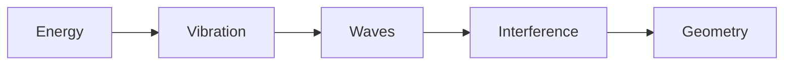
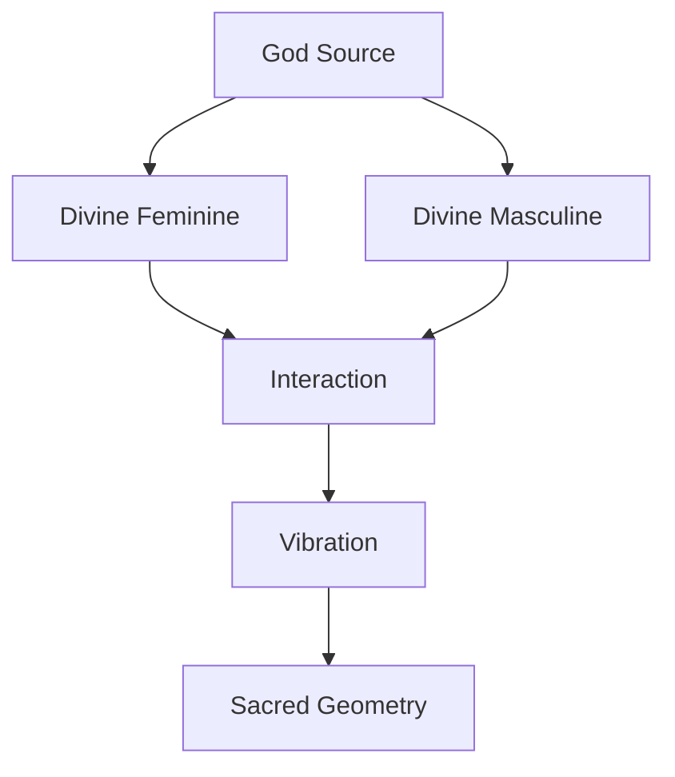
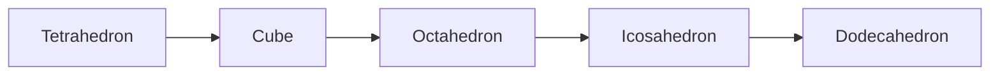
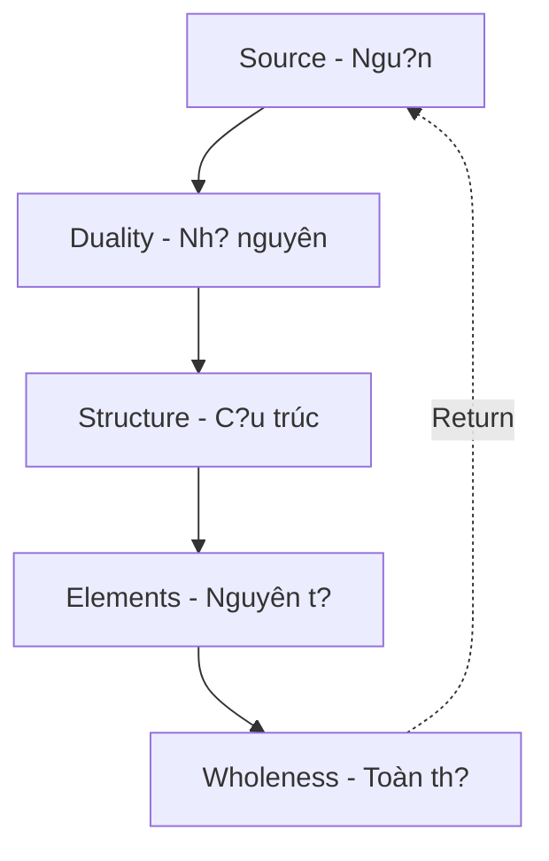
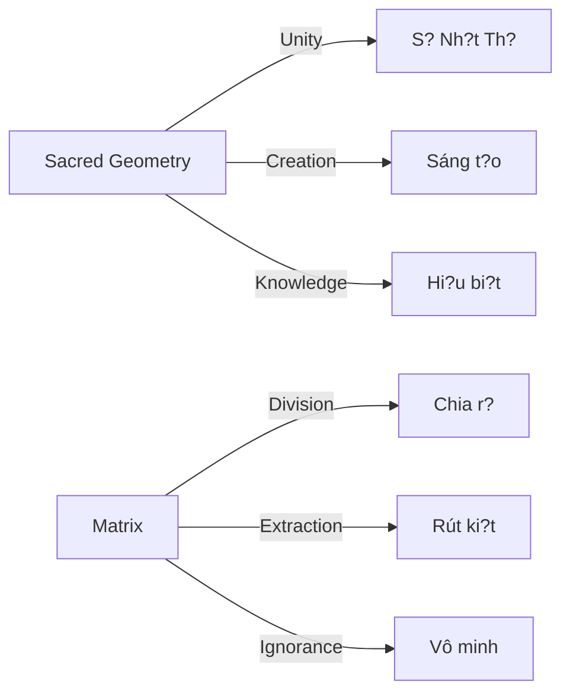

# Sacred Geometry (Hình H?c Thiêng)

**Ngu?n tham kh?o:** Sách "Lu?t Tâm Th?c" c?a Ngô Sa Th?ch

---

## Hình ?nh / Images

### Flower of Life - Bông Hoa S? S?ng

*M?u hình xu?t hi?n ? m?i n?n van minh c? d?i / Pattern found in all ancient civilizations*

> ?? **Video Cymatics:** [Cymatics: Science vs Music - Nigel Stanford (YouTube)](https://www.youtube.com/watch?v=Q3oItpVa9fs) - Xem âm thanh t?o hình h?c trên cát và nu?c

---

## Vu Tr? Ðu?c T?o T? Hình H?c

B?n nghi vu tr? du?c t?o ra t? v?t ch?t? **Sai r?i.**

*You think the universe is made of matter? Wrong.*

Vu tr? du?c t?o ra t? **hình h?c**.

*The universe is made of **geometry**.*

Tru?c khi có nguyên t?. Tru?c khi có ánh sáng. Tru?c c? th?i gian… **Ðã có c?u trúc.**

*Before atoms. Before light. Before time itself... There was structure.*

Và c?u trúc dó không ph?i ng?u nhiên. Nó **chính xác. Ð?i x?ng. L?p l?i.**

*And that structure is not random. It's precise. Symmetric. Repeating.*

---

## Sacred Geometry ? Ðâu? / Where Is It?

T? ADN c?a b?n d?n qu? d?o thiên hà, t?t c? d?u tuân theo cùng m?t m?u hình.

*From your DNA to galaxy orbits, everything follows the same pattern.*

| Noi xu?t hi?n | Ví d? |
|---------------|-------|
| **Sinh h?c** | C?u trúc xo?n kép DNA |
| **Co th? ngu?i** | T? l? vàng (Golden Ratio) |
| **Vu tr?** | Hình xo?n ?c thiên hà |
| **Khoáng v?t** | M?ng tinh th? |
| **V?t lý** | Sóng giao thoa |

Nh?ng hình này không du?c "v? ra" vì d?p. Chúng xu?t hi?n vì dó là **cách nang lu?ng ?n d?nh nh?t** d? t?n t?i trong không gian.

*These shapes weren't "drawn" for beauty. They appear because that's the most stable way for energy to exist in space.*

---

## T? Nang Lu?ng Ð?n Hình H?c / From Energy to Geometry

V?t lý hi?n d?i nói r?t rõ: Vu tr?, ? t?ng n?n t?ng nh?t, không ph?i là "v?t ch?t" - nó là **nang lu?ng**.

*Modern physics is clear: At its most fundamental level, the universe is not "matter" - it's energy.*

- Nguyên t? không d?c / Atoms aren't solid
- H?t co b?n không ph?i viên bi nh? / Subatomic particles aren't tiny balls
- Chúng là **dao d?ng c?a tru?ng nang lu?ng** / They're vibrations of energy fields

Khi có nang lu?ng ? có dao d?ng ? dao d?ng t?o sóng ? sóng g?p sóng ? **giao thoa** ? t?o ra m?u hình ?n d?nh = **Hình h?c**.

*Energy ? vibration ? waves ? wave meets wave ? interference ? stable patterns = Geometry.*

> **Thí nghi?m Cymatics:** Âm thanh rung trên b? m?t cát t?o thành hoa van hình h?c hoàn h?o. Không ai "v?" chúng - chúng t? xu?t hi?n khi dao d?ng d?t tr?ng thái cân b?ng.
>
> *Cymatics experiment: Sound vibrating on sand creates perfect geometric patterns. No one "draws" them - they appear when vibration reaches equilibrium.*

---

## God Source - Tru?ng Ý Th?c Tuy?t Ð?i

Tru?c m?i dao d?ng. Tru?c m?i sóng. Tru?c m?i hình h?c. Có m?t **Tru?ng Ý Th?c Tuy?t Ð?i**.

*Before all vibration. Before all waves. Before all geometry. There is an Absolute Consciousness Field.*

B?n có th? g?i nó là:
- **Ngu?n** / The Source
- **God Source**
- **The Absolute Field**

Không ph?i m?t v? th?n mang hình d?ng. Mà là **t?ng hòa m?i kh? nang t?n t?i**. M?i nang lu?ng. M?i ti?m nang.

*Not a deity with form. But the totality of all possibilities. All energy. All potential.*

### T?i Sao Phân Chia? / Why Division?

? tr?ng thái nguyên so, không có phân tách. Không có trên – du?i. Không có trong – ngoài. Ch? có **Toàn Th?**.

*In the primordial state, there's no separation. No up-down. No in-out. Only the Whole.*

Nhung m?t toàn th? tuy?t d?i **không th? "tr?i nghi?m" chính nó**.

*But an absolute whole cannot "experience" itself.*

Ð? có tr?i nghi?m ? ph?i có d?i chi?u ? ph?i có ch? th? và khách th?.

*To have experience ? requires contrast ? requires subject and object.*

Và vì v?y, God Source b?t d?u... **phân chia**.

*And so, God Source began to... divide.*

---

## Divine Feminine & Divine Masculine

T? God Source, Ngu?n phân chia thành hai nguyên lý:

*From God Source, the Source divides into two principles:*

| Nguyên lý | Ð?c di?m | Vai trò |
|-----------|----------|---------|
| **Divine Feminine** | Không gian ch?a d?ng | Ti?m nang, receptive |
| **Divine Masculine** | Xung l?c kh?i phát | Chuy?n d?ng, active |

> Ngu?i Pleiadian g?i 2 Beings này là **EH** và **AH**.
>
> *The Pleiadians call these 2 Beings EH and AH.*

Không ph?i nam – n? sinh h?c. Mà là **hai l?c n?n t?ng c?a t?n t?i**.

*Not biological male-female. But the two foundational forces of existence.*

Khi hai c?c này tuong tác ? dao d?ng b?t d?u ? và t? dao d?ng dó, **hình h?c ra d?i**.

*When these two poles interact ? vibration begins ? and from that vibration, geometry is born.*

---

## 5 Kh?i Platonic - Platonic Solids

Trong không gian 3D, ch? có dúng **5 kh?i da di?n d?u** t?n t?i. Không hon, không kém.

*In 3D space, there are exactly 5 regular polyhedra. No more, no less.*

| Kh?i | M?t | Ð?nh | C?nh | Nguyên t? | Ý nghia |
|------|-----|------|------|-----------|---------|
| **Tetrahedron** | 4 tam giác | 4 | 6 | ?? L?a | Tia kh?i sinh d?u tiên |
| **Hexahedron (Cube)** | 6 vuông | 8 | 12 | ?? Ð?t | ?n d?nh, n?n móng |
| **Octahedron** | 8 tam giác | 6 | 12 | ?? Khí | Chuy?n d?ng, cân b?ng |
| **Icosahedron** | 20 tam giác | 12 | 30 | ?? Nu?c | Linh ho?t, thích nghi |
| **Dodecahedron** | 12 ngu giác | 20 | 30 | ? Ether | Tru?ng bao trùm |

### T?i Sao Ch? Có 5? / Why Only 5?

Ð? m?t kh?i du?c g?i là "da di?n d?u":
- M?i m?t ph?i gi?ng h?t nhau
- M?i góc ph?i b?ng nhau
- M?i c?nh ph?i b?ng nhau

Khi b?n th? ghép nhi?u hon 5 c?u trúc nhu v?y... các góc s? vu?t quá 360 d?. Không gian không còn "dóng" l?i du?c.

*When you try to create more than 5 such structures... angles exceed 360 degrees. Space can no longer "close."*

**Chính c?u trúc c?a không gian 3D gi?i h?n s? lu?ng d?i x?ng hoàn h?o.**

*The very structure of 3D space limits the number of perfect symmetries.*

---

## Merkaba - Hai Tetrahedron L?ng Nhau

Khi **2 kh?i t? di?n l?ng vào nhau**, chúng ta có: **MERKABA**.

*When 2 tetrahedra interlock, we have: MERKABA.*

2 kh?i t? di?n giao nhau ? 1 di?m: Ðó là **nang lu?ng di?m không** (zero-point energy).

*2 tetrahedra intersect at one point: That is zero-point energy.*

> Các n?n van minh thiên hà s? d?ng nang lu?ng này d? ph?c v? cho các m?c dích khác nhau.
>
> *Galactic civilizations use this energy for various purposes.*

---

## Flower of Life - Bông Hoa S? S?ng

Khi c?u trúc d?t d?n s? hài hòa tr?n v?n:
- Các vòng tròn b?t d?u giao nhau
- Các tâm di?m l?p l?i theo t? l? hoàn h?o

M?t m?u hình xu?t hi?n: **Flower of Life**.

*When structure reaches complete harmony, a pattern emerges: Flower of Life.*

### T?i Sao Xu?t Hi?n Kh?p Noi? / Why Everywhere?

B?n b?t g?p hình ?nh bông hoa s? s?ng ? nhi?u n?n van minh, nhi?u n?n van hóa và tôn giáo mà h? **không h? giao thoa v?i nhau**:

*You find the Flower of Life in many civilizations, cultures, and religions that never interacted:*

- Ai C?p c? d?i
- Trung Hoa
- ?n Ð?
- Châu M? ti?n Columbus
- Celtic
- Nh?t B?n

**Ph?i chang, ngu?i xua dã th?u hi?u di?u gì dó v? tr?t t? thiêng liêng c?a vu tr??**

*Perhaps the ancients understood something about the sacred order of the universe?*

---

## Hành Trình C?a Ý Th?c / Journey of Consciousness

Hình h?c thiêng không ch? là hình v?. Nó là **hành trình c?a Ý Th?c** di t? M?t ? tr? v? M?t.

*Sacred geometry is not just drawings. It's the journey of Consciousness from One ? back to One.*

| Giai do?n | Mô t? |
|-----------|-------|
| **Ngu?n** | God Source, Toàn Th? |
| **Nh? nguyên** | Feminine/Masculine, Âm/Duong |
| **C?u trúc** | 5 Platonic Solids |
| **Nguyên t?** | L?a, Ð?t, Khí, Nu?c, Ether |
| **Toàn th?** | Flower of Life, tr? v? Ngu?n |

---

## B?n Là M?t Ph?n C?a Hình H?c

N?u b?n ch? nhìn Sacred Geometry nhu nh?ng hình v? d?p... b?n s? b? l? di?u quan tr?ng nh?t.

*If you only see Sacred Geometry as pretty drawings... you'll miss the most important thing.*

B?n không ph?i ngu?i quan sát.

**B?n là m?t giao di?m c?a nang lu?ng.**
**M?t d?nh trong c?u trúc l?n hon.**
**M?t ph?n c?a hình h?c mà vu tr? dang t? v?.**

*You're not an observer. You ARE an intersection of energy. A vertex in a larger structure. A part of the geometry the universe is drawing.*

> Và n?u God Source dang tr?i nghi?m chính mình... thì b?n không ph?i ngu?i quan sát. **B?n là tr?i nghi?m dó.**
>
> *And if God Source is experiencing itself... then you're not the observer. You ARE the experience.*

---

## Giao Ði?m C?a M?i Th? / The Intersection

Sacred Geometry không ph?i mê tín. Nó là giao di?m gi?a:

*Sacred Geometry is not superstition. It's the intersection of:*

- **Toán h?c** / Mathematics
- **V?t lý** / Physics
- **Sinh h?c** / Biology
- **Nh?n th?c** / Consciousness

Và n?u b?n di d? sâu... b?n s? b?t d?u t? h?i:

**Ph?i chang ý th?c cung v?n hành theo hình h?c?**

*And if you go deep enough... you'll start asking: Does consciousness also operate by geometry?*

---

## K?t N?i V?i Ma Tr?n / Connection to The Matrix

Sacred Geometry không ch? là ki?n th?c "d?p" - nó có liên h? sâu s?c v?i [[Ma Tr?n]] và h? th?ng ki?m soát.

*Sacred Geometry isn't just "beautiful" knowledge - it has deep connections to [[Ma Tr?n|The Matrix]] and control systems.*

### Nh? Nguyên - Công C? Ki?m Soát / Duality as Control

[[Nh? Nguyên]] (Divine Feminine/Masculine) là nguyên lý sáng t?o t? nhiên. Nhung [[Ma Tr?n]] **bóp méo** nó thành công c? chia r?:

*[[Nh? Nguyên|Duality]] (Divine Feminine/Masculine) is a natural creative principle. But [[Ma Tr?n|The Matrix]] distorts it into a tool of division:*

| Nguyên lý t? nhiên | Ma Tr?n bóp méo thành |
|-------------------|----------------------|
| Feminine/Masculine | Nam vs N?, chi?n tranh gi?i tính |
| Âm/Duong hài hòa | T?t vs X?u tuy?t d?i |
| Ð?i l?p b? sung | Ð?i l?p lo?i tr? |
| Unity through polarity | Division through conflict |

> **Bí m?t:** [[Elite]] hi?u Sacred Geometry. H? s? d?ng nó trong ki?n trúc, logo, nghi l?. Nhung h? **che gi?u** ki?n th?c này kh?i d?i chúng và **bóp méo** nh? nguyên thành công c? chia r?.
>
> *Secret: The [[Elite]] understand Sacred Geometry. They use it in architecture, logos, rituals. But they hide this knowledge from the masses and distort duality into a tool of division.*

### T?i Sao Sacred Geometry B? ?n? / Why Is It Hidden?

1. **N?u b?n hi?u** r?ng vu tr? có c?u trúc ? b?n nh?n ra có Ngu?n/Ý Th?c
2. **N?u b?n hi?u** nh? nguyên là b? sung ? b?n không b? chia r?
3. **N?u b?n hi?u** b?n là m?t ph?n c?a hình h?c ? b?n nh?n ra s?c m?nh c?a mình
4. **N?u b?n hi?u** Flower of Life ? b?n th?y s? k?t n?i gi?a m?i th?

? **Ma Tr?n m?t quy?n ki?m soát.**

*If you understand these things ? The Matrix loses control.*

### Sacred Geometry vs Ma Tr?n

### ?ng D?ng Th?c T? / Practical Application

Hi?u Sacred Geometry giúp b?n:

*Understanding Sacred Geometry helps you:*

- **Nh?n ra Nh? Nguyên gi?** - Khi media d?y b?n v? m?t c?c (t?t/x?u, ta/d?ch), hãy nh? r?ng dó là s? bóp méo
- **Th?y c?u trúc ?n** - Logo công ty, ki?n trúc quy?n l?c thu?ng s? d?ng Sacred Geometry
- **K?t n?i v?i Ngu?n** - Thi?n d?nh trên Flower of Life, Merkaba
- **Thoát kh?i chia r?** - Nh? nguyên không ph?i d? chi?n d?u, mà d? b? sung

---

## Related

### Vu tr? h?c / Cosmology
- [[Vu Tr? H?c Ph?t Giáo]] - Buddhist cosmology
- [[Núi Tu Di]] - Axis mundi
- [[Mô Hình Ð?a Tâm]] - Geocentric model

### Nang lu?ng / Energy
- [[Nang Lu?ng Aether]] - The field
- [[T?n S? Schumann]] - Earth's frequency
- [[Nikola Tesla]] - Frequency and vibration

### Tâm linh / Spirituality
- [[S? Nh?t Th?]] - Oneness
- [[Nh? Nguyên]] - Duality
- [[Monad]] - Philosophy of being
- [[Chakra]] - Energy centers

### Ý th?c / Consciousness
- [[Vô Th?c T?p Th?]] - Collective unconscious
- [[Gnosis]] - Direct knowing
- [[Ma Tr?n]] - The Matrix
- [[Nh? Nguyên]] - Duality
- [[Chia Tách B?i Nh? Nguyên]] - Division by duality

### Khoa h?c / Science
- [[Khoa H?c Xét L?i]] - Revisionist science
- [[Walter Russell]] - Cosmogony
