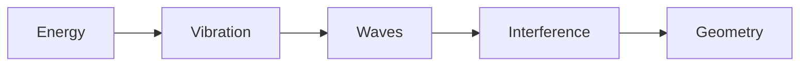
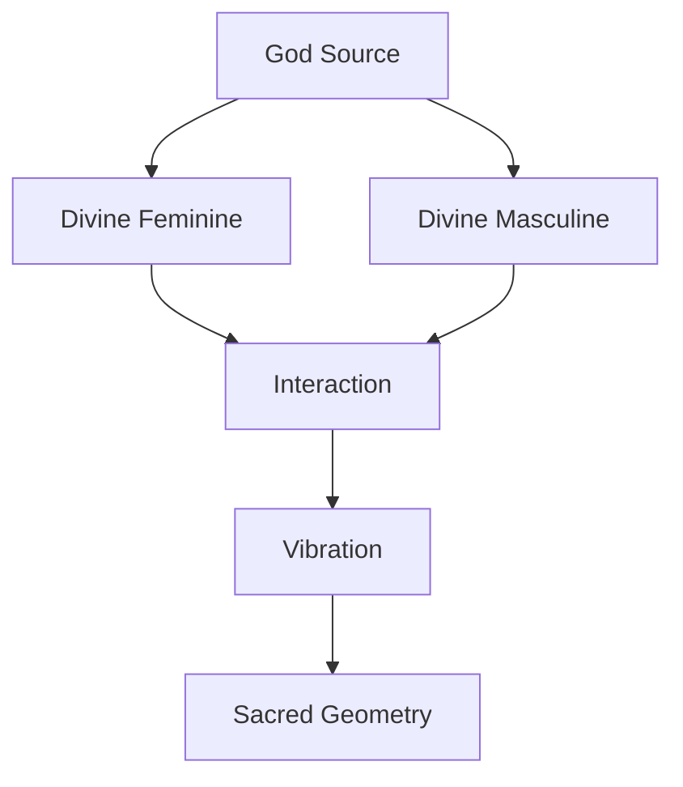
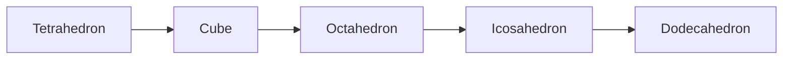
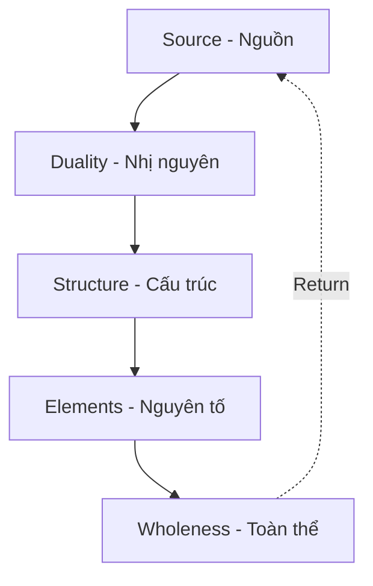
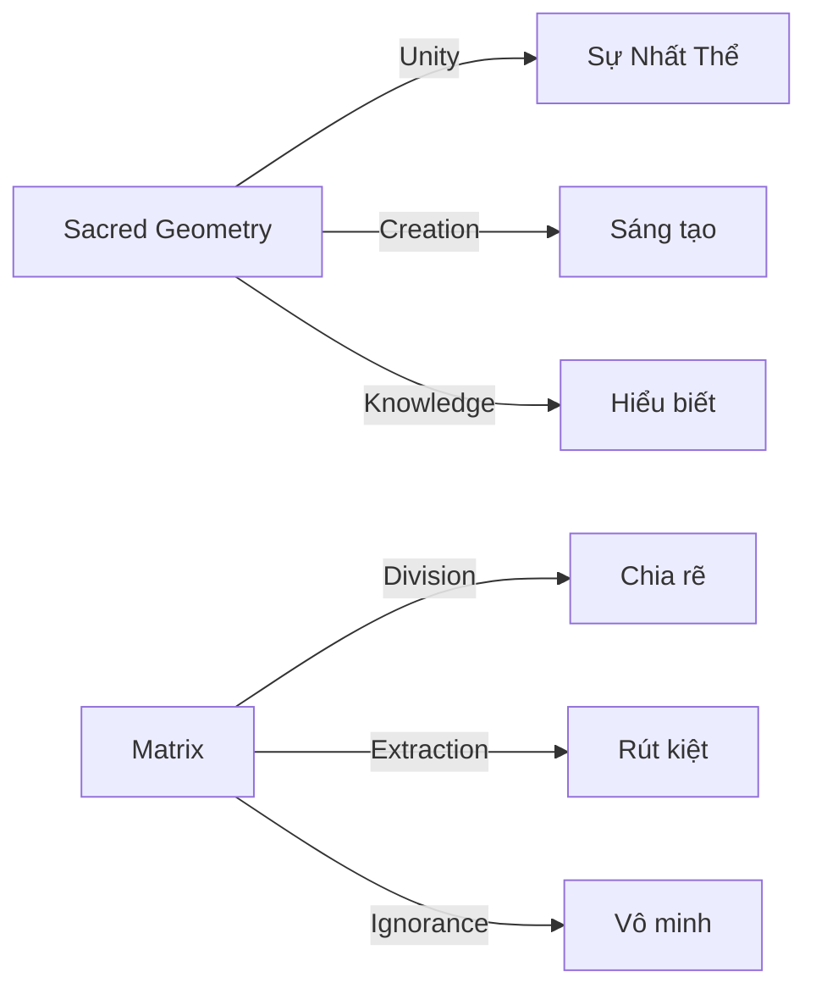

---
title: "Sacred Geometry"
aliases: ["Sacred Geometry", "Hình Học Thiêng", "Hình Học Thiêng Liêng", "Sacred Geometry (Hình Học Thiêng)"]
date: 2026-04-26
tags: [esoterica]
status: refined
---
# Sacred Geometry (Hình Học Thiêng)

**Nguồn tham khảo:** Sách "Luật Tâm Thức" của Ngô Sa Thạch

---

## Hình Ảnh / Images

### Flower of Life — Bông Hoa Sự Sống

*Mẫu hình xuất hiện ở mọi nền văn minh cổ đại / Pattern found in all ancient civilizations*

> 📺 **Video Cymatics:** [Cymatics: Science vs Music - Nigel Stanford (YouTube)](https://www.youtube.com/watch?v=Q3oItpVa9fs) — Xem âm thanh tạo hình học trên cát và nước

---

## Vũ Trụ Được Tạo Từ Hình Học

Bạn nghĩ vũ trụ được tạo ra từ vật chất? **Sai rồi.**

*You think the universe is made of matter? Wrong.*

Vũ trụ được tạo ra từ **hình học**.

*The universe is made of **geometry**.*

Trước khi có nguyên tử. Trước khi có ánh sáng. Trước cả thời gian… **Đã có cấu trúc.**

*Before atoms. Before light. Before time itself... There was structure.*

Và cấu trúc đó không phải ngẫu nhiên. Nó **chính xác. Đối xứng. Lặp lại.**

*And that structure is not random. It's precise. Symmetric. Repeating.*

---

## Sacred Geometry Ở Đâu? / Where Is It?

Từ ADN của bạn đến quỹ đạo thiên hà, tất cả đều tuân theo cùng một mẫu hình.

*From your DNA to galaxy orbits, everything follows the same pattern.*

| Nơi xuất hiện | Ví dụ |
|---------------|-------|
| **Sinh học** | Cấu trúc xoắn kép DNA |
| **Cơ thể người** | Tỷ lệ vàng (Golden Ratio) |
| **Vũ trụ** | Hình xoắn ốc thiên hà |
| **Khoáng vật** | Mạng tinh thể |
| **Vật lý** | Sóng giao thoa |

Những hình này không được "vẽ ra" vì đẹp. Chúng xuất hiện vì đó là **cách năng lượng ổn định nhất** để tồn tại trong không gian.

*These shapes weren't "drawn" for beauty. They appear because that's the most stable way for energy to exist in space.*

---

## Từ Năng Lượng Đến Hình Học / From Energy to Geometry

Vật lý hiện đại nói rất rõ: Vũ trụ, ở tầng nền tảng nhất, không phải là "vật chất" — nó là **năng lượng**.

*Modern physics is clear: At its most fundamental level, the universe is not "matter" — it's energy.*

- Nguyên tử không đặc / Atoms aren't solid
- Hạt cơ bản không phải viên bi nhỏ / Subatomic particles aren't tiny balls
- Chúng là **dao động của trường năng lượng** / They're vibrations of energy fields

Khi có năng lượng → có dao động → dao động tạo sóng → sóng gặp sóng → **giao thoa** → tạo ra mẫu hình ổn định = **Hình học**.

*Energy → vibration → waves → wave meets wave → interference → stable patterns = Geometry.*

> **Thí nghiệm Cymatics:** Âm thanh rung trên bề mặt cát tạo thành hoa văn hình học hoàn hảo. Không ai "vẽ" chúng — chúng tự xuất hiện khi dao động đạt trạng thái cân bằng.
>
> *Cymatics experiment: Sound vibrating on sand creates perfect geometric patterns. No one "draws" them — they appear when vibration reaches equilibrium.*

---

## God Source — Trường Ý Thức Tuyệt Đối

Trước mọi dao động. Trước mọi sóng. Trước mọi hình học. Có một **Trường Ý Thức Tuyệt Đối**.

*Before all vibration. Before all waves. Before all geometry. There is an Absolute Consciousness Field.*

Bạn có thể gọi nó là:
- **Nguồn** / The Source
- **God Source**
- **The Absolute Field**

Không phải một vị thần mang hình dạng. Mà là **tổng hòa mọi khả năng tồn tại**. Mọi năng lượng. Mọi tiềm năng.

*Not a deity with form. But the totality of all possibilities. All energy. All potential.*

### Tại Sao Phân Chia? / Why Division?

Ở trạng thái nguyên sơ, không có phân tách. Không có trên – dưới. Không có trong – ngoài. Chỉ có **Toàn Thể**.

*In the primordial state, there's no separation. No up-down. No in-out. Only the Whole.*

Nhưng một toàn thể tuyệt đối **không thể "trải nghiệm" chính nó**.

*But an absolute whole cannot "experience" itself.*

Để có trải nghiệm → phải có đối chiếu → phải có chủ thể và khách thể.

*To have experience → requires contrast → requires subject and object.*

Và vì vậy, God Source bắt đầu... **phân chia**.

*And so, God Source began to... divide.*

---

## Divine Feminine & Divine Masculine

Từ God Source, Nguồn phân chia thành hai nguyên lý:

*From God Source, the Source divides into two principles:*

| Nguyên lý | Đặc điểm | Vai trò |
|-----------|----------|---------|
| **Divine Feminine** | Không gian chứa đựng | Tiềm năng, receptive |
| **Divine Masculine** | Xung lực khởi phát | Chuyển động, active |

> Người Pleiadian gọi 2 Beings này là **EH** và **AH**.
>
> *The Pleiadians call these 2 Beings EH and AH.*

Không phải nam – nữ sinh học. Mà là **hai lực nền tảng của tồn tại**.

*Not biological male-female. But the two foundational forces of existence.*

Khi hai cực này tương tác → dao động bắt đầu → và từ dao động đó, **hình học ra đời**.

*When these two poles interact → vibration begins → and from that vibration, geometry is born.*

---

## 5 Khối Platonic — Platonic Solids

Trong không gian 3D, chỉ có đúng **5 khối đa diện đều** tồn tại. Không hơn, không kém.

*In 3D space, there are exactly 5 regular polyhedra. No more, no less.*

| Khối | Mặt | Đỉnh | Cạnh | Nguyên tố | Ý nghĩa |
|------|-----|------|------|-----------|---------|
| **Tetrahedron** | 4 tam giác | 4 | 6 | 🔥 Lửa | Tia khởi sinh đầu tiên |
| **Hexahedron (Cube)** | 6 vuông | 8 | 12 | 🌍 Đất | Ổn định, nền móng |
| **Octahedron** | 8 tam giác | 6 | 12 | 💨 Khí | Chuyển động, cân bằng |
| **Icosahedron** | 20 tam giác | 12 | 30 | 💧 Nước | Linh hoạt, thích nghi |
| **Dodecahedron** | 12 ngũ giác | 20 | 30 | ✨ Ether | Trường bao trùm |

### Tại Sao Chỉ Có 5? / Why Only 5?

Để một khối được gọi là "đa diện đều":
- Mọi mặt phải giống hệt nhau
- Mọi góc phải bằng nhau
- Mọi cạnh phải bằng nhau

Khi bạn thử ghép nhiều hơn 5 cấu trúc như vậy... các góc sẽ vượt quá 360 độ. Không gian không còn "đóng" lại được.

*When you try to create more than 5 such structures... angles exceed 360 degrees. Space can no longer "close."*

**Chính cấu trúc của không gian 3D giới hạn số lượng đối xứng hoàn hảo.**

*The very structure of 3D space limits the number of perfect symmetries.*

---

## Merkaba — Hai Tetrahedron Lồng Nhau

Khi **2 khối tứ diện lồng vào nhau**, chúng ta có: **MERKABA**.

*When 2 tetrahedra interlock, we have: MERKABA.*

2 khối tứ diện giao nhau ở 1 điểm: Đó là **năng lượng điểm không** (zero-point energy).

*2 tetrahedra intersect at one point: That is zero-point energy.*

> Các nền văn minh thiên hà sử dụng năng lượng này để phục vụ cho các mục đích khác nhau.
>
> *Galactic civilizations use this energy for various purposes.*

---

## Flower of Life — Bông Hoa Sự Sống

Khi cấu trúc đạt đến sự hài hòa trọn vẹn:
- Các vòng tròn bắt đầu giao nhau
- Các tâm điểm lặp lại theo tỷ lệ hoàn hảo

Một mẫu hình xuất hiện: **Flower of Life**.

*When structure reaches complete harmony, a pattern emerges: Flower of Life.*

### Tại Sao Xuất Hiện Khắp Nơi? / Why Everywhere?

Bạn bắt gặp hình ảnh bông hoa sự sống ở nhiều nền văn minh, nhiều nền văn hóa và tôn giáo mà họ **không hề giao thoa với nhau**:

*You find the Flower of Life in many civilizations, cultures, and religions that never interacted:*

- Ai Cập cổ đại
- Trung Hoa
- Ấn Độ
- Châu Mỹ tiền Columbus
- Celtic
- Nhật Bản

**Phải chăng, người xưa đã thấu hiểu điều gì đó về trật tự thiêng liêng của vũ trụ?**

*Perhaps the ancients understood something about the sacred order of the universe?*

---

## Hành Trình Của Ý Thức / Journey of Consciousness

Hình học thiêng không chỉ là hình vẽ. Nó là **hành trình của Ý Thức** đi từ Một → trở về Một.

*Sacred geometry is not just drawings. It's the journey of Consciousness from One → back to One.*

| Giai đoạn | Mô tả |
|-----------|-------|
| **Nguồn** | God Source, Toàn Thể |
| **Nhị nguyên** | Feminine/Masculine, Âm/Dương |
| **Cấu trúc** | 5 Platonic Solids |
| **Nguyên tố** | Lửa, Đất, Khí, Nước, Ether |
| **Toàn thể** | Flower of Life, trở về Nguồn |

---

## Bạn Là Một Phần Của Hình Học

Nếu bạn chỉ nhìn Sacred Geometry như những hình vẽ đẹp... bạn sẽ bỏ lỡ điều quan trọng nhất.

*If you only see Sacred Geometry as pretty drawings... you'll miss the most important thing.*

Bạn không phải người quan sát.

**Bạn là một giao điểm của năng lượng.**
**Một đỉnh trong cấu trúc lớn hơn.**
**Một phần của hình học mà vũ trụ đang tự vẽ.**

*You're not an observer. You ARE an intersection of energy. A vertex in a larger structure. A part of the geometry the universe is drawing.*

> Và nếu God Source đang trải nghiệm chính mình... thì bạn không phải người quan sát. **Bạn là trải nghiệm đó.**
>
> *And if God Source is experiencing itself... then you're not the observer. You ARE the experience.*

---

## Giao Điểm Của Mọi Thứ / The Intersection

Sacred Geometry không phải mê tín. Nó là giao điểm giữa:

*Sacred Geometry is not superstition. It's the intersection of:*

- **Toán học** / Mathematics
- **Vật lý** / Physics
- **Sinh học** / Biology
- **Nhận thức** / Consciousness

Và nếu bạn đi đủ sâu... bạn sẽ bắt đầu tự hỏi:

**Phải chăng ý thức cũng vận hành theo hình học?**

*And if you go deep enough... you'll start asking: Does consciousness also operate by geometry?*

---

## Kết Nối Với Ma Trận / Connection to The Matrix

Sacred Geometry không chỉ là kiến thức "đẹp" — nó có liên hệ sâu sắc với [[Ma Trận]] và hệ thống kiểm soát.

*Sacred Geometry isn't just "beautiful" knowledge — it has deep connections to [[Ma Trận|The Matrix]] and control systems.*

### Nhị Nguyên — Công Cụ Kiểm Soát / Duality as Control

[[Nhị Nguyên]] (Divine Feminine/Masculine) là nguyên lý sáng tạo tự nhiên. Nhưng [[Ma Trận]] **bóp méo** nó thành công cụ chia rẽ:

*[[Nhị Nguyên|Duality]] (Divine Feminine/Masculine) is a natural creative principle. But [[Ma Trận|The Matrix]] distorts it into a tool of division:*

| Nguyên lý tự nhiên | Ma Trận bóp méo thành |
|-------------------|----------------------|
| Feminine/Masculine | Nam vs Nữ, chiến tranh giới tính |
| Âm/Dương hài hòa | Tốt vs Xấu tuyệt đối |
| Đối lập bổ sung | Đối lập loại trừ |
| Unity through polarity | Division through conflict |

> **Bí mật:** [[Elite]] hiểu Sacred Geometry. Họ sử dụng nó trong kiến trúc, logo, nghi lễ. Nhưng họ **che giấu** kiến thức này khỏi đại chúng và **bóp méo** nhị nguyên thành công cụ chia rẽ.
>
> *Secret: The [[Elite]] understand Sacred Geometry. They use it in architecture, logos, rituals. But they hide this knowledge from the masses and distort duality into a tool of division.*

### Tại Sao Sacred Geometry Bị Ẩn? / Why Is It Hidden?

1. **Nếu bạn hiểu** rằng vũ trụ có cấu trúc → bạn nhận ra có Nguồn/Ý Thức
2. **Nếu bạn hiểu** nhị nguyên là bổ sung → bạn không bị chia rẽ
3. **Nếu bạn hiểu** bạn là một phần của hình học → bạn nhận ra sức mạnh của mình
4. **Nếu bạn hiểu** Flower of Life → bạn thấy sự kết nối giữa mọi thứ

→ **Ma Trận mất quyền kiểm soát.**

*If you understand these things → The Matrix loses control.*

### Sacred Geometry vs Ma Trận

### Ứng Dụng Thực Tế / Practical Application

Hiểu Sacred Geometry giúp bạn:

*Understanding Sacred Geometry helps you:*

- **Nhận ra Nhị Nguyên giả** — Khi media đẩy bạn về một cực (tốt/xấu, ta/địch), hãy nhớ rằng đó là sự bóp méo
- **Thấy cấu trúc ẩn** — Logo công ty, kiến trúc quyền lực thường sử dụng Sacred Geometry
- **Kết nối với Nguồn** — Thiền định trên Flower of Life, Merkaba
- **Thoát khỏi chia rẽ** — Nhị nguyên không phải để chiến đấu, mà để bổ sung

---

## Related

### Vũ trụ học / Cosmology
- [[Vũ Trụ Học Phật Giáo]] — Buddhist cosmology
- [[Núi Tu Di (Mount Meru)]] — Axis mundi
- [[Mô Hình Địa Tâm]] — Geocentric model

### Năng lượng / Energy
- [[Năng Lượng Aether]] — The field
- [[Tần Số Schumann]] — Earth's frequency
- [[Nikola Tesla (Tần Số và Rung Động)]] — Frequency and vibration

### Tâm linh / Spirituality
- [[Sự Nhất Thể]] — Oneness
- [[Nhị Nguyên]] — Duality
- [[Monad]] — Philosophy of being
- [[Chakra]] — Energy centers

### Ý thức / Consciousness
- [[Vô Thức Tập Thể]] — Collective unconscious
- [[Gnosis (Ngộ Đạo)]] — Direct knowing
- [[Ma Trận]] — The Matrix
- [[Nhị Nguyên]] — Duality
- [[Chia Tách Bởi Nhị Nguyên]] — Division by duality

### Khoa học / Science
- [[Khoa Học Xét Lại (Revisionist Science)]] — Revisionist science
- [[Walter Russell]] — Cosmogony
