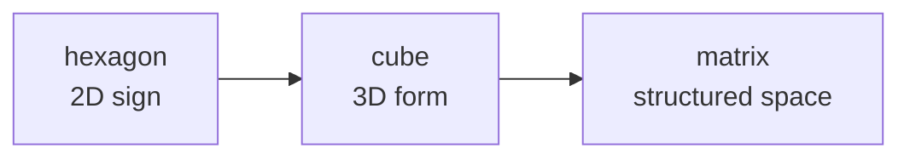

# Saturn Cube (Khối Lập Phương Sao Thổ)

**Saturn Cube là lens biểu tượng để đọc giới hạn, thời gian, vật chất, luật, grid và cấu trúc giam giữ của cõi 3D.** Nó không phải một bằng chứng độc lập rằng "Sao Thổ điều khiển thế giới"; nó là một mật mã hình ảnh giúp thấy cách power dùng hình khối, màu đen, vòng, thời gian và ritual để biểu thị control.

*The Saturn Cube is a symbolic lens for limit, time, matter, law, grid, and 3D enclosure.*

---

## Evidence Discipline / Cách Đọc

| Tầng | Cách đọc |
|---|---|
| Fact | Saturn/Kronos là thần thời gian/giới hạn trong thần thoại; Saturn có hexagon cực bắc được quan sát bởi NASA |
| Symbol | cube, black stone, ring, hexagon, time, law là motif control/structure |
| Pattern | cùng motif xuất hiện trong religion, architecture, corporate art, graduation, tech design |
| Speculative synthesis | Saturn broadcast, Moon amplifier, prison planet là vault hypothesis, không phải fact khoa học |

---

## Saturn Là Thời Gian Và Giới Hạn

Trong myth, Saturn/Kronos là thời gian nuốt con. Đây là hình ảnh rất chính xác: mọi hình thể sinh trong thời gian đều bị thời gian ăn lại.

| Saturn motif | Nghĩa biểu tượng |
|---|---|
| rings | giới hạn, orbit, boundary |
| old god | thời gian, luật cổ, karma |
| devouring children | mọi sinh thể bị time consume |
| agriculture | gieo-gặt, cycle, harvest |
| cube | vật chất hóa, đóng khung, enclosure |

Saturn không chỉ "xấu". Không có Saturn thì không có form, discipline, structure. Bẫy là khi structure biến thành prison.

---

## Hexagon Và Cube

Saturn có hexagon ở cực bắc: đây là quan sát thiên văn thật. Trong symbolic geometry, hexagon 2D có thể được đọc như projection của cube 3D.

Kỷ luật: hexagon trên Saturn không tự chứng minh occult control. Nhưng nó là synchronicity mạnh đối với các hệ biểu tượng dùng hexagon/cube để nói về matter và containment.

---

## Black Cube Motif

| Motif | Cách đọc thận trọng |
|---|---|
| Kaaba | trung tâm pilgrimage, black cube sacred form |
| tefillin | hộp đen ritual trên thân thể |
| graduation cap | cube trên đầu như biểu tượng institutional initiation |
| corporate black cube sculptures | modern power aesthetic |
| server/data center boxes | Saturnian order trong tech |

Không gom mọi black cube thành một âm mưu. Đọc pattern như ngôn ngữ: power thích hình khối vì hình khối nói về order.

---

## Saturn Và AI

[[AI]] là Saturnian technology ở tầng symbol: rule, structure, prediction, optimization, time compression, grid hóa hành vi. Nó biến chaos của con người thành data field có thể đo và điều khiển.

Đây là Saturn Cube hiện đại: không phải cục đá đen, mà là model vô hình bao quanh đời sống.

---

## Escape Không Phải Bay Khỏi Vật Chất

Thoát Saturn không phải ghét discipline hay ghét form. Người không có Saturn sẽ tan. Người bị Saturn nuốt sẽ cứng lại.

| Bị Saturn nuốt | Saturn được tích hợp |
|---|---|
| sợ luật, sống trong prison | dùng luật để build freedom |
| mắc kẹt trong time anxiety | biết cycle và nhịp |
| worship structure | structure phục vụ soul |
| bị grid hóa | dùng grid nhưng không đồng nhất với grid |

[[Gnosis]] không phá form bằng chaos; nó nhớ rằng form không phải Source.

---

## Core Insight / Chốt Lại

**Saturn Cube là biểu tượng của form. Form cần thiết để sống, nhưng khi con người quên mình lớn hơn form, cube thành nhà tù.**

*The cube is form. Form is necessary; forgetting what exceeds form turns structure into prison.*
