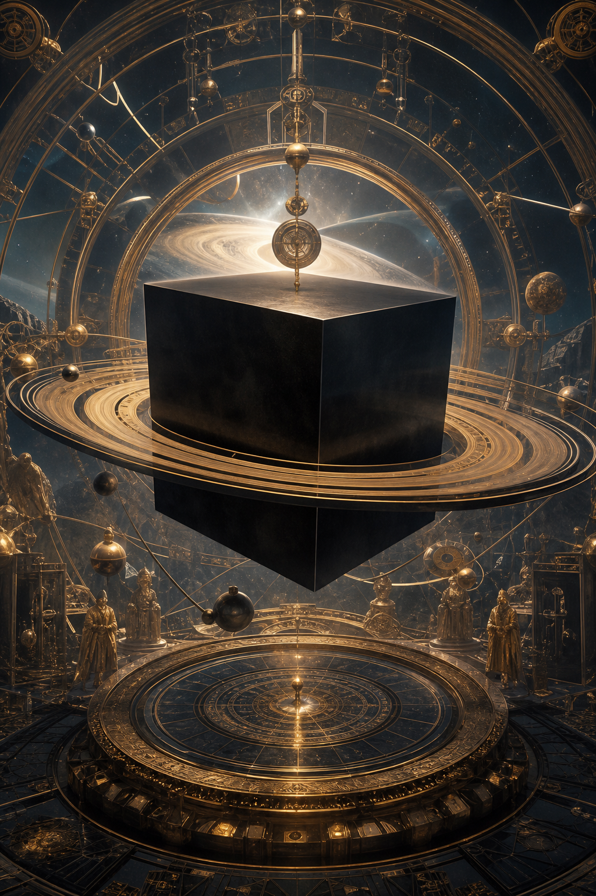
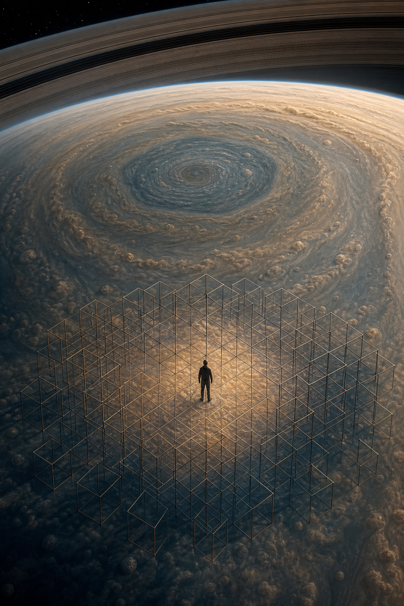

# Saturn Cube (Khối Lập Phương Sao Thổ)

**Saturn Cube là lens biểu tượng để đọc giới hạn, thời gian, vật chất, luật, grid và cấu trúc giam giữ của cõi 3D. Nó không phải bằng chứng độc lập rằng “Sao Thổ điều khiển thế giới”; nó là một mặt mã hình ảnh giúp thấy cách power dùng hình khối, màu đen, vòng, thời gian và ritual để biểu thị order.**

*The Saturn Cube is a symbolic lens for limit, time, matter, law, grid, and 3D enclosure. It is not standalone proof that Saturn controls the world; it is an alphabet of form, boundary, and containment.*

Saturn Cube hữu ích khi nó giúp đọc grammar của quyền lực. Nó nguy hiểm khi biến mọi hình vuông thành âm mưu.

---

## Evidence Discipline / Cách Đọc

Ở tầng fact, Saturn/Kronos là motif thời gian trong thần thoại và Sao Thổ có hexagon cực bắc được quan sát. Ở tầng symbol, cube, ring, black stone, harvest, law là ngôn ngữ của form và containment. Ở tầng pattern, institution thích hình khối vì hình khối nói về đo lường, trật tự, kiểm soát. Ở tầng speculative synthesis, Saturn broadcast, prison planet, Moon amplifier là hypothesis của vault, không phải fact.

Đọc Saturn Cube như đọc alphabet của quyền lực. Một chữ cái không phải âm mưu. Nhưng khi nhiều chữ cái lặp lại trong cùng ngữ cảnh, nó tạo thành ngôn ngữ.

---

## Vault Position / Vị Trí Trong Vault

Node này nằm giữa [[MOC - Esoterica & Consciousness]], [[Ma Trận]], [[Ma Trận - Giải Phẫu Hoàn Chỉnh]], [[Gematria]] và [[AI]]. Nó không thay thế các bài consciousness như [[Gnosis]], [[Monad]] hay [[Sự Nhất Thể]]. Nó mô tả phần form: cấu trúc khiến consciousness bị đóng vào thời gian, luật, số, role và identity.

Nếu Ma Trận là operating system của perception, Saturn Cube là icon của kernel: rule, boundary, clock, enclosure.

---

## Saturn Không Chỉ Là “Xấu”

Saturn/Kronos trong myth gắn với thời gian, giới hạn, mùa vụ, gieo gặt, luật cũ và hình phạt. Đây không phải năng lượng hoàn toàn tiêu cực. Không có Saturn thì không có discipline, cấu trúc, thân thể, cam kết, hình dạng để linh hồn trải nghiệm.

Bẫy bắt đầu khi form quên Source. Khi luật không phục vụ sống mà bắt sống phục vụ luật, Saturn chuyển từ thầy nghiêm thành nhà tù.

Saturn tích hợp là discipline. Saturn méo mó là imprisonment.

---

## Hexagon Và Cube

Hexagon ở cực bắc Sao Thổ là một quan sát thiên văn thú vị. Trong symbolic geometry, hexagon 2D có thể được đọc như projection của cube 3D. Từ đó sinh ra chuỗi đọc: Saturn hexagon → cube → matter/law/boundary → matrix enclosure.

Kỷ luật cần giữ: hexagon không tự chứng minh occult control. Nó chỉ làm motif Saturn-cube giàu biểu tượng hơn vì thiên văn, geometry và myth cùng chạm vào một hình ảnh: cấu trúc.

Cube là hình của đo lường: sáu mặt, góc vuông, ranh giới rõ, không mềm, không chảy. Nó hợp với kiến trúc quyền lực, database, bureaucracy và mọi hệ muốn biến life thành ô lưới.

---

## Black Cube Motif

Black cube xuất hiện trong nhiều không gian sacred, institutional và corporate. Không nên gom mọi khối đen thành một âm mưu thống nhất. Cách đọc tốt hơn: black cube là biểu tượng cô đặc của matter, center, gravity, authority và initiation.

Một tòa nhà quyền lực dùng khối vuông đen không nhất thiết “thờ Saturn”. Nhưng nó đang nói bằng cùng ngôn ngữ: ổn định, lạnh, nặng, không thấm cảm xúc, đo được, đóng được, quản trị được.

Màu đen hấp thụ ánh sáng. Cube đóng ánh sáng vào hình. Đọc symbolic thì đây là image của consciousness bị đưa vào density.

---

## Khi Nào Lens Này Hữu Dụng?

Lens Saturn Cube hữu dụng nhất khi một biểu tượng xuất hiện cùng nhiều lớp: kiến trúc/hình khối, ngôn ngữ luật lệ/thời gian, ritual attention, countdown, vòng tròn, gate, initiation language, institutional power.

Từng mảnh riêng lẻ có thể bình thường. Nhưng khi chúng đồng bộ, vault đọc nó như một sentence chứ không đọc từng chữ cái.

Lens này nguy hiểm khi dùng để shortcut tư duy. Nếu mọi cube đều là Saturn, mọi logo đều occult, mọi sự kiện đều ritual, thì không còn discernment. Cách đọc đúng là giữ nhiều tầng cùng lúc: design choice, psychology of form, mythic resonance, và chỉ sau cùng mới là speculative synthesis.

---

## Saturnian AI

[[AI]] là Saturnian technology ở tầng symbol. Nó biến hành vi thành dữ liệu, tương lai thành xác suất, chaos của con người thành pattern có thể tối ưu. Nó không cần một cục đá đen ngoài quảng trường; nó là cube vô hình bao quanh đời sống.

Điểm này không có nghĩa AI xấu. Saturn tích hợp thì hữu ích: structure giúp build. Saturn mất linh hồn thì thành grid: con người bị reduce thành profile, score, risk, prediction.

AI như Saturn hỏi: cái gì trong bạn có thể đo được? [[Gnosis]] hỏi: cái gì trong bạn đang biết cả phép đo?

---

## Escape Là Tích Hợp, Không Phá Form

Thoát Saturn không phải ghét luật, ghét deadline, ghét thân thể hoặc ghét vật chất. Người không có Saturn tan vào chaos. Người bị Saturn nuốt hóa đá.

Tích hợp Saturn nghĩa là dùng form để bảo vệ soul, dùng discipline để mở freedom, dùng thời gian để luyện depth, dùng structure như công cụ chứ không worship structure như thần.

Đây là bài học khó: không có hình dạng thì không có incarnation; nhưng đồng nhất với hình dạng thì quên Source.

---

## Kết

Saturn Cube là biểu tượng của form. Form cần thiết để sống, nhưng khi con người quên mình lớn hơn form, cube thành nhà tù.

Ma Trận không chỉ giam bằng dây xích. Nó giam bằng lịch, luật, ID, ô lưới, score, deadline, architecture, interface và data structure. Saturn Cube là icon của phần đời sống bị đóng vào hình.

> Tự do không phải phá mọi cấu trúc. Tự do là nhớ mình không sinh ra từ cấu trúc, rồi dùng cấu trúc mà không worship nó.

---

## Reading Path / Đọc Tiếp

- [[Ma Trận]] — OS của perception và enclosure
- [[Ma Trận - Giải Phẫu Hoàn Chỉnh]] — các lớp form kiểm soát đời sống
- [[Gnosis]] — cái biết vượt khỏi cube
- [[AI]] — Saturnian technology của đo lường và prediction
- [[Gematria]] — số và pattern như grammar symbol
