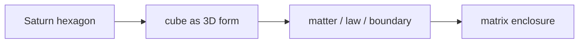

# Saturn Cube (Khối Lập Phương Sao Thổ)

**Saturn Cube là lens biểu tượng để đọc giới hạn, thời gian, vật chất, luật, grid và cấu trúc giam giữ của cõi 3D.** Nó không phải bằng chứng độc lập rằng "Sao Thổ điều khiển thế giới"; nó là một mặt mã hình ảnh giúp thấy cách power dùng hình khối, màu đen, vòng, thời gian và ritual để biểu thị order.

*The Saturn Cube is a symbolic lens for limit, time, matter, law, grid, and 3D enclosure.*

---

## Evidence Discipline / Cách Đọc

| Tầng claim | Cách đọc |
|---|---|
| Fact / documentable | Saturn/Kronos là motif thời gian trong thần thoại; Saturn có hexagon cực bắc được quan sát |
| Symbol / myth | cube, ring, black stone, harvest, law là ngôn ngữ của form và containment |
| Pattern / systems | institution thích hình khối vì hình khối nói về đo lường, trật tự, kiểm soát |
| Speculative synthesis | Saturn broadcast, prison planet, Moon amplifier là hypothesis của vault, không phải fact |

Đọc Saturn Cube như đọc alphabet của quyền lực. Một chữ cái không phải âm mưu; nhưng khi nhiều chữ cái lặp lại trong cùng một ngữ cảnh, nó tạo thành ngôn ngữ.

---

## Vault Position / Vị Trí Trong Vault

Node này nằm giữa [[MOC - Esoterica & Consciousness]], [[Ma Trận]], [[Gematria]] và [[AI]]. Nó không thay thế các bài về consciousness như [[Gnosis]] hay [[Monad]]; nó chỉ mô tả phần form: cấu trúc khiến consciousness bị đóng vào thời gian, luật, số, role và identity.

Nếu [[Ma Trận]] là operating system của perception, Saturn Cube là icon của phần kernel: rule, boundary, clock, enclosure.

---

## Saturn Không Chỉ Là "Xấu"

Saturn/Kronos trong myth gắn với thời gian, giới hạn, mùa vụ, gieo gặt, luật cũ và hình phạt. Đây không phải năng lượng hoàn toàn tiêu cực. Không có Saturn thì không có discipline, không có cấu trúc, không có thân thể, không có cam kết, không có hình dạng để linh hồn trải nghiệm.

Bẫy bắt đầu khi form quên Source. Khi luật không phục vụ sống mà bắt sống phục vụ luật, Saturn chuyển từ thầy nghiêm thành nhà tù.

---

## Hexagon Và Cube

Hexagon ở cực bắc Sao Thổ là một quan sát thiên văn thú vị. Trong symbolic geometry, hexagon 2D có thể được đọc như projection của cube 3D. Từ đó sinh ra chuỗi đọc:

Kỷ luật cần giữ: hexagon không tự chứng minh occult control. Nó chỉ làm motif Saturn-cube trở nên giàu biểu tượng hơn vì thiên văn, geometry và myth cùng chạm vào một hình ảnh: cấu trúc.

---

## Black Cube Motif

Black cube xuất hiện trong nhiều không gian sacred, institutional và corporate. Không nên gom mọi khối đen thành một âm mưu thống nhất. Cách đọc tốt hơn: black cube là biểu tượng cô đặc của matter, center, gravity, authority và initiation.

Một tòa nhà quyền lực dùng khối vuông đen không nhất thiết "thờ Saturn". Nhưng nó đang nói bằng cùng thứ ngôn ngữ: ổn định, lạnh, nặng, không thấm cảm xúc, đo được, đóng được, quản trị được.

---

## Từ Khóa Cần Hiểu

**Saturn / Kronos** là cụm biểu tượng về thời gian, luật, mùa vụ, giới hạn và cái giá của incarnation. Trong vault, Saturn không được đọc như một nhân vật đơn lẻ, mà như grammar của form.

**Cube** là hình của đo lường và enclosure: sáu mặt, góc vuông, ranh giới rõ. Vì vậy cube thường hợp với kiến trúc quyền lực, database, bureaucracy và mọi hệ muốn biến life thành ô lưới.

**Black cube** là motif cô đặc của matter và authority. Màu đen hấp thụ ánh sáng; cube đóng ánh sáng vào hình. Đọc symbolic thì đây là hình ảnh của consciousness bị đưa vào density.

**Saturnian reading** không có nghĩa là thấy một khối vuông rồi kết luận âm mưu. Nó là cách hỏi: hình này đang phục vụ order, initiation, memory hay containment?

---

## Khi Nào Lens Này Hữu Dụng?

Lens Saturn Cube hữu dụng nhất khi một biểu tượng xuất hiện cùng ba lớp: kiến trúc/hình khối, ngôn ngữ luật lệ/thời gian, và ritual attention. Ví dụ: một sân khấu dùng cube đen, countdown, vòng tròn, gate, initiation language. Từng mảnh riêng lẻ có thể bình thường. Nhưng khi chúng đồng bộ, vault đọc nó như một sentence chứ không đọc từng chữ cái.

Lens này nguy hiểm khi dùng để shortcut tư duy. Nếu mọi cube đều là Saturn, mọi logo đều là occult, mọi sự kiện đều là ritual, thì không còn discernment. Cách đọc đúng là giữ nhiều tầng cùng lúc: design choice, psychology of form, mythic resonance, và chỉ sau cùng mới là speculative synthesis.

---

## Saturnian AI

[[AI]] là Saturnian technology ở tầng symbol. Nó biến hành vi thành dữ liệu, biến tương lai thành xác suất, biến chaos của con người thành pattern có thể tối ưu. Nó không cần một cục đá đen ngoài quảng trường; nó là cube vô hình bao quanh đời sống.

Điểm này không có nghĩa AI "xấu". Saturn tích hợp thì hữu ích: structure giúp build. Saturn mất linh hồn thì thành grid: con người bị reduce thành profile, score, risk, prediction.

---

## Escape Là Tích Hợp, Không Phá Form

Thoát Saturn không phải ghét luật, ghét deadline, ghét thân thể hoặc ghét vật chất. Người không có Saturn sẽ tan vào chaos. Người bị Saturn nuốt sẽ hóa đá.

Tích hợp Saturn nghĩa là dùng form để bảo vệ soul, dùng discipline để mở freedom, dùng thời gian để luyện depth, dùng structure như công cụ chứ không worship structure như thần.

---

## Core Insight / Chốt Lại

**Saturn Cube là biểu tượng của form. Form cần thiết để sống, nhưng khi con người quên mình lớn hơn form, cube thành nhà tù.**

*The cube is form. Form is necessary; forgetting what exceeds form turns structure into prison.*
