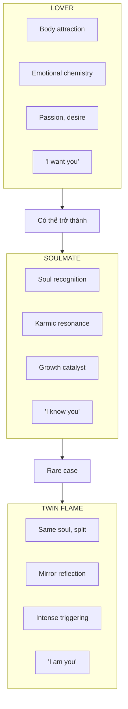
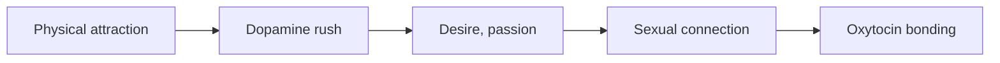
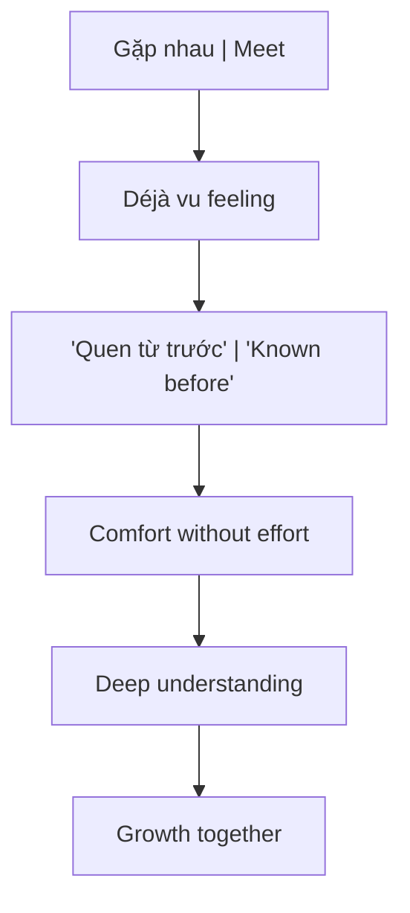
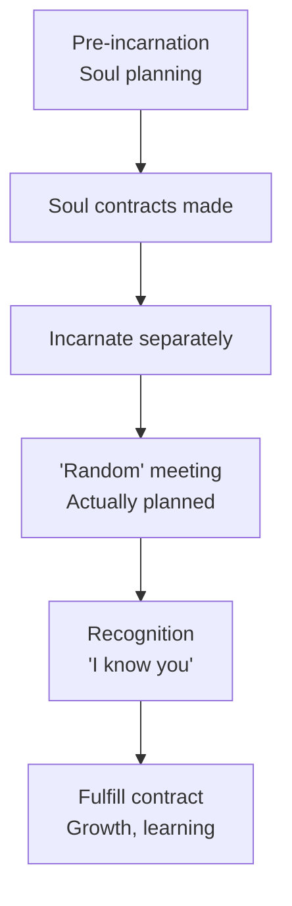
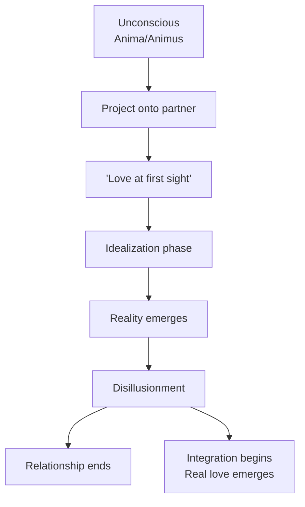
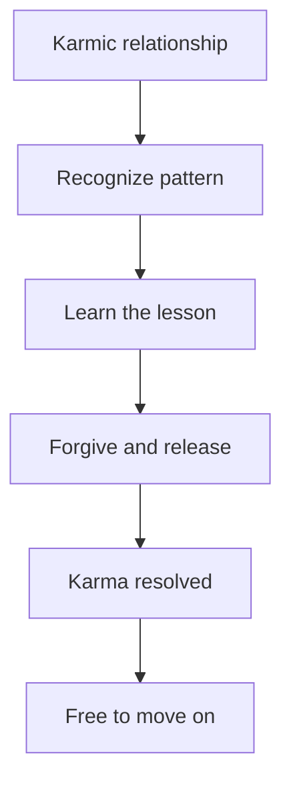
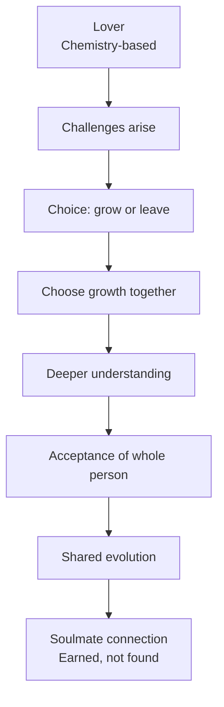
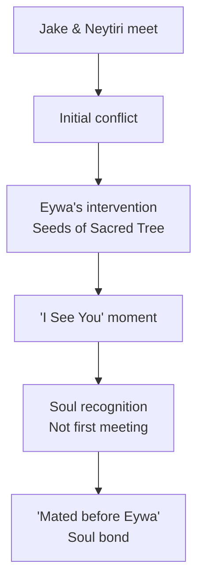
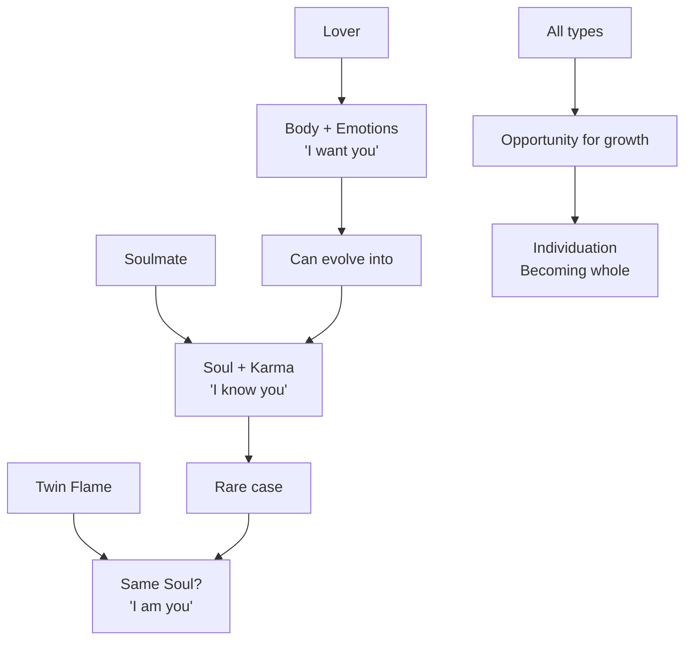

# Soulmate vs Lover — Anatomy Của Kết Nối / Anatomy of Connection

> *"Lover là người bạn muốn. Soulmate là người bạn nhận ra."*
> *"A lover is someone you want. A soulmate is someone you recognize."*

Trong văn hóa hiện đại, **lover** và **soulmate** thường bị nhầm lẫn. Intense chemistry được gọi là "soulmate connection", trong khi true soul recognition bị bỏ qua vì thiếu drama. Bài này phân tích sự khác biệt qua lens tâm lý học và esoteric.

*In modern culture, lover and soulmate are often confused. Intense chemistry is called "soulmate connection", while true soul recognition is overlooked for lacking drama.*

---

## Tổng Quan / Overview

---

## I. Lover — Kết Nối Qua Body & Emotions

### Đặc Điểm / Characteristics

| Aspect | Description |
|--------|-------------|
| **Basis** | Physical attraction, emotional chemistry |
| **Feeling** | "I want you", "I need you" |
| **Duration** | Có thể ngắn hoặc dài |
| **Purpose** | Pleasure, companionship, reproduction |
| **Conflict** | Có thể phá vỡ relationship |
| **Quantity** | Nhiều trong một đời |

### Body Level

**Lover connection thường bắt đầu từ:**
- Visual attraction
- Pheromones, biology
- Sexual energy
- "Chemistry" — hormone cocktail

### Emotional Level

| Hormone | Effect | Cảm giác |
|---------|--------|----------|
| **Dopamine** | Reward, pleasure | Thèm muốn, nghiện |
| **Norepinephrine** | Excitement | Tim đập nhanh, hồi hộp |
| **Serotonin** | (Lowered) | Obsessive thinking |
| **Oxytocin** | Bonding | Gắn kết, tin tưởng |
| **Vasopressin** | Attachment | Bảo vệ, possessiveness |

> *"Falling in love" là cocktail hóa học. Không phải ngẫu nhiên nó giống... nghiện.*
>
> *"Falling in love" is a chemical cocktail. It's no coincidence it resembles... addiction.*

### Shadow Side of Lover

Khi chỉ dừng ở lover level:
- **Codependency** — "I can't live without you"
- **Possessiveness** — "You are mine"
- **Jealousy** — Fear of loss
- **Projection** — Falling in love with fantasy, not person
- **Trauma bonding** — Intensity mistaken for depth

---

## II. Soulmate — Kết Nối Qua Soul & Karma

### Đặc Điểm / Characteristics

| Aspect | Description |
|--------|-------------|
| **Basis** | Soul recognition, past-life connection |
| **Feeling** | "I know you", "I've met you before" |
| **Duration** | Transcends time (many lifetimes?) |
| **Purpose** | Growth, evolution, karma resolution |
| **Conflict** | Catalyst for growth, not destruction |
| **Quantity** | Few in a lifetime |

### Soul Recognition

**Signs of soulmate connection:**
- Instant comfort, không cần "warm up"
- Hiểu nhau không cần giải thích
- Gặp đúng lúc cần thiết trong đời
- Relationship thúc đẩy growth (dù comfortable hay challenging)
- Sense of "coming home"

### Types of Soulmates

| Type | Description | Romantic? |
|------|-------------|-----------|
| **Romantic soulmate** | Life partner | Yes |
| **Soul friend** | Deep platonic connection | No |
| **Soul teacher** | Mentor, guide | Usually no |
| **Soul catalyst** | "Enemy" who triggers major growth | No |
| **Soul family** | Group of souls traveling together | Mixed |

> *"Soulmate không nhất thiết romantic. Người dạy bạn bài học đau đớn nhất... có thể là soulmate."*
>
> *"A soulmate isn't necessarily romantic. The person who taught you the most painful lesson... could be a soulmate."*

### Soul Contracts

**Esoteric view:**
- Trước khi incarnate, souls đồng ý gặp nhau
- Mục đích: học bài học, resolve karma, evolve
- Contract không phải destiny — vẫn có free will
- Một số souls travel cùng qua nhiều kiếp

---

## III. Twin Flame — Controversial Concept

### Theory

| Belief | Description |
|--------|-------------|
| **Origin** | One soul split into two bodies |
| **Purpose** | Ultimate reunion, ascension |
| **Experience** | Intense mirroring, triggering |
| **Rarity** | Very rare (or mythical?) |

### Warning Signs

**"Twin flame" culture có nhiều toxic elements:**

| Red Flag | Reality |
|----------|---------|
| "We're twin flames, so abuse is okay" | Abuse is never okay |
| "Running and chasing is normal" | That's avoidant/anxious attachment |
| "The pain means it's real" | Pain can mean incompatibility |
| "I can't move on, they're my twin" | This is obsession, not love |
| "The universe will bring us together" | Avoiding healthy relationship work |

> *"Nhiều người dùng 'twin flame' để justify toxic relationships và unhealthy attachment."*
>
> *"Many people use 'twin flame' to justify toxic relationships and unhealthy attachment."*

### Alternative View

**Twin flame có thể là:**
- Metaphor cho [[Individuation]] — integrating inner anima/animus
- Projection của "Magical Other" (James Hollis)
- Idealized fantasy, not real person
- Or genuinely rare phenomenon

---

## IV. Jung's Perspective — Anima/Animus

### The "Magical Other"

**James Hollis (Jungian analyst):**

> *"The idea that there is one person out there who is right for us, will make our lives work, a soul-mate who will repair the ravages of our personal history."*

This is **projection** của anima/animus:
- **Men** project anima (inner feminine) onto women
- **Women** project animus (inner masculine) onto men
- We fall in love with our **own unconscious**, not the actual person

### Falling in Love = Projection?

**Theo Jung:**
- "Love at first sight" = falling in love with projected archetype
- Honeymoon phase = idealization
- Conflict begins when real person doesn't match projection
- True love = when projection is withdrawn và real person is seen

### Integration Path

| Stage | Process |
|-------|---------|
| **1. Projection** | Fall in love with image |
| **2. Disappointment** | Real person differs from image |
| **3. Choice** | Leave or integrate |
| **4. Withdrawal** | Take back projection |
| **5. Integration** | Develop inner anima/animus |
| **6. Real love** | Love actual person, not fantasy |

> *"Khi bạn ngừng tìm kiếm soul ở người khác và bắt đầu develop inner opposite, bạn trở nên capable of authentic relationships."*
>
> *"When you stop seeking your soul in others and develop your inner opposite, you become capable of authentic relationships."*

---

## V. Karmic Relationships

### Đặc Điểm

| Aspect | Karmic Relationship |
|--------|---------------------|
| **Purpose** | Resolve past karma |
| **Feeling** | Intense, often turbulent |
| **Pattern** | Repeating conflicts |
| **Duration** | Until lesson learned |
| **Outcome** | Growth or endless loop |

### Signs of Karmic Relationship

- Instant intensity (không phải comfort)
- Repeating same arguments
- Feeling "stuck" but can't leave
- Triggers deep wounds
- Push-pull dynamic

### Resolution

> *"Karmic relationship không phải punishment. Đó là opportunity để heal và evolve."*

---

## VI. So Sánh Tổng Quan / Complete Comparison

| Aspect | Lover | Soulmate | Twin Flame | Karmic |
|--------|-------|----------|------------|--------|
| **Basis** | Body, emotions | Soul | Same soul | Unresolved karma |
| **Feeling** | Want, desire | Recognition | Mirror | Intensity |
| **Intensity** | High initially | Deep, stable | Extreme | Turbulent |
| **Purpose** | Pleasure | Growth | Ascension | Resolution |
| **Conflict** | Can destroy | Catalyzes growth | Triggers everything | Repeats until learned |
| **Duration** | Variable | Transcendent | Eternal (theory) | Until resolved |
| **Romantic?** | Usually | Not always | Usually | Often |
| **Healthy?** | Can be | Usually | Often not | Depends |

---

## VII. Lover → Soulmate Transformation

### Can Lovers Become Soulmates?

**Yes, through:**

### Requirements

1. **Both commit to growth** — không chỉ một người
2. **See real person** — withdraw projections
3. **Accept shadow** — love whole person, not just "good" parts
4. **Shared evolution** — grow together, not apart
5. **Conscious love** — [[Tình Yêu Tỉnh Thức]]

---

## VIII. Practical Wisdom

### Questions to Ask

| About relationship | Reflection |
|-------------------|------------|
| Am I in love with the person or my projection? | Anima/animus check |
| Does this relationship help me grow? | Soulmate indicator |
| Am I attached to intensity or depth? | Karmic vs soulmate |
| Can I see their flaws and still love them? | Real love test |
| Do I feel free or trapped? | Healthy connection check |

### Warning: Misidentification

| Mistake | Reality |
|---------|---------|
| Intense chemistry = soulmate | Could be trauma bonding |
| Comfort = boring | Could be genuine safety |
| Drama = passion | Could be toxicity |
| "Can't live without" = love | Could be codependency |
| Pain = depth | Could be incompatibility |

### Healthy Soulmate Signs

- ✓ Feel more yourself, not less
- ✓ Grow together, not stagnate
- ✓ Respect boundaries
- ✓ Support dreams
- ✓ Safe to be vulnerable
- ✓ Conflict resolves, not repeats
- ✓ Freedom within connection

---

## IX. "I See You" — Avatar's Disclosure

### Oel Ngati Kameie

Trong phim **Avatar** (James Cameron), người Na'vi chào nhau bằng **"Oel ngati kameie"** — *"I See You"*.

*In Avatar, the Na'vi greet each other with "Oel ngati kameie" — "I See You."*

Đây **không phải** "I see your body" hay "I notice you". Mà là:

> **"I see your SOUL. I recognize who you truly are."**

### Soul Recognition in Avatar

**Pattern:**
- Jake không chỉ "fall in love" với Neytiri
- Neytiri không chỉ attracted to Jake
- Cả hai **recognize** nhau — RE-cognition, not first cognition
- "I See You" = "I know you from before"

### Eywa = Gaia Consciousness Network

| Avatar Concept | Esoteric Equivalent |
|----------------|---------------------|
| **Eywa** | [[Gaia - Trái Đất Có Ý Thức]] |
| **Tree of Souls** | [[Vô Thức Tập Thể]] / Akashic Records |
| **Neural bonding (tsaheylu)** | Soul merge / telepathy |
| **Ancestors' memories** | Past lives accessible |
| **"I See You"** | **Soulmate recognition** |

### Hiding in Plain Sight

Hollywood disclosure pattern:
- **Truth** presented as "alien fiction"
- Soul recognition = "weird Na'vi greeting"
- Gaia network = "fantasy planet"
- Consciousness upload = "sci-fi tech"

> *"Avatar shows us what soulmate recognition looks like — instant, deep, beyond words. 'I See You' is not vision. It's knowing."*
>
> *"Avatar cho chúng ta thấy soulmate recognition — tức thì, sâu sắc, vượt ngôn ngữ. 'I See You' không phải nhìn. Mà là BIẾT."*

### Application

Khi gặp ai đó và cảm thấy **"I know you"** dù mới gặp lần đầu — đó có thể là soul recognition.

*When you meet someone and feel "I know you" despite meeting for the first time — that could be soul recognition.*

**Signs của "I See You" moment:**
- Không cần giải thích nhiều
- Comfort tức thì
- Sense of "coming home"
- Feeling seen và understood ở level sâu hơn words

→ *Xem phân tích đầy đủ:* [[Avatar - Disclosure Của Eywa & Gaia]]

---

## Core Insight / Insight Cốt Lõi

**Key insights:**

1. **Lover** = body và emotions, chemistry-based, có thể nhiều trong đời
2. **Soulmate** = soul recognition, không nhất thiết romantic, catalyst for growth
3. **Twin flame** = controversial, often misused to justify toxic patterns
4. **Karmic** = intense, repeating, đến để resolve và move on
5. **Lover có thể trở thành soulmate** qua conscious growth
6. **Real soulmate không cần drama** — có thể quiet và deep

> *"Soulmate không phải người khiến bạn thoải mái. Mà là người mirror những gì bạn cần thấy để evolve. Sometimes that's comfortable. Sometimes that's challenging. Always it's growth."*
>
> *"A soulmate isn't someone who makes you comfortable. It's someone who mirrors what you need to see to evolve. Sometimes comfortable. Sometimes challenging. Always growth."*

---

## Vault Connections

### Related Notes
- [[Tình Yêu Tỉnh Thức]] — Conscious love, Agape
- [[S.E.X Và Tâm Lý Học Jung]] — Sacred energy exchange
- [[Năng Lượng Tình Dục]] — Sexual energy and connection
- [[Tâm Lý Học Jung]] — Anima, Animus, Projection
- [[Individuation]] — Becoming whole, integrating anima/animus

### Soul & Karma
- [[Luân Hồi]] — Reincarnation, past lives
- [[Nhân Quả]] — Karma and relationships
- [[Hành Trình Linh Hồn và Sức Mạnh Của Tình Yêu Tỉnh Thức]] — Soul journey

### Psychology
- [[Nguyên Mẫu]] — Archetypes in relationships
- [[Vô Thức Tập Thể]] — Collective unconscious
- [[Nhị Nguyên]] — Beyond duality in love

---

## Sources

- Psychology Today — Twin Flame, Karmic, and Soulmate Relationships
- James Hollis — "The Magical Other" concept
- Carl Jung — Anima/Animus theory
- MindBodyGreen — Past Lives and Soul Contracts
- Wikipedia — Soulmate concept history
- Jung Society of Utah — Anima, Animus, and the Magical Other

---

*Lần cuối cập nhật: 2026-04-30*
