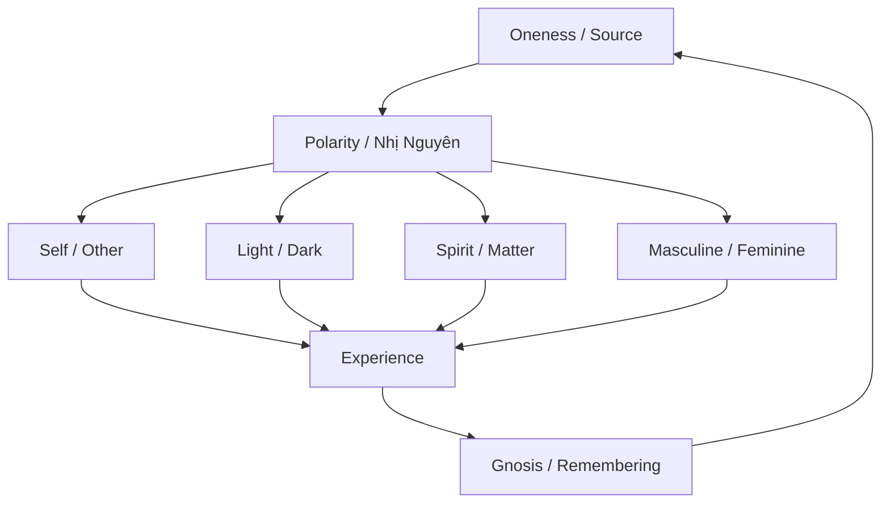
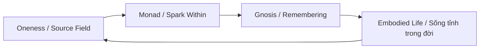

# Sự Nhất Thể (Oneness)

**Sự Nhất Thể không phải ý tưởng “mọi thứ đều màu hồng”. Nó là sự nhận ra rằng phía sau mọi phân mảnh — ta/người, sáng/tối, tinh thần/vật chất, thắng/thua — có một nền tảng duy nhất đang biểu hiện thành muôn hình vạn trạng. Nhất Thể là Source nhìn chính nó qua vô số đôi mắt.**

*Oneness is not the naive idea that “everything is love and light.” It is the recognition that behind all fragmentation — self/other, light/dark, spirit/matter, winning/losing — there is one ground expressing itself through countless forms. Oneness is Source looking at itself through infinite eyes.*

Nếu [[Monad]] là tia lửa của Source trong mỗi sinh thể, thì Sự Nhất Thể là đại dương nơi mọi tia lửa chưa từng thật sự tách rời. Nếu [[Gnosis]] là sự nhớ lại, thì Nhất Thể là thứ được nhớ ở tầng sâu nhất.

---

## 1. Nhất Thể Là Gì?

Nhất Thể là trực giác metaphysical rằng thực tại không phải tập hợp những vật thể tách biệt hoàn toàn, mà là một trường sống duy nhất đang tạm phân thành nhiều hình dạng để trải nghiệm chính nó.

Ở tầng giác quan, bạn là bạn, tôi là tôi, cây là cây, đá là đá. Ở tầng sâu hơn, tất cả là pattern trong cùng một field.

Điều này không phủ nhận sự khác biệt. Nó đặt sự khác biệt vào đúng vị trí: khác biệt là biểu hiện, không phải bản chất tối hậu.

| Tầng nhìn | Thấy gì? |
|---|---|
| Ego | Tôi tách khỏi thế giới |
| Social identity | Tôi thuộc phe này, không thuộc phe kia |
| Soul | Tôi đang học qua nhiều trải nghiệm |
| Monad | Tôi là tia lửa của Source |
| Oneness | Chỉ có Source đang nhìn qua mọi hình dạng |

Nhất Thể không phải một belief để treo trên tường. Nó là shift trong cách nhìn reality.

---

## 2. Một Truth, Nhiều Ngôn Ngữ

Hầu hết truyền thống tâm linh lớn đều có một phiên bản của Nhất Thể. Chúng khác nhau ở biểu tượng, nhưng cùng chỉ về một hướng.

| Truyền thống | Tên gọi | Cốt lõi |
|---|---|---|
| Hindu | Brahman / Atman | Đại Ngã và Tiểu Ngã vốn không hai |
| Đạo | Đạo / Vô Cực | Nguồn chưa phân cực sinh ra âm-dương |
| Phật giáo | Interbeing / Tánh Không | Không vật gì tự tồn tại riêng lẻ |
| Sufism | Wahdat al-Wujud | Unity of Being |
| Christian mysticism | “I and the Father are one” | Hợp nhất với Thần tính |
| Hermeticism | As above, so below | Một pattern phản chiếu qua nhiều tầng |
| Khoa học trường | Unified field | Vật thể như dao động trong một field |

Ngôn ngữ khác nhau vì mind cần biểu tượng. Nhưng biểu tượng không phải mặt trăng. Nó chỉ là ngón tay.

---

## 3. Nhất Thể Và Nhị Nguyên

Muốn hiểu Nhất Thể phải hiểu [[Nhị Nguyên]]. Cái Một không hủy nhị nguyên. Cái Một biểu hiện thành nhị nguyên để có trải nghiệm.

Không có sáng/tối thì không có contrast. Không có ta/người thì không có quan hệ. Không có mất/tìm thì không có hành trình. Không có quên thì không có nhớ.

Vấn đề không phải nhị nguyên tồn tại. Vấn đề là consciousness quên gốc Một và mắc kẹt trong hai cực như thể chúng tuyệt đối tách rời.

Đó là lúc trò chơi thành nhà tù.

---

## 4. Ma Trận Là Hệ Thống Của Sự Chia Tách

[[Ma Trận]] vận hành bằng cách làm con người quên Nhất Thể và đồng nhất với mảnh nhỏ nhất có thể:

- Tôi là thân xác này.
- Tôi là quốc gia này.
- Tôi là phe chính trị này.
- Tôi là tôn giáo này.
- Tôi là trauma này.
- Tôi là bank account này.
- Tôi là avatar social media này.

Càng đồng nhất hẹp, càng dễ điều khiển. Một người nghĩ mình là body sẽ bị điều khiển bằng sợ chết. Một người nghĩ mình là status sẽ bị điều khiển bằng xấu hổ. Một người nghĩ mình là phe phái sẽ bị điều khiển bằng kẻ thù.

Divide and conquer không chỉ là chiến lược chính trị. Nó là công nghệ metaphysical của Ma Trận.

| Công cụ chia tách | Tác dụng |
|---|---|
| Race | Us vs them |
| Religion | My God vs your God |
| Nation | Border conflict |
| Politics | Left vs right |
| Gender war | Masculine vs feminine |
| Class war | Rich vs poor |
| Algorithm | Echo chamber |

Khi con người nhớ Nhất Thể, Ma Trận mất công cụ mạnh nhất: illusion rằng “người kia” hoàn toàn tách khỏi mình.

---

## 5. Nhất Thể Không Phải Spiritual Bypassing

Đây là điểm cần rất cẩn thận. Nhiều người dùng “all is one” để né reality:

- “Tất cả là một nên không cần chống bất công.”
- “Mọi thứ là illusion nên đau khổ không quan trọng.”
- “Không có thiện ác nên làm gì cũng được.”
- “Chỉ cần love and light, đừng nói chuyện Ma Trận.”

Đó không phải Nhất Thể. Đó là bypassing.

Nhất Thể thật không làm bạn vô cảm. Nó làm bạn thấy đau khổ của người khác không tách khỏi mình. Vì vậy compassion trở nên tự nhiên hơn, không phải đạo đức gượng ép.

Nếu tay trái bị thương, tay phải không nói: “Tất cả là một nên kệ đi.” Tay phải tự nhiên chăm sóc tay trái vì cả hai cùng một thân.

Nhất Thể không xóa trách nhiệm. Nó làm trách nhiệm sâu hơn.

---

## 6. Nhất Thể Và Ego

Ego tạo cảm giác “tôi là một cá thể riêng”. Ở tầng sinh tồn, ego cần thiết. Nếu không có ego, bạn không biết bảo vệ thân xác, giữ ranh giới, hoàn thành vai diễn đời này.

Nhưng ego trở thành nhà tù khi nó tưởng mình là toàn bộ reality.

| Ego lành mạnh | Ego bị Ma Trận chiếm dụng |
|---|---|
| Công cụ điều hướng đời sống | Danh tính tuyệt đối |
| Giữ ranh giới cần thiết | Tạo chiến tranh liên tục |
| Phục vụ soul experience | Sợ tan biến nên bám víu |
| Có thể mềm ra trước Gnosis | Chống lại mọi thứ đe dọa identity |

Nhất Thể không yêu cầu giết ego. Nó yêu cầu đặt ego đúng vị trí: một interface, không phải chủ nhân.

Đây là nơi Nhất Thể nối với [[Individuation]]. Ta không dissolve cá tính thành một đám mây mơ hồ. Ta tích hợp bản thể cá nhân đủ vững để nó trở thành cửa sổ trong suốt cho cái Một đi qua.

---

## 7. Nhất Thể Trong Đời Sống

Nhất Thể không chỉ nằm trong thiền định. Nó hiện ra trong những khoảnh khắc rất đời:

- Khi nhìn một đứa trẻ cười và thấy tim mềm ra.
- Khi đứng giữa thiên nhiên và cảm giác “mình không ở ngoài cảnh này”.
- Khi tha thứ không phải vì người kia đúng, mà vì không muốn tiếp tục nuôi độc trong cùng một field.
- Khi làm hại người khác và sâu bên trong biết mình cũng đang tự hại.
- Khi giúp ai đó và cảm giác như một phần của mình được chữa lành.

Ở tầng Nhất Thể, đạo đức không còn là bộ luật bên ngoài. Nó là nhận thức năng lượng: bất cứ thứ gì ta gửi vào field cũng đi qua chính ta.

---

## 8. Nhất Thể Và Khoa Học Hiện Đại

Không nên ép khoa học hiện đại “chứng minh” Nhất Thể. Nhưng một số mô hình khoa học làm mềm đi worldview vật chất cứng:

| Mô hình | Gợi ý |
|---|---|
| Ecology | Không sinh vật nào tồn tại độc lập khỏi hệ sinh thái |
| Systems theory | Phần tử chỉ có nghĩa trong quan hệ với toàn hệ |
| Field theory | Vật thể như pattern trong trường |
| Quantum non-locality | Reality không hoàn toàn local như trực giác thường |
| Holographic metaphor | Mỗi phần phản chiếu thông tin của toàn thể |

Những mô hình này không phải bằng chứng cuối cùng. Nhưng chúng nhắc ta rằng “vật thể tách biệt tuyệt đối” là một giả định nghèo nàn.

Nhất Thể là trực giác sâu hơn: relation không phải phụ kiện của reality. Relation là cấu trúc của reality.

---

## 9. Trải Nghiệm Nhất Thể

Một số cửa vào:

1. **Thiền định** — quan sát ranh giới giữa observer và observed mềm ra.
2. **Nature immersion** — ở trong rừng/biển/núi đủ lâu để body nhớ mình thuộc về Earth.
3. **Service** — giúp người khác mà không biến nó thành ego performance.
4. **Shadow work** — nhận ra thứ mình ghét ở người khác thường có gốc trong chính mình.
5. **Deep grief** — đau đủ sâu có thể phá vỡ vỏ ego.
6. **Love** — tình yêu thật làm ranh giới cái tôi giãn ra.
7. **Gnosis** — trực nghiệm divine spark và Source.

Cảnh báo: trải nghiệm Nhất Thể có thể đến rồi đi. Đừng biến memory của experience thành identity mới. Cái quan trọng không phải “tôi từng có mystical experience”, mà là sau đó bạn sống bớt chia tách hơn không.

---

## 10. Nhất Thể Và Elite

[[Elite]] sợ Nhất Thể không phải vì mọi người sẽ cùng ngồi thiền. Họ sợ vì Nhất Thể phá công nghệ cai trị cốt lõi: chia để trị.

Một nhân loại nhớ mình liên kết với nhau sẽ khó bị kéo vào chiến tranh vô nghĩa. Một cộng đồng nhớ mình thuộc về đất sẽ khó chấp nhận phá hủy môi trường để đổi lấy paper wealth. Một cá nhân nhớ mình không chỉ là consumer sẽ khó bị điều khiển bằng dopamine và status.

Do đó hệ thống phải liên tục sản xuất chia tách:

- identity politics
- outrage media
- gender war
- class resentment
- religious conflict
- nationalism cực đoan
- thuật toán echo chamber

Không phải mọi khác biệt đều xấu. Nhưng khi khác biệt bị weaponize để bạn quên common Source, nó trở thành công cụ của Ma Trận.

---

## 11. Synthesis: Nhất Thể Là Nền, Monad Là Điểm, Gnosis Là Nhớ

Bộ ba này nên đọc cùng nhau:

| Node | Vai trò |
|---|---|
| [[Sự Nhất Thể]] | Nền tảng: tất cả vốn là một field/source |
| [[Monad]] | Điểm Một bên trong từng sinh thể |
| [[Gnosis]] | Sự nhớ lại trực tiếp về bản chất đó |

Nếu chỉ có Nhất Thể mà không có Monad, ta dễ rơi vào mơ hồ: “tất cả là một” nhưng không biết cửa vào nằm đâu.

Nếu chỉ có Monad mà không có Nhất Thể, ta dễ biến divine spark thành một “cái tôi cao cấp” mới.

Nếu chỉ có Gnosis mà không có hai nền trên, ta dễ săn trải nghiệm thức tỉnh như săn dopamine tâm linh.

Ba node này tạo thành một trục:

Nhất Thể không phải điểm đến xa xôi. Nó là nền luôn có mặt. Monad là cửa trong bạn. Gnosis là khoảnh khắc cửa mở.

---

## Related

### Source / Nguồn
- [[Monad]] — Tia lửa của Source trong từng sinh thể
- [[Gnosis]] — Trực nghiệm nhớ lại Nhất Thể
- [[Nghịch Lý Của Hiểu Biết]] — Khi mọi framework tan vào cái thấy

### Polarity / Phân cực
- [[Nhị Nguyên]] — Cách cái Một phân thành hai cực để trải nghiệm
- [[Ma Trận]] — Hệ thống weaponize chia tách
- [[Elite]] — Tầng quyền lực hưởng lợi từ divide and conquer

### Integration / Tích hợp
- [[Individuation]] — Trở thành cá thể toàn vẹn mà không quên Source
- [[Tâm Lý Học Jung]] — Ego, shadow, Self và hành trình trở về toàn thể
- [[Lemuria]] — Civilization memory của trạng thái liên kết hơn

---

> *“Separation is the dream. Oneness is what remains when the dream is seen through.”*
>
> *Chia tách là giấc mơ. Nhất Thể là thứ còn lại khi giấc mơ được nhìn xuyên qua.*
