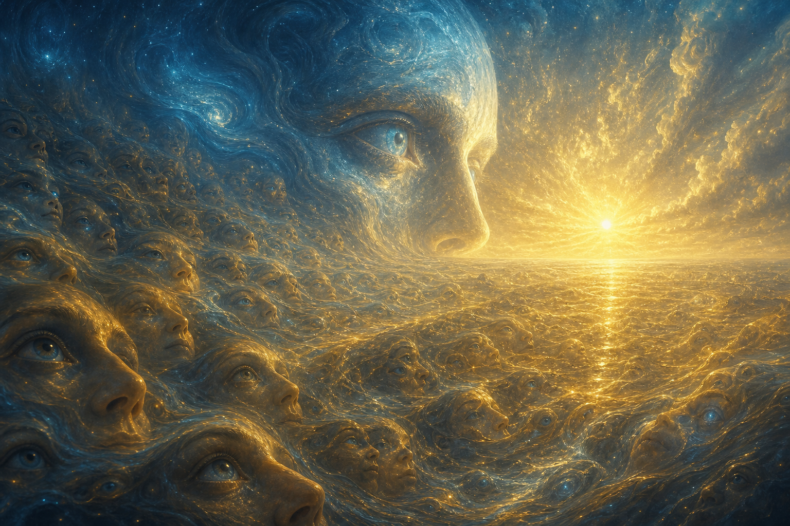

# Sự Nhất Thể (Oneness)

**Sự Nhất Thể không phải ý tưởng “mọi thứ đều màu hồng”. Nó là sự nhận ra rằng phía sau mọi phân mảnh: ta/người, sáng/tối, tinh thần/vật chất, thắng/thua, có một nền tảng duy nhất đang biểu hiện thành muôn hình vạn trạng. Nhất Thể là Source nhìn chính nó qua vô số đôi mắt.**

*Oneness is not the naive idea that everything is love and light. It is the recognition that behind all fragmentation, there is one ground expressing itself through countless forms.*

Nếu [[Monad]] là tia lửa của Source trong mỗi sinh thể, thì Sự Nhất Thể là đại dương nơi mọi tia lửa chưa từng thật sự tách rời. Nếu [[Gnosis]] là sự nhớ lại, thì Nhất Thể là thứ được nhớ ở tầng sâu nhất.

---

## Evidence Discipline / Cách Đọc

Sự Nhất Thể là metaphysical core của vault. Nó không phải fact claim vật lý kiểu “đã đo được Source bằng thiết bị”. Nó là lens triết học, tâm linh và lived gnosis để đọc relation: mọi thứ liên hệ, mọi hành động tạo consequence, mọi chia tách tuyệt đối đều là illusion ở một tầng sâu.

Đọc sai Nhất Thể sẽ thành spiritual bypass: “tất cả là một nên không cần phân biệt thật/giả, thiện/ác, kiểm soát/tự do”. Đọc đúng thì ngược lại: vì mọi thứ liên hệ, mỗi hành vi control và mỗi hành vi care đều lan trong cùng một field.

Nhất Thể không xóa discernment. Nó làm discernment có compassion.

---

## Một Nền, Vô Số Hình Dạng

Ở tầng giác quan, bạn là bạn, tôi là tôi, cây là cây, đá là đá. Ở tầng xã hội, ta có tên, quốc tịch, nghề, phe, ký ức, vết thương. Ở tầng soul, ta có hành trình, bài học, nghiệp, lựa chọn. Ở tầng [[Monad]], ta là tia lửa bất khả phân của Source. Ở tầng Nhất Thể, chỉ có Source đang nhìn qua tất cả hình dạng.

Nhất Thể không phủ nhận khác biệt. Nó đặt khác biệt vào đúng vị trí: khác biệt là biểu hiện, không phải bản chất tối hậu.

Đây là điểm tinh tế. Nếu nói “mọi thứ là một” rồi phủ nhận đau, đó là bypass. Nếu nói “mọi thứ tách biệt tuyệt đối” rồi sống bằng chiến tranh liên tục, đó là Ma Trận. Nhất Thể thật giữ được cả hai: khác biệt có thật ở tầng đời sống, nhưng không tuyệt đối ở tầng Source.

---

## Nhất Thể Và Nhị Nguyên

Muốn hiểu Nhất Thể phải hiểu [[Nhị Nguyên]]. Cái Một không hủy nhị nguyên. Cái Một biểu hiện thành nhị nguyên để có trải nghiệm.

Không có sáng/tối thì không có contrast. Không có ta/người thì không có quan hệ. Không có mất/tìm thì không có hành trình. Không có quên thì không có nhớ.

Vấn đề không phải nhị nguyên tồn tại. Vấn đề là consciousness quên gốc Một và mắc kẹt trong hai cực như thể chúng tuyệt đối tách rời. Khi đó polarity thành prison: nam chống nữ, tả chống hữu, science chống spirituality, dân tộc chống dân tộc, người tỉnh chống NPC.

[[Nghịch Lý Của Hiểu Biết]] nằm ở đây: mind không thể thắng bằng cách chọn một cực cuối cùng. Nó phải thấy cơ chế tạo cực.

---

## Ma Trận Là Công Nghệ Của Chia Tách

[[Ma Trận]] vận hành bằng cách làm con người quên Nhất Thể và đồng nhất với mảnh nhỏ nhất có thể: body, trauma, bank account, quốc gia, phe chính trị, tôn giáo, giới tính, avatar social media, career title.

Càng đồng nhất hẹp, càng dễ điều khiển. Người nghĩ mình chỉ là body bị điều khiển bằng sợ chết. Người nghĩ mình là status bị điều khiển bằng xấu hổ. Người nghĩ mình là phe phái bị điều khiển bằng kẻ thù. Người nghĩ mình là wound bị điều khiển bằng trigger.

Divide and conquer không chỉ là chiến lược chính trị. Nó là công nghệ metaphysical của Ma Trận.

Khi con người nhớ Nhất Thể, Ma Trận mất công cụ mạnh nhất: illusion rằng “người kia” hoàn toàn tách khỏi mình.

---

## Nhất Thể Không Phải Love-And-Light Bypass

Nhiều người dùng “all is one” để né reality: tất cả là một nên không cần chống bất công; mọi thứ là illusion nên đau khổ không quan trọng; không có thiện ác nên làm gì cũng được; chỉ cần love and light, đừng nói chuyện control.

Đó không phải Nhất Thể. Đó là ego spiritual hóa sự né tránh.

Nếu tay trái bị thương, tay phải không nói “tất cả là một nên kệ đi”. Tay phải tự nhiên chăm sóc tay trái vì cả hai cùng một thân. Nhất Thể thật không làm bạn vô cảm. Nó làm compassion bớt đạo đức giả, vì người kia không còn là vật thể ngoài mình.

Nhất Thể không xóa trách nhiệm. Nó làm trách nhiệm sâu hơn.

---

## Ego, Individuation Và Cái Một

Ego không phải kẻ thù tuyệt đối. Ego là interface đời này. Nó giúp giữ ranh giới, bảo vệ thân xác, hoàn thành vai diễn. Vấn đề là ego tưởng nó là toàn bộ reality.

Nhất Thể không yêu cầu giết ego. Nó yêu cầu đặt ego đúng vị trí: công cụ điều hướng, không phải chủ nhân.

Đây là nơi Nhất Thể nối với [[Individuation]]. Người chưa tích hợp shadow dễ dùng “oneness” để tan thành một đám mây mơ hồ, né responsibility và boundary. Người individuation tốt hơn có cá thể đủ vững để trở thành cửa sổ trong suốt cho cái Một đi qua.

Cái Một không cần bạn mất hình dạng. Nó cần hình dạng ngừng tưởng mình tách khỏi biển.

---

## Political Và Spiritual Implication

Nhất Thể có hệ quả chính trị rất mạnh, nhưng không theo kiểu utopia ngây thơ. Nếu mọi thứ liên hệ, thì monetary system, media frame, food system, family structure, health, ecology và attention đều là spiritual issues. Không có chuyện “tâm linh” nằm ngoài đời sống.

Một hệ thống bóc lột không chỉ làm hại nạn nhân riêng lẻ. Nó làm nhiễu toàn field. Một hành vi care không chỉ giúp một người. Nó sửa một phần relation trong field.

Đây là lý do [[Elite]] thích chia tách. Một public nhớ Nhất Thể sẽ khó bị kéo vào chiến tranh ngang hàng vô tận. Họ vẫn discern. Họ vẫn chống cái cần chống. Nhưng họ không còn bị say bởi hận thù như nhiên liệu chính.

---

## Kết

Sự Nhất Thể là mặt nước trước khi có sóng. Sóng khác nhau là thật ở tầng sóng, nhưng không có sóng nào rời khỏi nước. Con người khác nhau là thật ở tầng đời sống, nhưng không có ai thật sự đứng ngoài Source.

Nhất Thể không làm đời sống nhạt đi. Nó làm đời sống linh thiêng hơn, vì mọi thứ mình chạm vào đều không hoàn toàn tách khỏi mình.

> Ma Trận nói: “mày là một mảnh cô lập phải chiến đấu với mọi mảnh khác.”  
> Nhất Thể nói: “mày là một cửa nhìn của cùng một Source, đang học cách nhớ lại qua hình dạng này.”

---

## Reading Path / Đọc Tiếp

- [[Monad]] — tia lửa của Source trong mỗi sinh thể
- [[Gnosis]] — khoảnh khắc nhớ lại trực tiếp
- [[Nhị Nguyên]] — polarity như công cụ trải nghiệm và nhà tù nhận thức
- [[Ma Trận]] — hệ điều hành chia tách perception
- [[Individuation]] — cá thể hóa đủ vững để không bypass cái Một
