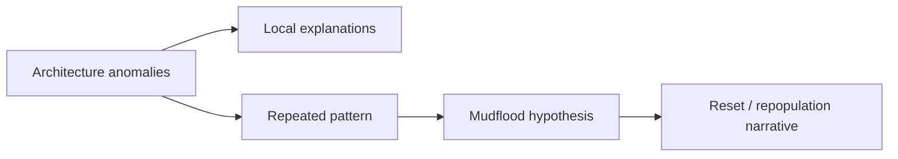

# Tartaria (Grand Tartary)

**Tartaria là một case study về cách lịch sử, bản đồ, kiến trúc và ký ức tập thể có thể bị đọc theo nhiều tầng cùng lúc.** Tầng fact: "Tartary" từng xuất hiện trên nhiều bản đồ châu Âu để chỉ các vùng rộng lớn ở Á-Âu, thường mơ hồ theo hiểu biết địa lý của thời đó. Tầng revisionist: sự biến mất của cái tên này, cộng với kiến trúc đồ sộ và motif [[Mudflood]], đặt ra câu hỏi liệu một lớp văn minh cũ đã bị xóa khỏi narrative hiện đại hay không.

*Tartaria is a map-history-architecture node: part documented cartographic term, part revisionist question about erased civilization and reset memory.*

---

## Evidence Discipline / Cách Đọc

| Tầng | Cách đọc đúng |
|---|---|
| Fact / documentable | "Tartary" xuất hiện trên bản đồ, atlas và văn bản châu Âu nhiều thế kỷ; nghĩa của nó thay đổi theo thời kỳ |
| Historical caution | bản đồ cổ thường dùng nhãn vùng rộng, không đồng nghĩa với một đế chế thống nhất |
| Pattern / systems | tên gọi biến mất, lịch sử được chuẩn hóa, kiến trúc cũ bị tái gán nguồn gốc |
| Symbol / myth | Tartaria là archetype của văn minh bị chôn, ký ức bị reset, công nghệ bị giấu |
| Speculative synthesis | free energy, aether grid, mudflood reset, repopulation là giả thuyết vault cần phân tầng |

Kỷ luật ở đây rất quan trọng: nếu mọi mái vòm đều bị gọi là "Tartarian tech", bài sẽ thành niềm tin lười. Nếu mọi câu hỏi bị dismiss là "conspiracy", ta bỏ lỡ pattern lịch sử và kiến trúc đáng điều tra.

---

## Vault Position / Vị Trí Trong Vault

Tartaria nối [[Mudflood]], [[Năng Lượng Aether]], [[Khoa Học Xét Lại]], [[Nikola Tesla]], [[Long Mạch]] và [[MOC - Ancient Civilizations & Hidden History]]. Nó là một node về memory control: ai đặt tên quá khứ, ai giải thích công trình cổ, ai quyết định một nền văn minh là "thực" hay chỉ là vùng hoang trên bản đồ?

Trong vault, Tartaria không được dùng như câu trả lời sẵn. Nó là một bộ câu hỏi.

---

## Tartary Trên Bản Đồ Cổ

Từ thế kỷ 15 đến 19, nhiều bản đồ châu Âu dùng các nhãn như Great Tartary, Chinese Tartary, Independent Tartary, Little Tartary. Tầng mainstream giải thích: đây là cách người châu Âu gọi các vùng rộng lớn liên quan đến các dân tộc Turkic-Mongol-Tatar và những khu vực chưa được họ phân loại chính xác.

Tầng câu hỏi: nếu một nhãn địa lý bao phủ diện tích rất lớn trong nhiều thế kỷ, tại sao ký ức phổ thông ngày nay gần như trống? Nó chỉ là nhãn ngoại lai bị thay bằng "Russia", "Central Asia", "Mongolia", "China"? Hay quá trình chuẩn hóa sử học đã làm mất một lớp nhận thức cũ?

| Quan sát | Cách đọc thận trọng |
|---|---|
| Tartary xuất hiện nhiều trên bản đồ | fact bản đồ, không tự chứng minh empire thống nhất |
| Ranh giới thay đổi | phù hợp với vùng địa lý mơ hồ, cũng đặt câu hỏi về hiểu biết thời đó |
| Biến mất khỏi giáo dục phổ thông | có thể do đổi thuật ngữ, cũng có thể do narrative simplification |
| Tên "Tatar/Tartar" bị nhập nhằng | cần phân biệt dân tộc, vùng, exonym, myth |

---

## Kiến Trúc: Câu Hỏi Không Nên Đọc Vội

Tartaria online thường bám vào kiến trúc cổ: mái vòm, tháp nhọn, star forts, nhà ga, nhà thờ, world fair buildings. Cảm giác chung là: "người ta bảo xây nhanh bằng công nghệ thô sơ, nhưng công trình quá tinh xảo." Cảm giác này đáng điều tra, nhưng không đủ để kết luận.

| Hiện tượng | Câu hỏi tốt hơn |
|---|---|
| công trình đồ sộ ở đô thị trẻ | ai thiết kế, ai tài trợ, chuỗi lao động ra sao? |
| tầng hầm/cửa sổ bị chôn | do nâng đường, lũ, bùn, tái quy hoạch hay sự kiện lớn? |
| star forts toàn cầu | logic quân sự, hình học pháo binh, hay geometry năng lượng? |
| world fairs xây rồi phá | temporary architecture, propaganda công nghiệp, hay che giấu reuse? |

Đọc mature là kiểm tra case-by-case. Một số công trình có lịch sử xây dựng rõ. Một số có khoảng trống đáng nghi. Không gom tất cả vào một rổ.

---

## Mudflood Và Reset Memory

[[Mudflood]] là giả thuyết rằng một sự kiện hoặc chuỗi sự kiện đã chôn vùi tầng trệt của nhiều đô thị, sau đó narrative mới được đặt lên trên. Đây là phần gây tranh luận nhất của cụm Tartaria.

Tầng fact: nhiều thành phố có tầng hầm, cửa sổ thấp, phố được nâng nền, lũ lụt, tái quy hoạch, hoặc xây dựng trên lớp cũ. Tầng speculative: nếu pattern này quá rộng và giải thích địa phương không đủ, có thể có một memory reset lớn hơn.

Điểm cần giữ: Mudflood không được dùng để khỏi nghiên cứu địa chất, đô thị học và lịch sử xây dựng. Nó phải buộc ta nghiên cứu kỹ hơn.

---

## Aether Tech Và Mái Vòm

Một nhánh Tartaria cho rằng các mái vòm, tháp nhọn, cột kim loại và kiến trúc cộng hưởng từng thu hoặc phân phối [[Năng Lượng Aether]]. Đây là tầng symbol-speculative, liên quan tới [[Nikola Tesla]] và các mô hình energy revisionism.

Cách đọc tốt nhất:

1. Kiến trúc cổ có hiểu biết sâu về âm học, ánh sáng, geometry, vật liệu và khí hậu.
2. Một số hình khối có thể tạo hiệu ứng điện/từ/âm học đáng nghiên cứu.
3. Claim "free energy grid toàn cầu" cần bằng chứng kỹ thuật rất mạnh.
4. Dù chưa chứng minh được aether tech, câu hỏi về kiến trúc như thiết bị môi trường vẫn đáng mở.

Đây là chỗ vault giữ curiosity nhưng không giả vờ đã có proof.

---

## Tartaria Và Việt Nam

Khi kéo Tartaria về Việt Nam, cần càng thận trọng. Không nên thấy kiến trúc Pháp, thành cổ hay [[Long Mạch]] rồi dán nhãn Tartaria ngay. Nhưng có thể dùng Tartaria như lens để hỏi:

| Node Việt Nam | Câu hỏi |
|---|---|
| [[Thành Cổ Loa]] | hình học phòng thủ, long mạch, hay geometry cổ hơn narrative đang kể? |
| kiến trúc thuộc địa | bao nhiêu là xây mới, bao nhiêu là tái sử dụng nền/hạ tầng? |
| đình, chùa, thành, giếng | có hiểu biết khí-hình-thủy-âm mà hiện đại bỏ qua không? |
| [[Long Mạch]] | geography thiêng có phải bản đồ năng lượng văn hóa? |

Tartaria không nên trở thành nhãn nhập khẩu đè lên lịch sử Việt. Nó chỉ là một công cụ hỏi lại kiến trúc và ký ức.

---

## Tại Sao Motif Này Hấp Dẫn?

Tartaria mạnh vì nó đánh vào một vết thương hiện đại: cảm giác rằng con người từng sống trong thế giới đẹp hơn, giàu biểu tượng hơn, ít bị bê tông hóa hơn, rồi bị nhét vào hộp kính, dây điện, nợ và lịch sử rút gọn.

Motif này hấp dẫn vì ba lý do:

1. kiến trúc cũ thật sự có phẩm chất mà nhiều đô thị hiện đại đánh mất;
2. lịch sử chính thống thường kể tuyến tính quá sạch;
3. con người cảm thấy bị tước quyền tưởng tượng về năng lực của tiền nhân.

Nhưng hấp dẫn không đồng nghĩa đúng. Nó chỉ nói rằng câu hỏi này chạm vào một archetype sâu: nền văn minh vàng bị chôn.

---

## Chốt Lại / Core Insight

**Tartaria không nên được dùng như một đáp án lười cho mọi công trình cổ. Nó là một câu hỏi sắc: lịch sử chính thống đã mất bao nhiêu lớp bản đồ, kiến trúc, công nghệ và ký ức khi chuẩn hóa quá khứ thành một câu chuyện tuyến tính?**

*Tartaria is not a lazy answer for every old building. It is a disciplined question about maps, memory, architecture, and the possibility of erased civilizational layers.*
