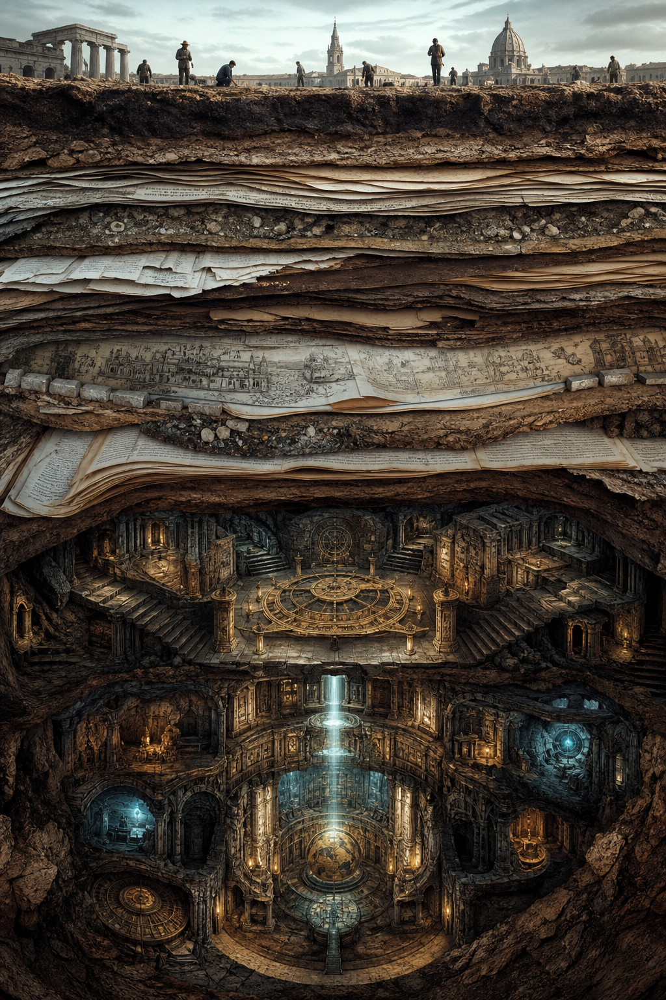
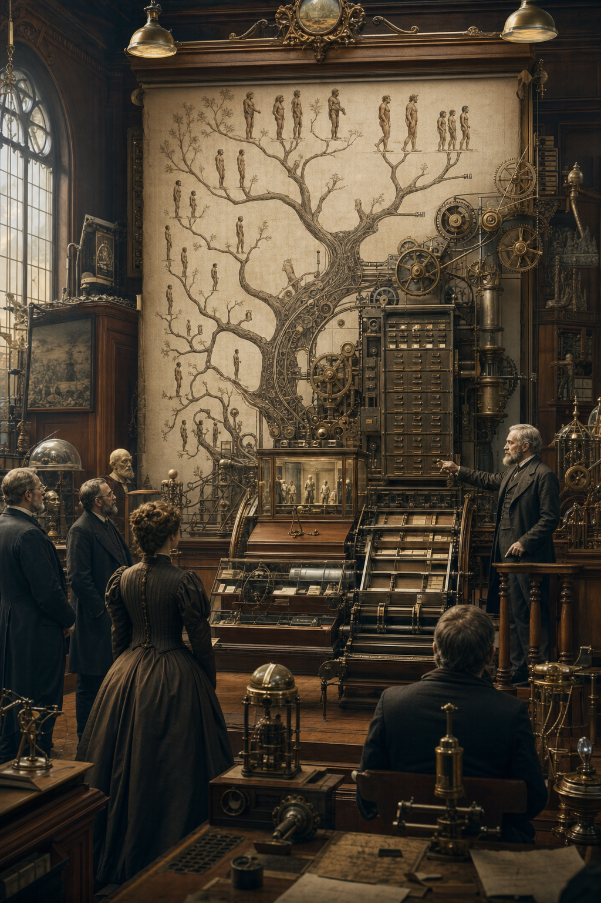
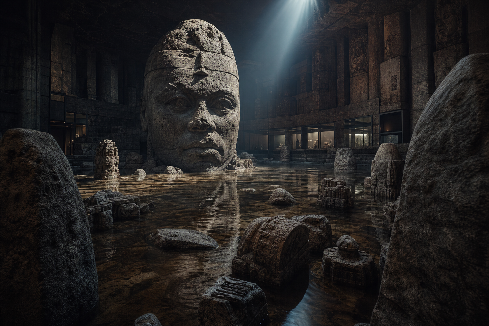

# Thuyết Tiến Hóa - Các Nền Văn Minh Bị Che Giấu

> "Nếu bạn kiểm soát được quá khứ, bạn kiểm soát được tương lai. Nếu bạn kiểm soát được hiện tại, bạn kiểm soát được quá khứ." — George Orwell, 1984

Năm 1859, Charles Darwin xuất bản "On the Origin of Species" và thay đổi vĩnh viễn cách nhân loại nhìn nhận bản thân. Từ đó, chúng ta được dạy rằng con người là sản phẩm của hàng triệu năm tiến hóa ngẫu nhiên, từ vi khuẩn đơn bào leo lên thành vượn, rồi từ vượn đứng thẳng thành người. Một câu chuyện đẹp. Một câu chuyện tiện lợi. Và có lẽ, một câu chuyện hoàn toàn sai.

*In 1859, Charles Darwin published "On the Origin of Species" and permanently changed how humanity sees itself. Since then, we've been taught that humans are products of millions of years of random evolution, from single-celled bacteria climbing up to apes, then apes standing upright to become humans. A beautiful story. A convenient story. And perhaps, a completely wrong story.*

---

## Vault Position / Vị Trí Trong Vault

Bài này không phải lời kêu gọi vứt bỏ sinh học tiến hóa. Nó là một bài **narrative audit**: khi một mô hình khoa học trở thành world-picture chính thức, nó định hình cách con người hiểu nguồn gốc, linh hồn, lịch sử và giới hạn của mình.

Trong vault, bài này đứng giữa [[Khoa Học Xét Lại]], [[Annunaki]], [[Nibiru]], [[Atlantis]], [[Monad]] và [[Sự Nhất Thể]]. Nó hỏi một câu hẹp hơn nhưng nguy hiểm hơn: nếu lịch sử loài người không tuyến tính như sách giáo khoa kể, thì ai được lợi từ timeline hiện tại?

Đọc đúng: Darwinism là một mô hình khoa học có phần evidence thật, có phần tranh luận thật, và có phần bị dùng như ideology. Đọc sai: biến mọi lỗ hổng khảo cổ thành bằng chứng chắc chắn rằng “mọi thứ đều bị giấu”.

---

## Source Discipline / Kỷ Luật Nguồn

Bài này bàn về một chủ đề dễ bị đọc quá tay, nên cần tách claim rõ:

- **Fact / documentable:** Darwin xuất bản *On the Origin of Species* năm 1859; Thomas Huxley, Royal Society, UNESCO, eugenics và các nhân vật lịch sử có hồ sơ công khai để đối chiếu.
- **Pattern / systems:** câu hỏi về narrative khoa học, incentive của giới học thuật và cách một mô hình trở thành consensus là phân tích hệ thống.
- **Symbol / myth:** “nền văn minh bị che giấu”, “ký ức bị xóa”, “lịch sử bị viết lại” là ngôn ngữ biểu tượng/huyền sử của vault.
- **Speculative synthesis:** kết nối Darwinism, elite agenda, văn minh cổ và metaphysics là giả thuyết tổng hợp, không phải kết luận khảo cổ chính thống.

Không dùng bài này như bằng chứng duy nhất để phủ định tiến hóa sinh học. Nếu trích ra ngoài vault, hãy đối chiếu từng claim lịch sử với nguồn sơ cấp hoặc tài liệu học thuật riêng.

---

## Darwin - Người Hay Công Cụ?

### Ai Đứng Sau Darwin?

Charles Darwin không phải nhà khoa học nghèo khổ theo đuổi chân lý. Ông là thành viên của giới thượng lưu Anh, cháu nội của Erasmus Darwin - một Freemason nổi tiếng và là người đầu tiên đề xuất ý tưởng tiến hóa. Gia đình Darwin kết hôn với gia đình Wedgwood (gốm sứ) - tạo nên một mạng lưới tiền bạc và ảnh hưởng đáng kể.

*Charles Darwin wasn't a poor scientist pursuing truth. He was a member of English upper class, grandson of Erasmus Darwin - a famous Freemason who first proposed the evolution idea. The Darwin family married into the Wedgwood family (ceramics) - creating a significant network of money and influence.*

Thomas Huxley - người được gọi là "Darwin's Bulldog" - là người thực sự đẩy thuyết tiến hóa vào mainstream. Huxley là thành viên của Royal Society, X Club (một nhóm quyền lực kiểm soát khoa học Anh), và có liên hệ với các gia đình elite. Cháu của Huxley là Aldous Huxley - tác giả "Brave New World" - và Julian Huxley - người sáng lập UNESCO và là nhà eugenics công khai.

*Thomas Huxley - called "Darwin's Bulldog" - was who actually pushed evolution into mainstream. Huxley was a member of the Royal Society, X Club (a powerful group controlling British science), and had connections to elite families. Huxley's grandchildren include Aldous Huxley - author of "Brave New World" - and Julian Huxley - UNESCO founder and open eugenicist.*

### Timing Đáng Ngờ

"On the Origin of Species" ra đời năm 1859 - đúng thời điểm Cách mạng Công nghiệp đạt đỉnh cao, giới elite cần một narrative mới để giữ quần chúng trong nhà máy thay vì nhà thờ. Nếu con người chỉ là động vật tiến hóa, không có linh hồn, không có mục đích thiêng liêng - thì việc biến họ thành bánh răng trong cỗ máy công nghiệp trở nên dễ dàng hơn nhiều.

*"On the Origin of Species" appeared in 1859 - exactly when the Industrial Revolution peaked, elites needed a new narrative to keep masses in factories instead of churches. If humans are just evolved animals, no soul, no divine purpose - then turning them into cogs in the industrial machine becomes much easier.*

---

## Những Lỗ Hổng Không Thể Bịt

### Missing Links - Mắt Xích Thất Lạc

Sau hơn 160 năm khai quật, chúng ta vẫn không tìm thấy dạng chuyển tiếp nào đáng kể. Darwin thừa nhận đây là vấn đề lớn nhất của lý thuyết và hy vọng tương lai sẽ tìm ra. Tương lai đã đến - và chúng ta vẫn không có gì.

*After over 160 years of excavation, we still haven't found any significant transitional forms. Darwin admitted this was his theory's biggest problem and hoped the future would find them. The future has arrived - and we still have nothing.*

Piltdown Man (1912) được hoan nghênh là "missing link" trong 40 năm - cho đến khi bị phát hiện là hộp sọ người ghép với hàm dưới đười ươi, răng được dũa, và xương được nhuộm để trông cũ. Đây không phải lỗi vô tình - đây là fraud có chủ đích, và những người chịu trách nhiệm không bao giờ bị truy tố.

*Piltdown Man (1912) was hailed as the "missing link" for 40 years - until discovered to be a human skull attached to an orangutan jaw, teeth filed down, and bones stained to look old. This wasn't an innocent mistake - this was deliberate fraud, and those responsible were never prosecuted.*

Nebraska Man (1922) được xây dựng từ một chiếc răng duy nhất - và được dùng làm bằng chứng trong phiên tòa Scopes nổi tiếng. Sau đó phát hiện chiếc răng thuộc về... một con lợn. Lucy (Australopithecus) - "bà tổ của loài người" - thực tế có cấu trúc xương giống khỉ hoàn toàn, với tỷ lệ tay dài hơn chân điển hình của loài leo trèo.

*Nebraska Man (1922) was constructed from a single tooth - and used as evidence in the famous Scopes trial. Later discovered the tooth belonged to... a pig. Lucy (Australopithecus) - "grandmother of humanity" - actually has bone structure completely like apes, with arm-to-leg ratio typical of climbing species.*

### Cambrian Explosion - Vụ Nổ Không Giải Thích Được

Khoảng 540 triệu năm trước, trong một khoảng thời gian địa chất cực ngắn (khoảng 20-25 triệu năm), hầu hết các phyla động vật chính xuất hiện đột ngột trong hồ sơ hóa thạch - không có tổ tiên chuyển tiếp rõ ràng. Darwin gọi đây là "sự kiện gây bối rối nhất" cho lý thuyết của ông.

*Around 540 million years ago, in an extremely short geological timeframe (about 20-25 million years), most major animal phyla suddenly appeared in the fossil record - with no clear transitional ancestors. Darwin called this "the most perplexing event" for his theory.*

Tiến hóa dần dần đòi hỏi hàng trăm triệu năm thay đổi nhỏ tích lũy. Cambrian Explosion cho thấy sự xuất hiện đột ngột của complexity - như thể ai đó "bật công tắc" cuộc sống phức tạp.

*Gradual evolution requires hundreds of millions of years of accumulated small changes. The Cambrian Explosion shows sudden appearance of complexity - as if someone "flipped a switch" for complex life.*

### DNA - Bằng Chứng Ngược

Thuyết tiến hóa dự đoán DNA sẽ cho thấy sự tích lũy dần thông tin di truyền mới. Thực tế cho thấy điều ngược lại.

*Evolution theory predicts DNA would show gradual accumulation of new genetic information. Reality shows the opposite.*

Bộ gene của các loài cổ đại (như cá mút đá - lamprey) không đơn giản hơn bộ gene hiện đại. Nhiều loài "nguyên thủy" có bộ gene phức tạp hơn loài "tiến hóa" hơn. Đột biến ngẫu nhiên - động cơ của tiến hóa - gần như luôn có hại hoặc trung tính, hiếm khi có lợi. Không có cơ chế đã được chứng minh để tạo ra thông tin di truyền mới - chỉ có biến thể của thông tin hiện có.

*Genomes of ancient species (like lampreys) aren't simpler than modern genomes. Many "primitive" species have more complex genomes than "more evolved" species. Random mutations - evolution's engine - are almost always harmful or neutral, rarely beneficial. No proven mechanism exists to create new genetic information - only variation of existing information.*

---

## Forbidden Archaeology - Những Gì Họ Giấu

### Out-of-Place Artifacts (OOPArts)

Nếu loài người chỉ xuất hiện ~200,000 năm trước và văn minh chỉ ~5,000 năm, làm sao giải thích những phát hiện này?

*If humans only appeared ~200,000 years ago and civilization only ~5,000 years, how do we explain these findings?*

**Antikythera Mechanism** (khoảng 100 BCE): Máy tính analog với hệ thống bánh răng phức tạp, có thể dự đoán nhật thực, nguyệt thực, và vị trí các hành tinh. Công nghệ tương đương không xuất hiện lại cho đến thế kỷ 18. Làm sao người Hy Lạp cổ đại có thể tạo ra thứ này nếu họ mới "tiến hóa" từ hang động vài nghìn năm trước?

***Antikythera Mechanism** (around 100 BCE): Analog computer with complex gear system, capable of predicting solar eclipses, lunar eclipses, and planetary positions. Equivalent technology didn't reappear until the 18th century. How could ancient Greeks create this if they had just "evolved" from caves a few thousand years prior?*

**Baghdad Battery** (khoảng 250 BCE): Bình gốm với thanh sắt và đồng, có thể tạo ra 1-2 volt điện. Mục đích không rõ, nhưng sự tồn tại của nó cho thấy kiến thức về điện 2,000 năm trước Volta.

***Baghdad Battery** (around 250 BCE): Ceramic jar with iron and copper rods, capable of producing 1-2 volts of electricity. Purpose unclear, but its existence suggests knowledge of electricity 2,000 years before Volta.*

**Đèn Dendera** (Ai Cập): Relief trong đền Hathor cho thấy hình ảnh giống bóng đèn điện kỳ lạ - với "dây tóc" bên trong bình thủy tinh. Mainstream giải thích là "hoa sen" - nhưng hoa sen không nối với dây cáp và không có "dây tóc".

***Dendera Lights** (Egypt): Relief in Hathor temple showing strange images resembling electric light bulbs - with "filaments" inside glass vessels. Mainstream explains as "lotus flowers" - but lotus flowers don't connect to cables and don't have "filaments".*

### Giant Skeletons - Người Khổng Lồ Bị Giấu

Báo chí Mỹ thế kỷ 19 và đầu thế kỷ 20 tràn ngập báo cáo về việc phát hiện bộ xương khổng lồ - 7 feet, 8 feet, thậm chí 10+ feet. New York Times, Washington Post, và nhiều tờ báo uy tín đăng những câu chuyện này như tin tức bình thường.

*19th and early 20th century American newspapers were full of reports about discovering giant skeletons - 7 feet, 8 feet, even 10+ feet. New York Times, Washington Post, and many reputable papers published these stories as normal news.*

Theo các nhà nghiên cứu như Jim Vieira, hàng trăm báo cáo từ khắp nước Mỹ đều có pattern giống nhau: phát hiện bộ xương → Smithsonian "thu thập" → bộ xương biến mất vĩnh viễn → không bao giờ trưng bày hay đề cập lại.

*According to researchers like Jim Vieira, hundreds of reports from across America all have the same pattern: skeleton discovered → Smithsonian "collects" → skeleton disappears forever → never displayed or mentioned again.*

Nếu giants thật sự tồn tại, điều này phù hợp với mô tả trong [[Chu Kỳ Vũ Trụ — Yugas & Kalpas]]: con người Satya Yuga cao ~9.5 mét, Treta Yuga ~7 mét, Dvapara ~3.5 mét. Chúng ta đang ở Kali Yuga với chiều cao ~1.6 mét - thấp nhất trong chu kỳ. Con người không tiến hóa lên - mà đang suy thoái xuống.

*If giants really existed, this fits descriptions in [[Chu Kỳ Vũ Trụ — Yugas & Kalpas]]: Satya Yuga humans ~9.5 meters tall, Treta Yuga ~7 meters, Dvapara ~3.5 meters. We're in Kali Yuga with height ~1.6 meters - lowest in the cycle. Humans aren't evolving up - we're devolving down.*

---

## Những Nền Văn Minh "Không Nên Tồn Tại"

### Công Nghệ Không Giải Thích Được

**Kim Tự Tháp Giza** không phải mộ - đây có thể là nhà máy điện cổ đại. Precision của construction (sai số chỉ 0.05%) vượt xa khả năng của "công nhân đồng và dây thừng". Vị trí chính xác tại tâm khối lượng đất liền của Trái Đất không thể là coincidence. Alignment hoàn hảo với các chòm sao không thể đạt được bằng "que và bóng".

***Giza Pyramid** isn't a tomb - it may be an ancient power plant. Construction precision (only 0.05% error) far exceeds capability of "copper tools and rope workers". Exact position at Earth's land mass center cannot be coincidence. Perfect alignment with constellations cannot be achieved with "sticks and shadows".*

**Puma Punku** (Bolivia): Những khối đá H-shaped cắt với precision đến mức không thể fit một tờ giấy vào giữa các mối nối. Granite và diorite - hai trong những loại đá cứng nhất - được cắt như bơ. Công nghệ hiện đại vẫn struggle để replicate.

***Puma Punku** (Bolivia): H-shaped stone blocks cut with such precision that a sheet of paper can't fit between joints. Granite and diorite - two of the hardest stones - cut like butter. Modern technology still struggles to replicate.*

**Baalbek** (Lebanon): Foundation stones nặng 1,000+ tấn mỗi khối - nặng hơn bất cứ thứ gì cần cẩu hiện đại có thể nâng. Được xếp chồng với precision millimeter. Official explanation: "ramps và rollers". Không ai demonstrate được cách làm điều này.

***Baalbek** (Lebanon): Foundation stones weighing 1,000+ tons each - heavier than anything modern cranes can lift. Stacked with millimeter precision. Official explanation: "ramps and rollers". No one has demonstrated how to do this.*

### Atlantis và Lemuria

Theo [[Atlantis]], một nền văn minh đạt đỉnh cao công nghệ đã tồn tại khoảng 11,500 năm trước - với crystal technology cho phép năng lượng tự do, giao tiếp thần giao cách cảm, và phương tiện bay. [[Lemuria]] có thể còn cổ xưa hơn.

*According to [[Atlantis]], a civilization that reached technological peak existed around 11,500 years ago - with crystal technology enabling free energy, telepathic communication, and flying vehicles. [[Lemuria]] may be even older.*

Hơn 500 nền văn hóa có truyền thuyết về đại hồng thủy với chi tiết giống nhau đáng kinh ngạc. Thời điểm? Khoảng 10,000-12,000 BCE. Đây không phải "myth lan truyền" - đây là memory tập thể về sự kiện thực sự.

*Over 500 cultures have flood legends with remarkably similar details. Timing? Around 10,000-12,000 BCE. This isn't "spreading myth" - this is collective memory of real events.*

---

## Annunaki và Genetic Engineering

Theo [[Annunaki]], các văn bản Sumerian mô tả "những vị thần từ trời xuống" (An.Nun.Na.Ki) đã can thiệp vào DNA của loài vượn để tạo ra Homo Sapiens - như một loài nô lệ để khai thác vàng.

*According to [[Annunaki]], Sumerian texts describe "those who came down from heaven" (An.Nun.Na.Ki) who intervened in ape DNA to create Homo Sapiens - as a slave species for gold mining.*

Điều này giải thích:
- **Missing link** - vì không có link, có jump
- **Sudden intelligence explosion** - không tiến hóa dần, mà được "nâng cấp"
- **Blood type incompatibility** - Rh negative không thể giải thích bằng tiến hóa tự nhiên
- **Junk DNA** - có thể là di sản của engineering, không phải "rác tiến hóa"

*This explains: Missing link - because there's no link, there's a jump. Sudden intelligence explosion - not gradual evolution, but "upgrade". Blood type incompatibility - Rh negative can't be explained by natural evolution. Junk DNA - may be engineering legacy, not "evolutionary junk".*

---

## Tại Sao Che Giấu?

### Narrative Control

Nếu con người biết họ từng là những thực thể cao hơn, từng sống trong các nền văn minh tiên tiến, từng có tiếp cận với năng lượng tự do và ý thức mở rộng - họ sẽ đặt câu hỏi: "Tại sao chúng ta không còn có những thứ đó? Ai đã lấy đi?"

*If humans knew they were once higher beings, once lived in advanced civilizations, once had access to free energy and expanded consciousness - they would ask: "Why don't we have those things anymore? Who took them away?"*

Câu hỏi đó dẫn đến [[Elite]] và hệ thống kiểm soát. Narrative "vượn → người" giữ con người trong trạng thái biết ơn vì "tiến bộ" thay vì tức giận vì "suy thoái".

*That question leads to [[Elite]] and the control system. The "ape → human" narrative keeps humans in a state of gratitude for "progress" rather than anger about "devolution".*

### Energy Suppression

[[Nikola Tesla]] cố gắng tái tạo công nghệ năng lượng tự do - tương tự với những gì [[Atlantis]] có. Wardenclyffe Tower bị cắt tài trợ bởi J.P. Morgan khi ông nhận ra "bạn không thể đặt đồng hồ đo năng lượng tự do". Tesla chết nghèo khổ, và hầu hết nghiên cứu của ông bị FBI tịch thu ngay sau khi ông qua đời.

*[[Nikola Tesla]] tried to recreate free energy technology - similar to what [[Atlantis]] had. Wardenclyffe Tower was defunded by J.P. Morgan when he realized "you can't put a meter on free energy". Tesla died in poverty, and most of his research was seized by the FBI immediately after his death.*

### Spiritual Disconnection

Thuyết tiến hóa cut con người khỏi nguồn gốc thiêng liêng. Nếu bạn chỉ là "vượn thông minh", bạn không có linh hồn, không có mục đích cao hơn, không có kết nối với [[Gnosis]] hay ý thức vũ trụ. Bạn chỉ là meat machine - dễ dàng kiểm soát, dễ dàng khai thác, dễ dàng feed [[Loosh - Năng Lượng Thu Hoạch Từ Con Người|Loosh]] cho những thực thể khác.

*Evolution theory cuts humans from divine origin. If you're just "smart ape", you have no soul, no higher purpose, no connection to [[Gnosis]] or cosmic consciousness. You're just a meat machine - easy to control, easy to exploit, easy to feed [[Loosh - Năng Lượng Thu Hoạch Từ Con Người|Loosh]] to other entities.*

---

## Conclusion - Đọc Lại Lịch Sử

Chúng ta không tiến hóa từ vượn. Chúng ta suy thoái từ những thực thể cao hơn.

*We didn't evolve from apes. We devolved from higher beings.*

Các nền văn minh tiên tiến - [[Atlantis]], [[Lemuria]], và có thể nhiều hơn - đã tồn tại và sụp đổ theo cycle được mô tả trong [[Chu Kỳ Vũ Trụ — Yugas & Kalpas]]. Mỗi lần reset, kiến thức bị mất và phải xây dựng lại. Và mỗi lần, có những thế lực đảm bảo rằng chúng ta không nhớ.

*Advanced civilizations - [[Atlantis]], [[Lemuria]], and perhaps more - existed and collapsed according to cycles described in [[Chu Kỳ Vũ Trụ — Yugas & Kalpas]]. Each reset, knowledge is lost and must be rebuilt. And each time, forces ensure we don't remember.*

Darwin không sai vì ông thiếu data - ông được tài trợ để đưa ra kết luận phù hợp với agenda. Giống như [[Khoa Học Xét Lại]] chỉ ra với Einstein và Newton, những "thiên tài" thường là những công cụ được chọn để cement narrative.

*Darwin wasn't wrong because he lacked data - he was funded to reach conclusions fitting an agenda. Like [[Khoa Học Xét Lại]] points out with Einstein and Newton, "geniuses" are often chosen tools to cement narrative.*

Câu hỏi không phải "Có phải chúng ta tiến hóa từ vượn?" Câu hỏi là: "Tại sao họ muốn chúng ta tin điều đó?"

*The question isn't "Did we evolve from apes?" The question is: "Why do they want us to believe that?"*

---

## Related

### Nền Văn Minh Cổ Đại
- [[Atlantis]] — Crystal technology và sự sụp đổ
- [[Lemuria]] — Nền văn minh chị em
- [[Tartaria]] — Văn minh bị xóa gần đây hơn
- [[Annunaki]] — Genetic engineering thesis

### Chu Kỳ và Suy Thoái
- [[Chu Kỳ Vũ Trụ — Yugas & Kalpas]] — Con người suy thoái, không tiến hóa
- [[Mudflood]] — Reset events
- [[Lịch Sử Song Song — Khi Thế Giới Đồng Bộ]] — Hidden timeline

### Khoa Học Xét Lại
- [[Khoa Học Xét Lại]] — Questioning mainstream
- [[Năng Lượng Aether]] — Suppressed technology
- [[Nikola Tesla]] — Người cố tái tạo công nghệ cổ

### Ma Trận và Kiểm Soát
- [[Elite]] — Ai giữ bí mật?
- [[Kiểm Soát Tâm Trí]] — Tại sao chúng ta tin?
- [[Loosh - Năng Lượng Thu Hoạch Từ Con Người]] — Tại sao giữ chúng ta thấp?

### Việt Nam
- [[Thành Cổ Loa]] — Công nghệ cổ đại VN
