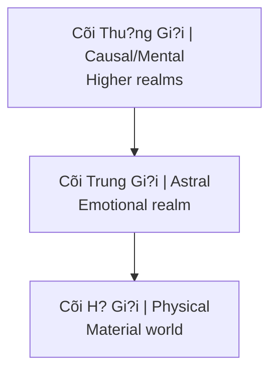

# Th?c Th? Cõi Trung Gi?i (Astral Entities)

**Th?c Th? Cõi Trung Gi?i** (Astral Entities) là các sinh linh t?n t?i ? t?n s? ngoài ph? nhìn th?y c?a con ngu?i. Trong nhi?u truy?n th?ng du?c g?i là Archons, demons, djinn, ký sinh trùng nang lu?ng.

## Trong Các Truy?n Th?ng

| Tradition | Name | Description |
|-----------|------|-------------|
| **Gnostic** | Archons | Rulers of material realm |
| **Christian** | Demons | Fallen angels |
| **Islamic** | Djinn | Made of smokeless fire |
| **Hindu** | Asuras, Rakshasas | Opposing forces |
| **Shamanic** | Spirits | Various entities |
| **Modern** | Energy vampires | Parasitic beings |

## Cõi Trung Gi?i (Astral Plane)

### V? trí trong cosmology / Position in Cosmology

### Ð?c di?m
- Frequency-based reality
- Thoughts create instantly
- Emotions are "food"
- Entities of various types

## Th?c Th? Ký Sinh

### Co ch? "an" nang lu?ng
- Low-frequency emotions = food source
- Fear, anger, lust, despair
- Addiction creates steady supply
- [[S? Th?t Ðen T?i V? Phim Khiêu Dâm]]

### Symptoms of Attachment
- Intrusive negative thoughts
- Compulsive behaviors
- Energy drain
- Personality changes
- Nightmares
- Unexplained anger/fear

### Common Entry Points
- Trauma (creates openings)
- Substance use (lowers defenses)
- Sexual activity (especially porn)
- Occult practices without protection
- Extreme negative environments

## Lo?i Th?c Th?

### 1. Larvae/Thought-forms
- Created by repetitive thoughts
- Feed on same emotional frequency
- Relatively weak
- Can be dissolved

### 2. Elemental Spirits
- Neutral, can be helpful or harmful
- Associated with nature
- Not inherently evil

### 3. Parasitic Entities
- Seek human energy
- Attach to aura
- Influence behavior to generate "food"

### 4. Higher Negative Entities
- Archons (Gnostic)
- Control matrix systems
- Use lower entities as agents

## Connection V?i [[Ma Tr?n]]

### Energy Harvesting System
- [[MindGeek]] = industrial-scale fear/lust generation
- Wars create mass trauma
- Financial stress = chronic fear
- Entertainment = emotional manipulation

### [[Quy Lu?t Trao Ð?i Tâm Linh]]
- Energy flows where attention goes
- Consuming dark content = feeding dark entities
- Every interaction is an exchange

## Protection & Cleansing

### Raise Vibration
- Positive emotions starve parasites
- Love, joy, gratitude
- They can't attach to high frequency

### Energy Hygiene
- Salt baths
- Sage/incense
- Sunlight exposure
- Grounding in nature

### Spiritual Practice
- Prayer/meditation
- Invoke higher protection
- Strengthen aura
- Shadow work ([[Individuation]])

### Lifestyle
- Reduce low-vibe content
- Clean environment
- Healthy relationships
- Purpose-driven life

## Related

- [[Quy Lu?t Trao Ð?i Tâm Linh]] - Exchange dynamics
- [[S? Th?t Ðen T?i V? Phim Khiêu Dâm]] - Industrial feeding
- [[Tà Linh]] - Detailed exploration
- [[Ma Tr?n]] - Bigger system
- [[Nang Lu?ng Tình D?c]] - What's being harvested
- [[Individuation]] - Protection through wholeness
