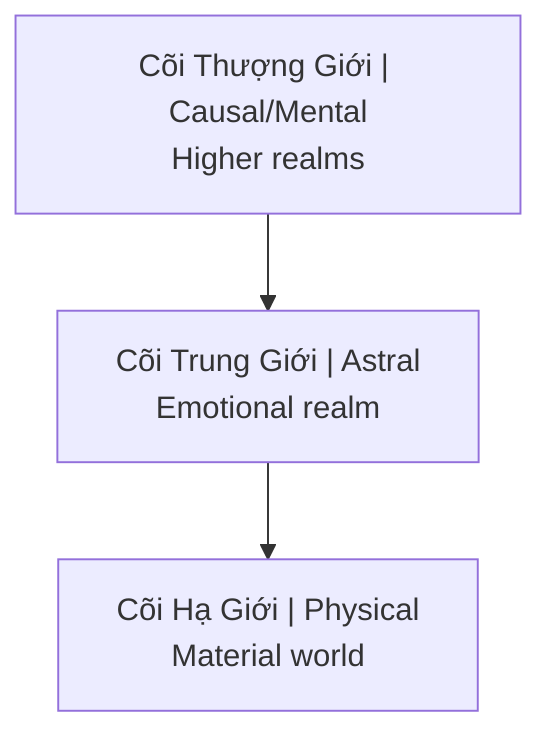

---
title: Thực Thể Cõi Trung Giới (Astral Entities)
date: 2026-04-07
tags: [esoterica]
status: refined
---
# Thực Thể Cõi Trung Giới (Astral Entities)

**Thực Thể Cõi Trung Giới** (Astral Entities) là các sinh linh tồn tại ở tần số ngoài phổ nhìn thấy của con người. Trong nhiều truyền thống được gọi là Archons, demons, djinn, ký sinh trùng năng lượng.

## Trong Các Truyền Thống

| Tradition | Name | Description |
|-----------|------|-------------|
| **Gnostic** | Archons | Rulers of material realm |
| **Christian** | Demons | Fallen angels |
| **Islamic** | Djinn | Made of smokeless fire |
| **Hindu** | Asuras, Rakshasas | Opposing forces |
| **Shamanic** | Spirits | Various entities |
| **Modern** | Energy vampires | Parasitic beings |

## Cõi Trung Giới (Astral Plane)

### Vị trí trong cosmology / Position in Cosmology

### Đặc điểm
- Frequency-based reality
- Thoughts create instantly
- Emotions are "food"
- Entities of various types

## Thực Thể Ký Sinh

### Cơ chế "ăn" năng lượng
- Low-frequency emotions = food source
- Fear, anger, lust, despair
- Addiction creates steady supply
- [[Sự Thật Đen Tối Về Phim Khiêu Dâm]]

### Symptoms of Attachment
- Intrusive negative thoughts
- Compulsive behaviors
- Energy drain
- Personality changes
- Nightmares
- Unexplained anger/fear

### Common Entry Points
- Trauma (creates openings)
- Substance use (lowers defenses)
- Sexual activity (especially porn)
- Occult practices without protection
- Extreme negative environments

## Loại Thực Thể

### 1. Larvae/Thought-forms
- Created by repetitive thoughts
- Feed on same emotional frequency
- Relatively weak
- Can be dissolved

### 2. Elemental Spirits
- Neutral, can be helpful or harmful
- Associated with nature
- Not inherently evil

### 3. Parasitic Entities
- Seek human energy
- Attach to aura
- Influence behavior to generate "food"

### 4. Higher Negative Entities
- Archons (Gnostic)
- Control matrix systems
- Use lower entities as agents

## Connection Với [[Ma Trận]]

### Energy Harvesting System
- [[MindGeek]] = industrial-scale fear/lust generation
- Wars create mass trauma
- Financial stress = chronic fear
- Entertainment = emotional manipulation

### [[Quy Luật Trao Đổi Tâm Linh]]
- Energy flows where attention goes
- Consuming dark content = feeding dark entities
- Every interaction is an exchange

## Protection & Cleansing

### Raise Vibration
- Positive emotions starve parasites
- Love, joy, gratitude
- They can't attach to high frequency

### Energy Hygiene
- Salt baths
- Sage/incense
- Sunlight exposure
- Grounding in nature

### Spiritual Practice
- Prayer/meditation
- Invoke higher protection
- Strengthen aura
- Shadow work ([[Individuation (Thành Toàn Bản Ngã)]])

### Lifestyle
- Reduce low-vibe content
- Clean environment
- Healthy relationships
- Purpose-driven life

## Related

- [[Quy Luật Trao Đổi Tâm Linh]] — Exchange dynamics
- [[Sự Thật Đen Tối Về Phim Khiêu Dâm]] — Industrial feeding
- [[Tà Linh (Energy Parasites)]] — Detailed exploration
- [[Ma Trận]] — Bigger system
- [[Năng Lượng Tình Dục]] — What's being harvested
- [[Individuation (Thành Toàn Bản Ngã)]] — Protection through wholeness
