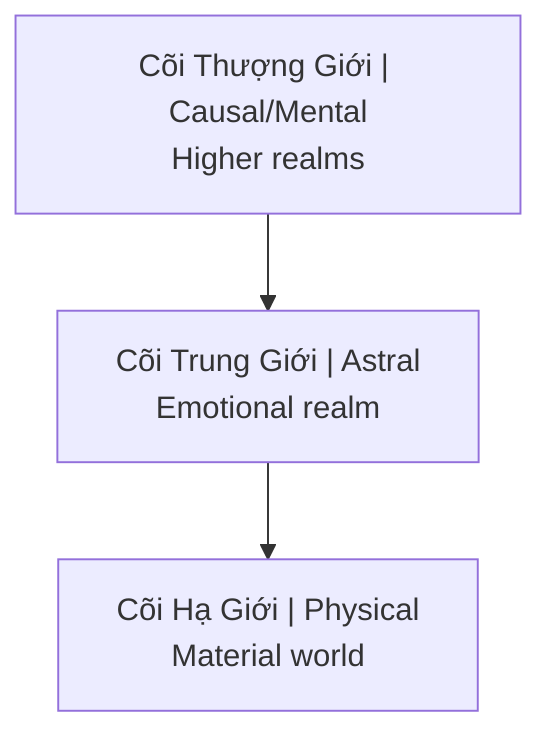

# Thực Thể Cõi Trung Giới (Astral Entities)

**Thực Thể Cõi Trung Giới** (Astral Entities) là các sinh linh tồn tại ở tần số ngoài phổ nhìn thấy của con người. Trong nhiều truyền thống được gọi là Archons, demons, djinn, ký sinh trùng năng lượng.

## Trong Các Truyền Thống

| Tradition | Name | Description |
|-----------|------|-------------|
| **Gnostic** | Archons | Rulers of material realm |
| **Christian** | Demons | Fallen angels |
| **Islamic** | Djinn | Made of smokeless fire |
| **Hindu** | Asuras, Rakshasas | Opposing forces |
| **Shamanic** | Spirits | Various entities |
| **Modern** | Energy vampires | Parasitic beings |

## Cõi Trung Giới (Astral Plane)

### Vị trí trong cosmology / Position in Cosmology

### Đặc điểm
- Frequency-based reality
- Thoughts create instantly
- Emotions are "food"
- Entities of various types

## Thực Thể Ký Sinh

### Cơ chế "ăn" năng lượng
- Low-frequency emotions = food source
- Fear, anger, lust, despair
- Addiction creates steady supply
- [[Sự Thật Đen Tối Về Phim Khiêu Dâm]]

### Symptoms of Attachment
- Intrusive negative thoughts
- Compulsive behaviors
- Energy drain
- Personality changes
- Nightmares
- Unexplained anger/fear

### Common Entry Points
- Trauma (creates openings)
- Substance use (lowers defenses)
- Sexual activity (especially porn)
- Occult practices without protection
- Extreme negative environments

## Loại Thực Thể

### 1. Larvae/Thought-forms
- Created by repetitive thoughts
- Feed on same emotional frequency
- Relatively weak
- Can be dissolved

### 2. Elemental Spirits
- Neutral, can be helpful or harmful
- Associated with nature
- Not inherently evil

### 3. Parasitic Entities
- Seek human energy
- Attach to aura
- Influence behavior to generate "food"

### 4. Higher Negative Entities
- Archons (Gnostic)
- Control matrix systems
- Use lower entities as agents

## Connection Với [[Ma Trận]]

### Energy Harvesting System
- [[MindGeek]] = industrial-scale fear/lust generation
- Wars create mass trauma
- Financial stress = chronic fear
- Entertainment = emotional manipulation

### [[Quy Luật Trao Đổi Tâm Linh]]
- Energy flows where attention goes
- Consuming dark content = feeding dark entities
- Every interaction is an exchange

## Protection & Cleansing

### Raise Vibration
- Positive emotions starve parasites
- Love, joy, gratitude
- They can't attach to high frequency

### Energy Hygiene
- Salt baths
- Sage/incense
- Sunlight exposure
- Grounding in nature

### Spiritual Practice
- Prayer/meditation
- Invoke higher protection
- Strengthen aura
- Shadow work ([[Individuation]])

### Lifestyle
- Reduce low-vibe content
- Clean environment
- Healthy relationships
- Purpose-driven life

## Evidence Discipline / Cách Đọc

Thực thể cõi trung giới là chủ đề phải giữ ranh giới rõ. Tầng truyền thống: nhiều nền văn hóa độc lập đều mô tả sinh linh vô hình, ký sinh, djinn, demon, archon hoặc spirit. Tầng tâm lý: một phần trải nghiệm có thể được đọc như trauma, dissociation, intrusive thoughts, addiction loop hoặc projection của shadow. Tầng năng lượng: một số thực hành huyền học đọc các hiện tượng đó như tương tác tần số thật giữa người và trường vô hình.

Kỷ luật của vault là không dùng "tà linh" để trốn trách nhiệm tâm lý, và không dùng "tâm lý" để phủ định mọi trải nghiệm vượt ngoài mô hình duy vật. Nếu một người có triệu chứng nguy hiểm, mất ngủ nặng, nghe lệnh tự hại hoặc mất kiểm soát hành vi, ưu tiên an toàn và hỗ trợ chuyên môn. Nếu hiện tượng nằm ở tầng năng lượng tinh tế, vẫn cần quan sát lạnh: nó tăng sau nội dung nào, môi trường nào, quan hệ nào, chất kích thích nào, và giảm khi có kỷ luật sống nào?

## Map Position / Vị Trí Trong Vault

Node này nối [[Tà Linh]], [[Gnosis]], [[Quy Luật Trao Đổi Tâm Linh]], [[Năng Lượng Tình Dục]] và [[Individuation]]. Nó giúp phân biệt spiritual warfare với fantasy. Ma Trận không cần phải có quỷ literal mới vận hành được; chỉ cần con người bị kéo xuống sợ hãi, dục vọng, nghiện và căm ghét là đủ tạo "thức ăn" cho các hệ thống ký sinh.

Thực hành trưởng thành là vệ sinh năng lượng cộng với shadow work. Người chỉ đốt sage nhưng không nhìn addiction sẽ lặp vòng. Người chỉ phân tích tâm lý nhưng sống trong nội dung độc, quan hệ độc và môi trường độc cũng khó sạch. Bảo vệ thật bắt đầu từ attention: thứ mình nhìn, ăn, nghe, ham muốn và lặp lại hằng ngày chính là cánh cửa.

## Related

- [[Quy Luật Trao Đổi Tâm Linh]] — Exchange dynamics
- [[Sự Thật Đen Tối Về Phim Khiêu Dâm]] — Industrial feeding
- [[Tà Linh]] — Detailed exploration
- [[Ma Trận]] — Bigger system
- [[Năng Lượng Tình Dục]] — What's being harvested
- [[Individuation]] — Protection through wholeness
