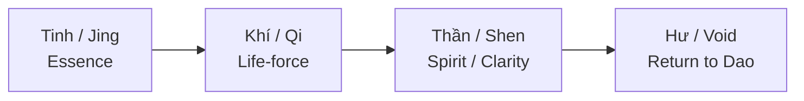

# Tinh Khí Thần (Three Treasures)

**Tinh Khí Thần là Tam Bảo của con người trong Đạo gia: Tinh là essence/sinh lực gốc, Khí là dòng năng lượng vận hành, Thần là clarity/consciousness. Đây không phải ba “chất” tách rời, mà là ba tầng chuyển hóa của cùng một sinh lực.**

*Jing-Qi-Shen are the Three Treasures in Taoist cultivation: Jing is essence/root vitality, Qi is circulating life-force, and Shen is clarity/consciousness. They are not three separate substances, but three transformational layers of the same life-force.*

---

## Vault Position / Vị Trí Trong Vault

Trong redpill.wiki, **Tinh Khí Thần** là node nối [[Đạo]], [[Năng Lượng Tình Dục]], [[S.E.X]], [[Tuyến Tùng]], [[Individuation]] và health sovereignty.

Nó giải thích vì sao tình dục, ăn ngủ, stress, breath, movement, meditation và spiritual clarity không thể tách rời.

> Một người không giữ được Tinh thì Khí loạn. Khí loạn thì Thần mờ. Thần mờ thì Ma Trận dễ kéo dây.

---

## 1. Tam Bảo Là Gì?

| Treasure | Nghĩa gần đúng | Tầng |
|---|---|---|
| **Tinh / Jing** | essence, reproductive vitality, deep reserves | body/root |
| **Khí / Qi** | life-force, movement, breath, circulation | energy/process |
| **Thần / Shen** | spirit, clarity, consciousness, radiance | mind/spirit |

Không nên hiểu Tinh chỉ là tinh dịch, Khí chỉ là hơi thở, Thần chỉ là suy nghĩ. Đó là cách dịch quá hẹp.

Tinh là vốn gốc. Khí là dòng vận hành. Thần là ánh sáng nhận biết.

---

## 2. Tinh / Jing

Tinh là reservoir sâu: sinh lực, khả năng phục hồi, reproductive essence, genetic/ancestral vitality.

Tinh bị hao bởi:

- overwork,
- thiếu ngủ,
- stress mạn tính,
- xuất tinh/sex vô độ,
- porn/dopamine hijack,
- bệnh kéo dài,
- ăn uống nghèo khoáng,
- sống nghịch nhịp.

Tinh được nuôi bởi:

- ngủ sâu,
- ăn đủ chất,
- moderation,
- sexual discipline,
- solitude,
- thở chậm,
- sống thuận [[Đạo]].

Trong vault, Tinh liên quan trực tiếp tới [[Năng Lượng Tình Dục]] và [[Sự Thật Đen Tối Về Phim Khiêu Dâm]].

---

## 3. Khí / Qi

Khí là dòng vận hành. Nếu Tinh là fuel, Khí là circulation.

Khí đi qua hơi thở, máu, fascia, kinh mạch, posture, movement, emotion.

Khí tắc khi:

- cảm xúc bị nén,
- trauma chưa xử lý,
- ít vận động,
- thở nông,
- ăn quá nặng,
- sống trong fear/outrage loop.

Khí thông khi:

- thở sâu,
- đi bộ,
- qigong/tai chi/yoga,
- khóc/giận đúng cách,
- bodywork,
- sống gần thiên nhiên.

Khí là nơi health gặp psychology. Một người có thể “biết” rất nhiều nhưng khí tắc thì vẫn sống kẹt.

---

## 4. Thần / Shen

Thần là clarity, presence, spiritual radiance. Thần hiện qua ánh mắt, giọng nói, sự an định, khả năng thấy pattern mà không panic.

Thần mờ khi:

- ngủ thiếu,
- nghiện dopamine,
- overthinking,
- guilt/shame,
- trauma,
- sex loạn,
- food độc,
- media outrage.

Thần sáng khi:

- Tinh đủ,
- Khí thông,
- tâm yên,
- sống thật,
- shadow bớt split,
- connection với Source rõ hơn.

Đây là nơi Tinh Khí Thần nối với [[Gnosis]] và [[Tuyến Tùng]].

---

## 5. Chuyển Hóa: Tinh → Khí → Thần

Đạo gia nói về quá trình luyện:

Không phải đàn áp dục tính. Không phải ghét body. Mà là không để sinh lực rơi xuống loop thấp nhất mãi.

Sexual transmutation đúng không phải “không bao giờ sex”. Nó là biết energy đang đi đâu: tiêu tán, bonding, sáng tạo, healing, hay spiritual refinement.

---

## 6. S.E.X Và Tam Bảo

Trong [[S.E.X]] và [[S.E.X Và Tâm Lý Học Jung]], sex không chỉ là physical act. Nó là energy exchange.

Khi hai người giao hợp, không chỉ Tinh trao đổi. Khí và Thần cũng bị ảnh hưởng:

- body chemistry,
- emotional imprint,
- trauma residue,
- bonding hormones,
- energetic entanglement,
- archetypal projection.

Đây là lý do cổ nhân xem tình dục là thiêng. Không phải vì sợ sex, mà vì hiểu sex là cửa trao đổi Tam Bảo.

---

## 7. Ma Trận Tấn Công Tam Bảo Như Nào?

| Treasure | Cách bị drain |
|---|---|
| Tinh | porn, hookup culture, overwork, sleep debt |
| Khí | sedentary life, processed food, suppressed emotion |
| Thần | social media, outrage, fear, nihilism, spiritual confusion |

[[Ma Trận]] không cần lấy hết năng lượng của một người trong một lần. Nó chỉ cần làm rò rỉ mỗi ngày.

---

## 8. Practice / Thực Hành

1. Ngủ trước khi nói chuyện “nâng tần số”.
2. Giảm porn/dopamine drain.
3. Thở bụng, đi bộ, ra nắng.
4. Ăn đủ khoáng/protein/fat tốt.
5. Làm shadow work để Khí không bị nghẽn trong emotion.
6. Thiền nhẹ để Thần sáng nhưng không spiritual bypass.
7. Chọn sexual exchange có ý thức.

---

## Synthesis

Tinh Khí Thần là một model cổ nhưng rất thực tế. Nó nói rằng spiritual clarity không thể tách khỏi body reserve và energy flow.

Muốn thấy rõ, không chỉ cần đọc nhiều. Phải giữ được Tinh, thông được Khí, sáng được Thần.

> Tam Bảo không phải thứ để khoe. Nó là vốn sống. Mất nó thì dù biết bao nhiêu red pill, người ta vẫn bị Ma Trận kéo đi.

---

## Related

- [[Đạo]]
- [[S.E.X]]
- [[S.E.X Và Tâm Lý Học Jung]]
- [[Năng Lượng Tình Dục]]
- [[Tuyến Tùng]]
- [[Individuation]]
- [[MOC - Esoterica & Consciousness]]
