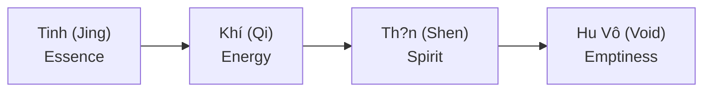

# Tinh Khí Th?n (Three Treasures)

**Tinh Khí Th?n** là "Tam B?o" c?a con ngu?i theo Ð?o giáo - nh?ng th? phi v?t ch?t không th? th?y nhung có th? c?m nh?n qua nang lu?ng.

*Jing Qi Shen are the "Three Treasures" in Taoism - non-physical things invisible but perceivable through energy.*

---

## Ba Báu v?t / The Three Treasures

| Treasure | Chinese | Description |
|----------|---------|-------------|
| **Tinh** | ? Jing | Essence, semen, DNA / Tinh túy, tinh d?ch, DNA |
| **Khí** | ? Qi | Life energy, circulation / Nang lu?ng s?ng, luu thông |
| **Th?n** | ? Shen | Spirit, consciousness / Tinh th?n, ý th?c cao c?p |

---

## Chi ti?t / Details

### Tinh (Jing) - Essence / Tinh túy

| Aspect | Description |
|--------|-------------|
| **Physical** | Reproductive fluids, DNA |
| **Function** | Foundation of life / N?n t?ng s? s?ng |
| **Depleted by** | Excess sex, overwork, stress |
| **Cultivated by** | Rest, nutrition, moderation |

### Khí (Qi) - Energy / Nang lu?ng

| Aspect | Description |
|--------|-------------|
| **Flow** | Circulates through meridians / Luu thông qua kinh m?ch |
| **Function** | Powers all life processes |
| **Blocked by** | Emotions, injury, toxins |
| **Cultivated by** | Breathwork, tai chi, qigong |

### Th?n (Shen) - Spirit / Tinh th?n

| Aspect | Description |
|--------|-------------|
| **Location** | Resides in heart / Ng? trong tim |
| **Function** | Consciousness, wisdom / Ý th?c, trí tu? |
| **Disturbed by** | Anxiety, overthinking |
| **Cultivated by** | Meditation, virtue / Thi?n d?nh, d?c h?nh |

---

## Transformation / Chuy?n hóa

### Taoist Alchemy / Luy?n dan Ð?o giáo

### Practice / Th?c hành

| Stage | Method |
|-------|--------|
| **Refine Jing** | Sexual transmutation, diet |
| **Cultivate Qi** | Breathwork, movement |
| **Nurture Shen** | Meditation, stillness |
| **Return to Void** | Non-attachment, enlightenment |

---

## C?m nh?n / Perception

| Experience | Meaning |
|------------|---------|
| **Peace from master** | Strong Shen / Th?n m?nh |
| **Unease from criminal** | Disturbed energy |
| **No words needed** | Energy speaks / Nang lu?ng nói |

---

## [[S.E.X]] và Tinh Khí Th?n

### Sacred Energy eXchange

| Principle | Description |
|-----------|-------------|
| **Exchange at all 3 levels** | Tinh, Khí, Th?n all involved |
| **"Tam tinh thành nh?t d?c"** | Mixed energy = weakened treasures |
| **Quality > Quantity** | Choose partners wisely |

### Conservation / B?o t?n

| Method | Benefit |
|--------|---------|
| **Retention** | Preserve Jing |
| **Transmutation** | Convert to higher energy |
| **Selective exchange** | Protect all three treasures |

---

## Related

### Energy / Nang lu?ng
- [[Nang Lu?ng Natri]]
- [[Nang Lu?ng Tình D?c]]
- [[Tuy?n Tùng]] - Shen connection

### Sex & Energy
- [[S.E.X Và Tâm Lý H?c Jung]]
- [[S? Th?t Ðen T?i V? Phim Khiêu Dâm]]
- [[Chimera]] - Energy mixing

### Wisdom / Trí tu?
- [[Trí Tu?]]
- [[Individuation]]
