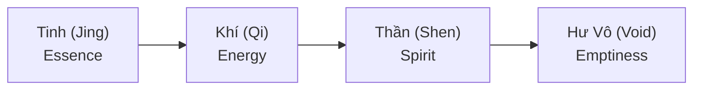

---
title: Tinh Khí Thần
aliases: ["Three Treasures", "Jing Qi Shen", "Tam Bảo"]
date: 2026-04-07
tags: [esoterica]
status: refined
related:
  - "[[S.E.X]]"
  - "[[Năng Lượng Tình Dục]]"
  - "[[Năng Lượng Natri]]"
---
# Tinh Khí Thần (Three Treasures)

**Tinh Khí Thần** là "Tam Bảo" của con người theo Đạo giáo — những thứ phi vật chất không thể thấy nhưng có thể cảm nhận qua năng lượng.

*Jing Qi Shen are the "Three Treasures" in Taoism — non-physical things invisible but perceivable through energy.*

---

## Ba Báu vật / The Three Treasures

| Treasure | Chinese | Description |
|----------|---------|-------------|
| **Tinh** | 精 Jing | Essence, semen, DNA / Tinh túy, tinh dịch, DNA |
| **Khí** | 氣 Qi | Life energy, circulation / Năng lượng sống, lưu thông |
| **Thần** | 神 Shen | Spirit, consciousness / Tinh thần, ý thức cao cấp |

---

## Chi tiết / Details

### Tinh (Jing) — Essence / Tinh túy

| Aspect | Description |
|--------|-------------|
| **Physical** | Reproductive fluids, DNA |
| **Function** | Foundation of life / Nền tảng sự sống |
| **Depleted by** | Excess sex, overwork, stress |
| **Cultivated by** | Rest, nutrition, moderation |

### Khí (Qi) — Energy / Năng lượng

| Aspect | Description |
|--------|-------------|
| **Flow** | Circulates through meridians / Lưu thông qua kinh mạch |
| **Function** | Powers all life processes |
| **Blocked by** | Emotions, injury, toxins |
| **Cultivated by** | Breathwork, tai chi, qigong |

### Thần (Shen) — Spirit / Tinh thần

| Aspect | Description |
|--------|-------------|
| **Location** | Resides in heart / Ngự trong tim |
| **Function** | Consciousness, wisdom / Ý thức, trí tuệ |
| **Disturbed by** | Anxiety, overthinking |
| **Cultivated by** | Meditation, virtue / Thiền định, đức hạnh |

---

## Transformation / Chuyển hóa

### Taoist Alchemy / Luyện đan Đạo giáo

### Practice / Thực hành

| Stage | Method |
|-------|--------|
| **Refine Jing** | Sexual transmutation, diet |
| **Cultivate Qi** | Breathwork, movement |
| **Nurture Shen** | Meditation, stillness |
| **Return to Void** | Non-attachment, enlightenment |

---

## Cảm nhận / Perception

| Experience | Meaning |
|------------|---------|
| **Peace from master** | Strong Shen / Thần mạnh |
| **Unease from criminal** | Disturbed energy |
| **No words needed** | Energy speaks / Năng lượng nói |

---

## [[S.E.X]] và Tinh Khí Thần

### Sacred Energy eXchange

| Principle | Description |
|-----------|-------------|
| **Exchange at all 3 levels** | Tinh, Khí, Thần all involved |
| **"Tam tinh thành nhất độc"** | Mixed energy = weakened treasures |
| **Quality > Quantity** | Choose partners wisely |

### Conservation / Bảo tồn

| Method | Benefit |
|--------|---------|
| **Retention** | Preserve Jing |
| **Transmutation** | Convert to higher energy |
| **Selective exchange** | Protect all three treasures |

---

## Related

### Energy / Năng lượng
- [[Năng Lượng Natri]]
- [[Năng Lượng Tình Dục]]
- [[Tuyến Tùng]] — Shen connection

### Sex & Energy
- [[S.E.X Và Tâm Lý Học Jung]]
- [[Sự Thật Đen Tối Về Phim Khiêu Dâm]]
- [[Chimera]] — Energy mixing

### Wisdom / Trí tuệ
- [[Trí Tuệ]]
- [[Individuation]]
