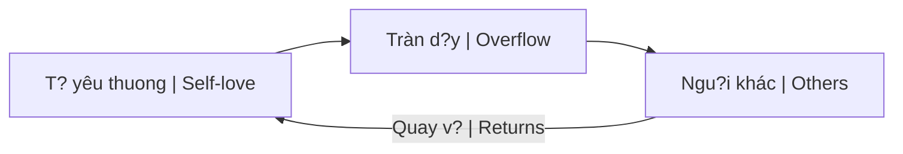

# Tình Yêu T?nh Th?c (Conscious Love)

**Tình Yêu T?nh Th?c** không ph?i c?m xúc chi?m h?u hay ràng bu?c, mà là nang lu?ng thang hoa xu?t phát t? s? th?u hi?u, ch?p nh?n và bao dung sâu s?c.

## Phân Bi?t Các Lo?i Tình Yêu

### Greek Words for Love

| Greek | Type | Description |
|-------|------|-------------|
| **Eros** | Romantic/Sexual | Passionate, can become obsessive |
| **Philia** | Friendship | Mutual respect, shared interests |
| **Storge** | Familial | Parent-child, family bonds |
| **Ludus** | Playful | Flirting, early romance |
| **Pragma** | Mature | Long-standing, committed |
| **Philautia** | Self-love | Healthy or narcissistic |
| **Agape** | Unconditional | **Conscious Love** |

### Agape = Tình Yêu T?nh Th?c
- Không di?u ki?n
- Không mong dáp l?i
- Vu?t qua ego
- Universal compassion

## Ð?c Ði?m

### 1. Không Chi?m H?u
- "I love you" ? "I own you"
- Freedom within connection
- Trust, not control
- Joy in partner's joy

### 2. Không K? V?ng
- Love as giving, not trading
- No score-keeping
- Accept as-is
- Not transactional

### 3. K?t H?p [[Trí Tu?]]
- Love without wisdom = enabling
- Wisdom without love = cold
- Both needed for true compassion
- Discerning, not naive

## S?c M?nh Ch?a Lành

### Hóa Gi?i [[Nhân Qu?]]
- Forgiveness breaks karma chains
- Love dissolves resentment
- End generational trauma
- Only force that truly heals

### Self-Love First

- Can't pour from empty cup
- Not selfish, necessary
- [[Individuation]] includes this

### Healing Trauma
- Love creates safety
- Safety allows processing
- Processing allows release
- Release allows growth

## Vu?t Qua [[Nh? Nguyên]]

### Beyond Good/Bad
- Love even "enemies"
- See humanity in all
- Understand, not judge
- Compassion for ignorance

### In Relationships
- Partner not "my other half"
- Two wholes choosing to share
- Not completing each other
- Growing together

## Practical Application

### Daily Practice
- Metta meditation (loving-kindness)
- Gratitude journal
- Acts of service
- Presence with loved ones

### In Conflict
- Pause before reacting
- Seek to understand
- Separate person from behavior
- Address with compassion

### Toward Self
- Inner critic ? Inner supporter
- Forgive past mistakes
- Celebrate small wins
- Rest without guilt

## Tình Yêu và Ma Tr?n

### [[Ma Tr?n]] Fears Love
- Love unites (Matrix divides)
- Love raises vibration (Matrix lowers)
- Love sees truth (Matrix obscures)
- Love sets free (Matrix enslaves)

### Revolutionary Act
- Loving in a fearful world
- Choosing compassion over hatred
- Building genuine connections
- [[Elite]] can't harvest love energy

## Related

- [[Hành Trình Linh H?n và S?c M?nh C?a Tình Yêu T?nh Th?c]]
- [[Nhân Qu?]] - What love dissolves
- [[Nh? Nguyên]] - What love transcends
- [[Trí Tu?]] - Love's companion
- [[Individuation]] - Self-love as foundation
- [[S? Nh?t Th?]] - Ultimate expression of love
