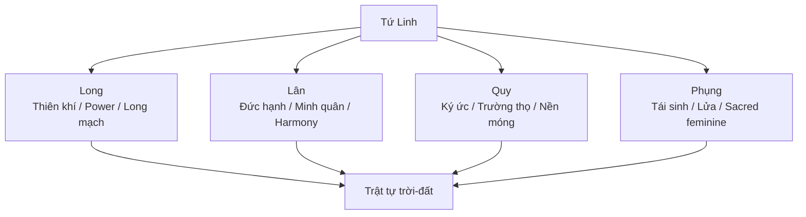

# Tứ Linh

**Tứ Linh gồm Long, Lân, Quy, Phụng: bốn archetype linh vật trong văn hóa Á Đông, mã hóa quan hệ giữa thiên khí, địa khí, vương quyền, đạo đức, trường thọ và tái sinh. Đây không chỉ là motif trang trí. Nó là symbolic technology của một nền văn hóa từng đọc thế giới như một cơ thể sống.**

*The Four Sacred Animals — Dragon, Qilin, Turtle, Phoenix — encode the relationship between heavenly force, earth energy, kingship, virtue, longevity, and rebirth. They are not mere decoration, but symbolic technology from a culture that once read the world as a living body.*

---

## Vault Position / Vị Trí Trong Vault

Trong redpill.wiki, **Tứ Linh** nằm ở giao điểm của symbolism, [[Long Mạch]], [[Phong Thủy]], hidden history và consciousness.

Nếu [[Đạo]] là dòng vận hành tự nhiên, thì Tứ Linh là bốn biểu tượng giúp con người đọc dòng đó qua hình ảnh:

- Long: thiên khí và trục trời-đất
- Lân: đức hạnh và minh quân
- Quy: ký ức, trường thọ, nền móng
- Phụng: tái sinh, lửa, phẩm chất nữ tính thiêng liêng

> Tứ Linh là ký ức biểu tượng của một nền văn hóa từng không tách vật chất khỏi tâm linh.

---

## 1. Vì Sao Linh Vật Quan Trọng?

Người hiện đại thường nhìn linh vật như folklore. Nhưng trong các nền văn minh cổ, linh vật là language.

Chúng giúp encode:

- quy luật thiên nhiên,
- quyền lực chính trị,
- phẩm chất đạo đức,
- chu kỳ vũ trụ,
- cấu trúc năng lượng của đất,
- archetype trong vô thức tập thể.

Một con rồng trên mái đình không chỉ để đẹp. Nó nhắc rằng công trình đó nằm trong quan hệ với trời, nước, mưa, vua, long mạch và protection.

Đây là cách symbolic architecture hoạt động: không giải thích bằng paragraph, mà imprint vào subconscious qua hình, hướng, vật liệu, nghi lễ và vị trí.

---

## 2. Long / Dragon

**Long** là linh vật mạnh nhất trong Tứ Linh. Nó nối trời, nước, mưa, vua, khí và [[Long Mạch]].

| Tầng | Ý nghĩa |
|---|---|
| Thiên nhiên | mưa, sông, nước, mây, sấm |
| Địa khí | long mạch, dòng năng lượng của đất |
| Chính trị | vương quyền, thiên mệnh |
| Tâm linh | lực sống, kundalini, trục trời-đất |
| Hidden history | ký ức về serpent/dragon beings, naga, ancient knowledge |

Rồng Á Đông khác dragon phương Tây. Dragon phương Tây thường bị biến thành quái vật cần giết. Rồng Á Đông là lực thiêng cần hiểu, kính và điều hòa.

Đây là một khác biệt symbolic rất lớn: một nền văn hóa giết serpent, một nền văn hóa cưỡi/điều long.

---

## 3. Lân / Qilin

**Lân** thường xuất hiện như điềm lành, gắn với minh quân, đạo đức và thời kỳ thái bình.

Lân không phải sức mạnh thô. Nó là quyền lực đã được đạo đức hóa.

| Tầng | Ý nghĩa |
|---|---|
| Đạo đức | nhân từ, chính trực, không sát hại vô cớ |
| Chính trị | minh quân, trị vì thuận Đạo |
| Xã hội | điềm lành, harmony, order |
| Tâm lý | sức mạnh nhưng không hung bạo |

Trong vault, Lân là biểu tượng của một dạng power khác với [[Elite]]. Elite dùng control. Lân đại diện cho authority có đạo, nơi quyền lực không tách khỏi trách nhiệm tâm linh.

---

## 4. Quy / Turtle

**Quy** là ký ức sâu, trường thọ, nền móng và thời gian dài.

Rùa mang nhà trên lưng. Nó chậm nhưng bền. Trong nhiều truyền thống, turtle liên quan tới world-supporting animal: sinh thể chống đỡ thế giới hoặc mang ký ức của đất.

| Tầng | Ý nghĩa |
|---|---|
| Thời gian | trường thọ, patience, deep cycles |
| Địa lý | nền móng, đất, stability |
| Tri thức | ký ức cổ, wisdom, record-keeping |
| Việt Nam | Kim Quy, Hồ Gươm, gươm thần, thiên mệnh |

Trong hidden history, Quy nhắc rằng civilization không chỉ chạy theo speed. Một nền văn minh mất ký ức sẽ dễ bị reset.

---

## 5. Phụng / Phoenix

**Phụng** là tái sinh, lửa, beauty, feminine sacred power và chu kỳ chết-sống.

Phụng không chỉ là chim đẹp. Nó là archetype của refinement: lửa đốt cái cũ để sinh cái mới.

| Tầng | Ý nghĩa |
|---|---|
| Tâm linh | tái sinh, purification, spiritual fire |
| Nữ tính thiêng | grace, beauty, creative order |
| Chính trị | hoàng hậu, balance với Long |
| Alchemy | chết đi rồi tái cấu trúc ở tầng cao hơn |

Nếu Long là trục trời-đất, Phụng là lửa chuyển hóa. Một bên là power, một bên là refinement. Một nền văn minh cần cả hai.

---

## 6. Tứ Linh Như Một Hệ Thống

Tứ Linh không nên đọc riêng lẻ. Chúng là một mandala văn hóa.

Bốn linh vật cùng giữ một cosmology:

- power phải có Đạo,
- longevity phải có memory,
- rebirth phải có purification,
- civilization phải gắn với trời-đất chứ không chỉ GDP.

---

## 7. Ma Trận Làm Gì Với Tứ Linh?

[[Ma Trận]] không nhất thiết xóa biểu tượng. Nó thường làm biểu tượng rỗng đi.

- Rồng thành logo du lịch.
- Lân thành múa khai trương.
- Quy thành chuyện cổ tích trẻ em.
- Phụng thành hoa văn áo dài.

Không phải các hình thức đó sai. Nhưng khi mất tầng meaning, symbol thành décor. Một nền văn hóa vẫn giữ hình nhưng mất memory.

Đây là cách symbolic amnesia hoạt động: không cần phá đình chùa nếu có thể khiến thế hệ sau không còn đọc được ngôn ngữ trên mái đình.

---

## Synthesis

Tứ Linh là một bản đồ nén của cosmology Á Đông: thiên khí, địa khí, đạo đức, ký ức và tái sinh.

Trong vault, nó nối [[Đạo]], [[Long Mạch]], [[Phong Thủy]], [[Nhân Quả]], [[Luân Hồi]] và hidden history. Nó nhắc rằng người xưa không sống trong một thế giới “vật chất chết”. Họ sống trong một reality có khí, linh, điềm, cycle và trách nhiệm.

> Khi một nền văn hóa quên cách đọc linh vật của mình, nó không chỉ mất folklore. Nó mất một phần operating system tâm linh.

---

## Related

- [[Đạo]]
- [[Long Mạch]]
- [[Phong Thủy]]
- [[Nhân Quả]]
- [[Luân Hồi]]
- [[MOC - Ancient Civilizations & Hidden History]]
- [[MOC - Esoterica & Consciousness]]
