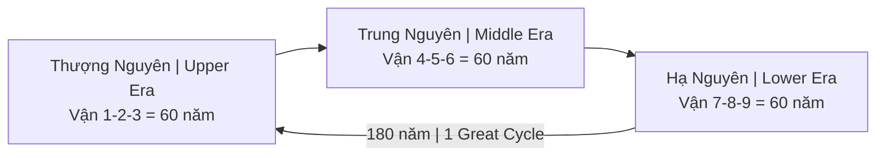

# Vận Chín (Period 9 / 九運)

**Vận Chín** là giai đoạn 20 năm từ 2024 đến 2044 theo hệ thống Phong thủy Tam nguyên Cửu vận (三元九運). Đại diện cho hành Hỏa (火), quẻ Li (離).

## Hệ Thống Tam Nguyên Cửu Vận

### Cấu trúc

### Vận 9 trong context
| Vận | Năm | Hành | Quẻ | Đặc điểm |
|-----|-----|------|-----|----------|
| 7 | 1984-2003 | Kim | Đoài | Verbal, entertainment |
| 8 | 2004-2023 | Thổ | Cấn | Real estate, wealth |
| **9** | **2024-2043** | **Hỏa** | **Li** | **Light, truth, exposure** |
| 1 | 2044-2063 | Thủy | Khảm | New beginning |

## Tính Chất Vận 9

### Hỏa = Ánh sáng, Minh bạch
- Mọi thứ bị phơi bày
- Không thể giấu
- Scandals, leaks, disclosure
- "Cockroaches scatter when light comes"

### Li Quẻ = 離
- Means: Attachment/Separation
- Fire, Sun, Lightning
- Middle daughter
- Eyes, heart, intelligence

## Industries Thịnh/Suy

### Thịnh (Fire energy aligned)
- **Technology** (data = light)
- **Media/Content** (storytelling)
- **Education** (spreading knowledge)
- **Healthcare** (heart, eyes, blood)
- **Beauty/Fashion** (appearance)
- **Culture/Arts** (creativity)
- **Mental health** (inner work)

### Suy (Earth energy declining)
- Real estate (Vận 8 over)
- Mining, construction
- Heavy industry
- Hoarding wealth

## 5 Năng Lực Sống Còn

### 1. Chữa lành tự nhiên
- Return to nature
- Detox (physical & mental)
- [[Thuyết Vi Sinh Nội Sinh]]
- [[Plasma Quinton]]

### 2. Tư duy sáng tạo
- Storytelling with soul
- Authentic content
- AI can't replicate genuineness
- Human touch premium

### 3. Kết nối cảm xúc
- Deep connection over wide reach
- 1000 true fans > 1M followers
- Community over audience
- Heart intelligence

### 4. Nội tâm vững vàng
- [[Tâm bất Biến]]
- Center in information storm
- Discernment
- Not swayed by trends

### 5. Ảnh hưởng cá nhân sâu
- Authenticity recognizable
- "Real" stands out in fake sea
- Trust = new currency

## Alignment với Other Systems

### [[Chu Kỳ Hoàng Đạo]]
- Pisces → Aquarius transition
- Age of truth, awakening
- Same energy as Vận 9

### Mayan Calendar
- 2012 shift
- New era of consciousness

### Kali Yuga End?
- Darkest age ending
- Golden age beginning?

## Practical Guidance

### Career
- Move toward Fire industries
- Build personal brand (authenticity)
- Content creation
- Education, healing

### Investment
- Tech, media, healthcare
- Reduce real estate exposure
- Digital assets ([[Bitcoin]]?)

### Personal
- Inner work priority
- Speak truth
- Build genuine connections
- Health (eyes, heart, blood)

## Related

- [[Vận Chín, Người Kogi và Ma Trận Y Tế]] — Deep dive
- [[Chu Kỳ Hoàng Đạo]] — Cosmic alignment
- [[Tâm bất Biến]] — Inner stability
- [[Trí Tuệ]] — Wisdom over intelligence
- [[Bitcoin]] — Digital fire?
