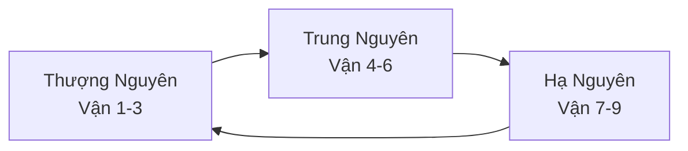
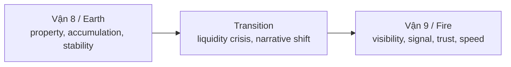

# Vận Chín (Period 9 / 九運)

**Vận Chín là khung Phong thủy đọc giai đoạn 2024-2044 như thời kỳ Hỏa: ánh sáng, tốc độ, hình ảnh, phơi bày, tim-mắt-máu, reputation và cuộc chiến giữa thật với giả.** Trong vault, Vận Chín không được dùng để "dự đoán chắc chắn", mà như một lens đọc nhịp biến động cùng [[Chu Kỳ Hoàng Đạo]], [[Báo Cáo 2030]], [[AI]] và [[Y Tế Tự Nhiên]].

*Period 9 reads 2024-2044 as a Fire cycle: light, speed, image, exposure, heart-eyes-blood, reputation, and the battle between real and fake.*

---

## Vault Position / Vị Trí Trong Bản Đồ

Bài này đặt [[Phong Thủy]] vào cùng bàn với [[AI]], [[Báo Cáo 2030]], [[Karma Disclosure - Truth Hidden In Plain Sight]] và [[Y Tế Tự Nhiên]]. Nó không dùng Cửu Vận như lịch tiên tri đóng đinh, mà như một **bản đồ attention**: thời nào loại năng lượng nào được khuếch đại, loại giả mạo nào dễ bị phơi, và loại người nào dễ bị chính ánh sáng làm mù.

Vì vậy câu hỏi của Vận 9 không phải "ngành nào chắc thắng?" mà là: trong một chu kỳ Fire, cái gì có signal thật, cái gì chỉ là spectacle, và ai giữ được thân-tâm khi tốc độ tăng?

---

## Evidence Discipline / Cách Đọc

| Tầng | Cách đọc |
|---|---|
| Tradition | Tam Nguyên Cửu Vận là hệ thống Phong thủy chu kỳ 180 năm, chia thành 9 vận, mỗi vận 20 năm |
| Pattern | Hỏa là lens đọc visibility, attention, tech, media, beauty, heart, eyes, scandal |
| Symbol | Quẻ Ly nói về sáng rõ nhưng cũng về bám víu / chia ly |
| Speculative synthesis | Nối Vận 9 với disclosure, AI, Agenda 2030 hoặc spiritual shift là diễn giải vault, không phải định luật |

---

## Hệ Tam Nguyên Cửu Vận

| Vận | Năm | Hành | Quẻ | Theme |
|---|---|---|---|---|
| 7 | 1984-2003 | Kim | Đoài | miệng, entertainment, finance, pleasure |
| 8 | 2004-2023 | Thổ | Cấn | đất, property, accumulation, mountain |
| 9 | 2024-2044 | Hỏa | Ly | light, visibility, exposure, image, heart |

Vận 9 là vận cuối của Hạ Nguyên, nên nó vừa là đỉnh Hỏa vừa là giai đoạn kết sổ trước một chu kỳ lớn mới.

---

## Quẻ Ly / Fire, Light, Separation

Ly không chỉ là "lửa". Ly còn có nghĩa tách rời, bám dính, thấy rõ. Đây là paradox của giai đoạn này: ánh sáng phơi bày cái giả, nhưng hình ảnh cũng làm con người bám vào persona, fame và illusion.

| Mặt sáng của Hỏa | Mặt bóng của Hỏa |
|---|---|
| minh bạch | phô diễn |
| truth exposure | scandal addiction |
| clarity | glare / quá chói |
| tim, warmth | drama, burnout |
| visibility | surveillance |
| creativity | vanity |

Đọc Vận 9 đúng là không worship "ánh sáng". Ánh sáng cũng có thể làm mù nếu không có discernment.

---

## Từ Đất Sang Lửa

Vận 8 ưu tiên tài sản hữu hình: đất, nhà, tích trữ, xây dựng, sự ổn định kiểu Thổ. Vận 9 đẩy thế giới sang tài sản vô hình: attention, reputation, data, signal, trust, image, cộng đồng, narrative.

Điều này không có nghĩa bất động sản "chết" hay tech "luôn thắng". Nó nghĩa là premium dịch từ vật chất câm sang thứ có visibility và trust.

---

## Ngành Thịnh Và Ngành Dễ Bị Lộ

Vận 9 thường bị đọc thành danh sách ngành "hot". Cách đó quá phẳng. Fire không thưởng một ngành chỉ vì ngành đó sáng đèn; Fire thưởng **signal có thể chịu được ánh sáng**. Media có thể khai sáng hoặc thành circus. AI có thể tăng trí tuệ hoặc sản xuất deepfake công nghiệp. Beauty có thể là nghệ thuật hiện diện hoặc vanity. Health có thể là chủ quyền thân thể hoặc panic economy.

Giữ bảng dưới đây như bản đồ rủi ro, không phải lời khuyên đầu tư:

| Vùng thuận Hỏa | Bài kiểm tra thật |
|---|---|
| Media, content, education | Có khai sáng hay chỉ câu dopamine? |
| AI, data, software | Có tăng discernment hay làm giả thực tại? |
| Beauty, fashion, personal brand | Có embodied signal hay chỉ persona? |
| Tim, mắt, máu, mental health | Có chữa hệ thần kinh hay bán nỗi sợ? |
| Solar, energy transition | Có năng lượng thật hay chỉ narrative ESG? |
| Investigation, journalism, whistleblowing | Có phơi sự thật hay controlled revelation? |

Những cấu trúc sống bằng bóng tối sẽ bị thử lửa mạnh hơn: business dựa trên bí mật, guru giả, institution độc quyền diễn giải, leverage bất động sản kiểu Thổ cũ, và cả attention economy nghiện drama. Nhưng "bị lộ" chưa chắc là sụp ngay; nhiều hệ thống còn dùng chính scandal để tái định vị. Đây là lý do Vận 9 cần đi cùng kỷ luật đọc pattern, không đi cùng phấn khích disclosure rẻ tiền.

---

## Vận 9 Và AI

[[AI]] là biểu hiện rất Hỏa: tốc độ, pattern recognition, visibility, image generation, automation của ngôn ngữ và attention. Nhưng AI cũng làm câu hỏi Vận 9 gay hơn: khi mọi thứ có thể fake, cái gì là thật?

Vận 9 không chỉ thưởng cho người biết dùng AI. Nó thưởng cho người giữ được **human signal**: taste, trust, embodied wisdom, voice thật, cộng đồng thật. AI làm commodity hóa output; con người phải nâng cấp discernment.

---

## Vận 9 Và Disclosure

Fire phơi bày. Vì vậy Vận 9 dễ đồng bộ với leak, scandal, UAP disclosure, institutional collapse, medical reversal, financial transparency và các bài đọc như [[Karma Disclosure - Truth Hidden In Plain Sight]].

Nhưng phơi bày không tự động là giải phóng. Một disclosure có thể là truth hoặc controlled revelation. Vì vậy Vận 9 cần đi cùng [[Cách Đọc Red Pill Wiki]]: thấy nhiều hơn phải phân biệt tốt hơn.

---

## Vận 9 Và Sức Khỏe

Trong Phong thủy, Ly liên hệ tim, mắt, máu, nervous visibility. Trong vault, điều này nối với [[Y Tế Tự Nhiên]], [[Cơ Chế Tự Bảo Vệ Của Cơ Thể]] và mental health.

Health caution: không dùng Vận 9 để tự chẩn đoán bệnh tim, mắt hoặc máu. Dùng nó như lời nhắc symbol: thời đại màn hình, stress, ánh sáng nhân tạo, dopamine và drama đốt hệ thần kinh rất nhanh. Cơ thể cần nhịp, bóng tối, khoáng, ngủ, tình thật.

---

## Năm Năng Lực Sống Còn

1. **Discernment:** phân biệt signal với spectacle.
2. **Embodied health:** giữ thân không bị đốt bởi speed.
3. **Authentic voice:** nói thật khi persona rẻ đi.
4. **Creative synthesis:** dùng AI như công cụ, không outsource linh hồn.
5. **Trust network:** xây cộng đồng nhỏ nhưng thật.

Đây là lý do Vận 9 không chỉ là phong thủy nhà cửa. Nó là phong thủy của attention.

---

## Core Insight / Chốt Lại

**Vận Chín là thời kỳ ánh sáng tăng cường. Cái thật có cơ hội tỏa sáng, cái giả có nguy cơ bị phơi bày, và người không có discernment sẽ bị chính ánh sáng làm mù.**

*Period 9 intensifies light. The real can shine, the fake can be exposed, and those without discernment can be blinded by the brightness itself.*
