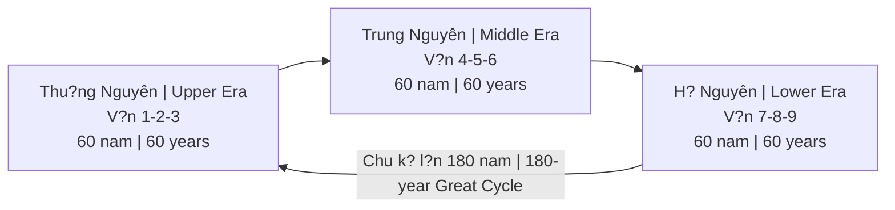
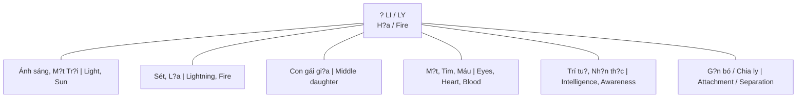

# V?n Chín (Period 9 / ??)

**V?n Chín** là giai do?n 20 nam t? 2024 d?n 2044 theo h? th?ng Phong th?y Tam nguyên C?u v?n (????). Ð?i di?n cho hành **H?a (?)**, qu? **Li (?)**.

*Period 9 is the 20-year cycle from 2024 to 2044 according to the San Yuan Jiu Yun (????) Feng Shui system. It represents the **Fire element (?)** and the **Li trigram (?)**.*

---

## H? Th?ng Tam Nguyên C?u V?n / San Yuan Jiu Yun System

### C?u trúc t?ng quan / Overall Structure

H? th?ng này d?a trên s? k?t h?p gi?a Thiên van h?c c? d?i, Kinh D?ch và C?u Tinh (9 sao) B?c Ð?u.

*This system is based on the combination of ancient astronomy, I Ching, and the 9 stars of the Big Dipper.*

### Chi ti?t 9 V?n / All 9 Periods

| V?n | Nam / Years | Hành / Element | Qu? / Trigram | Ð?c di?m chính / Key Theme |
|-----|-------------|----------------|---------------|---------------------------|
| 1 | 1864-1883 | Th?y / Water | Kh?m | Kh?i d?u / Beginning |
| 2 | 1884-1903 | Th? / Earth | Khôn | M?, d?t / Mother, earth |
| 3 | 1904-1923 | M?c / Wood | Ch?n | S?m, ch?n d?ng / Thunder, movement |
| 4 | 1924-1943 | M?c / Wood | T?n | Gió, giao ti?p / Wind, communication |
| 5 | 1944-1963 | Th? / Earth | - | Trung tâm / Center |
| 6 | 1964-1983 | Kim / Metal | Càn | Cha, quy?n l?c / Father, authority |
| 7 | 1984-2003 | Kim / Metal | Ðoài | Mi?ng, gi?i trí / Mouth, entertainment |
| 8 | 2004-2023 | Th? / Earth | C?n | Núi, b?t d?ng s?n / Mountain, real estate |
| **9** | **2024-2043** | **H?a / Fire** | **Li** | **Ánh sáng, s? th?t / Light, truth** |

---

## Tính Ch?t V?n 9 / Period 9 Characteristics

### Hành H?a (?) = Ánh sáng, Minh b?ch / Fire = Light, Transparency

| Ti?ng Vi?t | English |
|------------|---------|
| M?i th? b? phoi bày | Everything gets exposed |
| Bí m?t không th? gi?u | Secrets cannot be hidden |
| Scandals, leaks, disclosures | Bê b?i, rò r?, phoi bày |
| "Gián ch?y khi ánh sáng d?n" | "Cockroaches scatter when light comes" |

### Qu? Li (?) / Li Trigram

**Ý nghia sâu c?a ch? ? (Li):**
- Nghia g?c: "Chia ly" / "G?n bó"
- Paradox: Ph?i buông b? (chia ly v?i cu) d? g?n bó v?i m?i
- Th?i k? thanh l?c, lo?i b? cái gi? d? gi? cái th?t

*Deep meaning of ? (Li):*
- *Original meaning: "Separation" / "Attachment"*
- *Paradox: Must let go (separate from old) to attach to new*
- *A purification period, removing the false to keep the true*

---

## Ngành Ngh? Th?nh/Suy / Industries Rise & Fall

### ?? Ngành TH?NH (Thu?n hành H?a) / Rising Industries (Fire-aligned)

| Ngành / Industry | Lý do / Reason |
|------------------|----------------|
| **Công ngh? / Technology** | Data = ánh sáng / Data = light |
| **Truy?n thông, Content / Media, Content** | K? chuy?n, phoi bày / Storytelling, exposure |
| **Giáo d?c / Education** | Lan t?a ki?n th?c / Spreading knowledge |
| **Y t? / Healthcare** | Tim, m?t, máu thu?c Li / Heart, eyes, blood = Li |
| **Làm d?p / Beauty & Fashion** | Ngo?i hình, ánh sáng / Appearance, radiance |
| **Van hóa, Ngh? thu?t / Culture & Arts** | Sáng t?o, bi?u d?t / Creativity, expression |
| **S?c kh?e tâm th?n / Mental health** | Inner work, awareness |
| **Nang lu?ng s?ch / Clean energy** | M?t tr?i, h?a / Solar, fire |

### ?? Ngành SUY (Hành Th? thoái) / Declining Industries (Earth declining)

| Ngành / Industry | Lý do / Reason |
|------------------|----------------|
| **B?t d?ng s?n / Real estate** | V?n 8 dã qua / Period 8 is over |
| **Khai khoáng / Mining** | Hành Th? / Earth element |
| **Xây d?ng n?ng / Heavy construction** | Hành Th? / Earth element |
| **Tích tr? tài s?n v?t ch?t / Hoarding physical wealth** | Không còn th?i / No longer the time |

---

## 5 Nang L?c S?ng Còn / 5 Survival Skills

### 1. Ch?a lành t? nhiên / Natural Healing

Quay v? thiên nhiên, detox c? th? ch?t l?n tinh th?n. Hi?u v? [[Thuy?t Vi Sinh N?i Sinh]], [[Plasma Quinton]].

*Return to nature, detox both physically and mentally. Understand [[Thuy?t Vi Sinh N?i Sinh]], [[Plasma Quinton]].*

### 2. Tu duy sáng t?o / Creative Thinking

K? chuy?n có h?n. Content chân th?c. AI không th? thay th? s? chân th?t. "Human touch" tr? thành premium.

*Storytelling with soul. Authentic content. AI cannot replicate genuineness. Human touch becomes premium.*

### 3. K?t n?i c?m xúc / Emotional Connection

Chi?u sâu hon chi?u r?ng. 1000 true fans > 1 tri?u followers. C?ng d?ng hon khán gi?. Trí tu? c?a trái tim.

*Depth over reach. 1000 true fans > 1 million followers. Community over audience. Heart intelligence.*

### 4. N?i tâm v?ng vàng / Inner Stability

[[Tâm b?t Bi?n]] - Trung tâm gi?a bão thông tin. Phân bi?t dúng sai. Không b? xu hu?ng cu?n di.

*[[Tâm b?t Bi?n]] - Center in the information storm. Discernment. Not swayed by trends.*

### 5. ?nh hu?ng cá nhân sâu / Deep Personal Influence

S? chân th?t du?c nh?n ra. "Th?t" n?i b?t trong bi?n gi?. Ni?m tin = ti?n t? m?i.

*Authenticity recognized. "Real" stands out in a sea of fake. Trust = new currency.*

---

## Liên K?t V?i Các H? Th?ng Khác / Alignment With Other Systems

### Chu K? Hoàng Ð?o / Zodiac Ages

| H? th?ng / System | Th?i k? / Period | Nang lu?ng / Energy |
|-------------------|------------------|---------------------|
| V?n 9 | 2024-2044 | H?a, s? th?t / Fire, truth |
| [[Chu K? Hoàng Ð?o]] | Pisces ? Aquarius | Th?c t?nh / Awakening |

C? hai h? th?ng d?u ch? ra: dây là th?i k? chuy?n d?i l?n, ánh sáng s? th?t chi?u r?i, nh?ng gì gi?u gi?m s? b? phoi bày.

*Both systems indicate: this is a major transition period, the light of truth shines, hidden things will be exposed.*

### L?ch Maya / Mayan Calendar

- 2012: Ði?m chuy?n / Shift point
- K? nguyên m?i c?a ý th?c / New era of consciousness
- Tuong d?ng v?i nang lu?ng V?n 9 / Similar to Period 9 energy

### Kali Yuga k?t thúc? / End of Kali Yuga?

- Th?i d?i den t?i nh?t dang k?t thúc? / Darkest age ending?
- Satya Yuga (Th?i hoàng kim) b?t d?u? / Golden age beginning?

---

## Hu?ng D?n Th?c Hành / Practical Guidance

### S? nghi?p / Career

| Nên / Do | Không nên / Avoid |
|----------|-------------------|
| Chuy?n sang ngành H?a / Move to Fire industries | Ð?u tu n?ng vào b?t d?ng s?n / Heavy real estate investment |
| Xây d?ng thuong hi?u cá nhân chân th?c / Build authentic personal brand | Kinh doanh d?a trên bí m?t / Business based on secrets |
| Sáng t?o n?i dung / Content creation | Tích tr?, hoarding |
| Giáo d?c, ch?a lành / Education, healing | Nh?ng gì che gi?u s? th?t / Anything hiding truth |

### Ð?u tu / Investment

| Ngành th?nh / Rising | Ngành suy / Declining |
|----------------------|----------------------|
| Tech, AI, Data | B?t d?ng s?n truy?n th?ng / Traditional real estate |
| Media, Content | Khai khoáng / Mining |
| Healthcare (tim, m?t) / Healthcare (heart, eyes) | Xây d?ng n?ng / Heavy construction |
| Tài s?n s? ([[Bitcoin]]?) / Digital assets | Vàng v?t lý (?) / Physical gold (?) |

### Cá nhân / Personal

| Uu tiên / Priority | Gi?i thích / Explanation |
|--------------------|--------------------------|
| Inner work | V?n 9 = th?i k? nhìn vào bên trong / Period 9 = look within |
| Nói s? th?t / Speak truth | Hành H?a = ánh sáng / Fire = light |
| Xây quan h? th?t / Build genuine connections | Ch?t lu?ng > S? lu?ng / Quality > Quantity |
| S?c kh?e: m?t, tim, máu / Health: eyes, heart, blood | Các b? ph?n thu?c qu? Li / Li trigram organs |

---

## K?t Lu?n / Conclusion

> **V?n 9 là th?i k? ánh sáng chi?u r?i m?i ngóc ngách.**
>
> Nh?ng gì gi? t?o s? b? l?. Nh?ng gì chân th?t s? t?a sáng. Ðây không ph?i th?i d? gi?u gi?m hay tích tr? - mà là th?i d? phoi bày, chia s?, và s?ng chân th?t.

> *Period 9 is when light shines into every corner.*
>
> *The fake will be exposed. The genuine will shine. This is not a time to hide or hoard - but a time to expose, share, and live authentically.*

---

## Related

- [[Chu K? Vu Tr? - Yugas & Kalpas]] - Chu k? Hindu/Buddhist
- [[Chu K? Hoàng Ð?o]]
- [[Phong Th?y]]
