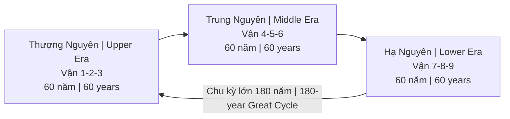
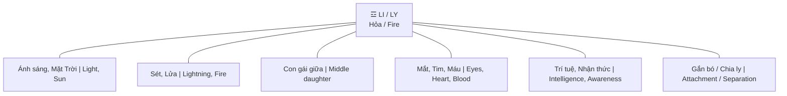

# Vận Chín (Period 9 / 九運)

**Vận Chín** là giai đoạn 20 năm từ 2024 đến 2044 theo hệ thống Phong thủy Tam nguyên Cửu vận (三元九運). Đại diện cho hành **Hỏa (火)**, quẻ **Li (離)**.

*Period 9 is the 20-year cycle from 2024 to 2044 according to the San Yuan Jiu Yun (三元九運) Feng Shui system. It represents the **Fire element (火)** and the **Li trigram (離)**.*

---

## Hệ Thống Tam Nguyên Cửu Vận / San Yuan Jiu Yun System

### Cấu trúc tổng quan / Overall Structure

Hệ thống này dựa trên sự kết hợp giữa Thiên văn học cổ đại, Kinh Dịch và Cửu Tinh (9 sao) Bắc Đẩu.

*This system is based on the combination of ancient astronomy, I Ching, and the 9 stars of the Big Dipper.*

### Chi tiết 9 Vận / All 9 Periods

| Vận | Năm / Years | Hành / Element | Quẻ / Trigram | Đặc điểm chính / Key Theme |
|-----|-------------|----------------|---------------|---------------------------|
| 1 | 1864-1883 | Thủy / Water | Khảm | Khởi đầu / Beginning |
| 2 | 1884-1903 | Thổ / Earth | Khôn | Mẹ, đất / Mother, earth |
| 3 | 1904-1923 | Mộc / Wood | Chấn | Sấm, chấn động / Thunder, movement |
| 4 | 1924-1943 | Mộc / Wood | Tốn | Gió, giao tiếp / Wind, communication |
| 5 | 1944-1963 | Thổ / Earth | — | Trung tâm / Center |
| 6 | 1964-1983 | Kim / Metal | Càn | Cha, quyền lực / Father, authority |
| 7 | 1984-2003 | Kim / Metal | Đoài | Miệng, giải trí / Mouth, entertainment |
| 8 | 2004-2023 | Thổ / Earth | Cấn | Núi, bất động sản / Mountain, real estate |
| **9** | **2024-2043** | **Hỏa / Fire** | **Li** | **Ánh sáng, sự thật / Light, truth** |

---

## Tính Chất Vận 9 / Period 9 Characteristics

### Hành Hỏa (火) = Ánh sáng, Minh bạch / Fire = Light, Transparency

| Tiếng Việt | English |
|------------|---------|
| Mọi thứ bị phơi bày | Everything gets exposed |
| Bí mật không thể giấu | Secrets cannot be hidden |
| Scandals, leaks, disclosures | Bê bối, rò rỉ, phơi bày |
| "Gián chạy khi ánh sáng đến" | "Cockroaches scatter when light comes" |

### Quẻ Li (離) / Li Trigram

**Ý nghĩa sâu của chữ 離 (Li):**
- Nghĩa gốc: "Chia ly" / "Gắn bó"
- Paradox: Phải buông bỏ (chia ly với cũ) để gắn bó với mới
- Thời kỳ thanh lọc, loại bỏ cái giả để giữ cái thật

*Deep meaning of 離 (Li):*
- *Original meaning: "Separation" / "Attachment"*
- *Paradox: Must let go (separate from old) to attach to new*
- *A purification period, removing the false to keep the true*

---

## Ngành Nghề Thịnh/Suy / Industries Rise & Fall

### 🔥 Ngành THỊNH (Thuận hành Hỏa) / Rising Industries (Fire-aligned)

| Ngành / Industry | Lý do / Reason |
|------------------|----------------|
| **Công nghệ / Technology** | Data = ánh sáng / Data = light |
| **Truyền thông, Content / Media, Content** | Kể chuyện, phơi bày / Storytelling, exposure |
| **Giáo dục / Education** | Lan tỏa kiến thức / Spreading knowledge |
| **Y tế / Healthcare** | Tim, mắt, máu thuộc Li / Heart, eyes, blood = Li |
| **Làm đẹp / Beauty & Fashion** | Ngoại hình, ánh sáng / Appearance, radiance |
| **Văn hóa, Nghệ thuật / Culture & Arts** | Sáng tạo, biểu đạt / Creativity, expression |
| **Sức khỏe tâm thần / Mental health** | Inner work, awareness |
| **Năng lượng sạch / Clean energy** | Mặt trời, hỏa / Solar, fire |

### 📉 Ngành SUY (Hành Thổ thoái) / Declining Industries (Earth declining)

| Ngành / Industry | Lý do / Reason |
|------------------|----------------|
| **Bất động sản / Real estate** | Vận 8 đã qua / Period 8 is over |
| **Khai khoáng / Mining** | Hành Thổ / Earth element |
| **Xây dựng nặng / Heavy construction** | Hành Thổ / Earth element |
| **Tích trữ tài sản vật chất / Hoarding physical wealth** | Không còn thời / No longer the time |

---

## 5 Năng Lực Sống Còn / 5 Survival Skills

### 1. Chữa lành tự nhiên / Natural Healing

Quay về thiên nhiên, detox cả thể chất lẫn tinh thần. Hiểu về [[Thuyết Vi Sinh Nội Sinh]], [[Plasma Quinton]].

*Return to nature, detox both physically and mentally. Understand [[Thuyết Vi Sinh Nội Sinh]], [[Plasma Quinton]].*

### 2. Tư duy sáng tạo / Creative Thinking

Kể chuyện có hồn. Content chân thực. AI không thể thay thế sự chân thật. "Human touch" trở thành premium.

*Storytelling with soul. Authentic content. AI cannot replicate genuineness. Human touch becomes premium.*

### 3. Kết nối cảm xúc / Emotional Connection

Chiều sâu hơn chiều rộng. 1000 true fans > 1 triệu followers. Cộng đồng hơn khán giả. Trí tuệ của trái tim.

*Depth over reach. 1000 true fans > 1 million followers. Community over audience. Heart intelligence.*

### 4. Nội tâm vững vàng / Inner Stability

[[Tâm bất Biến]] — Trung tâm giữa bão thông tin. Phân biệt đúng sai. Không bị xu hướng cuốn đi.

*[[Tâm bất Biến]] — Center in the information storm. Discernment. Not swayed by trends.*

### 5. Ảnh hưởng cá nhân sâu / Deep Personal Influence

Sự chân thật được nhận ra. "Thật" nổi bật trong biển giả. Niềm tin = tiền tệ mới.

*Authenticity recognized. "Real" stands out in a sea of fake. Trust = new currency.*

---

## Liên Kết Với Các Hệ Thống Khác / Alignment With Other Systems

### Chu Kỳ Hoàng Đạo / Zodiac Ages

| Hệ thống / System | Thời kỳ / Period | Năng lượng / Energy |
|-------------------|------------------|---------------------|
| Vận 9 | 2024-2044 | Hỏa, sự thật / Fire, truth |
| [[Chu Kỳ Hoàng Đạo]] | Pisces → Aquarius | Thức tỉnh / Awakening |

Cả hai hệ thống đều chỉ ra: đây là thời kỳ chuyển đổi lớn, ánh sáng sự thật chiếu rọi, những gì giấu giếm sẽ bị phơi bày.

*Both systems indicate: this is a major transition period, the light of truth shines, hidden things will be exposed.*

### Lịch Maya / Mayan Calendar

- 2012: Điểm chuyển / Shift point
- Kỷ nguyên mới của ý thức / New era of consciousness
- Tương đồng với năng lượng Vận 9 / Similar to Period 9 energy

### Kali Yuga kết thúc? / End of Kali Yuga?

- Thời đại đen tối nhất đang kết thúc? / Darkest age ending?
- Satya Yuga (Thời hoàng kim) bắt đầu? / Golden age beginning?

---

## Hướng Dẫn Thực Hành / Practical Guidance

### Sự nghiệp / Career

| Nên / Do | Không nên / Avoid |
|----------|-------------------|
| Chuyển sang ngành Hỏa / Move to Fire industries | Đầu tư nặng vào bất động sản / Heavy real estate investment |
| Xây dựng thương hiệu cá nhân chân thực / Build authentic personal brand | Kinh doanh dựa trên bí mật / Business based on secrets |
| Sáng tạo nội dung / Content creation | Tích trữ, hoarding |
| Giáo dục, chữa lành / Education, healing | Những gì che giấu sự thật / Anything hiding truth |

### Đầu tư / Investment

| Ngành thịnh / Rising | Ngành suy / Declining |
|----------------------|----------------------|
| Tech, AI, Data | Bất động sản truyền thống / Traditional real estate |
| Media, Content | Khai khoáng / Mining |
| Healthcare (tim, mắt) / Healthcare (heart, eyes) | Xây dựng nặng / Heavy construction |
| Tài sản số ([[Bitcoin]]?) / Digital assets | Vàng vật lý (?) / Physical gold (?) |

### Cá nhân / Personal

| Ưu tiên / Priority | Giải thích / Explanation |
|--------------------|--------------------------|
| Inner work | Vận 9 = thời kỳ nhìn vào bên trong / Period 9 = look within |
| Nói sự thật / Speak truth | Hành Hỏa = ánh sáng / Fire = light |
| Xây quan hệ thật / Build genuine connections | Chất lượng > Số lượng / Quality > Quantity |
| Sức khỏe: mắt, tim, máu / Health: eyes, heart, blood | Các bộ phận thuộc quẻ Li / Li trigram organs |

---

## Kết Luận / Conclusion

> **Vận 9 là thời kỳ ánh sáng chiếu rọi mọi ngóc ngách.**
>
> Những gì giả tạo sẽ bị lộ. Những gì chân thật sẽ tỏa sáng. Đây không phải thời để giấu giếm hay tích trữ — mà là thời để phơi bày, chia sẻ, và sống chân thật.

> *Period 9 is when light shines into every corner.*
>
> *The fake will be exposed. The genuine will shine. This is not a time to hide or hoard — but a time to expose, share, and live authentically.*

---

## Related / Liên quan

- [[Vận Chín, Người Kogi và Ma Trận Y Tế]] — Phân tích sâu / Deep dive
- [[Chu Kỳ Hoàng Đạo]] — Sự tương đồng vũ trụ / Cosmic alignment
- [[Tâm bất Biến]] — Nội tâm vững vàng / Inner stability
- [[Trí Tuệ]] — Trí tuệ hơn thông minh / Wisdom over intelligence
- [[Bitcoin]] — Lửa số? / Digital fire?
- [[Ma Trận]] — Những gì sẽ bị phơi bày / What will be exposed
- [[Gnosis (Ngộ Đạo)]] — Ánh sáng bên trong / Inner light
