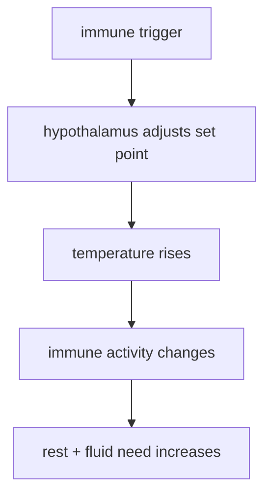
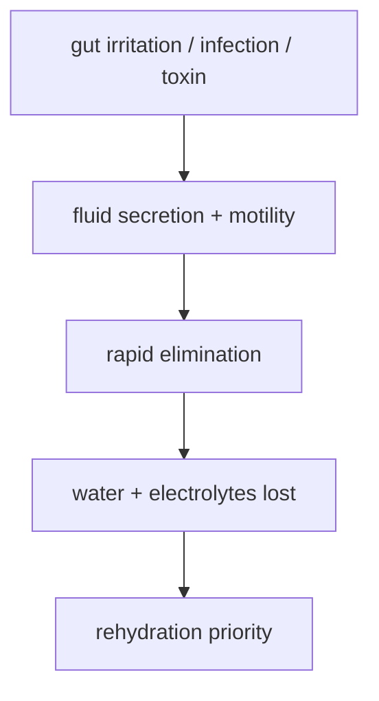

# Cơ Chế Tự Bảo Vệ Của Cơ Thể

**Triệu chứng không phải lúc nào cũng là kẻ thù; nhiều triệu chứng là cách cơ thể cô lập, đẩy ra, làm nóng, làm loãng, ho, ói, tiêu chảy hoặc nghỉ bắt buộc để bảo vệ terrain.** Nhưng hiểu cơ thể không có nghĩa là lãng mạn hóa nguy hiểm: sốt cao, mất nước, khó thở, đau dữ dội, co giật, lơ mơ hoặc nhiễm trùng nặng cần chăm sóc y tế.

*Symptoms are often protective processes, not random enemies. But body wisdom is not an excuse to ignore danger signals.*

---

## Medical Caution / Cảnh Báo Y Tế

Bài này thuộc [[MOC - Health Sovereignty]]: giúp người đọc có thêm quyền hiểu cơ thể, không thay thế bác sĩ, cấp cứu, xét nghiệm hoặc thuốc cần thiết. Trẻ nhỏ, người già, phụ nữ mang thai, người suy giảm miễn dịch và người có bệnh nền cần thận trọng hơn.

| Tầng claim | Cách đọc |
|---|---|
| Fact | sốt, ho, tiêu chảy, viêm là cơ chế sinh lý có vai trò bảo vệ trong nhiều bối cảnh |
| Clinical caution | cùng một triệu chứng có thể là bảo vệ hoặc dấu hiệu nguy hiểm tùy mức độ, thời gian, cơ địa |
| Pattern | y tế công nghiệp thường bán giải pháp dập triệu chứng nhanh |
| Vault synthesis | hỗ trợ terrain trước khi vội tắt mọi tín hiệu của cơ thể |

---

## Vault Position / Vị Trí Trong Vault

Bài này là nền sinh lý cho [[Y Tế Tự Nhiên]], [[Thuyết Vi Sinh Nội Sinh]], [[Hệ Tiêu Hóa - Bộ Não Thứ Hai]] và phê bình [[Thuốc Hóa Dầu]]. Nó không nói "đừng dùng thuốc". Nó nói: trước khi dập một triệu chứng, hãy hỏi nó đang cố làm gì.

---

## Sốt / Fever

Sốt là phản ứng được điều phối bởi hệ miễn dịch và vùng dưới đồi. Trong nhiều nhiễm trùng, tăng nhiệt giúp giảm khả năng nhân lên của một số mầm bệnh và tăng hiệu quả của một số phản ứng miễn dịch.

Sai lầm thường gặp là coi sốt chỉ như nhiệt độ cần kéo xuống bằng mọi giá. Nhưng sai lầm ngược lại là coi sốt luôn tốt. Kỷ luật đúng là đọc bối cảnh: tuổi, mức sốt, thời gian, hydration, ý thức, co giật, khó thở, đau cổ, phát ban, bệnh nền.

> Hỗ trợ sốt thường bắt đầu bằng nghỉ, nước, điện giải, theo dõi và giảm tải; dùng thuốc hạ sốt là công cụ, không phải phản xạ vô thức.

---

## Ho / Cough

Ho là cơ chế làm sạch đường thở. Nó đẩy chất nhầy, bụi, dị vật và tác nhân kích thích ra ngoài. Dập ho mạnh khi phổi cần tống đờm có thể làm người bệnh cảm thấy yên hơn nhưng không nhất thiết giúp cơ thể sạch hơn.

| Loại ho | Cách đọc sơ bộ |
|---|---|
| ho có đờm | thường là quá trình tống xuất, cần nước và làm loãng đờm |
| ho khan kích thích | có thể do viêm, dị ứng, trào ngược, không khí khô hoặc thuốc |
| ho kèm khó thở, đau ngực, tím tái, sốt kéo dài | cần đánh giá y tế |

Vault đọc ho cùng gut-lung axis: ruột, viêm, histamine, dị ứng, reflux và terrain tổng thể có thể ảnh hưởng đường thở. Nhưng không nên quy mọi ho về "độc tố"; đó là overclaim.

---

## Tiêu Chảy / Diarrhea

Tiêu chảy là cách ruột đẩy nhanh chất gây kích thích, độc tố hoặc tác nhân nhiễm trùng ra ngoài. Vấn đề nguy hiểm nhất thường không phải "đi nhiều" mà là **mất nước và mất điện giải**.

Thuốc cầm tiêu chảy có chỗ dùng, nhưng không phải lúc nào cũng nên dùng ngay, nhất là khi nghi nhiễm trùng, sốt cao, phân máu hoặc đau bụng nặng. Cốt lõi là bù nước, muối khoáng, quan sát dấu hiệu nguy hiểm và tìm hỗ trợ khi vượt ngưỡng.

---

## Viêm / Inflammation

Viêm là đội sửa chữa: tăng máu đến vùng tổn thương, gọi tế bào miễn dịch, dọn mảnh vụn, tái tạo mô. Nhưng viêm mạn tính là đội sửa chữa không chịu rời công trường, khiến tissue bị hư tiếp.

| Viêm cấp | Viêm mạn |
|---|---|
| ngắn hạn, có mục tiêu | kéo dài, hệ thống |
| giúp cô lập và sửa chữa | làm mệt, đau, rối loạn chuyển hóa |
| cần hỗ trợ và nghỉ | cần tìm nguyên nhân terrain |

Đây là nơi [[Y Tế Tự Nhiên]] hữu ích: ngủ, ánh sáng, vận động, protein đủ, khoáng, giảm ultra-processed food, giảm stress và xử lý gut terrain.

---

## Dập Triệu Chứng vs Hỗ Trợ Cơ Thể

| Reflex cũ | Câu hỏi tốt hơn |
|---|---|
| sốt là xấu | sốt đang ở mức nào, người bệnh có ổn không? |
| ho là phiền | ho khan hay ho đờm, có khó thở không? |
| tiêu chảy phải cầm | có mất nước, sốt, máu, đau nặng không? |
| đau là kẻ thù | đau báo gì, có tổn thương cần xử lý không? |
| thuốc là giải pháp đầu tiên | terrain cần gì để tự sửa? |

Health sovereignty không chống thuốc. Nó chống autopilot.

---

## Core Insight / Chốt Lại

**Cơ thể không ngu. Nhưng cơ thể cũng không bất tử. Đọc triệu chứng như tín hiệu, hỗ trợ cơ chế tự vệ khi hợp lý, và biết ngưỡng phải gọi y tế là ba phần của cùng một trí tuệ.**

*The body is intelligent, not invincible. Read symptoms as signals, support defense when appropriate, and know when medical help is required.*
