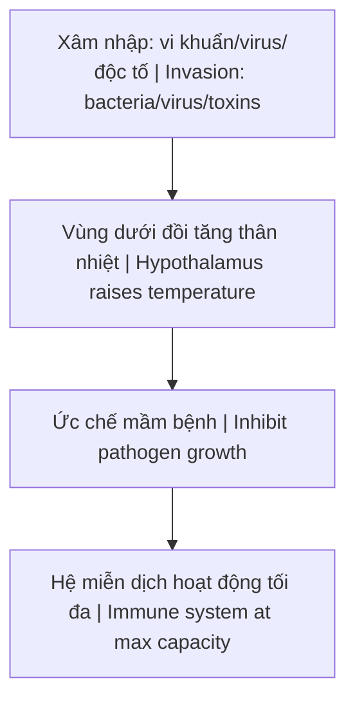
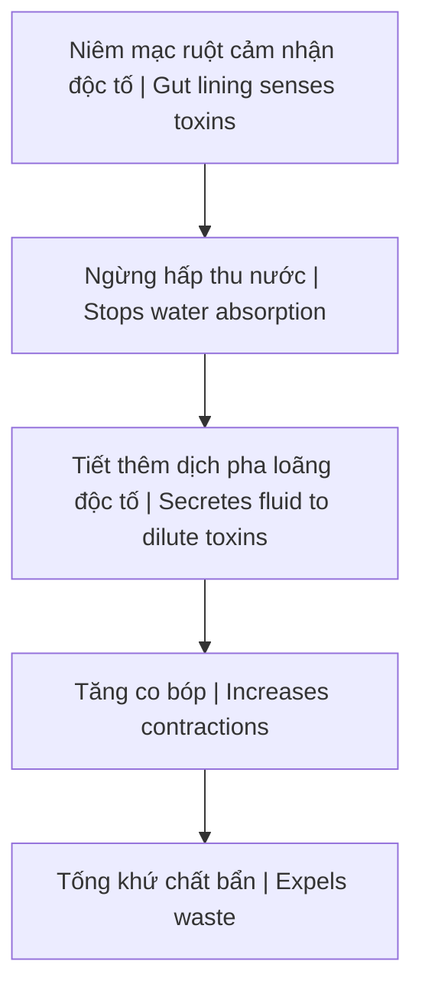

---
title: "Cơ Chế Tự Bảo Vệ Của Cơ Thể"
aliases: ["Body's Self-Defense", "Immune Response"]
date: 2026-04-17
tags: [health, terrain-theory, immune-system]
status: refined
---

---

## How To Read This / Cách Đọc Bài Này

Bài này thuộc nhóm **health sovereignty** của redpill.wiki. Nó có thể dùng giọng mạnh để phản biện medical-industrial complex, nhưng không phải chỉ dẫn y khoa cá nhân.

Cần đọc theo bốn tầng:

| Tầng | Cách đọc | Ví dụ |
|---|---|---|
| **Fact / documentable** | cơ chế sinh học, dữ liệu an toàn, guideline, nghiên cứu có thể kiểm | physiology, clinical studies, adverse effects |
| **Research / emerging** | hướng nghiên cứu còn đang phát triển, tùy context/cơ địa | repurposed drugs, metabolic protocols, terrain interventions |
| **Pattern / systems reading** | incentive của pharma, food system, regulatory capture, chronic treatment | dependency loop, symptom management |
| **Vault synthesis** | mô hình terrain/sovereignty/metabolic reading của vault | [[Y Tế Tự Nhiên]], [[MOC - Health Sovereignty]] |

> Health content phải giúp người đọc có thêm quyền hiểu cơ thể, không khiến họ liều lĩnh bỏ qua dữ liệu, bác sĩ, hoặc tình trạng nguy hiểm.

---

## Source Register / Nguồn Nên Đối Chiếu

Khi audit sâu hơn, ưu tiên:

- medical guidelines / standard-of-care để biết mainstream claim chính xác trước khi phản biện,
- PubMed/PMC reviews, clinical trials, case reports nếu có,
- drug labels, contraindications, adverse event data,
- mechanistic physiology / metabolism / terrain literature,
- conflict-of-interest, funding, regulatory history,
- các node liên quan: [[Y Tế Tự Nhiên]], [[Kính Chiếu Yêu - Nhìn Thấu Tây Y]], [[MOC - Health Sovereignty]].

# Cơ Chế Tự Bảo Vệ Của Cơ Thể (Body's Self-Defense Mechanisms)

Triệu chứng bệnh lý không phải là kẻ thù cần tiêu diệt. **Sốt, ho, và tiêu chảy** thực chất là những chiến binh bảo vệ và là cơ chế tự làm sạch của cơ thể.

*Disease symptoms are not enemies to destroy. **Fever, cough, and diarrhea** are actually protective warriors and the body's self-cleansing mechanisms.*

> **Việc dập tắt ngay lập tức các triệu chứng bằng thuốc đôi khi là hành động tước đi vũ khí tự vệ của chính cơ thể.**
>
> *Immediately suppressing symptoms with medication is sometimes disarming the body's own defenses.*

---

## 1. Cơ Chế Sốt / Fever Mechanism

### Cách hoạt động / How It Works

### Chi tiết / Details

| Giai đoạn / Stage | Mô tả / Description |
|-------------------|---------------------|
| **Xâm nhập** | Vi khuẩn, virus, độc tố vào cơ thể / Pathogens enter body |
| **Phản ứng** | Vùng dưới đồi chủ động tăng nhiệt / Hypothalamus raises temperature |
| **Tiết Prostaglandin** | Pháo sáng dẫn đường cho bạch cầu / Flares guiding white blood cells |
| **Bạch cầu tập trung** | Bao vây, tiêu diệt, dọn dẹp / Surround, destroy, clean up |

### Vấn đề với thuốc hạ sốt / Problem With Fever Reducers

| Tác dụng / Effect | Hệ quả / Consequence |
|-------------------|----------------------|
| Cắt đứt Prostaglandin | Cuts off Prostaglandin production |
| Hạ nhiệt tức thì | Immediate temperature drop |
| **Tắt pháo sáng miễn dịch** | **Turns off immune system's flares** |
| Kéo dài quá trình đào thải | Prolongs detox process |

### Khi nào sốt nguy hiểm? / When Is Fever Dangerous?

Chỉ khi nhiệt độ **vượt ngưỡng chịu đựng của tế bào thần kinh trung ương** mới kích hoạt co giật. Cốt lõi là **giải độc máu và ruột**.

*Only when temperature **exceeds central nervous system cell tolerance** does it trigger seizures. The core is **blood and gut detoxification**.*

---

## 2. Cơ Chế Ho / Cough Mechanism

### Cách hoạt động / How It Works

| Đặc điểm / Feature | Chi tiết / Detail |
|--------------------|-------------------|
| **Phản xạ cơ học** | Mechanical reflex explosion |
| **Tốc độ luồng khí** | Extremely high air velocity |
| **Mục đích** | Đẩy văng dị vật, bụi, vi sinh vật, đờm / Expel foreign objects, dust, microbes, phlegm |

### Tại sao ho quan trọng? / Why Is Cough Important?

| Không có ho | Có ho |
|-------------|-------|
| Bụi bẩn, mầm bệnh vào thẳng phổi | Đường thở tự làm sạch |
| Dust, pathogens go straight to lungs | Airways self-clean |
| Cư trú và gây bệnh | Được tống ra ngoài |
| Reside and cause disease | Expelled |

### Liên kết ruột - phổi / Gut-Lung Connection

> Khi cơ thể tích tụ độc tố từ đường ruột do táo bón, khí độc có thể đẩy ngược lên. **Ho chính là cách đường hô hấp tự làm sạch.**
>
> *When toxins accumulate in the gut from constipation, toxic gases can push upward. **Cough is how the respiratory tract self-cleans.***

---

## 3. Cơ Chế Tiêu Chảy / Diarrhea Mechanism

### Cách hoạt động / How It Works

### Tại sao tiêu chảy quan trọng? / Why Is Diarrhea Important?

| Không có tiêu chảy | Có tiêu chảy |
|--------------------|--------------|
| Độc tố ngấm ngược qua thành ruột | Độc tố được tống ra ngoài |
| Toxins absorb back through gut wall | Toxins expelled |
| Nhiễm trùng huyết | Cơ thể được làm sạch |
| Septicemia | Body cleansed |

### Xử lý đúng cách / Correct Approach

| ❌ Sai / Wrong | ✅ Đúng / Right |
|----------------|-----------------|
| Dùng thuốc cầm tiêu chảy ngay | Liên tục bù nước và muối khoáng |
| Immediately use anti-diarrhea drugs | Continuously replenish water and electrolytes |
| Giữ độc tố trong cơ thể | Để cơ thể xả hết chất độc |
| Keep toxins inside | Let body expel all toxins |

---

## Tổng Kết / Summary

### Triệu chứng là đồng minh / Symptoms Are Allies

| Triệu chứng / Symptom | Chức năng / Function |
|-----------------------|----------------------|
| **Sốt / Fever** | Ức chế mầm bệnh, kích hoạt miễn dịch / Inhibit pathogens, activate immunity |
| **Ho / Cough** | Đẩy dị vật, làm sạch đường thở / Expel foreign objects, clean airways |
| **Tiêu chảy / Diarrhea** | Tống độc tố khỏi ruột / Expel toxins from gut |

### Nguyên tắc vàng / Golden Principle

> **Hỗ trợ cơ thể, đừng chống lại nó.**
>
> *Support the body, don't fight against it.*

| Thay vì / Instead of | Hãy / Do |
|----------------------|----------|
| Dập tắt triệu chứng | Hỗ trợ quá trình tự nhiên |
| Suppress symptoms | Support natural process |
| Thuốc hạ sốt ngay | Bù nước, nghỉ ngơi, giải độc |
| Immediate fever reducers | Hydrate, rest, detox |

---

## Related / Liên quan

### Y học tự nhiên / Natural Medicine
- [[Thuyết Vi Sinh Nội Sinh]] — Terrain theory
- [[Y Tế Tự Nhiên]] — Natural health
- [[Thuốc Hóa Dầu]] — Petrochemical medicine problem

### Hệ tiêu hóa / Digestive System
- [[Hệ Tiêu Hóa - Bộ Não Thứ Hai]] — Second brain
- [[Vận Chín, Người Kogi và Ma Trận Y Tế]] — Medical matrix
