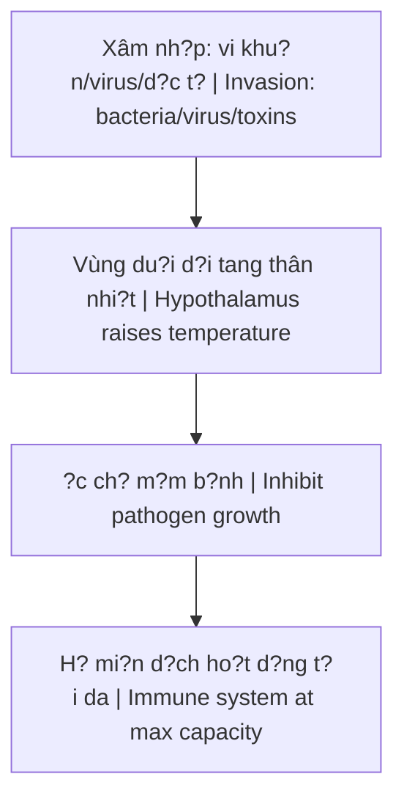
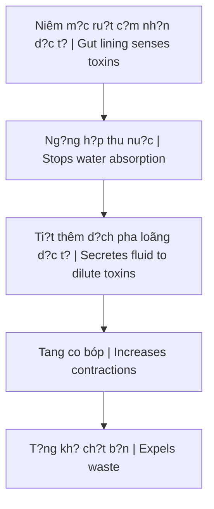

# Co Ch? T? B?o V? C?a Co Th? (Body's Self-Defense Mechanisms)

Tri?u ch?ng b?nh lý không ph?i là k? thù c?n tiêu di?t. **S?t, ho, và tiêu ch?y** th?c ch?t là nh?ng chi?n binh b?o v? và là co ch? t? làm s?ch c?a co th?.

*Disease symptoms are not enemies to destroy. **Fever, cough, and diarrhea** are actually protective warriors and the body's self-cleansing mechanisms.*

> **Vi?c d?p t?t ngay l?p t?c các tri?u ch?ng b?ng thu?c dôi khi là hành d?ng tu?c di vu khí t? v? c?a chính co th?.**
>
> *Immediately suppressing symptoms with medication is sometimes disarming the body's own defenses.*

---

## 1. Co Ch? S?t / Fever Mechanism

### Cách ho?t d?ng / How It Works

### Chi ti?t / Details

| Giai do?n / Stage | Mô t? / Description |
|-------------------|---------------------|
| **Xâm nh?p** | Vi khu?n, virus, d?c t? vào co th? / Pathogens enter body |
| **Ph?n ?ng** | Vùng du?i d?i ch? d?ng tang nhi?t / Hypothalamus raises temperature |
| **Ti?t Prostaglandin** | Pháo sáng d?n du?ng cho b?ch c?u / Flares guiding white blood cells |
| **B?ch c?u t?p trung** | Bao vây, tiêu di?t, d?n d?p / Surround, destroy, clean up |

### V?n d? v?i thu?c h? s?t / Problem With Fever Reducers

| Tác d?ng / Effect | H? qu? / Consequence |
|-------------------|----------------------|
| C?t d?t Prostaglandin | Cuts off Prostaglandin production |
| H? nhi?t t?c thì | Immediate temperature drop |
| **T?t pháo sáng mi?n d?ch** | **Turns off immune system's flares** |
| Kéo dài quá trình dào th?i | Prolongs detox process |

### Khi nào s?t nguy hi?m? / When Is Fever Dangerous?

Ch? khi nhi?t d? **vu?t ngu?ng ch?u d?ng c?a t? bào th?n kinh trung uong** m?i kích ho?t co gi?t. C?t lõi là **gi?i d?c máu và ru?t**.

*Only when temperature **exceeds central nervous system cell tolerance** does it trigger seizures. The core is **blood and gut detoxification**.*

---

## 2. Co Ch? Ho / Cough Mechanism

### Cách ho?t d?ng / How It Works

| Ð?c di?m / Feature | Chi ti?t / Detail |
|--------------------|-------------------|
| **Ph?n x? co h?c** | Mechanical reflex explosion |
| **T?c d? lu?ng khí** | Extremely high air velocity |
| **M?c dích** | Ð?y vang d? v?t, b?i, vi sinh v?t, d?m / Expel foreign objects, dust, microbes, phlegm |

### T?i sao ho quan tr?ng? / Why Is Cough Important?

| Không có ho | Có ho |
|-------------|-------|
| B?i b?n, m?m b?nh vào th?ng ph?i | Ðu?ng th? t? làm s?ch |
| Dust, pathogens go straight to lungs | Airways self-clean |
| Cu trú và gây b?nh | Ðu?c t?ng ra ngoài |
| Reside and cause disease | Expelled |

### Liên k?t ru?t - ph?i / Gut-Lung Connection

> Khi co th? tích t? d?c t? t? du?ng ru?t do táo bón, khí d?c có th? d?y ngu?c lên. **Ho chính là cách du?ng hô h?p t? làm s?ch.**
>
> *When toxins accumulate in the gut from constipation, toxic gases can push upward. **Cough is how the respiratory tract self-cleans.***

---

## 3. Co Ch? Tiêu Ch?y / Diarrhea Mechanism

### Cách ho?t d?ng / How It Works

### T?i sao tiêu ch?y quan tr?ng? / Why Is Diarrhea Important?

| Không có tiêu ch?y | Có tiêu ch?y |
|--------------------|--------------|
| Ð?c t? ng?m ngu?c qua thành ru?t | Ð?c t? du?c t?ng ra ngoài |
| Toxins absorb back through gut wall | Toxins expelled |
| Nhi?m trùng huy?t | Co th? du?c làm s?ch |
| Septicemia | Body cleansed |

### X? lý dúng cách / Correct Approach

| ? Sai / Wrong | ? Ðúng / Right |
|----------------|-----------------|
| Dùng thu?c c?m tiêu ch?y ngay | Liên t?c bù nu?c và mu?i khoáng |
| Immediately use anti-diarrhea drugs | Continuously replenish water and electrolytes |
| Gi? d?c t? trong co th? | Ð? co th? x? h?t ch?t d?c |
| Keep toxins inside | Let body expel all toxins |

---

## T?ng K?t / Summary

### Tri?u ch?ng là d?ng minh / Symptoms Are Allies

| Tri?u ch?ng / Symptom | Ch?c nang / Function |
|-----------------------|----------------------|
| **S?t / Fever** | ?c ch? m?m b?nh, kích ho?t mi?n d?ch / Inhibit pathogens, activate immunity |
| **Ho / Cough** | Ð?y d? v?t, làm s?ch du?ng th? / Expel foreign objects, clean airways |
| **Tiêu ch?y / Diarrhea** | T?ng d?c t? kh?i ru?t / Expel toxins from gut |

### Nguyên t?c vàng / Golden Principle

> **H? tr? co th?, d?ng ch?ng l?i nó.**
>
> *Support the body, don't fight against it.*

| Thay vì / Instead of | Hãy / Do |
|----------------------|----------|
| D?p t?t tri?u ch?ng | H? tr? quá trình t? nhiên |
| Suppress symptoms | Support natural process |
| Thu?c h? s?t ngay | Bù nu?c, ngh? ngoi, gi?i d?c |
| Immediate fever reducers | Hydrate, rest, detox |

---

## Related / Liên quan

### Y h?c t? nhiên / Natural Medicine
- [[Thuy?t Vi Sinh N?i Sinh]] - Terrain theory
- [[Y T? T? Nhiên]] - Natural health
- [[Thu?c Hóa D?u]] - Petrochemical medicine problem

### H? tiêu hóa / Digestive System
- [[H? Tiêu Hóa - B? Não Th? Hai]] - Second brain
- [[V?n Chín, Ngu?i Kogi và Ma Tr?n Y T?]] - Medical matrix
