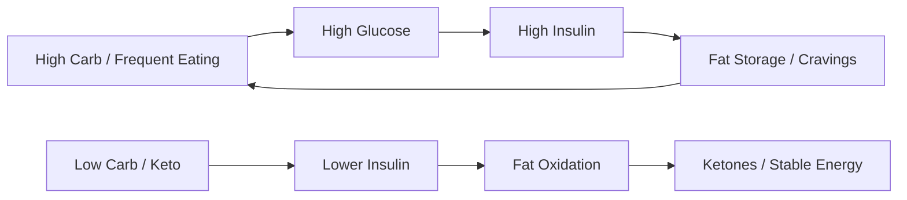

# Ketogenic Diet

**Ketogenic Diet không chỉ là trend giảm cân. Ở tầng metabolic, keto là một cách chuyển cơ thể từ glucose-dominant metabolism sang fat/ketone metabolism, đặt lại câu hỏi rất căn bản: bệnh tật là lỗi thuốc men, hay là lỗi môi trường chuyển hóa?**

*The ketogenic diet is not merely a weight-loss trend. At the metabolic level, keto shifts the body from glucose-dominant metabolism toward fat/ketone metabolism, reopening a deeper question: is disease a drug deficiency, or a problem of metabolic terrain?*

---

## Medical Caution / Cẩn Trọng

Bài này là knowledge-vault synthesis, không phải medical advice. Người đang dùng thuốc tiểu đường, huyết áp, phụ nữ mang thai, người có bệnh gan/thận, rối loạn ăn uống, hoặc bệnh nền nặng cần có người chuyên môn theo dõi nếu thay đổi diet mạnh.

Keto có thể là công cụ mạnh. Công cụ mạnh dùng sai cũng có thể gây hại.

---

## Vault Position / Vị Trí Trong Vault

Trong redpill.wiki, **Ketogenic Diet** nằm trong cụm [[MOC - Health Sovereignty]] và nối trực tiếp với [[Ung Thư - Metabolic Protocol]], [[Prolonged Fasting]], [[Thuyết Vi Sinh Nội Sinh]] và [[Y Tế Tự Nhiên]].

Nó không được đọc như “phép màu chữa mọi bệnh”. Nó được đọc như một **metabolic lever**: một đòn bẩy thay đổi nhiên liệu, insulin, glucose pressure và trạng thái viêm.

> Keto không phải magic. Nó là một cách rút bớt nhiên liệu khỏi hệ thống đang bị glucose hóa quá mức.

---

## 1. Keto Là Gì?

Ketogenic Diet là chế độ ăn rất thấp carbohydrate, vừa đủ protein, cao fat tự nhiên, nhằm đưa cơ thể vào trạng thái **ketosis**: gan tạo ketone từ fat để làm nhiên liệu thay glucose.

| Macro | Keto logic |
|---|---|
| Carbohydrate | giảm mạnh để hạ glucose/insulin pressure |
| Protein | vừa đủ để giữ cơ, không quá cao |
| Fat | nguồn năng lượng chính |
| Ketones | nhiên liệu thay thế cho não và cơ thể |

Keto không đơn giản là “ăn nhiều thịt”. Keto đúng là quản lý metabolic state.

---

## 2. Vì Sao Insulin Quan Trọng?

Insulin là hormone lưu trữ. Khi insulin cao liên tục, cơ thể khó đốt fat, dễ đói, dễ viêm, dễ rối loạn năng lượng.

Modern diet thường giữ insulin cao bằng:

- đường,
- refined carbs,
- snack liên tục,
- nước ngọt,
- ultra-processed food,
- stress + thiếu ngủ.

Keto giảm glucose spikes và tạo khoảng trống cho fat metabolism quay lại.

---

## 3. Keto Và Ung Thư / Cancer Metabolism

Trong [[Ung Thư - Metabolic Protocol]], keto được nhắc vì liên quan tới Warburg Effect: nhiều tế bào ung thư phụ thuộc mạnh vào glucose fermentation dù có oxy.

Điều này không có nghĩa “keto chữa ung thư”. Cách nói đúng hơn:

- Keto có thể giảm glucose availability.
- Keto có thể hỗ trợ insulin control.
- Keto có thể tạo metabolic pressure lên một số tumor metabolism.
- Keto cần được xem như một phần terrain strategy, không phải standalone cure.

| Claim | Confidence |
|---|---|
| Keto giúp giảm glucose/insulin ở nhiều người | mạnh |
| Ketone là nhiên liệu thay thế thật | mạnh |
| Cancer metabolism liên quan glucose/Warburg | mạnh vừa/tùy cancer |
| Keto tự chữa ung thư | không nên claim như fact |

Đây là đúng tinh thần [[Cách Đọc Red Pill Wiki]]: phân biệt fact, pattern và synthesis.

---

## 4. Keto Và Fasting

Keto và [[Prolonged Fasting]] là hai công cụ cùng trục.

| Tool | Cách hoạt động |
|---|---|
| Keto | giảm carbs để vào ketosis trong khi vẫn ăn |
| Fasting | ngừng nạp food để cơ thể tự chuyển sang fat/ketone |
| Keto + fasting | dễ fasting hơn vì hunger ổn định hơn |

Keto có thể là “training wheels” cho fasting: khi cơ thể đã quen fat adaptation, nhịn ăn thường bớt shock hơn.

---

## 5. Keto Sạch vs Keto Bẩn

Không phải cứ low-carb là healthy.

| Keto sạch | Keto bẩn |
|---|---|
| thịt/cá/trứng chất lượng | processed meat liên tục |
| fat tự nhiên | seed oils, trans fats |
| rau low-carb, minerals | thiếu electrolyte, táo bón |
| ăn theo hunger thật | ăn keto snack cả ngày |
| metabolic clarity | dùng keto như excuse ăn junk low-carb |

Keto bẩn vẫn có thể giảm carbs nhưng không chắc cải thiện terrain.

---

## 6. Rủi Ro Và Sai Lầm

- thiếu sodium/potassium/magnesium,
- ăn quá ít protein,
- ăn quá nhiều fat khi mục tiêu là giảm fat body,
- bỏ carbs quá nhanh khi đang dùng thuốc glucose/huyết áp,
- nhầm keto với carnivore cực đoan,
- không lắng nghe tín hiệu cơ thể,
- xem keto như identity.

Một diet trở thành Ma Trận mới khi nó biến thành giáo phái.

---

## 7. Practical Frame

Keto nên được xem như một protocol thử nghiệm có feedback:

1. Track energy, hunger, mood, sleep.
2. Ưu tiên whole foods.
3. Bổ sung electrolyte đúng.
4. Không ép nếu cơ thể báo stress kéo dài.
5. Nếu có bệnh nền/thuốc, cần supervision.
6. Dùng labs nếu có thể: glucose, insulin, HbA1c, lipids, liver/kidney markers.

---

## Synthesis

Ketogenic Diet là một công cụ để giành lại quyền điều khiển metabolic switch. Trong một food system thiết kế để con người nghiện đường, snack và insulin spikes, keto là một cách đặt lại câu hỏi: cơ thể thật sự cần gì để vận hành rõ, bền và ít lệ thuộc hơn?

> Keto không phải đích đến. Nó là một cửa để thấy rằng metabolism có thể được điều khiển lại.

---

## Related

- [[Ung Thư - Metabolic Protocol]]
- [[Prolonged Fasting]]
- [[Y Tế Tự Nhiên]]
- [[Thuyết Vi Sinh Nội Sinh]]
- [[Kính Chiếu Yêu - Nhìn Thấu Tây Y]]
- [[MOC - Health Sovereignty]]
